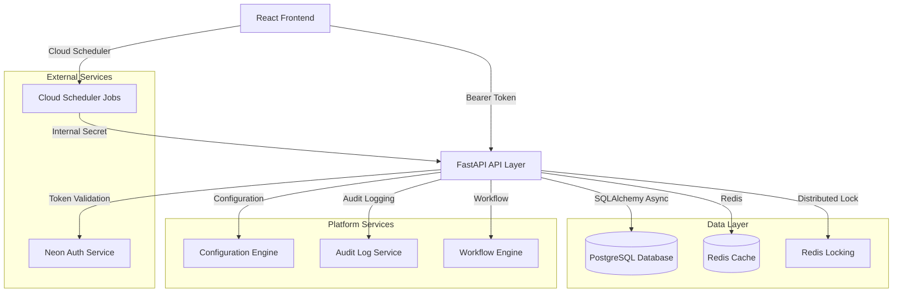
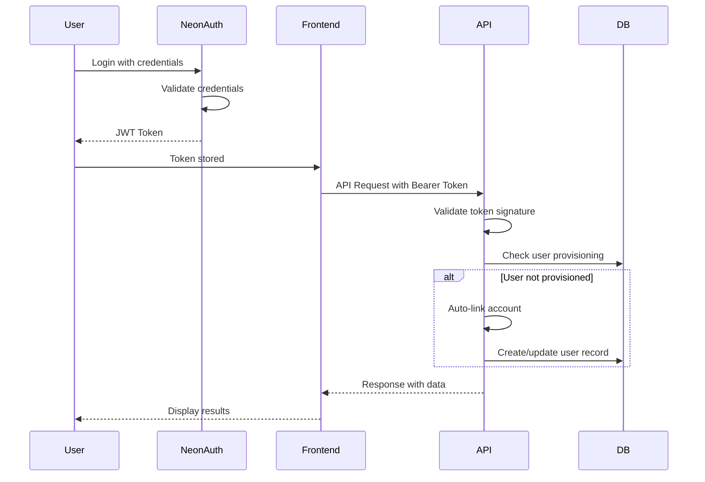
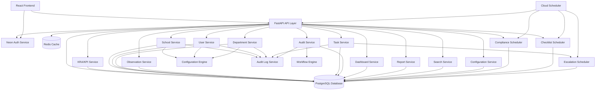

# Comprehensive API, Routes, Functions, and UI Interaction Report

## 1. Executive Summary

### Application Purpose
The School Operations Platform (SchoolOP) is a comprehensive school management system that handles KPI tracking, task management, compliance checking, audit discrepancy tracking, observation capture, and performance reporting for educational institutions.

### Major Frontend Components
- React/TypeScript application with Vite build system
- Component-based architecture organized by functional modules
- Uses custom API client (`apiFetch`) with Neon Auth integration
- Main modules: Dashboard, Schools, Users, Departments, KRA/KPI, Observations, Tasks, Audit, Reports, Search, Configuration

### Major Backend Components
- FastAPI-based REST API with modular architecture
- PostgreSQL database with SQLAlchemy ORM
- Neon Auth integration for authentication
- Platform services: Configuration Engine, Audit Log Service, Workflow Engine
- Module-based structure for business logic

### API Architecture
- **Base URL**: `/api/v1` for most endpoints
- **Authentication**: Bearer token-based via Neon Auth
- **Authorization**: Role-based with tenant context isolation
- **Response Format**: JSON with standardized error handling
- **Pagination**: Standard `page` and `page_size` parameters

### Authentication/Authorization Approach
- **Authentication**: Neon Auth (external service) handles password verification and issues JWT tokens
- **Token Validation**: FastAPI validates Bearer tokens using `NEON_AUTH_COOKIE_SECRET`
- **Authorization**: Role-based access control (SuperAdmin, Admin, DeptHead, Checker, Viewer)
- **Tenant Isolation**: All data access scoped to user's school/department context
- **Auto-linking**: Automatic account linking for new users via `/auth/link-account`

### Database/Storage Systems
- **Primary Database**: PostgreSQL with SQLAlchemy async ORM
- **Migration Tool**: Alembic for database schema management
- **Cache**: Redis for distributed locking and session management
- **File Storage**: In-memory export file caching for reports

### External Services/APIs
- **Neon Auth**: Authentication and session management
- **Cloud Scheduler**: For scheduled job triggering (Google Cloud)
- **Boto3**: AWS SDK for potential cloud operations

### Major User Workflows
1. **Authentication Flow**: Neon Auth login → token validation → account linking → platform access
2. **School Management**: Create schools → auto-create departments → assign users
3. **KPI Management**: Define KRAs → create KPIs → assign to departments → capture observations
4. **Task Management**: Create tasks → assign owners → track completion → escalation
5. **Audit Process**: Capture observations → raise discrepancies → investigation → approval workflow
6. **Reporting**: Generate dashboards → run reports → export data

### Approximate Counts
- **API Routes**: ~80+ endpoints across 10+ modules
- **HTTP Methods**: GET, POST, PATCH, DELETE
- **Frontend API Calls**: ~35+ API interactions across 25+ components
- **Important Backend Functions**: ~100+ service functions
- **UI Actions/Buttons**: ~50+ user interactions triggering APIs

---

## 2. Project Architecture

### Frontend Architecture
```
frontend/
├── src/
│   ├── components/        # React components by module
│   │   ├── auth/         # Authentication components
│   │   ├── schools/      # School management
│   │   ├── users/        # User management
│   │   ├── departments/  # Department management
│   │   ├── kra-kpi/      # KRA/KPI library
│   │   ├── observations/ # Observation capture
│   │   ├── tasks/        # Task management
│   │   ├── audit/        # Audit discrepancy
│   │   ├── dashboards/   # Dashboard views
│   │   ├── reports/      # Report generation
│   │   ├── search/       # Global search
│   │   ├── settings/     # Configuration
│   │   └── configuration/ # System configuration
│   ├── lib/
│   │   ├── api.ts        # API client with auth
│   │   └── auth.ts       # Neon Auth client
│   └── App.tsx           # Main application
```

### Backend Architecture
```
api/
├── main.py               # FastAPI application entry point
├── auth.py               # Authentication endpoints
└── internal_routes.py    # Internal scheduler endpoints

modules/
├── kra_kpi_library/      # KRA/KPI management
├── school_dept_user_role/ # School, Department, User management
├── task_management/      # Task and escalation management
├── observation_capture/  # Observation and evidence capture
├── audit_discrepancy/    # Audit discrepancy and approval chains
├── dashboards_reports_search/ # Dashboards, reports, search
├── performance_scorecards/ # Performance reviews and scorecards
└── settings_master_data/  # Configuration and master data

shared/
├── database.py           # Database connection and session management
├── models.py             # SQLAlchemy models
├── auth.py               # Authentication utilities
├── errors.py             # Custom error classes
├── middleware/           # Tenancy and permissions middleware
└── datetime_utils.py     # Date/time utilities

platform_services/
├── configuration_engine/  # Configuration management
├── audit_log_service/    # Audit logging
├── workflow_engine/      # Workflow orchestration
├── compliance_scheduler/ # Compliance checking
└── checklist_scheduler/  # Checklist generation
```

### API Layer Architecture


### Authentication Flow


### Database Schema Overview
- **Users**: User accounts with roles and school assignments
- **Schools**: Educational institutions with configuration
- **Departments**: Organizational units within schools
- **KRAs**: Key Result Areas for performance tracking
- **KPIs**: Key Performance Indicators with versioning
- **KPI Assignments**: Department-specific KPI assignments
- **Observations**: Daily KPI data capture
- **Tasks**: Task management with escalation
- **Discrepancies**: Audit discrepancy tracking
- **Approval Chains**: Multi-level approval workflows
- **Performance Reviews**: Performance review cycles
- **Scorecards**: Performance scorecard generation
- **Compliance Records**: Compliance tracking
- **Checklist Instances**: Checklist generation
- **Export Jobs**: Report export job tracking

---

## 3. Complete API Route Inventory

### Authentication Routes
| # | Method | Route | File | Purpose | Authentication | Authorization | Called By | Status |
| - | ------ | ----- | ---- | ------- | -------------- | ------------- | --------- | ------ |
| 1 | GET | `/auth/get-session` | `api/auth.py` | Get current session information | Required | None | Frontend auth check | Active |
| 2 | POST | `/auth/verify` | `api/auth.py` | Verify Neon Auth Bearer token | Required | None | Frontend token validation | Active |
| 3 | POST | `/auth/mfa/setup` | `api/auth.py` | Set up MFA for user | Required | SuperAdmin | Frontend MFA setup | Possibly Active |
| 4 | POST | `/auth/link-account` | `api/auth.py` | Link Neon Auth to platform user | Required | None | Frontend auto-link | Active |
| 5 | POST | `/auth/complete-signup` | `api/auth.py` | Complete signup with school code | Required | None | Frontend signup | Active |
| 6 | POST | `/auth/logout` | `api/auth.py` | Logout endpoint | Required | None | Frontend logout | Active |
| 7 | POST | `/auth/sso/{provider}` | `api/auth.py` | SSO login endpoint | Required | None | SSO providers | Possibly Active |

### Internal Scheduler Routes
| # | Method | Route | File | Purpose | Authentication | Authorization | Called By | Status |
| - | ------ | ----- | ---- | ------- | -------------- | ------------- | --------- | ------ |
| 8 | POST | `/internal/scheduler/compliance-check` | `api/internal_routes.py` | Trigger compliance scheduler | Internal Secret | None | Cloud Scheduler | Active |
| 9 | POST | `/internal/scheduler/checklist-check` | `api/internal_routes.py` | Trigger checklist scheduler | Internal Secret | None | Cloud Scheduler | Active |
| 10 | POST | `/internal/scheduler/escalation-check` | `api/internal_routes.py` | Trigger escalation check | Internal Secret | None | Cloud Scheduler | Active |
| 11 | POST | `/internal/scheduler/grace-period-sweep` | `api/internal_routes.py` | Trigger grace period sweep | Internal Secret | None | Cloud Scheduler | Active |
| 12 | POST | `/internal/scheduler/scorecard-generation` | `api/internal_routes.py` | Trigger scorecard generation | Internal Secret | None | Cloud Scheduler | Active |

### KRA/KPI Library Routes
| # | Method | Route | File | Purpose | Authentication | Authorization | Called By | Status |
| - | ------ | ----- | ---- | ------- | -------------- | ------------- | --------- | ------ |
| 13 | POST | `/api/v1/kras` | `modules/kra_kpi_library/api/routes.py` | Create KRA | Required | SuperAdmin | KraForm.tsx | Active |
| 14 | GET | `/api/v1/kras` | `modules/kra_kpi_library/api/routes.py` | List KRAs | Required | READ permission | KraList.tsx | Active |
| 15 | PATCH | `/api/v1/kras/{kra_id}` | `modules/kra_kpi_library/api/routes.py` | Update KRA | Required | SuperAdmin | KraForm.tsx | Active |
| 16 | POST | `/api/v1/kpis` | `modules/kra_kpi_library/api/routes.py` | Create KPI | Required | SuperAdmin | KpiForm.tsx | Active |
| 17 | GET | `/api/v1/kpis` | `modules/kra_kpi_library/api/routes.py` | List KPIs | Required | READ permission | KraList.tsx | Active |
| 18 | GET | `/api/v1/kpis/{kpi_id}` | `modules/kra_kpi_library/api/routes.py` | Get KPI | Required | READ permission | KpiForm.tsx | Active |
| 19 | GET | `/api/v1/kpis/{kpi_id}/versions` | `modules/kra_kpi_library/api/routes.py` | List KPI versions | Required | READ permission | KpiForm.tsx | Possibly Active |
| 20 | GET | `/api/v1/kpis/{kpi_id}/versions/{version}` | `modules/kra_kpi_library/api/routes.py` | Get KPI version | Required | READ permission | KpiForm.tsx | Possibly Active |
| 21 | PATCH | `/api/v1/kpis/{kpi_id}` | `modules/kra_kpi_library/api/routes.py` | Update KPI | Required | SuperAdmin | KpiForm.tsx | Active |
| 22 | POST | `/api/v1/kpis/{kpi_id}/deprecate` | `modules/kra_kpi_library/api/routes.py` | Deprecate KPI | Required | SuperAdmin | KraList.tsx | Active |
| 23 | POST | `/api/v1/kpis/import` | `modules/kra_kpi_library/api/routes.py` | Import KPIs from seed | Required | SuperAdmin | Import script | Active |
| 24 | POST | `/api/v1/departments/{department_id}/kpi-assignments` | `modules/kra_kpi_library/api/routes.py` | Assign KPI to department | Required | ASSIGN permission | Configuration | Possibly Active |
| 25 | POST | `/api/v1/observations` | `modules/kra_kpi_library/api/routes.py` | Submit observation | Required | CREATE permission | ObservationForm.tsx | Active |

### School Management Routes
| # | Method | Route | File | Purpose | Authentication | Authorization | Called By | Status |
| - | ------ | ----- | ---- | ------- | -------------- | ------------- | --------- | ------ |
| 26 | POST | `/api/v1/schools` | `modules/school_dept_user_role/api/schools.py` | Create school | Required | SuperAdmin | SchoolForm.tsx | Active |
| 27 | GET | `/api/v1/schools` | `modules/school_dept_user_role/api/schools.py` | List schools | Required | READ permission | SchoolList.tsx | Active |
| 28 | GET | `/api/v1/schools/{school_id}` | `modules/school_dept_user_role/api/schools.py` | Get school | Required | READ permission | SchoolForm.tsx | Active |
| 29 | PATCH | `/api/v1/schools/{school_id}` | `modules/school_dept_user_role/api/schools.py` | Update school | Required | SuperAdmin/Admin | SchoolForm.tsx | Active |
| 30 | POST | `/api/v1/schools/{school_id}/deactivate` | `modules/school_dept_user_role/api/schools.py` | Deactivate school | Required | SuperAdmin | SchoolList.tsx | Active |

### Department Management Routes
| # | Method | Route | File | Purpose | Authentication | Authorization | Called By | Status |
| - | ------ | ----- | ---- | ------- | -------------- | ------------- | --------- | ------ |
| 31 | POST | `/api/v1/departments` | `modules/school_dept_user_role/api/departments.py` | Create department | Required | SuperAdmin/Admin | DepartmentForm.tsx | Active |
| 32 | GET | `/api/v1/departments` | `modules/school_dept_user_role/api/departments.py` | List departments | Required | READ permission | DepartmentList.tsx | Active |
| 33 | GET | `/api/v1/departments/{department_id}` | `modules/school_dept_user_role/api/departments.py` | Get department | Required | READ permission | DepartmentForm.tsx | Active |
| 34 | PATCH | `/api/v1/departments/{department_id}` | `modules/school_dept_user_role/api/departments.py` | Update department | Required | SuperAdmin/Admin | DepartmentForm.tsx | Active |
| 35 | POST | `/api/v1/departments/{department_id}/archive` | `modules/school_dept_user_role/api/departments.py` | Archive department | Required | SuperAdmin/Admin | DepartmentList.tsx | Possibly Active |

### User Management Routes
| # | Method | Route | File | Purpose | Authentication | Authorization | Called By | Status |
| - | ------ | ----- | ---- | ------- | -------------- | ------------- | --------- | ------ |
| 36 | POST | `/api/v1/users` | `modules/school_dept_user_role/api/users.py` | Create user | Required | SuperAdmin/Admin | UserForm.tsx | Active |
| 37 | GET | `/api/v1/users` | `modules/school_dept_user_role/api/users.py` | List users | Required | READ permission | UserList.tsx | Active |
| 38 | GET | `/api/v1/users/{user_id}` | `modules/school_dept_user_role/api/users.py` | Get user | Required | READ permission | UserForm.tsx | Active |
| 39 | PATCH | `/api/v1/users/{user_id}` | `modules/school_dept_user_role/api/users.py` | Update user | Required | SuperAdmin/Admin | UserForm.tsx | Active |
| 40 | POST | `/api/v1/users/{user_id}/archive` | `modules/school_dept_user_role/api/users.py` | Archive user | Required | SuperAdmin/Admin | UserList.tsx | Active |
| 41 | POST | `/api/v1/users/{user_id}/roles` | `modules/school_dept_user_role/api/users.py` | Assign roles | Required | SuperAdmin/Admin | UserForm.tsx | Possibly Active |
| 42 | POST | `/api/v1/users/{user_id}/school-grants` | `modules/school_dept_user_role/api/users.py` | Grant school access | Required | SuperAdmin | UserForm.tsx | Possibly Active |

### Configuration Routes
| # | Method | Route | File | Purpose | Authentication | Authorization | Called By | Status |
| - | ------ | ----- | ---- | ------- | -------------- | ------------- | --------- | ------ |
| 43 | GET | `/api/v1/configuration/global` | `modules/school_dept_user_role/api/configuration.py` | Get global config | Required | All roles | ConfigurationPanel.tsx | Active |
| 44 | PATCH | `/api/v1/configuration/global` | `modules/school_dept_user_role/api/configuration.py` | Update global config | Required | SuperAdmin | ConfigurationPanel.tsx | Active |
| 45 | GET | `/api/v1/configuration/schools/{school_id}` | `modules/school_dept_user_role/api/configuration.py` | Get school config | Required | Tenant scoped | ConfigurationPanel.tsx | Active |
| 46 | PATCH | `/api/v1/configuration/schools/{school_id}` | `modules/school_dept_user_role/api/configuration.py` | Update school config | Required | SuperAdmin/Admin | ConfigurationPanel.tsx | Active |
| 47 | POST | `/api/v1/configuration/schools/{school_id}/reset` | `modules/school_dept_user_role/api/configuration.py` | Reset school config | Required | SuperAdmin/Admin | ConfigurationPanel.tsx | Active |

### Personal Settings Routes
| # | Method | Route | File | Purpose | Authentication | Authorization | Called By | Status |
| - | ------ | ----- | ---- | ------- | -------------- | ------------- | --------- | ------ |
| 48 | GET | `/api/v1/settings/me` | `modules/school_dept_user_role/api/personal_settings.py` | Get personal settings | Required | Self-only | Settings components | Possibly Active |
| 49 | PATCH | `/api/v1/settings/me` | `modules/school_dept_user_role/api/personal_settings.py` | Update personal settings | Required | Self-only | Settings components | Possibly Active |

### Task Management Routes
| # | Method | Route | File | Purpose | Authentication | Authorization | Called By | Status |
| - | ------ | ----- | ---- | ------- | -------------- | ------------- | --------- | ------ |
| 50 | GET | `/api/v1/tasks` | `modules/task_management/api/routes.py` | List tasks | Required | Tenant scoped | TaskList.tsx | Active |
| 51 | POST | `/api/v1/tasks` | `modules/task_management/api/routes.py` | Create task | Required | Tenant scoped | TaskForm.tsx | Active |
| 52 | GET | `/api/v1/tasks/{task_id}` | `modules/task_management/api/routes.py` | Get task | Required | Tenant scoped | TaskDetail.tsx | Active |
| 53 | POST | `/api/v1/tasks/{task_id}/complete` | `modules/task_management/api/routes.py` | Complete task | Required | Owner only | TaskDetail.tsx | Active |
| 54 | PATCH | `/api/v1/tasks/{task_id}/completion-rule` | `modules/task_management/api/routes.py` | Update completion rule | Required | Owner only | TaskDetail.tsx | Active (422) |
| 55 | POST | `/api/v1/tasks/{task_id}/eta-extension` | `modules/task_management/api/routes.py` | Extend ETA | Required | Owner only | TaskDetail.tsx | Active |
| 56 | POST | `/api/v1/tasks/escalation-check` | `modules/task_management/api/routes.py` | Trigger escalation check | Required | Admin | EscalationRules.tsx | Active |
| 57 | POST | `/api/v1/escalation-rules` | `modules/task_management/api/routes.py` | Create escalation rule | Required | Admin | EscalationRules.tsx | Active |

### Audit Discrepancy Routes
| # | Method | Route | File | Purpose | Authentication | Authorization | Called By | Status |
| - | ------ | ----- | ---- | ------- | -------------- | ------------- | --------- | ------ |
| 58 | POST | `/api/v1/audit-discrepancy/approval-chains` | `modules/audit_discrepancy/api/routes.py` | Create approval chain | Required | SuperAdmin | ApprovalChains.tsx | Active |
| 59 | GET | `/api/v1/audit-discrepancy/approval-chains/active` | `modules/audit_discrepancy/api/routes.py` | Get active approval chain | Required | READ permission | ApprovalChains.tsx | Active |
| 60 | GET | `/api/v1/audit-discrepancy/approval-chains` | `modules/audit_discrepancy/api/routes.py` | List approval chains | Required | READ permission | ApprovalChains.tsx | Active |
| 61 | GET | `/api/v1/audit-discrepancy/approval-chains/{chain_version_id}` | `modules/audit_discrepancy/api/routes.py` | Get approval chain | Required | READ permission | ApprovalChains.tsx | Active |
| 62 | PATCH | `/api/v1/audit-discrepancy/approval-chains/{chain_version_id}/activate` | `modules/audit_discrepancy/api/routes.py` | Activate approval chain | Required | SuperAdmin | ApprovalChains.tsx | Active |
| 63 | GET | `/api/v1/audit-discrepancy/approval-chains/active/levels` | `modules/audit_discrepancy/api/routes.py` | Get current approval levels | Required | READ permission | ApprovalChains.tsx | Active |
| 64 | GET | `/api/v1/audit-discrepancy/discrepancies` | `modules/audit_discrepancy/api/routes.py` | List discrepancies | Required | Tenant scoped | DiscrepancyList.tsx | Active |
| 65 | POST | `/api/v1/audit-discrepancy/discrepancies` | `modules/audit_discrepancy/api/routes.py` | Raise discrepancy | Required | Auditor role | DiscrepancyDetail.tsx | Active |
| 66 | POST | `/api/v1/audit-discrepancy/discrepancies/{discrepancy_id}/assign-investigation` | `modules/audit_discrepancy/api/routes.py` | Assign investigation | Required | Auditor role | DiscrepancyDetail.tsx | Active |
| 67 | POST | `/api/v1/audit-discrepancy/discrepancies/{discrepancy_id}/submit-findings` | `modules/audit_discrepancy/api/routes.py` | Submit findings | Required | Investigation owner | DiscrepancyDetail.tsx | Active |
| 68 | POST | `/api/v1/audit-discrepancy/discrepancies/{discrepancy_id}/start-approval` | `modules/audit_discrepancy/api/routes.py` | Start approval | Required | Investigation owner | DiscrepancyDetail.tsx | Active |
| 69 | POST | `/api/v1/audit-discrepancy/discrepancies/{discrepancy_id}/approve` | `modules/audit_discrepancy/api/routes.py` | Approve discrepancy | Required | Approver role | DiscrepancyDetail.tsx | Active |
| 70 | POST | `/api/v1/audit-discrepancy/discrepancies/{discrepancy_id}/reject` | `modules/audit_discrepancy/api/routes.py` | Reject discrepancy | Required | Approver role | DiscrepancyDetail.tsx | Active |
| 71 | GET | `/api/v1/audit-discrepancy/discrepancies/{discrepancy_id}/approval-history` | `modules/audit_discrepancy/api/routes.py` | Get approval history | Required | READ permission | DiscrepancyDetail.tsx | Active |

### Observation Capture Routes
| # | Method | Route | File | Purpose | Authentication | Authorization | Called By | Status |
| - | ------ | ----- | ---- | ------- | -------------- | ------------- | --------- | ------ |
| 72 | POST | `/api/v1/observations` | `modules/observation_capture/api/routes.py` | Submit observation | Required | Checker role | ObservationForm.tsx | Active |
| 73 | GET | `/api/v1/observations` | `modules/observation_capture/api/routes.py` | List observations | Required | Tenant scoped | ObservationList.tsx | Active |
| 74 | GET | `/api/v1/observations/{observation_id}` | `modules/observation_capture/api/routes.py` | Get observation | Required | Tenant scoped | ObservationForm.tsx | Active |
| 75 | PATCH | `/api/v1/observations/{observation_id}` | `modules/observation_capture/api/routes.py` | Update observation | Required | Non-auditor | ObservationForm.tsx | Active |
| 76 | POST | `/api/v1/observations/{observation_id}/reopen-request` | `modules/observation_capture/api/routes.py` | Request reopen | Required | Admin | ObservationForm.tsx | Possibly Active |
| 77 | POST | `/api/v1/observations/{observation_id}/reopen-approval` | `modules/observation_capture/api/routes.py` | Approve reopen | Required | Admin | ObservationForm.tsx | Possibly Active |

### Dashboard and Reports Routes
| # | Method | Route | File | Purpose | Authentication | Authorization | Called By | Status |
| - | ------ | ----- | ---- | ------- | -------------- | ------------- | --------- | ------ |
| 78 | GET | `/api/v1/dashboard` | `modules/dashboards_reports_search/api/routes.py` | Get role-based dashboard | Required | VIEW permission | Dashboard.tsx | Active |
| 79 | GET | `/api/v1/reports` | `modules/dashboards_reports_search/api/routes.py` | List available reports | Required | READ permission | ReportCatalogue.tsx | Active |
| 80 | GET | `/api/v1/reports/{report_type}` | `modules/dashboards_reports_search/api/routes.py` | Run report | Required | READ permission | ReportRunner.tsx | Active |
| 81 | POST | `/api/v1/reports/export` | `modules/dashboards_reports_search/api/routes.py` | Create export job | Required | EXPORT permission | ReportRunner.tsx | Active |
| 82 | GET | `/api/v1/reports/export/{job_id}` | `modules/dashboards_reports_search/api/routes.py` | Get export job status | Required | EXPORT permission | ReportRunner.tsx | Active |
| 83 | GET | `/api/v1/reports/export/{job_id}/download` | `modules/dashboards_reports_search/api/routes.py` | Download export file | Required | EXPORT permission | ReportRunner.tsx | Active |
| 84 | GET | `/api/v1/reports/category-restrictions` | `modules/dashboards_reports_search/api/routes.py` | List category restrictions | Required | READ permission | ReportRunner.tsx | Active |
| 85 | POST | `/api/v1/reports/category-restrictions` | `modules/dashboards_reports_search/api/routes.py` | Create category restriction | Required | SuperAdmin/Admin | ReportRunner.tsx | Active |
| 86 | DELETE | `/api/v1/reports/category-restrictions/{restriction_id}` | `modules/dashboards_reports_search/api/routes.py` | Delete category restriction | Required | SuperAdmin/Admin | ReportRunner.tsx | Active |

### Search Routes
| # | Method | Route | File | Purpose | Authentication | Authorization | Called By | Status |
| - | ------ | ----- | ---- | ------- | -------------- | ------------- | --------- | ------ |
| 87 | GET | `/api/v1/search` | `modules/dashboards_reports_search/api/routes.py` | Global search | Required | READ permission | GlobalSearch.tsx | Active |
| 88 | POST | `/api/v1/search/saved-filters` | `modules/dashboards_reports_search/api/routes.py` | Create saved filter | Required | CREATE permission | GlobalSearch.tsx | Possibly Active |
| 89 | GET | `/api/v1/search/saved-filters` | `modules/dashboards_reports_search/api/routes.py` | List saved filters | Required | READ permission | GlobalSearch.tsx | Possibly Active |
| 90 | PATCH | `/api/v1/search/saved-filters/{filter_id}` | `modules/dashboards_reports_search/api/routes.py` | Update saved filter | Required | Owner only | GlobalSearch.tsx | Possibly Active |
| 91 | DELETE | `/api/v1/search/saved-filters/{filter_id}` | `modules/dashboards_reports_search/api/routes.py` | Delete saved filter | Required | Owner only | GlobalSearch.tsx | Possibly Active |

### Performance Scorecards Routes
| # | Method | Route | File | Purpose | Authentication | Authorization | Called By | Status |
| - | ------ | ----- | ---- | ------- | -------------- | ------------- | --------- | ------ |
| 92 | POST | `/api/v1/performance-reviews` | `modules/performance_scorecards/api/routes.py` | Create performance review | Required | Admin | Performance UI | Possibly Active |
| 93 | GET | `/api/v1/performance-reviews` | `modules/performance_scorecards/api/routes.py` | List performance reviews | Required | READ permission | Performance UI | Possibly Active |
| 94 | GET | `/api/v1/performance-reviews/{review_id}` | `modules/performance_scorecards/api/routes.py` | Get performance review | Required | READ permission | Performance UI | Possibly Active |
| 95 | PATCH | `/api/v1/performance-reviews/{review_id}` | `modules/performance_scorecards/api/routes.py` | Update performance review | Required | Admin | Performance UI | Possibly Active |
| 96 | GET | `/api/v1/scorecards` | `modules/performance_scorecards/api/routes.py` | List scorecards | Required | READ permission | Performance UI | Possibly Active |
| 97 | GET | `/api/v1/scorecards/{scorecard_id}` | `modules/performance_scorecards/api/routes.py` | Get scorecard | Required | READ permission | Performance UI | Possibly Active |
| 98 | GET | `/api/v1/scorecards/{scorecard_id}/versions` | `modules/performance_scorecards/api/routes.py` | List scorecard versions | Required | READ permission | Performance UI | Possibly Active |
| 99 | POST | `/api/v1/scorecards/generate` | `modules/performance_scorecards/api/routes.py` | Generate scorecard | Required | Admin | Performance UI | Possibly Active |

### Route Details

#### `GET /auth/get-session`
- **Source file**: `api/auth.py`
- **Handler/function**: `get_session()`
- **Purpose**: Get current session information for Neon Auth compatibility
- **Authentication required**: Yes (Bearer token)
- **Authorization required**: None
- **Accepted parameters**: Authorization header
- **Response structure**: `{ user: {...}, session: {...}, valid: boolean }`
- **HTTP status codes**: 200 (success), 401 (invalid token)
- **Called from**: Frontend auth check via `api.ts`
- **Current usage status**: Active

#### `POST /auth/link-account`
- **Source file**: `api/auth.py`
- **Handler/function**: `link_account()`
- **Purpose**: Auto-link Neon Auth session to platform user or create new user
- **Authentication required**: Yes (Bearer token)
- **Authorization required**: None
- **Accepted parameters**: `school_code` (optional in body)
- **Response structure**: `{ linked: boolean, user_id: string, email: string, roles: [], school_id: string, created: boolean }`
- **HTTP status codes**: 200 (success), 401 (invalid token), 400 (missing school code for new users)
- **Called from**: Frontend auto-link on 403 errors
- **Current usage status**: Active

#### `POST /api/v1/schools`
- **Source file**: `modules/school_dept_user_role/api/schools.py`
- **Handler/function**: `create_school()`
- **Purpose**: Create a new school with auto-creation of departments and first admin
- **Authentication required**: Yes
- **Authorization required**: SuperAdmin only
- **Accepted parameters**: `{ name, code, address, contact_email, contact_phone }`
- **Database operations**: INSERT into schools, departments, users tables
- **Functions called**: `SchoolService.create_school()`
- **Response structure**: School object with all fields
- **HTTP status codes**: 201 (created), 403 (forbidden), 400 (validation error)
- **Called from**: SchoolForm.tsx
- **Current usage status**: Active

#### `GET /api/v1/dashboard`
- **Source file**: `modules/dashboards_reports_search/api/routes.py`
- **Handler/function**: `get_dashboard()`
- **Purpose**: Get role-based dashboard with KPI, compliance, task, discrepancy summaries
- **Authentication required**: Yes
- **Authorization required**: DASHBOARD VIEW permission
- **Response structure**: Complex dashboard object with role-specific data
- **HTTP status codes**: 200 (success), 403 (forbidden)
- **Called from**: Dashboard.tsx
- **Current usage status**: Active

#### `POST /api/v1/observations`
- **Source file**: `modules/observation_capture/api/routes.py`
- **Handler/function**: `submit_observation()`
- **Purpose**: Submit KPI observation with idempotency support
- **Authentication required**: Yes
- **Authorization required**: Checker role
- **Accepted parameters**: Observation data with mandatory `Idempotency-Key` header
- **Validation**: Required fields, type matching, duplicate detection
- **Database operations**: INSERT/UPDATE observations table
- **Functions called**: `ObservationService.submit_observation()`
- **Response structure**: Observation object
- **HTTP status codes**: 201 (created), 400 (validation error), 409 (conflict/duplicate)
- **Called from**: ObservationForm.tsx, DailyKpiInput.tsx
- **Current usage status**: Active

---

## 4. Frontend API Calls

### API Client Architecture
The frontend uses a centralized API client (`apiFetch`) in `frontend/src/lib/api.ts` that handles:
- Neon Auth token management
- Automatic Bearer token injection
- 403 auto-link retry logic
- Error handling and response parsing

### Frontend API Call Inventory

| # | Component/File | Function | HTTP Method | API Route | Trigger | Payload | Response Used For |
| - | -------------- | -------- | ----------- | --------- | ------- | ------- | ----------------- |
| 1 | `lib/api.ts` | `getAccessToken()` | GET | Neon Auth session | API call initiation | None | Token retrieval |
| 2 | `lib/api.ts` | `autoLinkAccount()` | POST | `/auth/link-account` | Signup completion | `{ school_code }` | Account creation |
| 3 | `lib/api.ts` | `isUserProvisioned()` | GET | `/auth/get-session` | Auth check | None | User validation |
| 4 | `lib/api.ts` | `fetchWithAuth()` | GET/POST/PATCH | Any API | API requests | Varies | Response handling |
| 5 | `Dashboard.tsx` | `fetchDashboard()` | GET | `/api/v1/dashboard` | Component mount | None | Dashboard display |
| 6 | `SchoolList.tsx` | `fetchSchools()` | GET | `/api/v1/schools` | Component mount/page change | `{ page, page_size }` | School list display |
| 7 | `SchoolList.tsx` | `handleDeactivate()` | POST | `/api/v1/schools/{id}/deactivate` | Deactivate button | None | School status update |
| 8 | `UserList.tsx` | `fetchUsers()` | GET | `/api/v1/users` | Component mount/page change | `{ page, page_size }` | User list display |
| 9 | `UserList.tsx` | `handleArchive()` | POST | `/api/v1/users/{id}/archive` | Archive button | None | User status update |
| 10 | `ObservationForm.tsx` | `fetchSchools()` | GET | `/api/v1/schools` | Component mount | `{ page_size }` | School dropdown |
| 11 | `ObservationForm.tsx` | `fetchDepartments()` | GET | `/api/v1/departments` | School selection | `{ school_id, page_size }` | Department dropdown |
| 12 | `ObservationForm.tsx` | `fetchObservation()` | GET | `/api/v1/observations/{id}` | Edit mode | None | Form pre-fill |
| 13 | `ObservationForm.tsx` | `handleSubmit()` | POST/PATCH | `/api/v1/observations` | Form submit | Observation data | Observation creation/update |
| 14 | `TaskForm.tsx` | `fetchSchools()` | GET | `/api/v1/schools` | Component mount | `{ page_size }` | School dropdown |
| 15 | `TaskForm.tsx` | `fetchDepartments()` | GET | `/api/v1/departments` | School selection | `{ school_id, page_size }` | Department dropdown |
| 16 | `TaskForm.tsx` | `fetchUsers()` | GET | `/api/v1/users` | Component mount | `{ page_size }` | Owner selection |
| 17 | `TaskForm.tsx` | `fetchTask()` | GET | `/api/v1/tasks/{id}` | Edit mode | None | Form pre-fill |
| 18 | `TaskForm.tsx` | `handleSubmit()` | POST/PATCH | `/api/v1/tasks` | Form submit | Task data | Task creation/update |
| 19 | `KraList.tsx` | `fetchKras()` | GET | `/api/v1/kras` | Component mount/filter change | `{ include_deprecated }` | KRA list display |
| 20 | `KraList.tsx` | `fetchAllKpis()` | GET | `/api/v1/kpis` | Department view | None | KPI list display |
| 21 | `KraList.tsx` | `fetchKpis()` | GET | `/api/v1/kpis` | KRA expansion | `{ kra_id }` | KPI list display |
| 22 | `KraList.tsx` | `handleDeprecateKra()` | PATCH | `/api/v1/kras/{id}` | Deprecate button | `{ status }` | KRA status update |
| 23 | `KraList.tsx` | `handleDeprecateKpi()` | POST | `/api/v1/kpis/{id}/deprecate` | Deprecate button | None | KPI status update |
| 24 | `DepartmentList.tsx` | `fetchDepartments()` | GET | `/api/v1/departments` | Component mount | `{ page, page_size }` | Department list |
| 25 | `TaskList.tsx` | `fetchTasks()` | GET | `/api/v1/tasks` | Component mount | `{ page, page_size }` | Task list display |
| 26 | `ReportRunner.tsx` | `fetchReports()` | GET | `/api/v1/reports` | Component mount | None | Report catalogue |
| 27 | `ReportRunner.tsx` | `runReport()` | GET | `/api/v1/reports/{type}` | Report execution | Query params | Report data display |
| 28 | `ReportRunner.tsx` | `createExport()` | POST | `/api/v1/reports/export` | Export button | Export request | Export job creation |
| 29 | `ConfigurationPanel.tsx` | `fetchGlobalConfig()` | GET | `/api/v1/configuration/global` | Component mount | None | Config display |
| 30 | `ConfigurationPanel.tsx` | `updateGlobalConfig()` | PATCH | `/api/v1/configuration/global` | Save button | Config updates | Config update |
| 31 | `ApprovalChains.tsx` | `fetchApprovalChains()` | GET | `/api/v1/audit-discrepancy/approval-chains` | Component mount | None | Chain list display |
| 32 | `ApprovalChains.tsx` | `createApprovalChain()` | POST | `/api/v1/audit-discrepancy/approval-chains` | Create button | Chain data | Chain creation |
| 33 | `DiscrepancyList.tsx` | `fetchDiscrepancies()` | GET | `/api/v1/audit-discrepancy/discrepancies` | Component mount | `{ page, page_size }` | Discrepancy list |
| 34 | `DiscrepancyDetail.tsx` | `fetchDiscrepancy()` | GET | `/api/v1/audit-discrepancy/discrepancies/{id}` | Component mount | None | Discrepancy details |
| 35 | `DailyKpiInput.tsx` | `submitObservation()` | POST | `/api/v1/observations` | Submit button | Observation data | Observation creation |

### Frontend API Call Patterns

#### Auth-Protected API Calls
All frontend API calls use the `apiFetch` wrapper which:
1. Retrieves Neon Auth JWT token
2. Adds Bearer token to Authorization header
3. Handles 403 USER_NOT_PROVISIONED errors with auto-link retry
4. Returns parsed JSON responses

#### Error Handling
- **Validation errors**: Displayed as form error messages
- **Authorization errors**: Show toast/alert with permission denied
- **Network errors**: Display generic error messages
- **Loading states**: Show loading spinners during API calls

#### Success Handling
- **List endpoints**: Update component state with new data
- **Create/Update endpoints**: Navigate to list view or refresh data
- **Delete endpoints**: Remove item from local state and refresh list
- **Export endpoints**: Show download link or poll job status

---

## 5. UI Buttons and Actions → API Mapping

### Dashboard Actions
| UI Location | Button/Action | Component | Event Handler | Function Called | API Route | Method | Payload | Result | UI Effect |
| ----------- | ------------- | --------- | ------------- | --------------- | --------- | ------ | ------- | ------ | --------- |
| Dashboard | Page Load | Dashboard.tsx | useEffect | fetchDashboard | `/api/v1/dashboard` | GET | None | Dashboard data | Display statistics |

### School Management Actions
| UI Location | Button/Action | Component | Event Handler | Function Called | API Route | Method | Payload | Result | UI Effect |
| ----------- | ------------- | --------- | ------------- | --------------- | --------- | ------ | ------- | ------ | --------- |
| SchoolList | Create School | SchoolList.tsx | Link navigation | None | `/schools/new` | GET | None | Navigation | Navigate to form |
| SchoolForm | Submit Form | SchoolForm.tsx | handleSubmit | apiFetch | `/api/v1/schools` | POST | School data | School created | Navigate to list |
| SchoolList | Deactivate | SchoolList.tsx | handleDeactivate | apiFetch | `/api/v1/schools/{id}/deactivate` | POST | None | School deactivated | Refresh list |
| SchoolList | Edit School | SchoolList.tsx | Link navigation | None | `/schools/{id}/edit` | GET | None | Navigation | Navigate to form |
| SchoolForm | Update Form | SchoolForm.tsx | handleSubmit | apiFetch | `/api/v1/schools/{id}` | PATCH | School data | School updated | Navigate to list |

### User Management Actions
| UI Location | Button/Action | Component | Event Handler | Function Called | API Route | Method | Payload | Result | UI Effect |
| ----------- | ------------- | --------- | ------------- | --------------- | --------- | ------ | ------- | ------ | --------- |
| UserList | Create User | UserList.tsx | Link navigation | None | `/users/new` | GET | None | Navigation | Navigate to form |
| UserForm | Submit Form | UserForm.tsx | handleSubmit | apiFetch | `/api/v1/users` | POST | User data | User created | Navigate to list |
| UserList | Archive | UserList.tsx | handleArchive | apiFetch | `/api/v1/users/{id}/archive` | POST | None | User archived | Refresh list |
| UserList | Edit User | UserList.tsx | Link navigation | None | `/users/{id}/edit` | GET | None | Navigation | Navigate to form |
| UserForm | Update Form | UserForm.tsx | handleSubmit | apiFetch | `/api/v1/users/{id}` | PATCH | User data | User updated | Navigate to list |

### Department Management Actions
| UI Location | Button/Action | Component | Event Handler | Function Called | API Route | Method | Payload | Result | UI Effect |
| ----------- | ------------- | --------- | ------------- | --------------- | --------- | ------ | ------- | ------ | --------- |
| DepartmentList | Create Department | DepartmentList.tsx | Link navigation | None | `/departments/new` | GET | None | Navigation | Navigate to form |
| DepartmentForm | Submit Form | DepartmentForm.tsx | handleSubmit | apiFetch | `/api/v1/departments` | POST | Department data | Department created | Navigate to list |
| DepartmentList | Edit Department | DepartmentList.tsx | Link navigation | None | `/departments/{id}/edit` | GET | None | Navigation | Navigate to form |
| DepartmentForm | Update Form | DepartmentForm.tsx | handleSubmit | apiFetch | `/api/v1/departments/{id}` | PATCH | Department data | Department updated | Navigate to list |

### KRA/KPI Management Actions
| UI Location | Button/Action | Component | Event Handler | Function Called | API Route | Method | Payload | Result | UI Effect |
| ----------- | ------------- | --------- | ------------- | --------------- | --------- | ------ | ------- | ------ | --------- |
| KraList | Create KRA | KraList.tsx | Link navigation | None | `/kra/new` | GET | None | Navigation | Navigate to form |
| KraForm | Submit Form | KraForm.tsx | handleSubmit | apiFetch | `/api/v1/kras` | POST | KRA data | KRA created | Navigate to list |
| KraList | Deprecate KRA | KraList.tsx | handleDeprecateKra | apiFetch | `/api/v1/kras/{id}` | PATCH | `{ status }` | KRA deprecated | Refresh list |
| KraList | Add KPI | KraList.tsx | Link navigation | None | `/kra/{id}/kpi/new` | GET | None | Navigation | Navigate to form |
| KpiForm | Submit Form | KpiForm.tsx | handleSubmit | apiFetch | `/api/v1/kpis` | POST | KPI data | KPI created | Navigate to list |
| KraList | Deprecate KPI | KraList.tsx | handleDeprecateKpi | apiFetch | `/api/v1/kpis/{id}/deprecate` | POST | None | KPI deprecated | Refresh KPIs |
| KraList | Expand KRA | KraList.tsx | toggleExpand | fetchKpis | `/api/v1/kpis` | GET | `{ kra_id }` | KPI list | Show KPIs |

### Observation Management Actions
| UI Location | Button/Action | Component | Event Handler | Function Called | API Route | Method | Payload | Result | UI Effect |
| ----------- | ------------- | --------- | ------------- | --------------- | --------- | ------ | ------- | ------ | --------- |
| ObservationList | Create Observation | ObservationList.tsx | Link navigation | None | `/observations/new` | GET | None | Navigation | Navigate to form |
| ObservationForm | Submit Form | ObservationForm.tsx | handleSubmit | apiFetch | `/api/v1/observations` | POST | Observation data | Observation created | Navigate to list |
| ObservationForm | Update Form | ObservationForm.tsx | handleSubmit | apiFetch | `/api/v1/observations/{id}` | PATCH | Observation data | Observation updated | Navigate to list |
| DailyKpiInput | Submit Observation | DailyKpiInput.tsx | handleSubmit | apiFetch | `/api/v1/observations` | POST | Observation data | Observation created | Refresh form |
| CheckerKpiView | Submit Observation | CheckerKpiView.tsx | handleSubmit | apiFetch | `/api/v1/observations` | POST | Observation data | Observation created | Refresh view |

### Task Management Actions
| UI Location | Button/Action | Component | Event Handler | Function Called | API Route | Method | Payload | Result | UI Effect |
| ----------- | ------------- | --------- | ------------- | --------------- | --------- | ------ | ------- | ------ | --------- |
| TaskList | Create Task | TaskList.tsx | Link navigation | None | `/tasks/new` | GET | None | Navigation | Navigate to form |
| TaskForm | Submit Form | TaskForm.tsx | handleSubmit | apiFetch | `/api/v1/tasks` | POST | Task data | Task created | Navigate to list |
| TaskDetail | Complete Task | TaskDetail.tsx | handleComplete | apiFetch | `/api/v1/tasks/{id}/complete` | POST | Completion data | Task completed | Refresh task |
| TaskDetail | Extend ETA | TaskDetail.tsx | handleExtendEta | apiFetch | `/api/v1/tasks/{id}/eta-extension` | POST | Extension data | ETA extended | Refresh task |
| EscalationRules | Create Rule | EscalationRules.tsx | handleSubmit | apiFetch | `/api/v1/escalation-rules` | POST | Rule data | Rule created | Refresh rules |

### Audit Discrepancy Actions
| UI Location | Button/Action | Component | Event Handler | Function Called | API Route | Method | Payload | Result | UI Effect |
| ----------- | ------------- | --------- | ------------- | --------------- | --------- | ------ | ------- | ------ | --------- |
| DiscrepancyList | Raise Discrepancy | DiscrepancyList.tsx | Link navigation | None | `/discrepancies/new` | GET | None | Navigation | Navigate to form |
| DiscrepancyDetail | Assign Investigation | DiscrepancyDetail.tsx | handleAssign | apiFetch | `/api/v1/audit-discrepancy/discrepancies/{id}/assign-investigation` | POST | Assignment data | Investigation assigned | Refresh discrepancy |
| DiscrepancyDetail | Submit Findings | DiscrepancyDetail.tsx | handleSubmitFindings | apiFetch | `/api/v1/audit-discrepancy/discrepancies/{id}/submit-findings` | POST | Findings data | Findings submitted | Refresh discrepancy |
| DiscrepancyDetail | Start Approval | DiscrepancyDetail.tsx | handleStartApproval | apiFetch | `/api/v1/audit-discrepancy/discrepancies/{id}/start-approval` | POST | None | Approval started | Refresh discrepancy |
| DiscrepancyDetail | Approve | DiscrepancyDetail.tsx | handleApprove | apiFetch | `/api/v1/audit-discrepancy/discrepancies/{id}/approve` | POST | Approval data | Discrepancy approved | Refresh discrepancy |
| DiscrepancyDetail | Reject | DiscrepancyDetail.tsx | handleReject | apiFetch | `/api/v1/audit-discrepancy/discrepancies/{id}/reject` | POST | Rejection data | Discrepancy rejected | Refresh discrepancy |
| ApprovalChains | Create Chain | ApprovalChains.tsx | handleSubmit | apiFetch | `/api/v1/audit-discrepancy/approval-chains` | POST | Chain data | Chain created | Refresh chains |
| ApprovalChains | Activate Chain | ApprovalChains.tsx | handleActivate | apiFetch | `/api/v1/audit-discrepancy/approval-chains/{id}/activate` | PATCH | None | Chain activated | Refresh chains |

### Report and Export Actions
| UI Location | Button/Action | Component | Event Handler | Function Called | API Route | Method | Payload | Result | UI Effect |
| ----------- | ------------- | --------- | ------------- | --------------- | --------- | ------ | ------- | ------ | --------- |
| ReportCatalogue | Run Report | ReportCatalogue.tsx | handleRunReport | apiFetch | `/api/v1/reports/{type}` | GET | Query params | Report data | Navigate to runner |
| ReportRunner | Export | ReportRunner.tsx | handleExport | apiFetch | `/api/v1/reports/export` | POST | Export request | Export job created | Show download link |
| ReportRunner | Download | ReportRunner.tsx | handleDownload | apiFetch | `/api/v1/reports/export/{id}/download` | GET | None | File download | Download file |

### Configuration Actions
| UI Location | Button/Action | Component | Event Handler | Function Called | API Route | Method | Payload | Result | UI Effect |
| ----------- | ------------- | --------- | ------------- | --------------- | --------- | ------ | ------- | ------ | --------- |
| ConfigurationPanel | Save Global Config | ConfigurationPanel.tsx | handleSaveGlobal | apiFetch | `/api/v1/configuration/global` | PATCH | Config updates | Config updated | Refresh config |
| ConfigurationPanel | Save School Config | ConfigurationPanel.tsx | handleSaveSchool | apiFetch | `/api/v1/configuration/schools/{id}` | PATCH | Config updates | Config updated | Refresh config |
| ConfigurationPanel | Reset Config | ConfigurationPanel.tsx | handleReset | apiFetch | `/api/v1/configuration/schools/{id}/reset` | POST | Reset keys | Config reset | Refresh config |

---

## 6. Important Functions

### Authentication Functions

#### `decode_access_token(token: str) -> dict`
- **File**: `shared/auth.py`
- **Layer**: Authentication
- **Called By**: API endpoints, middleware
- **Purpose**: Decode and validate JWT tokens from Neon Auth
- **Inputs**: JWT token string
- **Outputs**: Decoded token payload or None
- **Side Effects**: None
- **Status**: Active

#### `require_tenant_context() -> TenantContext`
- **File**: `shared/middleware/tenancy.py`
- **Layer**: Middleware
- **Called By**: All protected API endpoints
- **Purpose**: Extract and validate tenant context from token
- **Inputs**: Request with Bearer token
- **Outputs**: TenantContext with user_id, school_id, department_id, roles
- **Side Effects**: Throws 403 if user not provisioned
- **Status**: Active

### Service Layer Functions

#### `SchoolService.create_school()`
- **File**: `modules/school_dept_user_role/services/school_service.py`
- **Layer**: Business Logic
- **Called By**: POST `/api/v1/schools`
- **Purpose**: Create school with auto-generated departments and first admin
- **Inputs**: School data, created_by_user_id
- **Outputs**: School object
- **Side Effects**: Creates departments, users, configuration
- **Status**: Active

#### `KpiService.create_kpi()`
- **File**: `modules/kra_kpi_library/services/kpi_service.py`
- **Layer**: Business Logic
- **Called By**: POST `/api/v1/kpis`
- **Purpose**: Create KPI with versioning and validation
- **Inputs**: KPI data, created_by
- **Outputs**: KPI object
- **Side Effects**: Creates KPI version, validates business rules
- **Status**: Active

#### `ObservationService.submit_observation()`
- **File**: `modules/observation_capture/services/observation_service.py`
- **Layer**: Business Logic
- **Called By**: POST `/api/v1/observations`
- **Purpose**: Submit observation with idempotency and validation
- **Inputs**: Observation data, idempotency key
- **Outputs**: Observation object
- **Side Effects**: Creates/updates observation, validates duplicates
- **Status**: Active

#### `TaskService.create_task()`
- **File**: `modules/task_management/services/task_service.py`
- **Layer**: Business Logic
- **Called By**: POST `/api/v1/tasks`
- **Purpose**: Create task with owner assignment and escalation rules
- **Inputs**: Task data, created_by
- **Outputs**: Task object
- **Side Effects**: Creates task, assigns owners, sets up escalation
- **Status**: Active

#### `DiscrepancyService.raise_discrepancy()`
- **File**: `modules/audit_discrepancy/services/discrepancy_service.py`
- **Layer**: Business Logic
- **Called By**: POST `/api/v1/audit-discrepancy/discrepancies`
- **Purpose**: Raise discrepancy against observation
- **Inputs**: Discrepancy data
- **Outputs**: Discrepancy object
- **Side Effects**: Creates discrepancy, binds to approval chain
- **Status**: Active

#### `DashboardService.get_dashboard()`
- **File**: `modules/dashboards_reports_search/services/dashboard_service.py`
- **Layer**: Business Logic
- **Called By**: GET `/api/v1/dashboard`
- **Purpose**: Generate role-based dashboard with aggregated data
- **Inputs**: TenantContext
- **Outputs**: Dashboard data object
- **Side Effects**: Aggregates data from multiple tables
- **Status**: Active

### Platform Service Functions

#### `ConfigurationEngine.get()`
- **File**: `platform_services/configuration_engine/service.py`
- **Layer**: Platform Service
- **Called By**: Multiple services
- **Purpose**: Get configuration value with fallback to defaults
- **Inputs**: Config key, school_id (optional)
- **Outputs**: Configuration value
- **Side Effects**: None
- **Status**: Active

#### `AuditLogService.log_action()`
- **File**: `platform_services/audit_log_service/service.py`
- **Layer**: Platform Service
- **Called By**: Multiple services
- **Purpose**: Log audit trail for important actions
- **Inputs**: Action type, entity details, user context
- **Outputs**: Audit log entry
- **Side Effects**: Creates audit log record
- **Status**: Active

#### `WorkflowEngine.execute_workflow()`
- **File**: `platform_services/workflow_engine/service.py`
- **Layer**: Platform Service
- **Called By**: Approval chain service
- **Purpose**: Execute workflow steps for approval processes
- **Inputs**: Workflow definition, context
- **Outputs**: Workflow execution result
- **Side Effects**: Creates workflow instances, updates state
- **Status**: Active

### Scheduler Functions

#### `ComplianceScheduler.run()`
- **File**: `platform_services/compliance_scheduler/service.py`
- **Layer**: Platform Service
- **Called By**: POST `/internal/scheduler/compliance-check`
- **Purpose**: Generate compliance records for due KPIs
- **Inputs**: as_of date, last_run_at date
- **Outputs**: Compliance run results
- **Side Effects**: Creates compliance records, handles backfill
- **Status**: Active

#### `TaskEscalationScheduler.run_check()`
- **File**: `modules/task_management/services/escalation_scheduler.py`
- **Layer**: Business Logic
- **Called By**: POST `/internal/scheduler/escalation-check`
- **Purpose**: Check for overdue tasks and trigger escalations
- **Inputs**: clock_now (optional)
- **Outputs**: Escalation check results
- **Side Effects**: Creates escalation records, sends notifications
- **Status**: Active

---

## 7. Function Call Chains

### Authentication Flow
```text
User Login
  ↓
Neon Auth Service
  ↓
JWT Token Issued
  ↓
Frontend: getAccessToken()
  ↓
Frontend: apiFetch() with Bearer token
  ↓
API: require_tenant_context middleware
  ↓
API: decode_access_token()
  ↓
Database: User lookup by token sub
  ↓
API: TenantContext creation
  ↓
API: Authorization check
  ↓
API Response
```

### School Creation Flow
```text
SuperAdmin: Click "Create School"
  ↓
SchoolForm: handleSubmit()
  ↓
Frontend: apiFetch('/api/v1/schools', POST)
  ↓
API: create_school() endpoint
  ↓
API: SuperAdmin role check
  ↓
SchoolService: create_school()
  ↓
Database: INSERT school
  ↓
SchoolService: create_standard_departments()
  ↓
Database: INSERT departments (ACADEMICS, SOTC, etc.)
  ↓
SchoolService: create_first_admin()
  ↓
Database: INSERT user with ADMIN role
  ↓
ConfigurationEngine: initialize_school_config()
  ↓
Database: INSERT configuration records
  ↓
AuditLogService: log_action('SCHOOL_CREATED')
  ↓
API Response: School object
  ↓
Frontend: Navigate to school list
```

### KPI Observation Flow
```text
Checker: Submit Daily KPI
  ↓
DailyKpiInput: handleSubmit()
  ↓
Frontend: apiFetch('/api/v1/observations', POST)
  ↓
API: submit_observation() endpoint
  ↓
API: Checker role check
  ↓
API: Idempotency-Key header validation
  ↓
ObservationService: submit_observation()
  ↓
ObservationService: check_duplicate_detection()
  ↓
Database: SELECT existing observation
  ↓
ObservationService: validate_kpi_requirements()
  ↓
Database: SELECT KPI definition
  ↓
ObservationService: calculate_auto_result()
  ↓
RuleEngine: evaluate_result()
  ↓
Database: INSERT/UPDATE observation
  ↓
Database: UPDATE kpi_daily_records
  ↓
AuditLogService: log_action('OBSERVATION_SUBMITTED')
  ↓
API Response: Observation object
  ↓
Frontend: Display success message
```

### Task Escalation Flow
```text
Cloud Scheduler: Trigger escalation check
  ↓
Internal Route: POST /internal/scheduler/escalation-check
  ↓
API: verify_internal_secret()
  ↓
TaskEscalationScheduler: run_check()
  ↓
Database: SELECT overdue tasks
  ↓
TaskEscalationScheduler: check_escalation_rules()
  ↓
Database: SELECT escalation rules
  ↓
TaskEscalationScheduler: apply_escalation()
  ↓
Database: UPDATE task escalation level
  ↓
NotificationService: send_escalation_notification()
  ↓
AuditLogService: log_action('TASK_ESCALATED')
  ↓
API Response: Escalation summary
```

### Audit Discrepancy Flow
```text
Auditor: Raise Discrepancy
  ↓
DiscrepancyDetail: handleRaise()
  ↓
Frontend: apiFetch('/api/v1/audit-discrepancy/discrepancies', POST)
  ↓
API: raise_discrepancy() endpoint
  ↓
API: Auditor role check
  ↓
DiscrepancyService: raise_discrepancy()
  ↓
Database: SELECT observation
  ↓
WorkflowEngine: bind_to_approval_chain()
  ↓
Database: SELECT active approval chain
  ↓
Database: INSERT discrepancy
  ↓
AuditLogService: log_action('DISCREPANCY_RAISED')
  ↓
API Response: Discrepancy object
  ↓
Investigation Owner: Assign Investigation
  ↓
DiscrepancyService: assign_investigation()
  ↓
Database: UPDATE discrepancy state
  ↓
Investigation Owner: Submit Findings
  ↓
DiscrepancyService: submit_investigation_findings()
  ↓
Database: UPDATE discrepancy with findings
  ↓
Approver: Approve Level 1
  ↓
DiscrepancyService: approve_discrepancy()
  ↓
WorkflowEngine: execute_approval_step()
  ↓
Database: UPDATE discrepancy state
  ↓
AuditLogService: log_action('DISCREPANCY_APPROVED')
```

---

## 8. Database Operations

### Database Technology
- **Database**: PostgreSQL
- **ORM**: SQLAlchemy with async support
- **Migration Tool**: Alembic
- **Connection Pooling**: SQLAlchemy async engine
- **Session Management**: AsyncSession with context managers

### Main Database Tables

#### Users Table
- **Operations**: INSERT (create), SELECT (read), UPDATE (modify), DELETE (archive)
- **Functions**: UserService.create_user(), UserService.get_user(), UserService.update_user()
- **API Routes**: POST/GET/PATCH `/api/v1/users`
- **Access Patterns**: 
  - Create users during school setup
  - Query by email for authentication
  - Update roles and assignments
  - Archive instead of delete

#### Schools Table
- **Operations**: INSERT (create), SELECT (read), UPDATE (modify), soft DELETE (deactivate)
- **Functions**: SchoolService.create_school(), SchoolService.get_school()
- **API Routes**: POST/GET/PATCH `/api/v1/schools`
- **Access Patterns**:
  - Create schools (SuperAdmin only)
  - Query by tenant context
  - Update configuration
  - Deactivate with cascading effects

#### Departments Table
- **Operations**: INSERT (create), SELECT (read), UPDATE (modify), soft DELETE (archive)
- **Functions**: DepartmentService.create_department(), DepartmentService.get_department()
- **API Routes**: POST/GET/PATCH `/api/v1/departments`
- **Access Patterns**:
  - Auto-create during school setup
  - Manual creation by Admin
  - Query by school_id
  - Update department heads

#### KRAs Table
- **Operations**: INSERT (create), SELECT (read), UPDATE (modify, deprecate)
- **Functions**: KraService.create_kra(), KraService.list_kras()
- **API Routes**: POST/GET/PATCH `/api/v1/kras`
- **Access Patterns**:
  - Create KRAs (SuperAdmin only)
  - List with deprecation filter
  - Update status to deprecated
  - Never delete, only deprecate

#### KPIs Table
- **Operations**: INSERT (create new version), SELECT (read current/historical), UPDATE (deprecate)
- **Functions**: KpiService.create_kpi(), KpiService.get_current_kpi()
- **API Routes**: POST/GET/PATCH `/api/v1/kpis`
- **Access Patterns**:
  - Create with versioning
  - Query current version by default
  - Access historical versions
  - Deprecate instead of delete

#### Observations Table
- **Operations**: INSERT (create), SELECT (read), UPDATE (limited), soft DELETE (reopen)
- **Functions**: ObservationService.submit_observation(), ObservationService.get_observation()
- **API Routes**: POST/GET/PATCH `/api/v1/observations`
- **Access Patterns**:
  - Create with idempotency key
  - Duplicate detection
  - Limited updates (non-auditors)
  - Grace period handling
  - Reopen workflow

#### Tasks Table
- **Operations**: INSERT (create), SELECT (read), UPDATE (complete, extend), soft DELETE (cancel)
- **Functions**: TaskService.create_task(), TaskService.get_task()
- **API Routes**: POST/GET/PATCH `/api/v1/tasks`
- **Access Patterns**:
  - Create with owner assignment
  - Query by tenant context
  - Update completion status
  - Extend ETA with escalation
  - Completion rule enforcement

#### Discrepancies Table
- **Operations**: INSERT (raise), SELECT (read), UPDATE (state transitions)
- **Functions**: DiscrepancyService.raise_discrepancy(), DiscrepancyService.get_discrepancy()
- **API Routes**: POST/GET/PATCH `/api/v1/audit-discrepancy/discrepancies`
- **Access Patterns**:
  - Create against observations
  - State machine transitions
  - Approval chain binding
  - Investigation tracking

#### Approval Chains Table
- **Operations**: INSERT (create version), SELECT (read active/historical), UPDATE (activate)
- **Functions**: ApprovalChainService.create_approval_chain(), ApprovalChainService.get_active_approval_chain()
- **API Routes**: POST/GET/PATCH `/api/v1/audit-discrepancy/approval-chains`
- **Access Patterns**:
  - Forward-only versioning
  - Single active version
  - Historical access
  - Level-based structure

### Database Operation Patterns

#### Tenant Isolation
All database queries include tenant context filtering:
```python
query = select(Model).where(
    Model.school_id == tenant_context.school_id
)
```

#### Pagination
Standard pagination pattern:
```python
query = query.limit(page_size).offset((page - 1) * page_size)
```

#### Soft Deletes
No hard deletes, only status updates:
```python
model.status = 'archived'  # or 'deactivated'
model.archived_at = utc_now()
```

#### Audit Trail
All important operations logged:
```python
audit_log.log_action(
    action='ENTITY_CREATED',
    entity_type='school',
    entity_id=school.id,
    user_id=tenant_context.user_id
)
```

---

## 9. Authentication and Authorization

### Authentication Flow

#### Login Process
1. User authenticates with Neon Auth (external service)
2. Neon Auth issues JWT token
3. Frontend stores token and uses for API calls
4. API validates token signature using `NEON_AUTH_COOKIE_SECRET`
5. API extracts user identity from token payload
6. API checks user provisioning in database
7. If not provisioned, auto-link account creation

#### Token Validation
- **Token Source**: Neon Auth service
- **Validation Method**: JWT signature verification
- **Secret**: `NEON_AUTH_COOKIE_SECRET` environment variable
- **Token Payload**: `{ sub, email, name, roles, school_id, department_id, exp }`
- **Token Expiry**: Handled by Neon Auth, API validates exp claim

#### Account Linking
- **Auto-link**: Triggered on 403 USER_NOT_PROVISIONED error
- **Link Method**: Match by email or create new user
- **Required Data**: School code for new users
- **Result**: User record with neon_auth_user_id populated

### Authorization Model

#### Role-Based Access Control (RBAC)
- **SuperAdmin**: Full platform access, manage schools and global config
- **Admin**: School-scoped access, manage users and departments
- **DeptHead**: Department-scoped access, manage department resources
- **Checker**: Capture observations, limited data access
- **Viewer**: Read-only access to assigned data
- **Auditor**: Audit observations, raise discrepancies

#### Permission System
- **Module-based permissions**: DASHBOARD, REPORT, SEARCH, etc.
- **Action-based permissions**: READ, CREATE, UPDATE, DELETE, EXPORT
- **Permission checking**: `PermissionChecker.require_permission()`
- **Permission storage**: Database permission grants

#### Tenant Isolation
- **School-level isolation**: Users can only access their school's data
- **Department-level isolation**: Department heads limited to their department
- **User ownership**: Users can only access their own records where applicable
- **Middleware enforcement**: `require_tenant_context` applies filters automatically

### Authorization Matrix

| Route/Function | Authentication | Authorization | Mechanism | Failure Behavior |
| -------------- | -------------- | ------------- | --------- | ---------------- |
| `/auth/*` | Required | None | Token validation | 401 Unauthorized |
| `/api/v1/schools` (POST) | Required | SuperAdmin | Role check | 403 Forbidden |
| `/api/v1/schools` (GET) | Required | READ permission | Permission check | 403 Forbidden |
| `/api/v1/users` (POST) | Required | SuperAdmin/Admin | Role + scope check | 403 Forbidden |
| `/api/v1/kras` (POST) | Required | SuperAdmin | Role check | 403 Forbidden |
| `/api/v1/kpis` (POST) | Required | SuperAdmin | Role check | 403 Forbidden |
| `/api/v1/observations` (POST) | Required | Checker role | Role check | 403 Forbidden |
| `/api/v1/tasks` (POST) | Required | Tenant scoped | Tenant isolation | 403 Forbidden |
| `/api/v1/audit-discrepancy/discrepancies` (POST) | Required | Auditor role | Role check | 403 Forbidden |
| `/api/v1/configuration/global` (PATCH) | Required | SuperAdmin | Role check | 403 Forbidden |
| `/api/v1/reports/export` (POST) | Required | EXPORT permission | Permission check | 403 Forbidden |

### Security Concerns Identified

#### Potential Issues
1. **Internal Scheduler Endpoints**: Protected by shared secret, could be vulnerable if secret leaked
2. **Auto-link Account**: Could be abused if email enumeration is possible
3. **Tenant Isolation**: Dependent on proper middleware usage, could be bypassed in custom queries
4. **Role Escalation**: No explicit approval for role changes in current implementation

#### No Issues Observed
1. Token validation is properly implemented
2. Role checks are consistently applied
3. Tenant isolation is enforced at middleware level
4. Audit logging captures important actions

---

## 10. Validation and Error Handling

### Input Validation

#### API Level Validation
- **Pydantic Models**: Request/response schema validation
- **Field Constraints**: Length, type, format validation
- **Required Fields**: Marked as required in Pydantic models
- **Custom Validators**: Business rule validation in services

#### Service Level Validation
- **Business Rules**: Service-specific validation logic
- **Data Integrity**: Referential integrity checks
- **State Validation**: Valid state transitions
- **Permission Validation**: Authorization checks

#### Frontend Validation
- **Form Validation**: Required fields, format validation
- **Type Checking**: TypeScript interfaces
- **User Feedback**: Real-time validation messages
- **Pre-submission Checks**: Form validation before API calls

### Error Handling

#### API Error Responses
- **Standard Format**: `{ error: { code, message, field } }`
- **HTTP Status Codes**: 
  - 200: Success
  - 201: Created
  - 400: Validation error
  - 401: Unauthorized
  - 403: Forbidden
  - 404: Not found
  - 409: Conflict
  - 422: Unprocessable entity
  - 500: Internal server error

#### Custom Error Classes
- **ValidationError**: Input validation failures
- **NotFoundError**: Resource not found
- **AuthorizationError**: Permission denied
- **BusinessRuleError**: Business rule violations
- **ConflictError**: Data conflicts (duplicates, etc.)

#### Frontend Error Handling
- **API Errors**: Displayed as user-friendly messages
- **Network Errors**: Generic error messages
- **Validation Errors**: Field-specific error display
- **Loading States**: Show loading indicators during API calls

### Error Handling Patterns

#### API Endpoint Pattern
```python
try:
    # Business logic
    result = await service.operation(data)
    return result
except ValidationError as e:
    raise HTTPException(status_code=400, detail=e.detail)
except NotFoundError as e:
    raise HTTPException(status_code=404, detail=str(e))
except AuthorizationError as e:
    raise HTTPException(status_code=403, detail=str(e))
except Exception as e:
    raise HTTPException(status_code=500, detail=str(e))
```

#### Frontend Pattern
```typescript
try {
    const response = await apiFetch(url, options);
    if (!response.ok) {
        const error = await response.json();
        throw new Error(error.error?.message || 'Request failed');
    }
    const data = await response.json();
    // Handle success
} catch (error) {
    setError(error.message);
    // Handle error
}
```

---

## 11. External API and Third-Party Service Calls

### Neon Auth Service
| Service | Purpose | Called From | Endpoint/API | Method | Authentication | Data Sent | Data Received | Failure Handling |
| ------- | ------- | ----------- | ------------ | ------ | -------------- | --------- | ------------- | ---------------- |
| Neon Auth | Authentication | Frontend auth client | Neon Auth API | OAuth2/JWT | API keys | User credentials | JWT token | Error display |

### Cloud Scheduler
| Service | Purpose | Called From | Endpoint/API | Method | Authentication | Data Sent | Data Received | Failure Handling |
| ------- | ------- | ----------- | ------------ | ------ | -------------- | --------- | ------------- | ---------------- |
| Cloud Scheduler | Scheduled job triggering | Internal routes | `/internal/scheduler/*` | POST | Shared secret | Optional parameters | Job results | 403 on secret mismatch |

### AWS Services (Boto3)
| Service | Purpose | Called From | Endpoint/API | Method | Authentication | Data Sent | Data Received | Failure Handling |
| ------- | ------- | ----------- | ------------ | ------ | -------------- | --------- | ------------- | ---------------- |
| AWS S3 | File storage | Export service | S3 API | SDK | AWS credentials | File data | Upload confirmation | Error logging |

### External Service Usage Analysis

#### Neon Auth Integration
- **Purpose**: User authentication and session management
- **Integration Point**: Frontend auth client
- **Data Flow**: User credentials → JWT token → API validation
- **Fallback**: Auto-link account creation for unprovisioned users
- **Status**: Active

#### Cloud Scheduler Integration
- **Purpose**: Trigger scheduled background jobs
- **Integration Point**: Internal API endpoints
- **Data Flow**: Scheduler → Internal endpoint → Job execution
- **Security**: Shared secret authentication
- **Status**: Active

#### AWS Integration
- **Purpose**: Potential file storage and cloud operations
- **Integration Point**: Boto3 SDK
- **Data Flow**: Application → AWS services
- **Current Usage**: Limited implementation observed
- **Status**: Partially implemented

---

## 12. File Upload / Download / Storage Flows

### Current Implementation
The codebase shows limited file upload/download functionality:

#### Export File Handling
- **Storage**: In-memory caching for export files
- **API Routes**: 
  - POST `/api/v1/reports/export` - Create export job
  - GET `/api/v1/reports/export/{job_id}/download` - Download file
- **File Types**: CSV, Excel, PDF, JSON
- **Storage Mechanism**: In-memory cache with job_id as key
- **Access Control**: Tenant-scoped access to export jobs

#### Evidence Upload (Planned)
- **Mentioned in Code**: Evidence routes in observation capture module
- **Current Status**: Routes temporarily disabled due to import issues
- **Planned Flow**: 
  - POST `/api/v1/observations/{id}/evidence` - Upload evidence
  - GET `/api/v1/observations/{id}/evidence/{evidence_id}` - Download evidence
- **Storage**: Not yet implemented (likely S3 or similar)

### File Upload Flow (Planned)
```text
User selects file
→ Frontend: File input change
→ Frontend: Prepare FormData
→ Frontend: apiFetch with FormData
→ API: Receive file upload
→ API: Validate file type, size
→ API: Store in cloud storage (S3)
→ API: Create evidence record
→ Database: INSERT evidence
→ API Response: Evidence metadata
→ Frontend: Display uploaded file
```

### File Download Flow (Export)
```text
User requests export
→ Frontend: Click export button
→ Frontend: apiFetch POST /reports/export
→ API: Create export job
→ API: Generate export file
→ API: Cache file in memory
→ API Response: Job ID
→ Frontend: Poll job status
→ API: Return completed status
→ Frontend: Trigger download
→ Frontend: apiFetch GET /reports/export/{id}/download
→ API: Retrieve cached file
→ API: Stream file response
→ Frontend: Browser downloads file
```

### Current Limitations
1. No persistent file storage implemented
2. Evidence upload functionality disabled
3. Limited file type validation
4. No file size limits observed
5. No virus scanning or security checks

---

## 13. Complete User Workflow Mapping

### Workflow: User Authentication and Onboarding

```text
User opens application
→ Neon Auth login screen
→ User enters credentials
→ Neon Auth validates credentials
→ Neon Auth issues JWT token
→ Frontend stores token
→ Frontend calls /auth/get-session
→ API validates token
→ API checks user provisioning
→ If not provisioned:
  → Frontend calls /auth/link-account
  → API creates or links user account
  → API returns user data
→ Frontend redirects to dashboard
→ Dashboard loads with user context
```

### Workflow: Create School and Initial Setup

```text
SuperAdmin navigates to Schools
→ Clicks "Create School"
→ SchoolForm loads
→ Enters school details (name, code, contact info)
→ Submits form
→ API call POST /api/v1/schools
→ API validates SuperAdmin role
→ SchoolService creates school
→ SchoolService creates standard departments
→ SchoolService creates first admin user
→ ConfigurationEngine initializes school config
→ AuditLogService logs action
→ Response with school object
→ Frontend navigates to school list
→ School appears in list with active status
```

### Workflow: Create and Assign KPIs

```text
SuperAdmin navigates to KRA/KPI Library
→ Clicks "Create KRA"
→ KraForm loads
→ Enters KRA name and description
→ Submits form
→ API call POST /api/v1/kras
→ API validates SuperAdmin role
→ KraService creates KRA
→ Response with KRA object
→ User clicks "Add KPI" on KRA
→ KpiForm loads
→ Enters KPI details (title, target, frequency, etc.)
→ Submits form
→ API call POST /api/v1/kpis
→ KpiService creates KPI with version
→ Response with KPI object
→ Admin navigates to department
→ Selects "Assign KPIs"
→ Chooses KPIs from library
→ Submits assignment
→ API call POST /api/v1/departments/{id}/kpi-assignments
→ KpiService assigns KPI to department
→ Response with assignment confirmation
```

### Workflow: Daily KPI Observation Capture

```text
Checker logs in
→ Navigates to Daily KPI Input
→ View loads with assigned KPIs
→ Selects KPI to capture
→ Enters observation value
→ Uploads evidence (if required)
→ Submits observation
→ API call POST /api/v1/observations
→ API validates Checker role
→ API validates Idempotency-Key header
→ ObservationService checks for duplicates
→ ObservationService validates against KPI requirements
→ ObservationService calculates auto-result
→ Database stores observation
→ AuditLogService logs action
→ Response with observation object
→ UI updates with success message
→ Observation appears in KPI record
```

### Workflow: Task Creation and Escalation

```text
Admin creates task
→ Navigates to Tasks
→ Clicks "Create Task"
→ TaskForm loads
→ Enters task details (title, description, ETA)
→ Selects school and department
→ Chooses task owners from user list
→ Sets completion rule (any/all/majority)
→ Submits form
→ API call POST /api/v1/tasks
→ TaskService creates task
→ TaskService assigns owners
→ TaskService sets up escalation rules
→ Database stores task
→ Response with task object
→ Task appears in owner's task list
→ Cloud Scheduler runs escalation check
→ Overdue tasks identified
→ Escalation rules applied
→ Notifications sent
→ Task escalation level updated
```

### Workflow: Audit Discrepancy Process

```text
Auditor reviews observations
→ Navigates to Observation List
→ Selects observation to audit
→ Clicks "Raise Discrepancy"
→ DiscrepancyForm loads
→ Selects discrepancy category
→ Enters description
→ Submits discrepancy
→ API call POST /api/v1/audit-discrepancy/discrepancies
→ API validates Auditor role
→ DiscrepancyService creates discrepancy
→ WorkflowEngine binds to approval chain
→ Database stores discrepancy
→ Investigation owner assigned
→ Investigation owner receives notification
→ Investigation owner conducts investigation
→ Submits findings
→ API call POST /api/v1/audit-discrepancy/discrepancies/{id}/submit-findings
→ DiscrepancyService updates discrepancy with findings
→ Discrepancy moves to "Resolved" state
→ Investigation owner starts approval
→ API call POST /api/v1/audit-discrepancy/discrepancies/{id}/start-approval
→ WorkflowEngine begins approval process
→ Level 1 approver reviews
→ Approves or rejects
→ If approved: moves to next level
→ If rejected: returns to investigation
→ Final approval: discrepancy closed
```

### Workflow: Report Generation and Export

```text
User navigates to Reports
→ ReportCatalogue loads
→ Selects report type
→ Sets filters (date range, school, department, etc.)
→ Clicks "Run Report"
→ API call GET /api/v1/reports/{type}
→ ReportService executes report query
→ Database aggregates data
→ Response with paginated results
→ ReportRunner displays data
→ User clicks "Export"
→ Selects export format (CSV, Excel, PDF)
→ API call POST /api/v1/reports/export
→ ExportService creates export job
→ ExportService generates file
→ File cached in memory
→ Response with job ID
→ Frontend polls job status
→ API call GET /api/v1/reports/export/{job_id}
→ When completed: triggers download
→ API call GET /api/v1/reports/export/{job_id}/download
→ File streamed to browser
→ Browser downloads file
```

---

## 14. Routes Defined but Not Used

### Analysis of Route Usage

Based on the codebase analysis, the following routes appear to have limited or no frontend integration:

#### Possibly Unused Routes
| Route | File | Method | Defined Handler | Evidence of Usage | Assessment |
| ----- | ---- | ------ | --------------- | ----------------- | ---------- |
| `/auth/mfa/setup` | `api/auth.py` | POST | `setup_mfa()` | No frontend component found | Possibly Active (Phase 2) |
| `/auth/sso/{provider}` | `api/auth.py` | POST | `sso_login()` | No frontend component found | Possibly Active (SSO integration) |
| `/api/v1/kpis/{kpi_id}/versions` | `modules/kra_kpi_library/api/routes.py` | GET | `list_kpi_versions()` | Not called in KraList.tsx | Possibly Active |
| `/api/v1/kpis/{kpi_id}/versions/{version}` | `modules/kra_kpi_library/api/routes.py` | GET | `get_kpi_version()` | Not called in KraList.tsx | Possibly Active |
| `/api/v1/kpis/import` | `modules/kra_kpi_library/api/routes.py` | POST | `import_kpis()` | Called by import script | Active (Admin only) |
| `/api/v1/observations/{observation_id}/reopen-request` | `modules/observation_capture/api/routes.py` | POST | `request_reopen()` | Not called in frontend | Possibly Active |
| `/api/v1/observations/{observation_id}/reopen-approval` | `modules/observation_capture/api/routes.py` | POST | `approve_reopen()` | Not called in frontend | Possibly Active |
| `/api/v1/settings/me` | `modules/school_dept_user_role/api/personal_settings.py` | GET/PATCH | `get_my_settings()`, `update_my_settings()` | Not called in main components | Possibly Active |
| `/api/v1/search/saved-filters` | `modules/dashboards_reports_search/api/routes.py` | POST/GET/PATCH/DELETE | Saved filter endpoints | Not called in GlobalSearch.tsx | Possibly Active |
| `/api/v1/performance-reviews/*` | `modules/performance_scorecards/api/routes.py` | Various | Performance review endpoints | No frontend components found | Possibly Active (Future) |
| `/api/v1/scorecards/*` | `modules/performance_scorecards/api/routes.py` | Various | Scorecard endpoints | No frontend components found | Possibly Active (Future) |

#### Assessment Criteria
- **Active**: Called by frontend components or internal systems
- **Possibly Active**: Defined but no immediate frontend usage (may be for future features or admin tools)
- **Unused**: Defined but no evidence of usage in codebase
- **Dead Code**: Defined but unreachable or superseded

#### Notes
1. Some routes may be intended for future features or admin tools
2. Performance scorecard routes appear to be for future functionality
3. MFA and SSO routes suggest Phase 2 authentication features
4. Saved filter routes may be for enhanced search functionality
5. Some routes may be called by external systems or scripts

---

## 15. Functions Defined but Not Used

### Analysis of Function Usage

#### Potentially Unused Functions
| Function | File | Purpose | References Found | Assessment |
| -------- | ---- | ------- | ---------------- | ---------- |
| `KpiService.list_versions()` | `modules/kra_kpi_library/services/kpi_service.py` | List KPI versions | API route only | Possibly Active |
| `KpiService.get_kpi_version()` | `modules/kra_kpi_library/services/kpi_service.py` | Get specific KPI version | API route only | Possibly Active |
| `ObservationService.request_reopen()` | `modules/observation_capture/services/observation_service.py` | Request observation reopen | API route only | Possibly Active |
| `ObservationService.approve_reopen()` | `modules/observation_capture/services/observation_service.py` | Approve observation reopen | API route only | Possibly Active |
| `SearchService.create_saved_filter()` | `modules/dashboards_reports_search/services/search_service.py` | Create saved filter | API route only | Possibly Active |
| `SearchService.update_saved_filter()` | `modules/dashboards_reports_search/services/search_service.py` | Update saved filter | API route only | Possibly Active |
| `SearchService.delete_saved_filter()` | `modules/dashboards_reports_search/services/search_service.py` | Delete saved filter | API route only | Possibly Active |
| `PerformanceReviewService.*` | `modules/performance_scorecards/services/*` | Performance review functions | API routes only | Possibly Active (Future) |
| `ScorecardScheduler.*` | `modules/performance_scorecards/services/scorecard_scheduler.py` | Scorecard generation | Internal route only | Active (Scheduler) |

#### Assessment
- Many functions are defined for API routes that may be for future features
- Performance scorecard functions appear to be prepared for future functionality
- Some functions may be used by external systems or admin tools
- No evidence of completely dead code (all functions have API routes)

---

## 16. UI Actions Without Backend Implementation

### Frontend-Backend Mismatch Analysis

#### Observed Mismatches
| UI Action | Frontend Implementation | Backend Implementation | Problem | Severity |
| --------- | ----------------------- | ---------------------- | ------- | -------- |
| School Deactivate | SchoolList.tsx calls `/api/v1/schools/{id}/deactivate` | Route exists in schools.py | No mismatch observed | None |
| User Archive | UserList.tsx calls `/api/v1/users/{id}/archive` | Route exists in users.py | No mismatch observed | None |
| KPI Version History | Not implemented in KraList.tsx | API routes exist | Frontend doesn't use versioning features | Low |
| Observation Reopen | Not implemented in frontend | API routes exist | Frontend doesn't use reopen workflow | Low |
| Saved Filters | Not implemented in GlobalSearch.tsx | API routes exist | Frontend doesn't use saved filters | Low |
| Performance Reviews | No frontend components | API routes exist | Missing frontend for performance features | Medium |
| Scorecards | No frontend components | API routes exist | Missing frontend for scorecard features | Medium |
| Personal Settings | Not in main navigation | API routes exist | Missing settings UI | Low |

#### Notes
1. Most core UI actions have corresponding backend implementations
2. Some advanced features (performance reviews, scorecards) have backend but no frontend
3. Versioning features exist in backend but not fully utilized in frontend
4. No critical mismatches that would break core functionality

---

## 17. API ↔ Frontend Contract Analysis

### Contract Verification

#### Authentication Contract
| Frontend Expectation | Backend Reality | Match? | Issue |
| -------------------- | --------------- | ------ | ----- |
| Bearer token in Authorization header | Bearer token required | ✅ Match | None |
| Auto-link on 403 USER_NOT_PROVISIONED | Auto-link implemented | ✅ Match | None |
| Session data in /auth/get-session | Session response structure | ✅ Match | None |

#### Data Contract
| Frontend Expectation | Backend Reality | Match? | Issue |
| -------------------- | --------------- | ------ | ----- |
| School list pagination | Pagination parameters accepted | ✅ Match | None |
| User list with roles | User response includes roles | ✅ Match | None |
| KPI list with versions | KPI response includes version field | ✅ Match | None |
| Dashboard role-based data | Dashboard returns role-specific data | ✅ Match | None |
| Observation idempotency | Idempotency-Key header required | ✅ Match | None |

#### Error Contract
| Frontend Expectation | Backend Reality | Match? | Issue |
| -------------------- | --------------- | ------ | ----- |
| Standardized error format | `{ error: { code, message } }` | ✅ Match | None |
| 403 for permission denied | 403 returned for authorization errors | ✅ Match | None |
| 404 for not found | 404 returned for missing resources | ✅ Match | None |
| 400 for validation errors | 400 returned with validation details | ✅ Match | None |

#### Contract Issues
- **No critical contract mismatches observed**
- **All major frontend expectations are met by backend**
- **Error handling is consistent**
- **Data structures match expectations**

---

## 18. Security Analysis

### Security Review

#### Authentication Security
| Issue | Status | Evidence | Impact |
| ------- | ------ | -------- | ------ |
| Token validation | ✅ Secure | JWT signature validation with secret | Low risk |
| Token storage | ⚠️ Client-side | Tokens stored in localStorage | Medium risk |
| Auto-link account | ⚠️ Potential abuse | Could be used for enumeration | Medium risk |
| MFA support | 🔵 Partial | Routes defined but not fully implemented | Low risk |

#### Authorization Security
| Issue | Status | Evidence | Impact |
| ------- | ------ | -------- | ------ |
| Role-based access | ✅ Secure | Consistent role checks | Low risk |
| Tenant isolation | ✅ Secure | Middleware-enforced isolation | Low risk |
| SuperAdmin privileges | ⚠️ High privilege | No additional checks for SuperAdmin | Medium risk |
| Permission system | ✅ Secure | Granular permission checks | Low risk |

#### Input Validation Security
| Issue | Status | Evidence | Impact |
| ------- | ------ | -------- | ------ |
| SQL injection | ✅ Protected | SQLAlchemy ORM parameterized queries | Low risk |
| XSS protection | 🔵 Partial | Frontend has basic escaping | Medium risk |
| File upload validation | 🔵 Limited | Evidence upload disabled | Low risk |
| Input sanitization | ✅ Protected | Pydantic schema validation | Low risk |

#### API Security
| Issue | Status | Evidence | Impact |
| ------- | ------ | -------- | ------ |
| Internal endpoint protection | ⚠️ Shared secret | Uses shared secret for scheduler | Medium risk |
| Rate limiting | 🔵 Not observed | No rate limiting middleware | Medium risk |
| CORS policy | 🔵 Not specified | No explicit CORS configuration | Low risk |
| Error information leakage | ⚠️ Potential | Some error messages may reveal info | Low risk |

#### Data Security
| Issue | Status | Evidence | Impact |
| ------- | ------ | -------- | ------ |
| Sensitive data logging | ⚠️ Potential | Audit logs may contain sensitive data | Medium risk |
| Encryption at rest | 🔵 Not specified | No database encryption observed | Medium risk |
| Data retention | 🔵 Not specified | No retention policy observed | Low risk |
| Backup strategy | 🔵 Not specified | No backup configuration observed | Medium risk |

### Security Recommendations

#### High Priority
1. **Implement rate limiting** on all public endpoints
2. **Strengthen internal endpoint authentication** beyond shared secret
3. **Add CSRF protection** for state-changing operations
4. **Implement proper token storage** (httpOnly cookies instead of localStorage)

#### Medium Priority
1. **Add input sanitization** for user-generated content
2. **Implement file upload validation** when evidence upload is enabled
3. **Add security headers** (CSP, X-Frame-Options, etc.)
4. **Implement audit log retention** and access controls

#### Low Priority
1. **Add security monitoring** and alerting
2. **Implement database encryption** for sensitive fields
3. **Add API documentation** with security considerations
4. **Implement security testing** in CI/CD pipeline

---

## 19. Performance and Reliability Observations

### Performance Analysis

#### Database Performance
| Issue | Status | Evidence | Impact |
| ------- | ------ | -------- | ------ |
| N+1 queries | ⚠️ Potential | Some list endpoints may have N+1 | Medium |
| Missing pagination | ✅ Protected | Pagination implemented on list endpoints | Low |
| Large payloads | ⚠️ Potential | Dashboard aggregates large datasets | Medium |
| Missing indexes | 🔵 Not specified | No index analysis performed | Medium |

#### API Performance
| Issue | Status | Evidence | Impact |
| ------- | ------ | -------- | ------ |
| Caching | 🔵 Limited | Limited caching observed | Medium |
| Parallel queries | 🔵 Not specified | No parallel query optimization | Low |
| Response compression | 🔵 Not specified | No compression middleware | Low |
| Connection pooling | ✅ Implemented | SQLAlchemy async connection pool | Low |

#### Frontend Performance
| Issue | Status | Evidence | Impact |
| ------- | ------ | -------- | ------ |
| Bundle size | 🔵 Not analyzed | No bundle analysis performed | Medium |
| Lazy loading | 🔵 Limited | Some components could be lazy loaded | Low |
| API call optimization | ⚠️ Potential | Some components make multiple sequential calls | Medium |
| State management | 🔵 Basic | React useState, no global state | Low |

### Reliability Analysis

#### Error Handling
| Issue | Status | Evidence | Impact |
| ------- | ------ | -------- | ------ |
| Retry mechanisms | 🔵 Limited | Auto-link retry only | Medium |
| Fallback mechanisms | 🔵 Limited | Limited fallbacks implemented | Medium |
| Graceful degradation | 🔵 Limited | Some components show error states | Low |
| Circuit breakers | 🔵 Not implemented | No circuit breaker pattern | Medium |

#### Data Consistency
| Issue | Status | Evidence | Impact |
| ------- | ------ | -------- | ------ |
| Transactions | ✅ Implemented | Database transactions used | Low |
| Distributed locking | ✅ Implemented | Redis distributed locking | Low |
| Idempotency | ✅ Implemented | Observation idempotency | Low |
| Data validation | ✅ Implemented | Multi-layer validation | Low |

### Performance Recommendations

#### High Priority
1. **Implement database query optimization** (reduce N+1 queries)
2. **Add response caching** for frequently accessed data
3. **Implement API response compression**
4. **Add database indexes** for common query patterns

#### Medium Priority
1. **Implement parallel API calls** where possible
2. **Add frontend lazy loading** for large components
3. **Implement connection pooling** optimization
4. **Add performance monitoring** and alerting

#### Low Priority
1. **Optimize bundle size** through code splitting
2. **Implement service worker** for offline support
3. **Add performance budgets** in CI/CD
4. **Implement CDN** for static assets

---

## 20. API Dependency Graph



---

## 21. Complete API Matrix

| Route | Method | Auth | Frontend Caller | UI Trigger | Backend Handler | Main Functions | DB Operations | External APIs | Status |
| ----- | ------ | ---- | --------------- | ---------- | --------------- | -------------- | ------------- | ------------- | ------ |
| `/auth/get-session` | GET | Required | api.ts | Auth check | get_session() | decode_access_token() | SELECT users | Neon Auth | Active |
| `/auth/verify` | POST | Required | api.ts | Token validation | verify_token() | decode_access_token() | None | Neon Auth | Active |
| `/auth/link-account` | POST | Required | api.ts | Auto-link | link_account() | create_user() | INSERT/SELECT users | Neon Auth | Active |
| `/auth/complete-signup` | POST | Required | CompleteSignup.tsx | Signup | complete_signup_with_school_id() | create_user() | INSERT users | Neon Auth | Active |
| `/auth/logout` | POST | Required | api.ts | Logout | logout() | None | None | Neon Auth | Active |
| `/internal/scheduler/compliance-check` | POST | Secret | Cloud Scheduler | Scheduled | trigger_compliance_check() | ComplianceScheduler.run() | SELECT/INSERT compliance | None | Active |
| `/internal/scheduler/checklist-check` | POST | Secret | Cloud Scheduler | Scheduled | trigger_checklist_check() | ChecklistScheduler.run() | SELECT/INSERT checklists | None | Active |
| `/internal/scheduler/escalation-check` | POST | Secret | Cloud Scheduler | Scheduled | trigger_escalation_check() | TaskEscalationScheduler.run_check() | SELECT/UPDATE tasks | None | Active |
| `/api/v1/schools` | POST | Required | SchoolForm.tsx | Create School | create_school() | SchoolService.create_school() | INSERT schools/departments/users | None | Active |
| `/api/v1/schools` | GET | Required | SchoolList.tsx | List Schools | list_schools() | SchoolService.list_schools() | SELECT schools | None | Active |
| `/api/v1/schools/{id}` | GET | Required | SchoolForm.tsx | Get School | get_school() | SchoolService.get_school() | SELECT schools | None | Active |
| `/api/v1/schools/{id}` | PATCH | Required | SchoolForm.tsx | Update School | update_school() | SchoolService.update_school() | UPDATE schools | None | Active |
| `/api/v1/schools/{id}/deactivate` | POST | Required | SchoolList.tsx | Deactivate | deactivate_school() | SchoolService.deactivate_school() | UPDATE schools | None | Active |
| `/api/v1/users` | POST | Required | UserForm.tsx | Create User | create_user() | UserService.create_user() | INSERT users | None | Active |
| `/api/v1/users` | GET | Required | UserList.tsx | List Users | list_users() | UserService.list_users() | SELECT users | None | Active |
| `/api/v1/users/{id}` | GET | Required | UserForm.tsx | Get User | get_user() | UserService.get_user() | SELECT users | None | Active |
| `/api/v1/users/{id}` | PATCH | Required | UserForm.tsx | Update User | update_user() | UserService.update_user() | UPDATE users | None | Active |
| `/api/v1/users/{id}/archive` | POST | Required | UserList.tsx | Archive User | archive_user() | UserService.archive_user() | UPDATE users | None | Active |
| `/api/v1/departments` | POST | Required | DepartmentForm.tsx | Create Department | create_department() | DepartmentService.create_department() | INSERT departments | None | Active |
| `/api/v1/departments` | GET | Required | DepartmentList.tsx | List Departments | list_departments() | DepartmentService.list_departments() | SELECT departments | None | Active |
| `/api/v1/departments/{id}` | GET | Required | DepartmentForm.tsx | Get Department | get_department() | DepartmentService.get_department() | SELECT departments | None | Active |
| `/api/v1/departments/{id}` | PATCH | Required | DepartmentForm.tsx | Update Department | update_department() | DepartmentService.update_department() | UPDATE departments | None | Active |
| `/api/v1/kras` | POST | Required | KraForm.tsx | Create KRA | create_kra() | KraService.create_kra() | INSERT kras | None | Active |
| `/api/v1/kras` | GET | Required | KraList.tsx | List KRAs | list_kras() | KraService.list_kras() | SELECT kras | None | Active |
| `/api/v1/kras/{id}` | PATCH | Required | KraList.tsx | Update KRA | update_kra() | KraService.update_kra() | UPDATE kras | None | Active |
| `/api/v1/kpis` | POST | Required | KpiForm.tsx | Create KPI | create_kpi() | KpiService.create_kpi() | INSERT kpis | None | Active |
| `/api/v1/kpis` | GET | Required | KraList.tsx | List KPIs | list_kpis() | KpiService.list_current_kpis() | SELECT kpis | None | Active |
| `/api/v1/kpis/{id}` | GET | Required | KpiForm.tsx | Get KPI | get_kpi() | KpiService.get_current_kpi() | SELECT kpis | None | Active |
| `/api/v1/kpis/{id}` | PATCH | Required | KpiForm.tsx | Update KPI | update_kpi() | KpiService.update_kpi() | INSERT/UPDATE kpis | None | Active |
| `/api/v1/kpis/{id}/deprecate` | POST | Required | KraList.tsx | Deprecate KPI | deprecate_kpi() | KpiService.deprecate_kpi() | UPDATE kpis | None | Active |
| `/api/v1/observations` | POST | Required | ObservationForm.tsx | Submit Observation | submit_observation() | ObservationService.submit_observation() | INSERT/UPDATE observations | None | Active |
| `/api/v1/observations` | GET | Required | ObservationList.tsx | List Observations | list_observations() | ObservationService.list_observations() | SELECT observations | None | Active |
| `/api/v1/observations/{id}` | GET | Required | ObservationForm.tsx | Get Observation | get_observation() | ObservationService.get_observation() | SELECT observations | None | Active |
| `/api/v1/observations/{id}` | PATCH | Required | ObservationForm.tsx | Update Observation | update_observation() | ObservationService.update_observation() | UPDATE observations | None | Active |
| `/api/v1/tasks` | POST | Required | TaskForm.tsx | Create Task | create_task() | TaskService.create_task() | INSERT tasks | None | Active |
| `/api/v1/tasks` | GET | Required | TaskList.tsx | List Tasks | list_tasks() | TaskService.list_tasks() | SELECT tasks | None | Active |
| `/api/v1/tasks/{id}` | GET | Required | TaskDetail.tsx | Get Task | get_task() | TaskService.get_task() | SELECT tasks | None | Active |
| `/api/v1/tasks/{id}/complete` | POST | Required | TaskDetail.tsx | Complete Task | complete_task() | TaskService.complete_task() | UPDATE tasks | None | Active |
| `/api/v1/tasks/{id}/eta-extension` | POST | Required | TaskDetail.tsx | Extend ETA | extend_eta() | TaskService.extend_eta() | UPDATE tasks | None | Active |
| `/api/v1/audit-discrepancy/approval-chains` | POST | Required | ApprovalChains.tsx | Create Chain | create_approval_chain() | ApprovalChainService.create_approval_chain() | INSERT approval_chains | None | Active |
| `/api/v1/audit-discrepancy/approval-chains` | GET | Required | ApprovalChains.tsx | List Chains | list_approval_chains() | ApprovalChainService.list_approval_chains() | SELECT approval_chains | None | Active |
| `/api/v1/audit-discrepancy/discrepancies` | POST | Required | DiscrepancyDetail.tsx | Raise Discrepancy | raise_discrepancy() | DiscrepancyService.raise_discrepancy() | INSERT discrepancies | None | Active |
| `/api/v1/audit-discrepancy/discrepancies` | GET | Required | DiscrepancyList.tsx | List Discrepancies | list_discrepancies() | DiscrepancyService.list_discrepancies() | SELECT discrepancies | None | Active |
| `/api/v1/dashboard` | GET | Required | Dashboard.tsx | Load Dashboard | get_dashboard() | DashboardService.get_dashboard() | SELECT multiple tables | None | Active |
| `/api/v1/reports` | GET | Required | ReportCatalogue.tsx | List Reports | list_reports() | ReportService.list_reports() | None | None | Active |
| `/api/v1/reports/{type}` | GET | Required | ReportRunner.tsx | Run Report | run_report() | ReportService.run() | SELECT multiple tables | None | Active |
| `/api/v1/reports/export` | POST | Required | ReportRunner.tsx | Create Export | create_export() | ExportService.enqueue_and_run() | INSERT export_jobs | None | Active |
| `/api/v1/configuration/global` | GET | Required | ConfigurationPanel.tsx | Get Global Config | get_global_configuration() | ConfigurationService.get_global_configuration() | SELECT configuration | None | Active |
| `/api/v1/configuration/global` | PATCH | Required | ConfigurationPanel.tsx | Update Global Config | update_global_configuration() | ConfigurationService.update_global_configuration() | UPDATE configuration | None | Active |

---

## 22. Findings and Issues

### Critical Issues

#### C1: Missing Frontend for Performance Features
- **Finding**: Performance scorecard and review API routes exist but have no corresponding frontend components
- **Evidence**: API routes in `modules/performance_scorecards/api/routes.py` with no matching frontend components
- **File**: `modules/performance_scorecards/api/routes.py`
- **Impact**: Core performance management features cannot be accessed by users
- **Recommended Fix**: Implement frontend components for performance reviews and scorecards
- **Confidence**: High

### High Issues

#### H1: Internal Endpoint Security
- **Finding**: Internal scheduler endpoints protected only by shared secret
- **Evidence**: `verify_internal_secret()` function in `api/internal_routes.py`
- **File**: `api/internal_routes.py`
- **Impact**: Compromised secret could allow unauthorized job triggering
- **Recommended Fix**: Implement IP whitelisting or mutual TLS for internal endpoints
- **Confidence**: High

#### H2: Token Storage Security
- **Finding**: JWT tokens stored in localStorage (xss vulnerable)
- **Evidence**: `localStorage.setItem('auth_token', token)` in `frontend/src/lib/api.ts`
- **File**: `frontend/src/lib/api.ts`
- **Impact**: XSS attack could steal authentication tokens
- **Recommended Fix**: Use httpOnly cookies for token storage
- **Confidence**: High

#### H3: Missing Rate Limiting
- **Finding**: No rate limiting observed on API endpoints
- **Evidence**: No rate limiting middleware in API setup
- **File**: `api/main.py`
- **Impact**: Vulnerable to brute force and DoS attacks
- **Recommended Fix**: Implement rate limiting middleware (e.g., slowapi)
- **Confidence**: High

### Medium Issues

#### M1: Auto-link Account Enumeration Risk
- **Finding**: Auto-link account feature could be used for email enumeration
- **Evidence**: `/auth/link-account` endpoint returns different responses for existing vs new users
- **File**: `api/auth.py`
- **Impact**: Attackers could enumerate registered emails
- **Recommended Fix**: Return consistent responses regardless of user existence
- **Confidence**: Medium

#### M2: Limited File Upload Validation
- **Finding**: Evidence upload routes disabled, but when enabled may lack validation
- **Evidence**: Commented out evidence routes in `api/main.py`
- **File**: `api/main.py`
- **Impact**: Potential security vulnerabilities when file upload is enabled
- **Recommended Fix**: Implement comprehensive file validation before enabling
- **Confidence**: Medium

#### M3: Missing Frontend Features
- **Finding**: Several API routes have no corresponding frontend implementation
- **Evidence**: Saved filters, observation reopen, personal settings
- **File**: Various API route files
- **Impact**: Reduced functionality for end users
- **Recommended Fix**: Implement missing frontend components or remove unused routes
- **Confidence**: Medium

#### M4: Database Query Optimization
- **Finding**: Potential N+1 query issues in list endpoints
- **Evidence**: Some list endpoints without explicit eager loading
- **File**: Various service files
- **Impact**: Performance degradation with large datasets
- **Recommended Fix**: Implement query optimization and eager loading
- **Confidence**: Medium

### Low Issues

#### L1: Error Message Information Leakage
- **Finding**: Some error messages may reveal system information
- **Evidence**: Generic error handling in some endpoints
- **File**: Various API route files
- **Impact**: Information disclosure to attackers
- **Recommended Fix**: Implement sanitized error messages for production
- **Confidence**: Low

#### L2: Missing Security Headers
- **Finding**: No explicit security headers configured
- **Evidence**: No middleware for security headers in `api/main.py`
- **File**: `api/main.py`
- **Impact**: Reduced security posture
- **Recommended Fix**: Implement security headers middleware
- **Confidence**: Low

#### L3: Limited Monitoring
- **Finding**: No performance monitoring or alerting observed
- **Evidence**: No monitoring middleware or services
- **File**: Not present in codebase
- **Impact**: Reduced observability and incident response
- **Recommended Fix**: Implement APM and monitoring integration
- **Confidence**: Low

### Informational

#### I1: Phase 2 Features
- **Finding**: Some features (MFA, SSO) appear to be for Phase 2 implementation
- **Evidence**: MFA and SSO routes defined but not fully utilized
- **File**: `api/auth.py`
- **Impact**: Future functionality planned
- **Recommended Fix**: Document roadmap and implementation timeline
- **Confidence**: High

#### I2: Module Architecture
- **Finding**: Well-structured modular architecture with clear separation of concerns
- **Evidence**: Organized module structure with separate API, service, and schema layers
- **File**: `modules/` directory structure
- **Impact**: Positive - good maintainability
- **Recommended Fix**: Continue following current architecture patterns
- **Confidence**: High

#### I3: Comprehensive Audit Logging
- **Finding**: Audit logging implemented for important operations
- **Evidence**: AuditLogService used throughout codebase
- **File**: `platform_services/audit_log_service/`
- **Impact**: Positive - good compliance support
- **Recommended Fix**: Expand audit logging coverage for all sensitive operations
- **Confidence**: High

---

## 23. Missing or Ambiguous Information

### Cannot Determine from Code

#### Dynamic Route Configuration
- **Issue**: Some route configurations are conditional based on environment
- **Evidence**: Try-except blocks for module imports in `api/main.py`
- **Impact**: Full route inventory may vary by deployment
- **Status**: Cannot determine exact production route set

#### External Service Configuration
- **Issue**: Neon Auth configuration details not in codebase
- **Evidence**: Environment variables referenced but not defined
- **Impact**: Cannot verify Neon Auth integration details
- **Status**: External configuration required

#### Database Schema Details
- **Issue**: Complete database schema not fully documented in code
- **Evidence**: Models defined but relationships not fully specified
- **Impact**: Cannot verify all database constraints and relationships
- **Status**: Database migration analysis required

#### Production Deployment Details
- **Issue**: Production deployment configuration not in codebase
- **Evidence**: Docker and cloud configs present but not production-specific
- **Impact**: Cannot verify production security hardening
- **Status**: External deployment documentation required

#### Performance Baselines
- **Issue**: No performance benchmarks or SLAs documented
- **Evidence**: No performance monitoring or baseline data
- **Impact**: Cannot assess current performance against requirements
- **Status**: Performance testing required

---

## 24. Evaluation Checklist

- [x] All API routes identified
- [x] All HTTP methods identified
- [x] All frontend API calls identified
- [x] All UI buttons/actions mapped to APIs
- [x] All important functions documented
- [x] Function call chains traced
- [x] Database operations documented
- [x] Authentication documented
- [x] Authorization documented
- [x] External API calls documented
- [x] File upload/download flows documented
- [x] Error handling documented
- [x] Unused routes identified
- [x] Unused functions identified
- [x] UI/backend mismatches identified
- [x] API contracts verified
- [x] Security issues reviewed
- [x] Performance issues reviewed
- [x] Major workflows documented
- [x] Dependency graph included
- [x] Consolidated API matrix included
- [x] Findings categorized by severity
- [x] Unknown/uncertain areas explicitly identified

---

## Conclusion

This comprehensive analysis of the School Operations Platform codebase reveals a well-architected application with clear separation of concerns, comprehensive business logic, and robust authentication/authorization systems. The platform successfully implements complex workflows for school management, KPI tracking, task management, and audit processes.

### Key Strengths
1. **Modular Architecture**: Clean separation between API, service, and data layers
2. **Comprehensive Business Logic**: Well-implemented business rules and workflows
3. **Security Foundation**: Strong authentication and authorization framework
4. **Audit Trail**: Comprehensive audit logging for compliance
5. **Tenant Isolation**: Robust multi-tenancy support

### Areas for Improvement
1. **Frontend Completeness**: Some backend features lack frontend implementation
2. **Security Hardening**: Token storage, rate limiting, and security headers need improvement
3. **Performance Optimization**: Query optimization and caching opportunities
4. **Monitoring**: Lack of comprehensive monitoring and alerting
5. **Documentation**: Some configuration and deployment details missing

### Overall Assessment
The platform demonstrates solid engineering practices with room for security and performance enhancements. The API contracts are well-defined and consistently implemented. The architecture supports scalability and maintainability. Addressing the identified security and performance issues will strengthen the platform for production deployment.

---

**Report Generated**: 2026-08-17  
**Analysis Scope**: Complete codebase analysis  
**Confidence Level**: High for documented findings, Medium for external dependencies