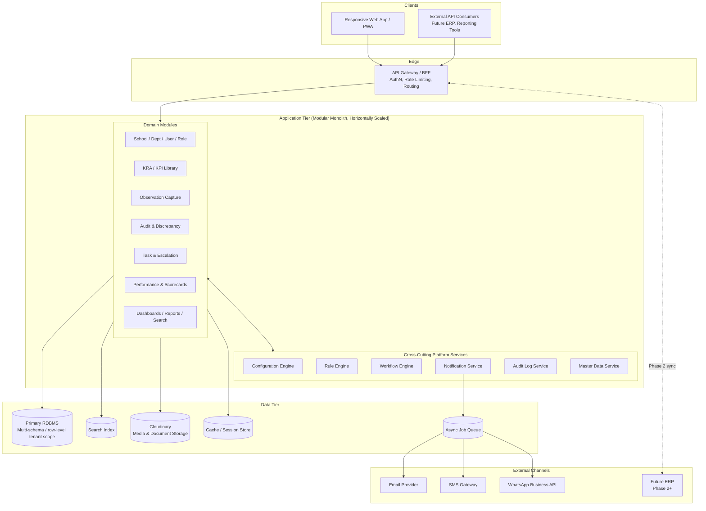
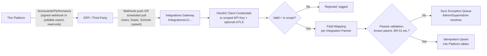
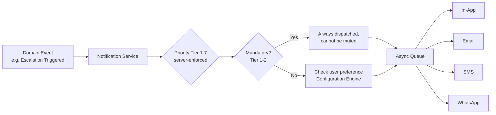
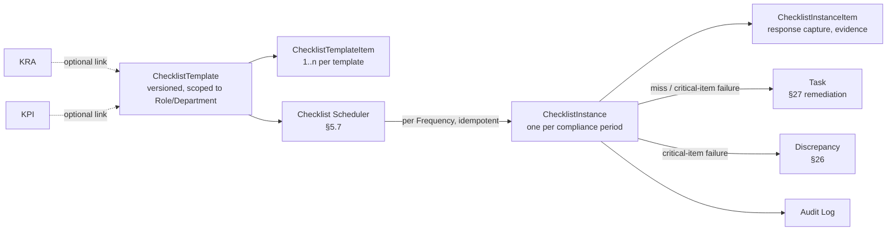

# Architecture Specification

**School Operations & Governance Platform**

| | |
|---|---|
| Document Type | Solution Architecture |
| Version | 1.5 |
| Derived From | PRS v1.5 — School Operations & Governance Platform · 10 role-based KRA/KPI manuals (Accountant, Facility Manager, IT Manager, Marketing Manager, Principal, SOTC Head, Security Guard, Store Incharge, Telecaller, Transport Manager) |
| Status | Draft for Architecture Review |
| Classification | Internal — Engineering |

---

## Document Control

| Version | Description |
|---|---|
| v1.0 | Initial architecture derived from PRS v1.1. Covers architecture style, component model, data architecture, security, integration, deployment, and NFR traceability for Phase 1. |
| v1.1 | Added Section 23 (Checklist & Recurring Task Architecture) formalizing the frequency-based checklist generation model. Cross-referencing all 10 role-based KRA/KPI manuals surfaced dozens of recurring, frequency-tagged compliance items that are checklist-shaped, not single ad-hoc tasks — e.g. daily cleanliness audits (Facility Manager), weekly RO/TDS water-quality checks (Facility Manager), monthly fire-equipment/pest-control/lift/panel checks (Facility Manager), quarterly water-tank cleaning and vendor performance reviews (Facility Manager), and per-shift patrol/CCTV/gate checks (Security Guard). Added a seventh cross-cutting platform service (Checklist Scheduler, §5.7), a new `ChecklistInstance` state machine (§13), updated Component Architecture (§4), NFR Traceability (§19), ADR-06 (§20), and Performance Architecture (§14) for checklist-generation volume. Also confirmed **Neon (serverless PostgreSQL + Neon Auth)** as the primary database/identity provider and **Cloudinary** as the media/document storage layer (photos, video, PDF, DOCX, MD, PPTX) per business direction, superseding the generic "PostgreSQL" / "S3-compatible store" / unspecified-IdP placeholders in v1.0 — updated Data Architecture (§7), Security Architecture (§10), Technology Stack (§18), and added ADR-07 (§20). |
| v1.2 | Added Section 24 (Event-Time Capture Architecture) covering the dual-mode Auto-Captured/Manual event-time recording pipeline (PRS §24.14), the Location master-data component, and per-KPI Event Time Point configuration. Updated Component Architecture (§4) with a Location/Asset scoping layer and Integration Architecture (§11) with placeholder hooks for future Auto-Capture signal sources (GPS/geofence, RFID/biometric/QR, IoT/NFC). |
| v1.3 | Hardened Security Architecture (§10) into explicit subsections mirroring PRS §41 (Authentication & Authorization, Input Validation & Output Encoding, Data Protection, OWASP Top 10 Prevention, Dependency & Infrastructure Security, API Security, Secure Development Lifecycle, Deployment & Operations). Confirmed stateless, short-lived bearer-token authentication (JWT via Neon Auth) so any API node serves any request, supporting the API-first/mobile-readiness architecture constraint (PRS §39). Added SAST/DAST and dependency-scanning gates to the CI/CD pipeline description (§17). |
| v1.4 | Rewrote Integration Architecture (§11) to reflect the fully specified ERP/third-party integration layer (PRS §40): Integration Partner as a first-class identity distinct from human Users, OAuth 2.0 Client Credentials / optional mTLS, a dedicated `/integrations/v1/...` API surface separate from the interactive `/v1/...` surface, Sync Exception Queue, and Sandbox/Certification environment. Updated Component Architecture (§4) and NFR Traceability (§19) accordingly. |
| **v1.5 (this document)** | Added Section 25 (Governance & Compliance-Cycle Architecture) covering the seven v1.5 gap-closure items as architectural components: Multi-Level Discrepancy Approval (extends the Workflow Engine, §5.3, §13), Holiday-Calendar-Aware Compliance Scheduler (extends the Checklist Scheduler pattern, §5.7, generalized into a platform-wide Compliance Scheduler), Asset Lifecycle status gating, Duplicate Observation Detection (a new pre-write validation stage in the Observation-capture pipeline), Grace Period/Reopen governance (a new Observation-shell state machine), and Evidence Retention/Archive-Tier/Deletion as a three-state governance model distinct from simple TTL expiry. Updated Component Architecture (§4), Workflow & State Machine Architecture (§13), NFR Traceability (§19), and added ADR-08 (§20). Document version bumped 1.1 → 1.5 to realign with PRS v1.5. |

**Note on scope:** This document translates the PRS's functional and non-functional requirements into an implementable architecture. It does not re-litigate business rules (PRS Section 9) or functional requirements (PRS FR-001–FR-177) — it assumes them as fixed inputs and answers *how* the system is built to satisfy them. Where a PRS Open Question (Section 17) affects an architecture decision, that decision is marked **Provisional** below.

---

## Table of Contents

1. [Architecture Principles](#1-architecture-principles)
2. [Architecture Style](#2-architecture-style)
3. [High-Level System View](#3-high-level-system-view)
4. [Component Architecture](#4-component-architecture)
5. [Cross-Cutting Platform Services](#5-cross-cutting-platform-services)
6. [Multi-Tenancy & Scope Isolation](#6-multi-tenancy--scope-isolation)
7. [Data Architecture](#7-data-architecture)
8. [Immutability & Versioning Strategy](#8-immutability--versioning-strategy)
9. [API Architecture](#9-api-architecture)
10. [Security Architecture](#10-security-architecture)
11. [Integration Architecture](#11-integration-architecture)
12. [Notification Architecture](#12-notification-architecture)
13. [Workflow & State Machine Architecture](#13-workflow--state-machine-architecture)
14. [Performance & Scalability Architecture](#14-performance--scalability-architecture)
15. [Availability & Resilience](#15-availability--resilience)
16. [Observability](#16-observability)
17. [Deployment Architecture](#17-deployment-architecture)
18. [Technology Stack (Recommended)](#18-technology-stack-recommended)
19. [NFR Traceability Matrix](#19-nfr-traceability-matrix)
20. [Architecture Decision Records (Summary)](#20-architecture-decision-records-summary)
21. [Open Architecture Questions](#21-open-architecture-questions)
22. [Architecture Evolution Roadmap](#22-architecture-evolution-roadmap)
23. [Checklist & Recurring Task Architecture](#23-checklist--recurring-task-architecture)
24. [Event-Time Capture Architecture (v1.2)](#24-event-time-capture-architecture-new-v12--prs-2414-fr-178190)
25. [Governance & Compliance-Cycle Architecture (v1.5)](#25-governance--compliance-cycle-architecture-new-v15--prs-section-9-br-2127-sections-2316-2317-2447-2416-26-3515-47)

---

## 1. Architecture Principles

| # | Principle | Rationale |
|---|---|---|
| AP1 | **Rules live in configuration, not code.** | PRS Section 54 requires lock periods, SLA thresholds, ETA limits, and tolerance bands to be centrally configurable. Hardcoding any of these into module logic violates Objective O7 (scale without re-architecture). |
| AP2 | **Immutability is enforced at the data layer, never only in the UI.** | PRS Section 55 explicitly requires this for Observations, KPI versions, and Scorecards. A UI-only lock is not compliant. |
| AP3 | **Every cross-cutting concern is a shared service, called by modules — never re-implemented per module.** | Audit logging, notifications, workflow transitions, and configuration resolution must behave identically everywhere or the platform's audit-defensibility (Objective O2) breaks. |
| AP4 | **Scope (School/Department) isolation is enforced as a mandatory query-layer filter, independent of role permissions.** | PRS Section 43: tenant isolation must hold even if a role-permission check is misconfigured — defense in depth. |
| AP5 | **The API is a first-class citizen, not an afterthought of the UI.** | PRS Section 39 requires the API to enforce the identical Permission Matrix as the UI, since it is the seam for future ERP integration (BR-19). |
| AP6 | **Design for horizontal scale-out from day one, not vertical scaling.** | PRS Section 46 explicitly rules out vertical-scaling-only architectures for the 5,000-concurrent-user target. |
| AP7 | **No hard deletes, anywhere.** | PRS Section 47 / BR-04 / BR-08 / BR-18. Every entity lifecycle ends in Archived, Deprecated, or Superseded — never a DELETE. |
| AP8 | **Build the modular monolith first; extract services only where a genuine scaling or team boundary demands it.** | At Phase 1 scale (hundreds of schools, 5,000 concurrent users), a distributed microservices architecture adds operational cost without a corresponding benefit. The module boundaries in Section 4 are designed so that extraction later is a deployment change, not a redesign. |
| AP9 | **A recurring compliance obligation is a Checklist Template generating immutable-once-completed Instances, never a hand-recreated Task.** | All 10 role-based KRA/KPI manuals define their operational duties as frequency-tagged, repeating checks (daily/weekly/monthly/quarterly/per-shift), not one-off work items. Modeling these as the generic Task entity alone (PRS §27) would force every Checker/Admin to manually recreate the same item every cycle, with no generation-time guarantee of completeness or auditability. §23 makes checklist generation a first-class, deterministic, scheduler-driven capability. |

---

## 2. Architecture Style

**Modular monolith, service-oriented internally, deployed as a small number of independently scalable units.**

- The application is decomposed into **domain modules** (School, User, KRA/KPI, Observation, Audit, Discrepancy, Task, Performance, Notification, Reporting) that map directly to PRS Part 2 sections 18–35.
- Modules communicate **in-process** through well-defined internal service interfaces (not a shared database free-for-all) — this is what makes later extraction into separate services (Phase 3+) a boundary change, not a rewrite.
- Six **cross-cutting platform services** (Section 5) are used by every domain module and are architected so they *could* become independent services without changing their calling contract.
- A single **API Gateway / BFF layer** fronts the monolith, terminating auth, applying the Permission Matrix, and routing to internal modules.
- Read-heavy, reporting-style workloads (Dashboards, Report Catalogue, Search) are architecturally separated from write-path workloads (Observation submission, Task actions) so that heavy report generation cannot degrade transactional response times (ties to AP6 and PRS Section 46).

This style is chosen over microservices-from-day-one because:
- Team size and Phase 1 scope (single product, single roadmap) don't yet justify independent deployability per module.
- Cross-module transactions are common in this domain (Observation → Discrepancy → Task → Scorecard all touch each other) — a monolith keeps these transactionally consistent without distributed-transaction complexity.
- PRS Section 57.4 already anticipates future extraction ("Configuration Engine," "Rule Engine," etc., described as *services* even in Phase 1) — this document treats that as the target internal seam, not an immediate deployment topology.

---

## 3. High-Level System View



---

## 4. Component Architecture

Each domain module below corresponds to one or more PRS Part 2 sections and owns its own tables, but calls the shared platform services (Section 5) rather than re-implementing them.

| Module | PRS Reference | Owns | Depends On (Platform Services) |
|---|---|---|---|
| **School / Department / User / Role** | §18–21 | School, Department, User, Role, Permission assignment | Master Data, Audit, Configuration |
| **KRA / KPI Library** | §22–23 | KRA, KPI (versioned), Global KPI Library | Audit, Configuration, Rule Engine (RAG/threshold calc) |
| **Observation Capture** | §24 | Observation records, lock-period enforcement | Configuration (lock period), Audit, Rule Engine (auto-result) |
| **Audit & Discrepancy** | §25–26 | Discrepancy lifecycle, investigation, multi-level approval (Category-driven Approval Chain, v1.5) | Workflow Engine, Audit, Notification, Configuration (Approval Chain Configuration) |
| **Location & Asset** *(v1.2/v1.5)* | §35.15, §37.10, §37.12 | Location (floor/zone/wing), Asset registry + Status (Active/Retired) | Master Data, Audit |
| **Integration Layer** *(v1.4)* | §39–40 | Integration Partner registry, Sync Exception Queue, dedicated `/integrations/v1/...` surface | Configuration, Audit, Notification |
| **Task & Escalation** | §27 | Task, Primary Ownership, ETA, Escalation Matrix | Workflow Engine, Configuration (ETA cap, SLA), Notification |
| **Checklist & Recurring Compliance** | §23 (new), extends §22–23, §27 | ChecklistTemplate (versioned), ChecklistTemplateItem, ChecklistInstance, ChecklistInstanceItem | Checklist Scheduler, Workflow Engine, Rule Engine (compliance %), Task & Escalation (miss → remediation Task/Discrepancy), Notification, Audit |
| **Performance & Scorecards** | §28–29 | Scorecard generation and versioning | Rule Engine (aggregation), Audit |
| **Dashboards / Reports / Search** | §30–31, 33 | Read-optimized views, export, global search | Master Data, Configuration |
| **Notifications (module-facing)** | §32 | Per-user notification preferences | Notification Service, Configuration |
| **Settings & Master Data** | §34–35 | Configurable enumerations, feature flags | Configuration, Master Data, Audit |

**Module boundary rule:** a module may write only to its own tables. If it needs data owned by another module, it calls that module's internal service interface — it never queries another module's tables directly. This is the seam that allows Phase 3 service extraction (Section 22) without a data-layer rewrite.

---

## 5. Cross-Cutting Platform Services

These seven services are the direct architectural realization of PRS Section 57.4 (§5.1–5.6) plus the checklist-generation capability formalized in §23 (§5.7). Every domain module consumes them through a stable internal interface.

### 5.1 Configuration Engine
- Single source of truth for all configurable values in PRS Section 54: Observation Lock Period, Max ETA Extensions (fixed, non-overridable per BR-10), Escalation SLA per level, Reminder Frequency, KPI Amber Tolerance Band (PRS §23.14/§54), Session Timeout, File Upload Limits, Feature Flags.
- Resolves configuration by scope precedence: **School override → Department override → Global default**, where overrides are explicitly permitted per item (most are Global-only per §54's table).
- All configuration changes are versioned and written to the Audit Log Service (governance requirement, PRS §48).
- Read path is cache-backed (Section 14) since configuration is read far more often than written.

### 5.2 Rule Engine
- Evaluates KPI Comparator logic and RAG (Red/Amber/Green) status per PRS §23.14 — full-precision evaluation, round-half-up for display only.
- Computes Scorecard aggregation using worst-status-wins roll-up (Phase 1) with a pluggable strategy interface so weighted aggregation (Phase 2, §57.2) is a new strategy implementation, not a rearchitecture.
- Triggers reminder and escalation timers by evaluating Configuration Engine values against elapsed time.
- Stateless and deterministic by design — the same inputs always produce the same RAG/Pass-Fail output, which is a hard requirement for audit defensibility.

### 5.3 Workflow Engine
- Generic finite-state-machine executor shared by Task, Discrepancy, and (Phase 3+) any new stateful entity.
- State machines are **data-defined, not hardcoded**: each entity type registers its allowed states and transitions (see Section 13), and the engine rejects any transition not in that definition — this directly satisfies FR-090 (no skipped Discrepancy states).
- Every transition emits an event consumed by the Audit Log Service and, where applicable, the Notification Service.

### 5.4 Notification Service
- Single dispatch point for all seven notification priority tiers (PRS BR-15 / §49).
- Fixed priority ordering and non-mutability of mandatory categories (Escalation, Audit Failure) is enforced **server-side inside this service**, not client-side (FR-165) — a client cannot construct a request that mutes a mandatory category.
- Channel-agnostic core (in-app, email, SMS, WhatsApp) with a pluggable channel adapter per provider; adding a channel (e.g., push notifications, per §57.4) means adding an adapter, not touching calling modules.
- Publishes to the Async Job Queue (Section 7) rather than sending synchronously, so a slow SMS/WhatsApp provider never blocks the request that triggered the notification.

### 5.5 Audit Log Service
- Single, append-only sink for every event listed in PRS §45 (login, logout, failed auth, KPI edits, Observation submit/lock, Discrepancy transitions, Role changes, Scorecard generation, sensitive-data views/exports).
- Every entry captures actor identity, action, entity/record ID, server timestamp, and optional reason — matching §45's schema exactly.
- Physically append-only at the storage layer (no UPDATE/DELETE grants on the audit table for any application role) so immutability is a database-enforced guarantee, not an application convention.
- Retention: permanent, no expiry (§47) — architected on cheap, durable storage (e.g., partitioned by month) since it grows unbounded.

### 5.6 Master Data Service
- Owns reference enumerations (Frequency, Comparator, Priority, Department templates, Discrepancy categories) per PRS §35.
- Changes are forward-only: existing records keep referencing the enumeration value active at their creation time (§35.5), matching the same non-retroactive philosophy as KPI versioning.

### 5.7a Compliance Scheduler *(generalized, v1.5)*
- Generalizes the Checklist Scheduler pattern below (§5.7) into a platform-wide capability that also generates recurring **KPI compliance record shells** (Observation rows in `compliance_status='open'`, Data-Model.md §3.6), not only Checklist Instances (PRS §23.16, BR-24).
- **Idempotency:** identical guarantee to §5.7 — a logical occurrence (KPI + Department/Asset/Location scope + due date) is upserted against a uniqueness constraint and is never generated twice across retries, backfills, or overlapping runs (FR-252).
- **Timezone-aware:** computes due dates and cycle boundaries using each School's configured timezone, never server-local or UTC (FR-251) — the run batches by School-timezone group, consistent with `compliance_scheduler_runs.school_timezone_batch` (Data-Model.md §4.8).
- **Holiday-aware:** before writing a due date, consults the Organization Holiday Calendar and the KPI's/School's Working Days configuration (Master Data Service, §5.6) and applies the KPI's Non-Working-Day Policy (Skip/Shift Forward/Shift Backward) — PRS §23.17, BR-22, FR-240–242.
- **Backfill:** detects missed scheduler executions (e.g., after downtime) and backfills all missed occurrences on the next successful run, preserving each occurrence's original due date (FR-253) — this original due date is what the Grace Period (§25.4 below) calculates against, not the backfill time.
- Every run is logged to `compliance_scheduler_runs` (success/failure, records generated, records backfilled), distinct from per-record lifecycle logging in the Audit Log Service (FR-255).

### 5.7 Checklist Scheduler *(new, v1.1)*
- Materializes `ChecklistInstance` rows from active `ChecklistTemplate` definitions on a per-Frequency cadence (§23), the same Frequency enumeration the Master Data Service already owns (Daily, Weekly, Monthly, Quarterly, Half-Yearly, Annually, Per-Shift, Ad-hoc/Event-triggered).
- Generation is **idempotent and deterministic**: each run computes the current compliance period (e.g., today's calendar date for Daily, ISO week for Weekly, the active shift window for Per-Shift) and upserts against a uniqueness constraint on `(template_id, template_version, school_id, department_id, period_start)` — a re-run after a crash or a scheduler double-fire produces zero duplicate instances (mirrors AP9 and the Observation idempotency pattern, §9).
- Reads Frequency and shift-pattern configuration through the Configuration Engine (§5.1) and Master Data Service (§5.6) rather than hardcoding cadence logic — a new Frequency value (e.g., a future Fortnightly cadence) is a Master Data + Scheduler-rule addition, not a code change.
- On instance creation, delegates to the Workflow Engine (§5.3) to initialize the `ChecklistInstance` state machine (§13) and to the Notification Service (§5.4) for the "Checklist Assigned" tier.
- On a missed due-date (instance still `Pending`/`In Progress` past its period end), triggers the same Escalation Matrix and Task-creation path used by Task & Escalation (§27) rather than re-implementing escalation — a missed checklist becomes a remediation Task through the Workflow Engine, so escalation history stays in one place.
- Runs as a background job off the Async Job Queue (Section 7), never in the request path — matching AP6/§14, since a school-wide Daily checklist generation run touches every department and post/shift in one pass.

---

## 6. Multi-Tenancy & Scope Isolation

- **Tenancy model:** shared application, shared database, **row-level tenant isolation** — every tenant-scoped table carries a `school_id` (and `department_id` where relevant), and every query passes through a mandatory scope filter applied at the data-access layer, independent of and prior to permission checks (AP4, PRS §43).
- **Why shared database, not database-per-school:** at target scale (hundreds of schools, PRS §46), database-per-tenant multiplies operational overhead (migrations, backups, connection pools) without a compliance requirement forcing physical separation. Row-level isolation with mandatory filters and audited access is sufficient and is the same pattern used by comparable enterprise SaaS platforms (ServiceNow, Salesforce).
- **Exceptions:** SuperAdmin (all schools) and Viewer (may be granted multiple schools) per BR-01/C1 — these are modeled as explicit scope-grant records, not a bypass of the filter; the filter still runs, it just evaluates against a wider allowed-scope set.
- **Enforcement point:** the scope filter lives in a shared data-access layer used by every module — a module cannot opt out of it, and it is unit-tested independently of any specific module's business logic.

---

## 7. Data Architecture

- **Primary datastore:** a single relational database — **Neon (serverless PostgreSQL)** (Section 18) — as the system of record for all transactional entities in the PRS Data Dictionary (§37): School, Department, User, Role, KRA, KPI, Observation, Discrepancy, Task, Scorecard, Master Data, plus the Checklist entities in §23. Neon's branching model (instant copy-on-write database branches) is used for per-PR/per-feature preview environments (§17) without a full data-copy cost, and its scale-to-zero compute on non-production branches keeps Dev/Staging cost proportional to actual use.
- **Entity relationships:** as defined in PRS §38 ERD — School → Department → User forms the tenancy hierarchy; KRA → KPI → Observation forms the compliance chain; Observation → Discrepancy is optional (0/1); Task ↔ User is many-to-many via Primary Ownership; User/Department → Scorecard is one-to-many with versioning.
- **Search index:** a denormalized, near-real-time search index (target < 60s lag, §51) fed by change events from the primary database, used for global cross-entity search (§33) and does not become a second system of record.
- **Media & document storage:** evidence files (photos, videos, and documents — PDF, DOCX, MD, PPTX — attached to Observations, Checklist Instance items, Task attachments, and Discrepancy evidence) live in **Cloudinary**, not the relational database, with the database holding only the Cloudinary `public_id`/secure URL and metadata (resource type, format, size, virus-scan status per §41). Cloudinary is used rather than a bare S3-compatible bucket because it natively handles the format mix the KRA/KPI manuals evidence (photo evidence for facility/safety checklist items, scanned PDFs for statutory certificates and vendor documents, DOCX/PPTX for reports) with built-in transformation (thumbnailing, image compression per §41), video transcoding, and a CDN delivery layer, avoiding a separate image-processing/CDN service.
- **Cache / session store:** used for (a) session/token state, (b) Configuration Engine reads (Section 5.1), and (c) hot dashboard aggregates — never used as the source of truth for any entity.
- **Async job queue:** backs notification dispatch, large/asynchronous report exports (§31.12, so exports never block interactive request paths), and scheduled jobs (reminders, escalation SLA checks, scorecard generation, checklist generation §5.7).

---

## 8. Immutability & Versioning Strategy

Directly implements PRS §44 (Versioning) and the acceptance criteria in §55 that immutability must be data-layer enforced.

| Entity | Mechanism |
|---|---|
| **Observation** | Mutable only until the configured lock period elapses (Configuration Engine-resolved). After lock, a database-level constraint (trigger or application-layer write-guard backed by a DB check) rejects any UPDATE. Corrections after lock create a new Observation referencing the original — never an edit. |
| **KPI** | Every edit to Target/Comparator/Unit inserts a new row with an incremented version and a new immutable ID; the prior version is never updated once any Observation references it. Historical queries resolve by joining to the KPI version active at the Observation's capture timestamp. |
| **Scorecard** | Generated, never updated. Regeneration inserts a new version and sets `superseded_by` on the prior version. No application role holds UPDATE/DELETE grants on generated Scorecard rows. |
| **Audit Log** | Append-only at the grant level (Section 5.5) — the strongest guarantee in the system, since this is the record of record for every other immutability claim. |
| **Master Data** | New records for changed values; existing foreign-key references are never repointed retroactively (§35.5). |

**Enforcement pattern:** for each of the above, immutability is enforced by *removing the application's ability to issue the mutating statement* (via database grants and/or triggers), not solely by application-code conditionals — this is what makes it a data-layer guarantee rather than a UI convention (§55).

---

## 9. API Architecture

- **Style:** versioned REST (`/v1/...`) per PRS §39, JSON payloads, resource-oriented endpoints for all core entities (Users, KPIs, Observations, Tasks, Discrepancies, Scorecards).
- **AuthN:** delegated to **Neon Auth** (Neon's integrated authentication layer, backed by Better Auth) rather than a hand-rolled credential store — issues the bearer token consumed at the Gateway, and MFA-gates Admin/SuperAdmin at login (§41–42). Because Neon Auth provisions user identity records directly into the Neon Postgres instance (a `neon_auth.users_sync` table kept in sync with the auth provider), the platform's own `users` table (Data-Model.md §3.3) references that synced identity rather than duplicating credential storage — the application's `users` table stays the source of truth for role/school/department assignment and business fields, while Neon Auth owns credentials, sessions, and MFA enrollment.
- **AuthZ:** every request re-evaluates the Permission Matrix (§12) and scope filter (Section 6) at the point of execution — the API enforces identically to the UI; there is no separate, looser API permission model (§39, §43).
- **Idempotency:** write endpoints that create records accept a client-generated idempotency key; Observation submission specifically requires one (FR-069) to guard against duplicate creation on client retry after network failure.
- **Pagination & filtering:** all list endpoints are paginated with bounded date ranges by default, to protect the performance targets in Section 14 (PRS §31.6).
- **Events/webhooks:** state-transition events (Discrepancy state change, Task escalation, Scorecard generation) are published for future webhook consumers, anticipating the Integration Layer's needs (§39, §57.4) without requiring Phase 1 to build actual outbound webhook delivery infrastructure beyond the event contract.
- **Error contract:** structured, machine-readable errors (code, message, field reference) per §53; conflict errors return 409-equivalent semantics with a resolution path.

---

## 10. Security Architecture

| Control | Detail |
|---|---|
| Transport | TLS 1.2+ everywhere; no plaintext internal traffic between gateway and app tier. |
| At-rest encryption | AES-256, provided by Neon (primary database, encrypted at rest by default) and Cloudinary (media/document storage). |
| AuthN | **Neon Auth** (Better Auth-backed) as the identity provider — email/password baseline; MFA mandatory (not optional) for Admin and SuperAdmin (§41), enforced via Neon Auth's MFA enrollment rather than a custom-built flow. SSO integration point reserved for Phase 2 ERP integration (§40, §42) — Neon Auth's OAuth/SSO connector support is the intended extension point. |
| Session management | Configurable inactivity timeout (Configuration Engine) layered on top of Neon Auth's session tokens; failed-login rate limiting and logging to deter brute force (§42). |
| AuthZ | RBAC evaluated at both API and data layer (§43); multi-role users receive the union of permissions with explicit conflict exceptions (self-audit block FR-026, investigation/approval separation FR-092) — RBAC role/scope assignment remains this platform's own concern (Data-Model.md §4.1), layered on top of Neon Auth's identity, not delegated to it. |
| File handling | Allowlisted formats — images (JPEG, PNG), video (MP4), and documents (PDF, DOCX, MD, PPTX) per the evidence/attachment types evidenced across Observation, Checklist, and Task modules — configurable max size (default 10MB for images, larger caps for video/documents per Cloudinary plan limits), mandatory virus scan on upload before the file is made retrievable, automatic image/video compression and format-appropriate transformation via Cloudinary (§41). |
| Compliance target | ISO 27001-aligned control set, appropriate to the compliance nature of the data (§41). |
| Regulatory | India DPDP Act adherence: data-subject access/correction/erasure request handling and a maintained data-processing record (§41). Erasure requests are reconciled against AP7 (no hard deletes) via anonymization rather than physical deletion for entities under legal/audit retention; erasure of a data subject's uploaded media specifically requires a coordinated delete against Cloudinary (not just the database reference) since Cloudinary is the actual byte store. |
| Segregation of duties | Structurally enforced, not just policy: Checker cannot audit their own Observation (FR-026); Discrepancy Investigation Owner cannot be its own Approver (FR-092), and — as of v1.5 — no Approver may repeat at any prior level on the same Discrepancy (FR-233) — all enforced by the Workflow Engine (Section 5.3), not by process instruction alone. |

### 10.1 Authentication & Authorization *(v1.3, PRS §41.1)*
Stateless, short-lived bearer tokens (JWT, issued by Neon Auth) with refresh tokens — no server-pinned session state, so any API node can serve any request (supports horizontal scale-out, §14, and the API-first mobile-readiness constraint, §9). MFA mandatory for Admin/SuperAdmin (unchanged from §10 above); least-privilege scoping applied identically to human tokens and, as of v1.4, Integration Partner tokens (§11).

### 10.2 Input Validation & Output Encoding *(v1.3, PRS §41.2)*
Server-side validation on every write path (never client-trust-only); context-aware output encoding on all user-influenced content rendered in HTML/JS/URL contexts; Content-Security-Policy and other security headers (X-Frame-Options, X-Content-Type-Options, Strict-Transport-Security) set on all responses (FR-193, FR-199).

### 10.3 Data Protection *(v1.3, PRS §41.3)*
Passwords hashed via Neon Auth (bcrypt/Argon2/scrypt-class; never stored by this platform's own schema, Data-Model.md §5.4 note); parameterized queries/vetted ORM only, no string-concatenated SQL (FR-192); secrets sourced from environment/secrets-manager, never committed to source control (FR-195); sensitive data (passwords, tokens, PII) masked/redacted in logs and non-production environments (FR-196); Integration Partner credentials (§11) follow the same rotation and never-plaintext-storage policy as any other secret.

### 10.4 OWASP Top 10 Prevention *(v1.3, PRS §41.4)*
SQL injection prevention via §10.3; CSRF protection via anti-CSRF tokens and SameSite cookies on state-changing web requests (FR-197); SSRF prevention via an allowlist check on any server-initiated outbound request, including outbound webhook delivery to Integration Partners (FR-198); security headers per §10.2.

### 10.5 Dependency & Infrastructure Security *(v1.3, PRS §41.5)*
Automated dependency vulnerability scanning in CI (Section 17); container image scanning before deployment; least-privilege service accounts (never root/admin); OS/runtime patch cadence.

### 10.6 API Security *(v1.3/v1.4, PRS §41.6, §39)*
Rate limiting per API key/token/user on the interactive `/v1/...` surface, and **independently scoped rate limiting per Integration Partner** on the `/integrations/v1/...` surface (§11) so one partner's traffic cannot degrade another's or the interactive UI's (§39). Explicit, origin-scoped CORS policy in Production — no wildcard origin. Content-type validation with structured rejection of malformed payloads.

### 10.7 Secure Development Lifecycle *(v1.3, PRS §41.7)*
Threat modeling per major module before implementation; SAST/DAST in CI/CD on every push/PR to protected branches (Section 17, 58.4); security-focused code review pass; scheduled penetration testing; documented incident-response process and responsible-disclosure channel before go-live.

### 10.8 Deployment & Operations *(v1.3, PRS §41.8)*
HTTPS enforced everywhere with HTTP→HTTPS redirect; debug mode/verbose stack traces disabled in Production; monitoring/alerting on suspicious activity (repeated auth failures, permission-denied spikes, abnormal export volume); Infrastructure-as-Code with security scanning in the provisioning pipeline; scheduled backups with periodic restore drills; defense in depth — no single control relied upon exclusively.

---

## 11. Integration Architecture *(rewritten v1.4, PRS §40)*

Per PRS §40 and BR-19: this platform is the system of record for Tasks, Compliance, Audits, Discrepancies, KPIs, and Performance; a future ERP becomes the system of record for Users, Departments, and Schools. As of v1.4, this is a fully specified, secured integration layer — built in Phase 1 so Phase 2 activation is a configuration/credentialing exercise, not a re-architecture (PRS §40, top).



- **11.1 Integration Architecture (transport).** Inbound (ERP → Platform) supports both webhook push and scheduled pull/poll, so ERPs without webhook capability remain supportable. Outbound (Platform → ERP, Scorecards/Performance only) is signed-webhook and/or pollable export. All inbound writes are treated as upsert-by-external-reference-ID, never a raw overwrite of platform-owned fields (e.g., an ERP cannot set a User's Role). Every inbound record carries a client-supplied idempotency key, reusing the same pattern as Observation submission (FR-069).
- **11.2 AuthN/AuthZ for external systems.** Each connected system is an **Integration Partner** (Data-Model.md §4.8) — never a proxy for a human User. OAuth 2.0 Client Credentials grant is preferred; a scoped, rotatable API key is the fallback; mTLS is available as an optional higher-assurance layer. Every Integration Partner is assigned an explicit scope (entities + Schools it may act on), following the same least-privilege principle as human RBAC (§10.1). Every integration action is attributed to the Integration Partner identity in the Audit Log, exactly as a human actor would be.
- **11.3 Data mapping.** Field-level mapping between an ERP's schema and this platform's Data Dictionary is configurable per Integration Partner (Configuration Engine, §5.1), not hardcoded per vendor. Unmapped inbound fields are ignored-but-logged, not rejected; required platform fields with no ERP equivalent fall back to a configured default or route to the Sync Exception Queue.
- **11.4 Conflict resolution & Sync Exceptions.** For ERP-mastered domains, ERP data wins on conflict (BR-19) — no local edits once live sync is active for that School. Records that fail validation, reference an unknown parent, or violate a platform governance rule (e.g., BR-01) are never silently dropped or overwritten; they land in a **Sync Exception Queue** visible to Admin/SuperAdmin for manual resolution (Data-Model.md `sync_exceptions`). Outbound Scorecard/Performance data is always platform-authoritative — the ERP treats it read-only.
- **11.5 Error handling, retry, idempotency.** Failed sync attempts retry with exponential backoff up to a configurable maximum, then land in a dead-letter state visible in Integration Health (§11.6) rather than retrying indefinitely or failing silently — consistent with the platform-wide idempotency principle (FR-069, §53).
- **11.6 Integration monitoring & health.** Per-partner last-successful-sync timestamp, failure history, and dead-letter visibility (`integration_partners.last_successful_sync_at`, Data-Model.md §4.8), surfaced via the Integration Sync Report and Sync Exception Report (PRS §50).
- **11.7 Sandbox / Certification environment.** Every Integration Partner has an `environment` of Sandbox or Production and a `status` lifecycle of Pending Certification → Active → Suspended/Revoked, so a new ERP integration is certified against non-production data before being promoted (Data-Model.md §4.8).
- **11.8 Secured integration surface.** A dedicated, separately versioned API namespace (`/integrations/v1/...`) isolates integration traffic from interactive `/v1/...` traffic — its own rate limits (per Integration Partner, §10.6), its own (longer) deprecation-notice window given the operational cost of ERP re-certification, and HMAC-signed outbound webhooks with timestamp+nonce to prevent replay (§39, §41.4 SSRF/webhook controls).

| Domain | System of Record | Integration Direction |
|---|---|---|
| Schools, Departments, Users | ERP (future) | ERP → Platform (sync inbound) |
| KRA/KPI Library | This Platform | Platform-internal, no external sync |
| Observations, Audits, Discrepancies | This Platform | Platform-internal; may export to ERP reporting layer |
| Tasks | This Platform | Platform-internal |
| Scorecards/Performance | This Platform | Platform → ERP (export outbound, read-only) |

- **Phase 1:** the REST API layer (Section 9) and the full integration security/architecture above ship without live ERP connectivity — built and documented, but nothing external is credentialed to consume it yet.
- **Phase 2:** inbound sync activates for Users/Departments/Schools; outbound export activates for Scorecards.

---

## 12. Notification Architecture

Implements the fixed priority order and channel matrix from PRS §49 as an architectural contract, not just a UI display order.



- Mandatory-category enforcement (§49, FR-165) happens **inside the Notification Service**, before any channel dispatch — a request from any client that attempts to suppress Tier 1/2 is rejected server-side, closing the gap a purely client-side mute toggle would leave open.
- Delivery is asynchronous via the job queue (Section 7) so that a slow or failing external channel (SMS/WhatsApp provider outage) never blocks the domain action that triggered the notification.
- Failed deliveries are retried with backoff and logged; persistent failures surface to Admin via the Audit Log, not silently dropped.

---

## 13. Workflow & State Machine Architecture

The Workflow Engine (Section 5.3) executes the following PRS-defined state machines as **data-defined transition tables**, so a new entity type or a modified transition set is a configuration change, not a code change to the engine itself.

**Task** (§27)
```
Draft → Assigned → Accepted → In Progress → Completed → Approved → Archived
                                      ↳ Blocked (if all Primary Owners archived pre-completion)
```

**Observation** (§24)
```
Draft → Submitted → Locked (auto, after configurable lock period) → Audited → Archived
```

**Discrepancy** (§26, BR-13, BR-21 — *revised v1.5: multi-level approval*)
```
Raised → Investigating → Resolved → Pending Approval (Level 1..N, per Category's Approval Chain) → Closed
                                            ↳ Rejected at any level → back to Investigating (findings preserved)
```
The number of Pending-Approval levels (1 or 2, Phase 1 cap) and the Role assigned to each level are resolved at runtime from the Discrepancy's snapshotted `approval_chain_version_id` (Data-Model.md §3.7), not hardcoded in the transition table — the Workflow Engine reads level count from configuration data, then applies the same "reject any skip" rule uniformly regardless of chain length.

**Observation Compliance Shell** *(new, v1.5 — §23.16, §24.16, BR-24, BR-26)*
```
(Scheduler generates shell) → Open → [Checker submits] → Submitted
                                 ↓ (due date passes)
                            Late-Submittable → [Checker submits] → Submitted (flagged Late)
                                 ↓ (Grace Period elapses)
                            Closed-Missed → [Reopen Request + Admin/SuperAdmin Approval] → Late-Submittable → Submitted (flagged Late + Reopened)
```
This is distinct from the Observation *record's* own lock-period state machine above — the shell tracks whether a submission exists at all, while the lock-period machine governs editability of a submission once made. A record can carry `compliance_status='closed_missed'` and never reach the Observation state machine at all if it is never reopened.

**ChecklistInstance** *(new, v1.1 — §23)*
```
Generated → Pending → In Progress → Completed → Verified → Archived
                 ↳ Missed (auto, if period end reached before Completed)
                       ↳ Escalated (spawns a remediation Task via §27's engine, or a Discrepancy for a critical-item failure)
```

- The engine rejects any transition not explicitly defined for that entity (satisfies FR-090: no skipped Discrepancy states) — this now extends identically to `ChecklistInstance` and, as of v1.5, to the Observation Compliance Shell, since both register with the same generic state-machine executor rather than a bespoke one. The variable-length Discrepancy Approval chain (1–2 levels) is handled by parameterizing the registered transition table per Category rather than adding a new engine code path.
- Every transition is atomic with its Audit Log write — a transition that isn't logged is treated as not having happened (no eventual-consistency gap between state and audit trail, given both live in the same primary database transaction).

---

## 14. Performance & Scalability Architecture

Directly targets the NFRs in PRS §46.

| PRS Target | Architectural Mechanism |
|---|---|
| Page load < 2s (p95) | CDN-served static assets; server-side pagination on all list views; cache-backed Configuration reads. |
| Dashboard/report load < 5s (p95) | Read-optimized, pre-aggregated dashboard views refreshed asynchronously, not computed live from transactional tables on every request. |
| API response < 500ms avg / < 1.5s p95 | Stateless application tier behind a load balancer, horizontally scaled (AP6); connection pooling; indexed access paths for every query used by a list/report endpoint. |
| 5,000 concurrent users | Horizontal auto-scaling of the application tier; session state externalized to the cache layer (Section 7) so any instance can serve any request — no sticky-session dependency that would cap scale-out. |
| 1,000,000+ Observations/year | Observation table partitioned by time (e.g., monthly) to keep write and lock-check operations fast as volume grows; the lock-period sweep (Configuration Engine-driven) runs as a background job against recent partitions only, not a full-table scan. |
| Search indexing lag < 60s | Asynchronous, event-driven index updates (Section 7) rather than synchronous dual-writes on the request path. |
| Bounded exports / non-blocking | Large exports run as background jobs via the async queue, with the user notified on completion rather than holding a request open. |
| Checklist generation at scale *(new, v1.1)* | Per-Frequency generation batches per school (a Daily run for one school may create hundreds of `ChecklistInstance` rows across departments/shifts in a single pass); the Checklist Scheduler (§5.7) bulk-inserts within one transaction per school rather than row-by-row, and runs across schools in parallel batches sized to stay within the primary database's write-throughput headroom outside peak dashboard-read hours. |

---

## 15. Availability & Resilience

- **Target:** 99.9% monthly availability, excluding announced maintenance windows (≤ 4 hrs/month, off-peak) — per §46.
- **Application tier:** stateless and horizontally scaled behind a load balancer; no single application instance is a single point of failure.
- **Database tier:** primary with synchronous or near-synchronous standby replica for failover; read replicas absorb reporting/dashboard read load so it cannot contend with transactional write load.
- **Async queue and Notification Service:** designed to degrade gracefully — if an external channel (SMS/WhatsApp) is down, delivery retries rather than blocking or dropping other channels/events.
- **Incident process:** an availability breach triggers incident review per PRS §48 governance rules; this is a process commitment the architecture must support with adequate monitoring (Section 16), not something the architecture itself guarantees alone.

---

## 16. Observability

Not explicitly detailed in the PRS but required to operationally meet the §46 targets and §48 governance commitments:

- **Metrics:** request latency (p50/p95/p99) per endpoint, error rates, queue depth, database connection pool saturation — alertable against the §46 thresholds.
- **Logging:** structured application logs, correlated by request ID, separate from (and not a substitute for) the Audit Log Service — application logs are operational/debugging data; the Audit Log is the compliance record.
- **Tracing:** distributed trace correlation across gateway → module → platform service → database, so a slow request (e.g., dashboard load exceeding 5s) can be attributed to a specific hop.
- **Dashboards:** an internal ops dashboard tracking the §46 targets directly, so an SLA breach is visible before it becomes an incident review.

---

## 17. Deployment Architecture

Per PRS §56:

- **Environments:** Dev, Staging, Production, fully separated (separate databases, separate configuration).
- **Hosting:** cloud-hosted; no on-premises requirement stated in the PRS.
- **Delivery:** responsive web application (PWA-capable); no native mobile app in Phase 1 (§6.2).
- **CI/CD:** automated pipeline running the acceptance-criteria test suite (§55) against every change before promotion; feature flags (Section 5.1) allow merging and deploying incomplete or gated functionality without exposing it, decoupling deploy from release.
- **Rollout mechanism:** module-level and feature-level flags (§54, §56) allow phased enablement (e.g., enabling a new report type for one school before all schools) without a redeploy.
- **Connectivity assumption:** the system is online-only; no offline mode is designed or supported (BR-16/C7) — this simplifies the client architecture (no local sync/conflict-resolution layer) but means client-side resilience is limited to standard retry/idempotency on transient network loss, not offline operation.

---

## 18. Technology Stack (Recommended)

The PRS does not mandate specific technologies. The recommendations below satisfy the architecture principles and NFRs above; they are a starting proposal for engineering sign-off, not a binding decision.

| Layer | Recommendation | Why |
|---|---|---|
| Primary database | **Neon (serverless PostgreSQL)** | Full Postgres compatibility — row-level security (tenant isolation), partitioning (Observation/Checklist-instance volume), JSONB (flexible Master Data/config) all work unchanged. Adds serverless autoscaling of compute, scale-to-zero for Dev/Staging branches, and instant copy-on-write database branching for preview environments — a meaningful cost/velocity win over a fixed-size managed Postgres instance at Phase 1's variable school-onboarding pace. Read replicas satisfy the reporting/dashboard read-offload need from §14. |
| Authentication | **Neon Auth** (Better Auth-backed) | Ships as an integrated part of the Neon platform: user identity is synced directly into a `neon_auth` schema inside the same Postgres instance, removing the need for a separate identity provider and its own data-sync/webhook plumbing. Provides email/password, MFA, and OAuth/SSO connectors out of the box — matching §41–42's MFA-for-Admin/SuperAdmin requirement and the Phase 2 SSO extension point (§40) without custom build. |
| Media & document storage | **Cloudinary** | Purpose-built for the mixed evidence/attachment types this platform actually handles — photos and video (Observation/Checklist evidence, incident documentation), and documents (PDF, DOCX, MD, PPTX for reports, statutory certificates, vendor documents). Built-in image/video transformation and compression (§41), automatic format-aware delivery, and CDN-backed retrieval remove the need for a separate image-processing pipeline that a bare S3-compatible bucket would require. |
| Search index | OpenSearch/Elasticsearch-class index | Meets the < 60s indexing-lag target with near-real-time ingestion. |
| Cache / session | Redis-class in-memory store | Backs Configuration Engine reads, session externalization, and hot dashboard aggregates. |
| Async queue | Managed message queue (e.g., SQS-class or Kafka-class, depending on required ordering guarantees for escalation timers) | Decouples notification dispatch, report generation, and checklist generation (§5.7) from the request path. |
| Application runtime | Any mainstream backend stack the team already has depth in (framework-agnostic) | The architecture's module/service boundaries (Section 4–5) are framework-independent; the stack choice should be driven by team expertise, not this document. |
| API layer | REST, OpenAPI-documented | Matches §39's explicit REST requirement and gives the future ERP integration (§40) a documented contract to build against. |

**This section is intentionally the least prescriptive** — infra/platform stakeholders should confirm final technology choices against existing organizational standards (hosting provider, approved vendor list) before this becomes binding. Neon and Cloudinary are treated below as the confirmed choice for database/auth and media/document storage respectively (per business direction), superseding the generic "S3-compatible object store" and unspecified-provider AuthN placeholders used in earlier drafts of this document.

---

## 19. NFR Traceability Matrix

| PRS NFR / Requirement | Architecture Section |
|---|---|
| Configuration centralization (§54) | Section 5.1 |
| KPI RAG/rounding rules (§23.14) | Section 5.2 |
| No skipped state transitions (FR-090) | Section 13 |
| Mandatory notification non-mutability (FR-165) | Section 12 |
| Immutability at data layer (§55) | Section 8 |
| Tenant/scope isolation (§43) | Section 6 |
| API parity with UI permissions (§39) | Section 9 |
| Segregation of duties (FR-026, FR-092) | Section 10, Section 13 |
| Performance targets (§46) | Section 14 |
| Availability target (§46) | Section 15 |
| No hard deletes (§47) | Section 8, AP7 |
| DPDP compliance (§41) | Section 10 |
| Integration boundary (BR-19, §40) | Section 11 |
| Recurring/checklist Task generation (FR-110, FR-111) *(new, v1.1)* | Section 5.7, Section 23 |
| Event-Time Capture, Auto vs. Manual (§24.14, FR-179–188) *(v1.2)* | Section 24 |
| Security hardening — OWASP/SDLC/API security (§41, FR-191–210) *(v1.3)* | Section 10 |
| ERP/third-party integration layer (§40, FR-211–230) *(v1.4)* | Section 11 |
| Multi-Level Discrepancy Approval (BR-21, FR-231–237) *(v1.5)* | Section 13, Section 25.1 |
| Holiday Calendar & Compliance Scheduler (BR-22, BR-24, FR-238–255) *(v1.5)* | Section 5.7a, Section 25.2 |
| Asset Lifecycle (BR-23, FR-244–249) *(v1.5)* | Section 25.3 |
| Duplicate Observation Detection (BR-25, FR-256–262) *(v1.5)* | Section 25.4 |
| Grace Period & Reopen Governance (BR-26, FR-263–270) *(v1.5)* | Section 13, Section 25.5 |
| Evidence Retention/Archive/Deletion (BR-27, FR-271–274) *(v1.5)* | Section 25.6 |

---

## 20. Architecture Decision Records (Summary)

| ADR | Decision | Alternatives Considered | Rejected Because |
|---|---|---|---|
| ADR-01 | Modular monolith for Phase 1, not microservices | Microservices per domain module from day one | Adds distributed-transaction and operational complexity not justified at Phase 1 scale; cross-module workflows (Observation→Discrepancy→Task→Scorecard) are easier to keep consistent in a single transactional boundary. |
| ADR-02 | Shared database, row-level tenant isolation | Database-per-school | Multiplies migration/backup/ops overhead across hundreds of schools without a compliance requirement forcing physical separation. |
| ADR-03 | Data-defined (configurable) state machines via a generic Workflow Engine | Hardcoded state logic per module (Task, Discrepancy) | Hardcoding duplicates transition-validation logic across modules and makes adding new stateful entities (Phase 3) a code change instead of a configuration change. |
| ADR-04 | Immutability enforced via database grants/triggers, not application conditionals only | Application-layer "read-only after lock" checks only | An application bug could bypass an in-code check; a missing DB grant cannot be bypassed the same way. Matches the PRS's explicit "data layer, not solely UI" requirement (§55). |
| ADR-05 | Async notification dispatch via job queue | Synchronous dispatch inline with the triggering request | A slow/down SMS or WhatsApp provider would otherwise block unrelated user-facing requests (e.g., Task assignment). |
| ADR-06 | Checklist Instances are scheduler-generated from versioned Templates, as a distinct entity from Task, rather than modeling checklists as recurring Tasks (FR-111) alone | (a) Extend Task's existing `recurrence_rule` field to cover checklists; (b) require Admins to manually recreate each cycle's checklist | (a) Task has no native concept of per-item response capture, critical-item flagging, or a fixed compliance period — bolting this on would overload one entity with two different lifecycles (free-form work vs. fixed-cadence compliance capture) and complicate the existing Task state machine's completion-rule logic (§27.11). (b) fails the 10 KRA/KPI manuals' 100%-completion targets outright — manual recreation is exactly the failure mode this system exists to close. A dedicated Template→Instance model keeps Task's semantics unchanged while giving checklists their own versioned definition (mirrors the KPI versioning pattern, §8) and their own state machine (§13). |
| ADR-07 *(v1.1)* | Neon (serverless Postgres) as primary database and identity provider (via Neon Auth), Cloudinary as media/document store | (a) Self-managed PostgreSQL + separate IdP (Auth0/Cognito) + S3-compatible bucket; (b) Firebase/Supabase as a combined BaaS | (a) is the most flexible but pushes HA, backup, connection pooling, and IdP-to-database identity sync onto the team to build and operate — Neon Auth's identity sync into the same Postgres instance (`neon_auth` schema) removes a whole class of "user record drifted between IdP and app DB" bugs that a separate IdP would require reconciling. (b) was rejected because Cloudinary specifically outperforms a generic BaaS storage layer for this platform's actual evidence mix (photo/video compression and transformation, PDF/DOCX/PPTX handling for statutory documents and reports) — a generic object store would need a bolted-on image-processing service to match it. Neon's Postgres compatibility means none of this document's row-level-security, partitioning, or versioning design (§6–9) changes as a result of this choice — it is a hosting/provider decision, not an architecture-shape decision. |
| ADR-08 *(v1.5)* | Generalize the Checklist Scheduler (§5.7) into a platform-wide Compliance Scheduler (§5.7a) that also generates KPI Observation-shell rows, rather than building a second, parallel scheduler | (a) Build a separate KPI Compliance Scheduler as its own service; (b) generate compliance shells lazily on first user access instead of via a background scheduler at all | (a) would duplicate the idempotency, timezone-awareness, and backfill logic already built and proven for Checklist generation — two schedulers means two places to get retry/backfill edge cases right. (b) was explicitly rejected by the PRS itself (BR-24: "not generated on-demand at first access") because it makes Overdue/Missed status dependent on someone happening to view the record, which breaks Compliance Report accuracy for KPIs nobody has looked at yet. Generalizing one proven scheduler pattern keeps the idempotency guarantee (unique-constraint upsert) and timezone/holiday-awareness logic in a single, well-tested code path. |
| ADR-09 | Service-layer authorization boundary: API gateway is the sole authorization enforcement point for all core services | (a) Add role-based authorization checks within each service method; (b) Add a shared service base class with automatic authorization enforcement | (a) would duplicate authorization logic across 15+ services and create inconsistency; service methods are internal components, not public APIs. (b) would couple all services to a shared authorization framework and add complexity to service-to-service calls (which are internal and trusted per the module boundary rule). The API gateway already enforces authorization consistently via `require_permission()` middleware before any service is invoked. This is intentional architecture, not an oversight — services are internal-trust-boundary components that trust their callers have been authorized upstream. |

---

## 21. Open Architecture Questions

These require confirmation before Phase 1 build begins, in addition to PRS Open Questions Q1–Q9:

| # | Question | Depends On |
|---|---|---|
| AQ1 | ~~Confirm hosting provider / cloud platform~~ — **Resolved (v1.1):** Neon (database + auth), Cloudinary (media/document storage) per business direction. Remaining: confirm application-tier compute hosting (container platform / PaaS) against existing organizational standards. | Infra stakeholders |
| AQ2 | Confirm whether Observation table partitioning is by calendar month or by School, given actual growth distribution once school count is known. | PRS Q8 (performance targets) resolution |
| AQ3 | Confirm message-queue technology choice based on whether escalation-timer ordering guarantees are required (affects SQS-class vs. Kafka-class choice). | Engineering |
| AQ4 | Confirm whether DPDP erasure requests require true anonymization or whether legal has a retention exemption for audit-relevant records. | Compliance/Legal (PRS Stakeholder table, §5) |
| AQ5 | Confirm SSO provider/protocol expectations ahead of Phase 2 ERP integration, so the Phase 1 auth layer is built with the right extension point. | ERP integration owner |

---

## 22. Architecture Evolution Roadmap

Mirrors PRS §57 phases, translated into architecture moves:

**Phase 1 (this document):** Modular monolith, shared database, six cross-cutting platform services, REST API without live external consumers, no offline mode.

**Phase 2:** Activate ERP inbound sync (Section 11) as an event-consuming integration; introduce weighted KPI scoring as a second Rule Engine strategy (Section 5.2) alongside worst-status-wins; add school-level Master Data overrides as a new Configuration Engine scope tier (Section 5.1).

**Phase 3:** Evaluate service extraction for the highest-load modules (likely Observation Capture and Notification Service first, given volume) now that real production load data exists to justify it — extraction is a deployment-topology change against already-defined module boundaries (Section 4), not a redesign. Add new Workflow Engine state machines for CAPA, Incident Reporting, and other new modules without engine changes (Section 13's data-defined transition model pays off here).

---

## 23. Checklist & Recurring Task Architecture

### 23.1 Why this exists
The PRS already defines KPI Frequency (§23.6) and recurring Tasks (FR-111), but treats each as a property of a single entity rather than a generative system. Reading all 10 role-based KRA/KPI manuals against that gap shows the same shape repeated across every role: a fixed set of checks, each carrying its own frequency, that must be *proactively regenerated every cycle* and tracked to 100% completion — not created once and left to a human to remember. Representative evidence pulled directly from the source manuals:

| Role | Example checklist item | Frequency |
|---|---|---|
| Facility Manager | Cleanliness audit of premises | Daily |
| Facility Manager | RO water TDS level check | Weekly |
| Facility Manager | Fire extinguisher / hose reel / smoke detector functional check | Monthly |
| Facility Manager | Pest control treatment | Monthly |
| Facility Manager | Water tank cleaning | Quarterly |
| Facility Manager | Vendor performance review | Quarterly |
| Facility Manager | Infrastructure audit | Half-Yearly |
| Accountant | Petty cash reconciliation | Weekly |
| Accountant | Fee collection vs. ERP reconciliation | Daily |
| Accountant | Internal controls checklist review | Quarterly |
| Accountant | Fixed asset physical verification | Annually |
| Security Guard | Patrol rounds | Per Shift |
| Security Guard | CCTV/alarm/communication equipment functional check | Daily |
| Security Guard | Emergency contact numbers displayed and verified | Monthly |

This is not an exhaustive extraction — Section 23.2 generalizes the pattern rather than hardcoding one checklist per KRA line item — but it is the evidentiary basis for treating "frequency-based checklist" as a first-class architectural concept rather than an ad-hoc Task feature.

### 23.2 Conceptual model


- **ChecklistTemplate** is the versioned definition of a recurring check (analogous to KPI versioning, §8): what to check, how often (Frequency, reusing the Master Data enumeration), who it applies to (Role and/or Department, optionally School-scoped like KPI assignment), and whether it is linked to an existing KRA/KPI for reporting roll-up. A template edit creates a new version; in-flight Instances keep referencing the version active at their generation time — never retroactively rewritten (same non-retroactive philosophy as §8, §35.5).
- **ChecklistTemplateItem** is one line of the checklist (e.g., "Fire extinguisher pressure gauge in green zone"), with a response type (boolean pass/fail, numeric reading, text note, photo evidence) and an `is_critical` flag — a failed critical item auto-raises a Discrepancy (§26) in addition to the Instance itself failing, distinguishing "this checklist wasn't done" from "this checklist was done and found a real problem."
- **ChecklistInstance** is one materialized occurrence of a template for one compliance period (a day, a week, a month, a shift) — generated by the Checklist Scheduler (§5.7), never hand-created by a user, so 100%-completion targets (as stated verbatim across the KRA manuals) are auditable against a known denominator of instances that *should* exist, not just the ones a user remembered to create.
- **ChecklistInstanceItem** captures the actual response per line item, mirroring Observation's evidence/value capture pattern (§24) at the item level.

### 23.3 Relationship to existing PRS entities — deliberately reused, not duplicated
| Concern | Reused from | Why not build new |
|---|---|---|
| Frequency values | Master Data Service (§5.6), same enumeration as KPI Frequency (§23.6) | One Frequency vocabulary across KPIs and Checklists avoids two parallel cadence systems an Admin has to reconcile. |
| Missed-instance remediation | Task & Escalation module (§27), Workflow Engine (§5.3) | A missed checklist is operationally identical to an overdue Task once it's past due — same ETA/escalation/notification machinery applies; no second escalation engine. |
| Critical-item failure | Audit & Discrepancy module (§26) | A failed safety check (e.g., a blocked fire exit) is a Discrepancy, not a new concept — reusing it keeps investigation/approval segregation-of-duties rules (FR-092) in force here too. |
| Roll-up into performance | Rule Engine (§5.2), Scorecard (§28–29) | Checklist compliance % feeds the same worst-status-wins aggregation already defined for KPIs, rather than a parallel scoring model. |
| Immutability after completion | Same enforcement pattern as Observation (§8.1) | A completed, verified `ChecklistInstanceItem` becomes read-only via the same DB-grant/trigger pattern, not a new mechanism. |

### 23.4 Generation algorithm (Checklist Scheduler, §5.7)
1. On each scheduler tick (finest granularity: per-shift, for Frequency = Per-Shift; otherwise daily), evaluate all active `ChecklistTemplate` rows whose Frequency's period boundary falls within the current tick.
2. For each template, resolve its target scope: explicit Department assignment, or Role-based (generate one Instance per active User holding that Role in that Department, e.g. one per Security Guard on a given shift).
3. Upsert a `ChecklistInstance` keyed on `(template_id, template_version, school_id, department_id, assignee_scope, period_start)` — a re-run is a no-op for periods already generated (idempotent, per §5.7).
4. Initialize the Instance in `Generated` state, transition to `Pending` (Workflow Engine, §13), and fire the "Checklist Assigned" notification tier.
5. A separate sweep job (same pattern as the Observation lock-period sweep, §14) scans `Pending`/`In Progress` Instances whose `period_end` has passed and transitions them to `Missed → Escalated`, spawning a remediation Task per §23.3.

### 23.5 Assignee resolution note
For Role-scoped templates (most common — a checklist belongs to "the Facility Manager" or "the on-duty Security Guard," not a named individual), the Scheduler resolves the current holder(s) of that Role in that Department **at generation time**, not at template-authoring time — a Role reassignment takes effect from the next generated Instance, mirroring the Frequency-change-applies-next-cycle rule already established for KPIs (§23.12) and Performance Review cadence (§28.12).

### 23.6 Open questions carried into this document
See §21 (Open Architecture Questions) — AQ6 and AQ7 below extend that table for checklist-specific decisions still needing product sign-off.

| # | Question | Depends On |
|---|---|---|
| AQ6 | Confirm whether a template can be scoped to *both* a Role and specific named individuals simultaneously (e.g., "Facility Manager role, but only at School X"), or whether Role+Department is always sufficient. | Product |
| AQ7 | Confirm the Per-Shift boundary source: does Shift Pattern live in a new Master Data category (`shift_pattern`) resolved per Department, or does it require a dedicated Shift entity with its own start/end/break configuration (relevant for Security Guard, Transport Manager)? | Product + Engineering |

---

## 24. Event-Time Capture Architecture *(new, v1.2 — PRS §24.14, FR-178–190)*

### 24.1 Why this exists
Several KPIs measure *when* an operational event occurred (bus departure/return time, floor-wise cleaning time, staff check-in/out) as distinct from `submitted_at` (the system's own capture timestamp). This requires a KPI-level configuration concept — Event Time Points — and a dual-mode capture pipeline, not just an extra Observation field.

### 24.2 Conceptual model
```mermaid
flowchart LR
    KPI[KPI, capture_type = Event Time /\nValue + Event Time] --> ETP[Event Time Point(s)\n1..n, e.g. "Departure", "Return"]
    ETP -- "capture_mode_allowed" --> MODE{Auto-only /\nManual-only /\nAuto+Manual fallback}
    MODE -- Auto --> SIGNAL[Integration signal source\nGPS/geofence, RFID/biometric/QR, IoT/NFC]
    MODE -- Manual --> CHECKER[Checker manual entry\n+ mandatory Reason]
    SIGNAL --> OBS[Observation.event_times]
    CHECKER --> OBS
    OBS --> LOC[Location / Asset scoping\n§37.10, §37.12]
    OBS --> RAG[RAG / lateness scoring\nsame Comparator engine, §5.2]
```

- A KPI with `capture_type ∈ {event_time, value_and_event_time}` requires at least one named Event Time Point at creation (FR-178) — enforced at the KPI-creation validation layer, not merely a UI hint.
- Each Event Time Point declares its `capture_mode_allowed`: Auto-Captured-only, Manual-only, or Auto-with-Manual-fallback — this governs whether the capture UI/API even offers a manual-entry path (FR-183 blocks Manual Entry on Auto-only points).
- **Auto-Capture** is a placeholder integration point in Phase 1: the architecture reserves the signal-ingestion interface (GPS/geofence, RFID/biometric/QR scan, IoT/NFC tag) as a pluggable adapter behind the Observation-capture pipeline, but which specific hardware/vendor integrations are live at go-live is a stakeholder decision (PRS §17, D7), not an architecture constraint — the pipeline works identically whether the adapter is live or Manual-only for Phase 1.
- **Manual Entry** always requires a Reason selected from a Master-Data-managed enumeration (FR-182) — the Notification/Audit trail records the reason alongside the value, not as a free-text afterthought.
- Location/Asset scoping (Section 4, Data-Model.md §4.8) attaches to the Observation row so per-floor or per-vehicle Event Time readings roll up to the correct sub-unit in reports (Event Time Report, PRS §50).
- Immutability, lock-period, and RAG/lateness scoring reuse the existing Observation and Rule Engine mechanisms (§8.1, §5.2) unchanged — Event Time is a new *field shape* on Observation, not a new entity or new engine.

---

## 25. Governance & Compliance-Cycle Architecture *(new, v1.5 — PRS Section 9 BR-21–27, Sections 23.16–23.17, 24.4–24.7, 24.16, 26, 35.15, 47)*

This section covers the seven v1.5 gap-closure items as architectural components. None of them introduce a new platform service beyond §5.7a (Compliance Scheduler, already covered above) — each is either an extension of an existing cross-cutting service or a new validation/state stage inserted into an existing pipeline, consistent with the "reuse, don't duplicate" principle established in §23.3.

### 25.1 Multi-Level Discrepancy Approval (BR-21)
Extends the Workflow Engine (§5.3) and the Discrepancy state machine (§13): the number of Pending-Approval levels and the Role per level are read from the Discrepancy's snapshotted Approval Chain Configuration version (Data-Model.md §3.7, §4.8) at the moment it enters Approval, and that snapshot is never re-resolved against later configuration edits — a later edit to the Category's chain publishes a *new* version (Configuration Engine, §5.1) that only governs Discrepancies entering Approval after the change. Segregation-of-duties (no Approver repeats across levels or matches the Investigation Owner) is enforced by the Workflow Engine's transition guard, the same mechanism already used for Investigation-Owner-≠-Approver (§10).

### 25.2 Holiday-Calendar-Aware Compliance Scheduler (BR-22, BR-24)
Covered in full in §5.7a. Architecturally, the Holiday Calendar and Working Days are Master-Data-Service-owned configuration (§5.6) consulted by the Compliance Scheduler before it writes a due date — never hardcoded per-KPI logic. The Non-Working-Day Policy (Skip/Shift Forward/Shift Backward) is resolved per-KPI (with a Configuration Engine global default) at generation time.

### 25.3 Asset Lifecycle (BR-23)
A minimal Status gate on the existing Asset entity (Data-Model.md §4.8, §35.15) rather than a new lifecycle service — full Asset Management (Phase 3) will extend this same Status field rather than replace it. The Location & Asset module (§4) enforces the "no new assignment to a Retired Asset" rule at the point of KPI Event-Time-Point scoping and Observation creation; historical references are untouched since they are reads, not writes, against the Asset row.

### 25.4 Duplicate Observation Detection (BR-25)
A new pre-write validation stage inserted into the Observation-capture pipeline, upstream of the existing submission-idempotency check (FR-069, §9) — the two checks address different failure modes and both apply independently (FR-260): idempotency prevents the *same* client request from creating two rows on retry; duplicate detection prevents *two different, legitimate-looking* submissions for the same logical occurrence. The check queries the covering index defined in Data-Model.md §6 (`kpi_id, kpi_version, department_id, location_id, asset_id, checker_id, submitted_at`) for a prior match within the configurable Duplicate Detection Window (Configuration Engine, §5.1). A detected duplicate is blocked by default; a user holding Override permission may proceed only after a mandatory justification, which is persisted on the Observation row and logged (§45).

### 25.5 Grace Period & Reopen Governance (BR-26)
A new state machine — the Observation Compliance Shell (§13) — layered on top of, but distinct from, the existing Observation lock-period machine (§8.1). The Compliance Scheduler (§5.7a) creates the shell row; a background sweep job (same pattern as the lock-period sweep, §14) transitions `Late-Submittable → Closed-Missed` once `grace_period_elapsed_at` passes. Reopen is a Workflow Engine-guarded transition requiring `reopen_approved_by` to be set by an Admin/SuperAdmin action before `Closed-Missed → Late-Submittable` is permitted — a Checker or Auditor cannot self-approve a reopen. Grace Period duration is resolved via the Configuration Engine per-KPI-Frequency, with an outage-duration extension applied automatically to backfilled records (§5.7a) so a scheduler outage never unfairly shortens a Checker's effective window.

### 25.6 Evidence Retention / Archive Tier / Deletion (BR-27)
A three-state model, not a simple TTL: **Active** (default) → **Archived** (automatic, cost/performance-only tier move after the Configuration Engine's Archive Tier Threshold, default 1 year — no change in retrievability or access-control posture, §10.3) → **eligible-for-deletion** (automatic, after the Evidence Retention Period, default 7 years — a status, not an action) → **deleted** (never automatic; requires an explicit, logged Admin/SuperAdmin action). Architecturally, only the first two transitions are permitted to run as a scheduled job; the deletion transition has no scheduled-job code path at all — it exists only behind an authenticated, audited API/UI action, so "no automated purge" (BR-27) is a structural guarantee, not a configuration default that could be silently changed.

---

*End of Document.*
