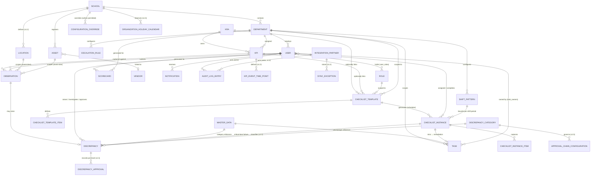

# Data Model Specification

**School Operations & Governance Platform**

| | |
|---|---|
| Document Type | Physical Data Model |
| Version | 1.5 |
| Derived From | PRS v1.5 §36–§37 (Entity Definitions, Data Dictionary), §38 (ERD), §23.14–23.17, §24.4–24.16, §26, §35.14–35.15, §40, §41.3, §47, §54 · Architecture.md §7–8, §23 (Data Architecture, Immutability Strategy, Checklist Architecture) · 10 role-based KRA/KPI manuals |
| Status | Draft for Engineering Review |
| Classification | Internal — Engineering |
| Target Platform | Neon (Serverless PostgreSQL) — full Postgres compatibility; Neon Auth for identity (per Architecture.md §10, §18) |

---

## Document Control

| Version | Description |
|---|---|
| v1.0 | Initial physical schema for all 9 entities with full field-level definitions in PRS §37 (School, Department, User, KRA, KPI, Observation, Discrepancy, Task, Scorecard), plus inferred schemas for supporting entities named in PRS §36 Entity Definitions but not field-detailed in §37 (Role, Escalation Rule, Notification, Master Data, Vendor, Asset). Inferred tables are explicitly marked. |
| v1.1 | Added Section 4.7 (Checklist & Recurring Task schema — `checklist_templates`, `checklist_template_items`, `checklist_instances`, `checklist_instance_items`, `shift_patterns`), engineering-inferred and flagged per the same convention as Section 4, backing Architecture.md §23. Extended the `frequency` Master Data category with `per_shift` and `fortnightly` values evidenced in the KRA/KPI manuals (Security Guard patrol cadence; general operational practice) — flagged for product confirmation (DQ6). Updated ERD (§2), Indexing Strategy (§6), Partitioning Strategy (§7), Immutability Enforcement (§8), Versioning Scheme (§9), and Retention Mapping (§10) accordingly. Confirmed target platform as **Neon (serverless PostgreSQL)** with **Neon Auth** for identity (§3.3), and **Cloudinary** as the media/document store referenced by every `*_file_url` column (§3.6, §4.7) — see Architecture.md §7, §18, ADR-07. |
| v1.2 | Added `locations` table (PRS §37.10) for per-floor/zone/wing scoping. Extended `observations` with Event-Time-Capture columns: `event_times` (JSONB array of `{point, time}`), `time_capture_mode`, `manual_time_reason`, `location_id`, `asset_id` (PRS §24.14, §37.6). Added KPI `capture_type` column (`value_reading`/`event_time`/`value_and_event_time`) and a child `kpi_event_time_points` table to `kpis` (PRS §23, FR-178). |
| v1.3 | No schema changes (Security hardening, PRS §41, is enforced at application/infra layers). Documented column-level and table-level implications of PRS §41.3 Data Protection and §41.9 FRs directly against existing tables (Section 5.4, new): password hashing lives entirely in Neon Auth (not this schema), `evidence_file_url` values are never logged, and TLS/encryption-at-rest are Neon-platform-level, not schema-level, controls. |
| v1.4 | Added `integration_partners` table (PRS §37.11) and `sync_exceptions` table (PRS §40.4) for ERP/third-party integration. Extended audit logging convention (§5.2) to accept an `integration_partner_id` actor in addition to `user_id`, per PRS §40.2 ("every integration action attributed exactly as a human actor would be"). |
| **v1.5 (this document)** | Full catch-up revision. Added `discrepancy_categories` and `approval_chain_configurations` Master Data tables and a `discrepancy_approvals` child table, replacing the fixed `approver_id` column on `discrepancies` with a per-level approval history (PRS §26, §37.7, BR-21, FR-231–237). Added `organization_holiday_calendar` and extended `schools`/`kpis` with `working_days`/`non_working_day_policy` columns (PRS §23.17, §35, BR-22, FR-238–243). Added `status` (Active/Retired) to `assets` (PRS §35.15, BR-23, FR-244–249). Added `compliance_scheduler_runs` log table and `compliance_status` column on `observations` distinguishing the compliance-record shell from the eventual submission (PRS §23.16, BR-24, FR-250–255). Added duplicate-detection columns (`duplicate_override_flag`, `duplicate_override_justification`, `original_observation_id`) to `observations` (PRS §24.4–24.7, BR-25, FR-256–262). Added Grace-Period/Reopen columns (`grace_period_elapsed_at`, `reopen_requested_by`, `reopen_reason`, `reopen_approved_by`, `reopened_flag`) to `observations` (PRS §24.16, BR-26, FR-263–270). Added `evidence_storage_tier` column to `observations` and formalized the Evidence Retention/Archive-Tier/Deletion state machine (PRS §47, BR-27, FR-271–274). Updated ERD (§2), Indexing Strategy (§6), Partitioning Strategy (§7), Immutability Enforcement (§8), Versioning Scheme (§9), Retention Mapping (§10), and Open Data Model Questions (§11) throughout. Document version bumped 1.1 → 1.5 to realign with PRS v1.5. |

**Note on scope:** PRS §37 provides field-level data dictionaries for 9 entities. Six additional entities appear in §36's Entity Definitions and are referenced structurally elsewhere in the PRS (Role, Escalation Rule, Notification, Master Data, Vendor, Asset) but without a field-level dictionary. Their schemas below are **engineering-inferred** from how they're used across PRS Part 2, and are flagged accordingly — treat them as a proposal to validate with product, not as directly sourced from the PRS the way the other 9 are.

---

## Table of Contents

1. [Conventions](#1-conventions)
2. [Entity-Relationship Diagram](#2-entity-relationship-diagram)
3. [Core Entities (PRS §37-Sourced)](#3-core-entities-prs-37-sourced)
4. [Supporting Entities (Inferred)](#4-supporting-entities-inferred)
   - 4.7 [Checklist & Recurring Task Schema (Inferred, v1.1)](#47-checklist--recurring-task-schema-inferred-v11)
   - 4.8 [New Master Data & Governance Tables (v1.2–v1.5)](#48-new-master-data--governance-tables-v12v15)
5. [Cross-Cutting Platform Tables](#5-cross-cutting-platform-tables)
6. [Indexing Strategy](#6-indexing-strategy)
7. [Partitioning Strategy](#7-partitioning-strategy)
8. [Immutability Enforcement](#8-immutability-enforcement)
9. [Versioning Scheme](#9-versioning-scheme)
10. [Retention & Archival Mapping](#10-retention--archival-mapping)
11. [Open Data Model Questions](#11-open-data-model-questions)

---

## 1. Conventions

- **Primary keys:** `UUID`, generated server-side (`gen_random_uuid()` or application-layer UUIDv7 for time-sortability on high-volume tables like Observation).
- **Tenant scope columns:** every tenant-scoped table carries `school_id` (and `department_id` where applicable), NOT NULL except where a role-level exception applies (SuperAdmin/Viewer records, per Architecture.md §6).
- **Audit columns:** every table includes `created_at`, `updated_at` (server time, UTC), and `created_by` / `updated_by` (FK to User) unless the table is itself append-only (e.g., Audit Log), in which case only `created_at`/`created_by` apply.
- **Soft lifecycle, never hard delete:** every entity has a `status` enum reflecting Active/Archived/Deprecated/Superseded as appropriate — there is no `deleted_at` column and no DELETE grant on any application role for these tables (PRS §47, Architecture.md AP7).
- **Naming:** snake_case table and column names; table names plural (`observations`, `discrepancies`); foreign keys named `<entity>_id`.
- **Enums:** modeled as Postgres native `ENUM` types where the value set is fixed and rarely changing (e.g., `discrepancy_state`); modeled as FK to a Master Data table where the value set is admin-configurable (e.g., `priority`, `frequency`) — see Section 4.4.

---

## 2. Entity-Relationship Diagram

Extends the conceptual ERD in PRS §38 with the supporting/cross-cutting entities needed for a physical schema.



---

## 3. Core Entities (PRS §37-Sourced)

### 3.1 `schools`
Source: PRS §37.1

```sql
CREATE TABLE schools (
    school_id               UUID PRIMARY KEY DEFAULT gen_random_uuid(),
    name                    TEXT NOT NULL UNIQUE,
    status                  school_status NOT NULL DEFAULT 'pending_onboarding',
        -- school_status ENUM: 'active','inactive','pending_onboarding'
    kpi_library_version_id  UUID NOT NULL REFERENCES kpi_library_versions(version_id),
        -- traceability per BR-05: which Global KPI Library snapshot this school was seeded from
    created_at              TIMESTAMPTZ NOT NULL DEFAULT now(),
    updated_at              TIMESTAMPTZ NOT NULL DEFAULT now(),
    created_by              UUID REFERENCES users(user_id)
);
```
No DELETE grant. `status = 'inactive'` is the archival state (BR-04 implied); the row is never removed.

### 3.2 `departments`
Source: PRS §37.2

```sql
CREATE TABLE departments (
    department_id     UUID PRIMARY KEY DEFAULT gen_random_uuid(),
    school_id          UUID NOT NULL REFERENCES schools(school_id),
    name               TEXT NOT NULL,
    department_head_id UUID REFERENCES users(user_id),
        -- must hold Admin role; enforced at application layer, not DB constraint
    status             department_status NOT NULL DEFAULT 'active',
        -- department_status ENUM: 'active','archived'
    created_at         TIMESTAMPTZ NOT NULL DEFAULT now(),
    updated_at         TIMESTAMPTZ NOT NULL DEFAULT now(),
    UNIQUE (school_id, name)
);
```

### 3.3 `users`
Source: PRS §37.3. **Identity backed by Neon Auth** (Architecture.md §10) — this table is the application's own profile/role/scope record; `auth_user_id` links it to the identity Neon Auth manages in the `neon_auth.users_sync` table within the same Neon Postgres instance, so credentials, password hashes, and MFA enrollment are never duplicated here.

```sql
CREATE TABLE users (
    user_id            UUID PRIMARY KEY DEFAULT gen_random_uuid(),
    auth_user_id        UUID NOT NULL UNIQUE,      -- FK-equivalent to neon_auth.users_sync.id (cross-schema, not a formal FK)
    name               TEXT NOT NULL,
    email              CITEXT NOT NULL UNIQUE,   -- denormalized copy of neon_auth.users_sync.email for query convenience; Neon Auth remains the source of truth for credential-level identity
    phone              TEXT,                     -- E.164 format, validated at app layer
    school_id          UUID REFERENCES schools(school_id),
        -- NULL only permitted for SuperAdmin/Viewer (BR-01) — enforced via CHECK + application logic, see 3.3.1
    language_preference TEXT NOT NULL DEFAULT 'en',
    status             user_status NOT NULL DEFAULT 'invited',
        -- user_status ENUM: 'invited','active','archived'
    mfa_enabled        BOOLEAN NOT NULL DEFAULT false,  -- forced true at app layer for Admin/SuperAdmin roles; reflects Neon Auth's MFA enrollment status
    created_at         TIMESTAMPTZ NOT NULL DEFAULT now(),
    updated_at         TIMESTAMPTZ NOT NULL DEFAULT now()
);

-- 3.3.1: school_id nullability is role-dependent; enforced via trigger, not a simple CHECK,
-- since it depends on the user's assigned roles (a runtime join to user_roles).
```

**Multi-school access (SuperAdmin/Viewer, BR-01, C1):** modeled via `user_school_grants` (Section 4.5), not a second FK on `users` — a user has exactly one *home* `school_id` (or NULL for SuperAdmin) and zero or more additional granted-scope rows.

### 3.4 `kras`
Source: PRS §37.4

```sql
CREATE TABLE kras (
    kra_id     UUID PRIMARY KEY DEFAULT gen_random_uuid(),
    name       TEXT NOT NULL UNIQUE,
    status     kra_status NOT NULL DEFAULT 'active',
        -- kra_status ENUM: 'active','deprecated'
    created_at TIMESTAMPTZ NOT NULL DEFAULT now(),
    updated_at TIMESTAMPTZ NOT NULL DEFAULT now()
);
```

### 3.5 `kpis`
Source: PRS §37.5. **Versioned entity** — see Section 9.

```sql
CREATE TABLE kpis (
    kpi_id          UUID NOT NULL,            -- stable identity across versions (NOT the row PK)
    version         INTEGER NOT NULL,
    kra_id          UUID NOT NULL REFERENCES kras(kra_id),
    title           TEXT NOT NULL,
    target_value    NUMERIC NOT NULL,
    comparator      comparator_enum NOT NULL,  -- ENUM: '>=','<=','=','<','>'
    unit_of_measure TEXT NOT NULL,
    frequency       TEXT NOT NULL REFERENCES master_data_entries(code)
        -- FK to Master Data category='frequency' (§35), not a hardcoded enum,
        -- since Frequency values are admin-configurable reference data.
    amber_tolerance_band NUMERIC,             -- nullable = uses Configuration Engine global default (§23.14/§54)
    status          kpi_status NOT NULL DEFAULT 'active',
        -- kpi_status ENUM: 'active','deprecated'
    is_immutable    BOOLEAN NOT NULL DEFAULT false,
        -- flips to true once >=1 observation references this (kpi_id, version)
    created_at      TIMESTAMPTZ NOT NULL DEFAULT now(),
    created_by      UUID NOT NULL REFERENCES users(user_id),
    PRIMARY KEY (kpi_id, version)
);

CREATE UNIQUE INDEX ux_kpis_current_version
    ON kpis (kpi_id) WHERE status = 'active';  -- at most one "current" active version per kpi_id
```

### 3.6 `observations`
Source: PRS §37.6. **Immutable-after-lock, high-volume, time-partitioned** — see Sections 7–8.

```sql
CREATE TABLE observations (
    observation_id    UUID NOT NULL DEFAULT gen_random_uuid(),
    kpi_id            UUID NOT NULL,
    kpi_version       INTEGER NOT NULL,
    checker_id        UUID NOT NULL REFERENCES users(user_id),
    department_id     UUID NOT NULL REFERENCES departments(department_id),  -- denormalized for tenant filter + partition pruning
    school_id         UUID NOT NULL REFERENCES schools(school_id),          -- denormalized, see Section 6
    value_numeric     NUMERIC,          -- populated when KPI unit type is numeric
    value_text        TEXT,             -- populated when KPI unit type is text/categorical
    evidence_file_url TEXT,             -- Cloudinary secure_url (or public_id) reference, nullable
    evidence_resource_type TEXT,        -- Cloudinary resource_type: 'image','video','raw' (for PDF/DOCX/MD/PPTX)
    auto_result       auto_result_enum NOT NULL,  -- ENUM: 'met','not_met','n_a'
    submitted_at      TIMESTAMPTZ NOT NULL DEFAULT now(),
    lock_status       lock_status_enum NOT NULL DEFAULT 'unlocked',  -- ENUM: 'unlocked','locked'
    locked_at         TIMESTAMPTZ,
    submission_token  UUID NOT NULL,     -- client-generated idempotency key (FR-069)
    superseded_observation_id UUID REFERENCES observations(observation_id),
        -- post-lock "correction" creates a NEW row referencing the original (BR-11) — see Section 8.1
    -- ── v1.2: Event-Time Capture (PRS §24.14, §37.6, FR-179–188) ──
    event_times        JSONB,             -- array of {event_time_point_id, time, capture_mode}; NULL unless KPI capture_type requires it
    time_capture_mode  time_capture_mode_enum,  -- ENUM: 'auto_captured','manual'; required whenever event_times is non-null
    manual_time_reason TEXT REFERENCES master_data_entries(code),  -- Master Data category='manual_time_reason'; required if time_capture_mode='manual'
    location_id        UUID REFERENCES locations(location_id),      -- per-floor/zone scoping (§37.10)
    asset_id           UUID REFERENCES assets(asset_id),            -- per-vehicle/asset scoping
    -- ── v1.5: Duplicate Detection (PRS §24.4–24.7, BR-25, FR-256–262) ──
    duplicate_override_flag BOOLEAN NOT NULL DEFAULT false,
    duplicate_override_justification TEXT,   -- required if duplicate_override_flag = true (app-layer CHECK)
    original_observation_id UUID REFERENCES observations(observation_id),  -- self-ref to the prior occurrence a duplicate was submitted against
    -- ── v1.5: Compliance Scheduler shell / Grace Period / Reopen (PRS §23.16, §24.16, BR-24, BR-26, FR-250–270) ──
    compliance_status  compliance_status_enum NOT NULL DEFAULT 'open',
        -- ENUM: 'open','late_submittable','closed_missed','submitted' — the shell row's lifecycle,
        -- distinct from auto_result. A row is INSERTed by the Compliance Scheduler at status='open'
        -- before any Checker submission exists, then transitions in place until 'submitted'.
    due_at              TIMESTAMPTZ,        -- computed by scheduler per §23.16/§23.17; NULL for ad-hoc/event-triggered KPIs
    grace_period_elapsed_at TIMESTAMPTZ,    -- due_at + configured grace period (+ outage extension if backfilled)
    reopen_requested_by UUID REFERENCES users(user_id),
    reopen_reason        TEXT,
    reopen_approved_by   UUID REFERENCES users(user_id),
    reopened_flag         BOOLEAN NOT NULL DEFAULT false,
    -- ── v1.5: Evidence Retention (PRS §47, BR-27, FR-271–274) ──
    evidence_storage_tier evidence_tier_enum NOT NULL DEFAULT 'active',  -- ENUM: 'active','archived'
    evidence_deleted_at  TIMESTAMPTZ,        -- set only by an explicit, logged Admin/SuperAdmin deletion action (never automated)
    evidence_deleted_by  UUID REFERENCES users(user_id),
    created_at        TIMESTAMPTZ NOT NULL DEFAULT now(),
    PRIMARY KEY (observation_id, submitted_at)   -- composite PK required for partitioning, see Section 7
) PARTITION BY RANGE (submitted_at);

CREATE UNIQUE INDEX ux_observations_submission_token ON observations (submission_token);

-- v1.5 Duplicate Detection support index: the check in FR-256 scans for a prior Observation
-- with the same (kpi_id, kpi_version, department_id, location_id, asset_id, checker_id) within
-- a configurable window ending at now() — see Section 6 for the covering index.
CONSTRAINT chk_duplicate_justification
    CHECK (duplicate_override_flag = false OR duplicate_override_justification IS NOT NULL);
```

**v1.2 `kpi_event_time_points`** (child of `kpis`, PRS §23, FR-178) — engineering-inferred structure backing the "at least one named Event Time Point required when Capture Type = Event Time or Value + Event Time" rule:

```sql
CREATE TABLE kpi_event_time_points (
    event_time_point_id UUID PRIMARY KEY DEFAULT gen_random_uuid(),
    kpi_id               UUID NOT NULL,
    kpi_version           INTEGER NOT NULL,
    name                   TEXT NOT NULL,          -- e.g., "Bus Departure Time"
    capture_mode_allowed   capture_mode_allowed_enum NOT NULL,
        -- ENUM: 'auto_only','manual_only','auto_with_manual_fallback' — governs FR-181/FR-183
    target_time            TIME,                    -- optional, for lateness scoring (§24.14)
    FOREIGN KEY (kpi_id, kpi_version) REFERENCES kpis(kpi_id, version)
);
```

Add `capture_type` to `kpis` (v1.2): `capture_type kpi_capture_type_enum NOT NULL DEFAULT 'value_reading'` — ENUM `'value_reading','event_time','value_and_event_time'` (PRS §23, FR-178). Add `working_days` and `non_working_day_policy` to `kpis` (v1.5, PRS §23.17, FR-239–241): `working_days JSONB` (per-KPI override of the School default) and `non_working_day_policy non_working_day_policy_enum` — ENUM `'skip','shift_forward','shift_backward'`, immutable once set (a change creates a new KPI version, consistent with §9).

### 3.7 `discrepancies`
Source: PRS §37.7. **Revised in v1.5**: the fixed `approver_id` / `Level1ApproverID` / `Level2ApproverID` columns are removed; approval actions are now recorded per-level in the child `discrepancy_approvals` table (FR-237), since the number of levels is configurable per Discrepancy Category (BR-21) rather than fixed at two.

```sql
CREATE TABLE discrepancies (
    discrepancy_id         UUID PRIMARY KEY DEFAULT gen_random_uuid(),
    observation_id         UUID NOT NULL REFERENCES observations(observation_id),
    raised_by_auditor_id   UUID NOT NULL REFERENCES users(user_id),
    state                  discrepancy_state NOT NULL DEFAULT 'raised',
        -- ENUM: 'raised','investigating','resolution_pending','pending_approval','resolved','closed'
        -- transitions validated exclusively by the Workflow Engine (Architecture.md §13); no direct UPDATE of `state`
        -- from application code outside that engine's transition function.
    investigation_owner_id UUID REFERENCES users(user_id),
    investigation_findings TEXT,          -- required before state can reach 'resolution_pending' (FR-091)
    resolution_note        TEXT,          -- required before 'pending_approval' (§26.6)
    category_id             UUID NOT NULL REFERENCES discrepancy_categories(category_id),
        -- immutable after creation (BR-21, FR-231) — enforced via BEFORE UPDATE trigger rejecting changes to this column
    approval_chain_version_id UUID REFERENCES approval_chain_configurations(chain_version_id),
        -- set once, on transition into 'pending_approval'; snapshots which chain version governs this Discrepancy (FR-235)
        -- never updated afterward, even if the Category's chain configuration changes later
    created_at              TIMESTAMPTZ NOT NULL DEFAULT now(),
    updated_at              TIMESTAMPTZ NOT NULL DEFAULT now()
);

CREATE TABLE discrepancy_approvals (
    -- v1.5 (PRS §26, §37.7, FR-232–237) — replaces fixed Level1/Level2 approver columns
    approval_id       UUID PRIMARY KEY DEFAULT gen_random_uuid(),
    discrepancy_id    UUID NOT NULL REFERENCES discrepancies(discrepancy_id),
    approval_level    INTEGER NOT NULL,           -- 1..N per the snapshotted chain version
    assigned_role_id  UUID NOT NULL REFERENCES roles(role_id),
        -- resolved from approval_chain_configurations at the moment the Discrepancy enters 'pending_approval'
    assigned_user_id  UUID REFERENCES users(user_id),  -- populated once actioned
    status             approval_status_enum NOT NULL DEFAULT 'pending',  -- ENUM: 'pending','approved','rejected'
    approved_at        TIMESTAMPTZ,
    comments            TEXT,
    UNIQUE (discrepancy_id, approval_level),
    CONSTRAINT chk_approver_not_investigator_or_prior_level
        -- Enforced at application layer (requires a lookup against discrepancies.investigation_owner_id
        -- and prior-level assigned_user_id values) — FR-233. A DB-level check trigger is used, not a
        -- static CHECK constraint, since it must query sibling/parent rows.
);
```

### 3.8 `tasks` and `task_owners`
Source: PRS §37.8. Primary Owners modeled as a join table (many-to-many, BR-09) rather than an array column, so per-owner completion state (needed for the "ALL owners complete" rule) has somewhere to live.

```sql
CREATE TABLE tasks (
    task_id               UUID PRIMARY KEY DEFAULT gen_random_uuid(),
    department_id         UUID NOT NULL REFERENCES departments(department_id),
    school_id             UUID NOT NULL REFERENCES schools(school_id),
    title                 TEXT NOT NULL,
    description            TEXT,
    completion_rule       completion_rule_enum NOT NULL,
        -- ENUM: 'any','all','approval_required' — immutable after creation (FR-104), enforced via trigger rejecting UPDATE
    eta                   TIMESTAMPTZ NOT NULL,           -- must be future at creation (validated app-layer)
    eta_extension_count   INTEGER NOT NULL DEFAULT 0,
        -- CHECK (eta_extension_count <= 3) — BR-10; a 4th request is redirected to escalation, never persisted as an extension
    status                task_status NOT NULL DEFAULT 'draft',
        -- ENUM: 'draft','assigned','accepted','in_progress','completed','approved','archived','blocked'
    parent_task_id         UUID REFERENCES tasks(task_id),
    recurrence_rule        TEXT,
    tags                   TEXT[] DEFAULT '{}',
    priority_code           TEXT REFERENCES master_data_entries(code),  -- Master Data category='priority'
    task_type_code           TEXT REFERENCES master_data_entries(code), -- Master Data category='task_type'
    created_at              TIMESTAMPTZ NOT NULL DEFAULT now(),
    updated_at              TIMESTAMPTZ NOT NULL DEFAULT now(),
    created_by               UUID NOT NULL REFERENCES users(user_id),
    CONSTRAINT chk_eta_extension_cap CHECK (eta_extension_count <= 3)
);

CREATE TABLE task_owners (
    task_id        UUID NOT NULL REFERENCES tasks(task_id),
    user_id        UUID NOT NULL REFERENCES users(user_id),
    completed_at   TIMESTAMPTZ,   -- per-owner completion timestamp; NULL = not yet completed by this owner
    PRIMARY KEY (task_id, user_id)
);

-- FR-107: at least one row in task_owners is required before a task can leave 'draft' — enforced at
-- application layer (a DB-level "at least one child row" constraint requires a deferred trigger).
```

### 3.9 `scorecards`
Source: PRS §37.9. **Versioned, immutable** — see Section 9.

```sql
CREATE TABLE scorecards (
    scorecard_id        UUID PRIMARY KEY DEFAULT gen_random_uuid(),
    subject_type         subject_type_enum NOT NULL,  -- ENUM: 'user','department'
    subject_id            UUID NOT NULL,               -- polymorphic ref to users.user_id or departments.department_id
    cycle_start           DATE NOT NULL,
    cycle_end             DATE NOT NULL,
    version                INTEGER NOT NULL DEFAULT 1,
    pct_kpis_met            NUMERIC NOT NULL,   -- computed by Rule Engine at generation time
    pct_tasks_on_time       NUMERIC NOT NULL,
    open_discrepancy_count INTEGER NOT NULL,
    rag_status              rag_enum NOT NULL,   -- ENUM: 'green','amber','red' — worst-status-wins rollup (§23.14)
    generated_at            TIMESTAMPTZ NOT NULL DEFAULT now(),
    superseded_by_id        UUID REFERENCES scorecards(scorecard_id),
    UNIQUE (subject_type, subject_id, cycle_start, cycle_end, version)
);
```
No UPDATE or DELETE grant on this table for any application role beyond the generation job (Section 8).

---

## 4. Supporting Entities (Inferred)

These entities are named in PRS §36 but do not have a §37 field-level dictionary. Schemas below are engineering-proposed based on how each entity is used elsewhere in the PRS — **flag for product confirmation before build** (see Section 11).

### 4.1 `roles` and `user_roles`
Basis: PRS §11 (five system roles), BR-02 (multi-role support).

```sql
CREATE TABLE roles (
    role_code   TEXT PRIMARY KEY,  -- 'super_admin','admin','checker','auditor','viewer'
    name        TEXT NOT NULL,
    description TEXT
);

CREATE TABLE user_roles (
    user_id    UUID NOT NULL REFERENCES users(user_id),
    role_code  TEXT NOT NULL REFERENCES roles(role_code),
    school_id  UUID REFERENCES schools(school_id),  -- role held in context of a specific school; NULL for SuperAdmin
    granted_at TIMESTAMPTZ NOT NULL DEFAULT now(),
    granted_by UUID REFERENCES users(user_id),
    PRIMARY KEY (user_id, role_code, school_id)
);
```

### 4.2 `escalation_rules`
Basis: PRS §36 ("configurable, ordered per-department escalation chain with SLA timers"), §38.1 ("Department → Escalation Rule is one-to-many, ordered by Level"), §49 (escalation notification tier).

```sql
CREATE TABLE escalation_rules (
    escalation_rule_id UUID PRIMARY KEY DEFAULT gen_random_uuid(),
    department_id       UUID NOT NULL REFERENCES departments(department_id),
    level                 INTEGER NOT NULL,          -- 1, 2, 3... ordered
    sla_hours              INTEGER NOT NULL,          -- resolved via Configuration Engine default unless overridden here
    escalation_manager_id  UUID NOT NULL REFERENCES users(user_id),
    applies_to              escalation_target_enum NOT NULL,  -- ENUM: 'task','discrepancy'
    status                  TEXT NOT NULL DEFAULT 'active',
    UNIQUE (department_id, level, applies_to)
);
```

### 4.3 `notifications`
Basis: PRS §49 Notification Matrix, §32.

```sql
CREATE TABLE notifications (
    notification_id UUID PRIMARY KEY DEFAULT gen_random_uuid(),
    recipient_id      UUID NOT NULL REFERENCES users(user_id),
    priority_tier      SMALLINT NOT NULL,   -- 1-7 per §49; 1-2 = mandatory, cannot be suppressed
    event_type          TEXT NOT NULL,       -- e.g., 'escalation_triggered','task_assigned','due_today'
    channel              TEXT NOT NULL,       -- 'in_app','email','sms','whatsapp'
    related_entity_type  TEXT,
    related_entity_id    UUID,
    payload               JSONB NOT NULL,
    delivery_status      delivery_status_enum NOT NULL DEFAULT 'pending',
        -- ENUM: 'pending','sent','failed','retrying'
    read_at               TIMESTAMPTZ,          -- in-app read receipt; NULL = unread
    created_at             TIMESTAMPTZ NOT NULL DEFAULT now()
);
```

### 4.4 `master_data_entries`
Basis: PRS §35 (Frequency, Comparator, Priority, Department templates, Discrepancy categories as configurable reference data).

```sql
CREATE TABLE master_data_entries (
    code       TEXT NOT NULL,           -- stable identifier referenced by FK elsewhere, e.g. 'daily','high','safety'
    category   TEXT NOT NULL,           -- 'frequency','priority','task_type','discrepancy_category','evidence_type', etc.
    label       TEXT NOT NULL,
    status       TEXT NOT NULL DEFAULT 'active',  -- 'active','deprecated' (§35.12: deprecate-but-retain if in use)
    created_at   TIMESTAMPTZ NOT NULL DEFAULT now(),
    PRIMARY KEY (category, code)
);
```

### 4.5 `user_school_grants`
Basis: PRS BR-01/C1 (SuperAdmin all-schools access, Viewer multi-school grant).

```sql
CREATE TABLE user_school_grants (
    user_id    UUID NOT NULL REFERENCES users(user_id),
    school_id  UUID NOT NULL REFERENCES schools(school_id),
    granted_at TIMESTAMPTZ NOT NULL DEFAULT now(),
    granted_by UUID REFERENCES users(user_id),
    PRIMARY KEY (user_id, school_id)
);
-- SuperAdmin: implicit all-school access at the application layer (no row explosion needed) —
-- this table is used specifically for the Viewer multi-school grant case.
```

### 4.6 `vendors` and `assets`
Basis: PRS §36, §6.1 (Phase 1 limited scope), ERD §38 (`ASSET }o--o| VENDOR`).

```sql
CREATE TABLE vendors (
    vendor_id   UUID PRIMARY KEY DEFAULT gen_random_uuid(),
    school_id    UUID NOT NULL REFERENCES schools(school_id),
    name          TEXT NOT NULL,
    contact_info  JSONB,
    status         TEXT NOT NULL DEFAULT 'active',
    created_at     TIMESTAMPTZ NOT NULL DEFAULT now()
);

CREATE TABLE assets (
    asset_id     UUID PRIMARY KEY DEFAULT gen_random_uuid(),
    school_id     UUID NOT NULL REFERENCES schools(school_id),
    vendor_id     UUID REFERENCES vendors(vendor_id),
    name           TEXT NOT NULL,
    category_code  TEXT REFERENCES master_data_entries(code),  -- Master Data category='asset_category' (v1.5, PRS §37.12)
    location_id     UUID REFERENCES locations(location_id),     -- per-vehicle/route/location reference (v1.5)
    stock_count    INTEGER,             -- nullable: only populated for stock-tracked assets
    reorder_level  INTEGER,
    status          asset_status_enum NOT NULL DEFAULT 'active',
        -- v1.5: ENUM 'active','retired' (was free-text TEXT in v1.1) — PRS §35.15, BR-23, FR-244–249.
        -- No DELETE grant on this table for any application role: an Asset with linked Observations
        -- can only be Retired, never hard-deleted (FR-248).
    created_at      TIMESTAMPTZ NOT NULL DEFAULT now(),
    updated_at      TIMESTAMPTZ NOT NULL DEFAULT now()
);
-- Minimal Phase 1 schema per §6.1's "basic vendor record-keeping" scope note; full Asset Management
-- module fields are deferred to Phase 3 (§57.3) and are out of scope for this document.
-- v1.5: a Retired Asset must not be newly assignable — enforced at application layer at the point of
-- KPI Event-Time-Point scoping and Observation creation (FR-245), not via a DB trigger, since "newly
-- assignable" depends on distinguishing new writes from historical reads that must remain unaffected (FR-247).
```

### 4.8 New Master Data & Governance Tables (v1.2–v1.5)

**`locations`** *(v1.2, PRS §37.10, FR-189)*
```sql
CREATE TABLE locations (
    location_id UUID PRIMARY KEY DEFAULT gen_random_uuid(),
    school_id    UUID NOT NULL REFERENCES schools(school_id),
    name          TEXT NOT NULL,
    type           location_type_enum NOT NULL,  -- ENUM: 'floor','zone','wing','other'
    status         location_status_enum NOT NULL DEFAULT 'active',  -- ENUM: 'active','archived'
    UNIQUE (school_id, name)
);
```

**`integration_partners`** *(v1.4, PRS §37.11, §40.2, §41.3)*
```sql
CREATE TABLE integration_partners (
    integration_partner_id UUID PRIMARY KEY DEFAULT gen_random_uuid(),
    name                     TEXT NOT NULL UNIQUE,
    auth_type                integration_auth_type_enum NOT NULL,  -- ENUM: 'oauth2_client_credentials','api_key','mtls'
    client_id                 TEXT NOT NULL UNIQUE,
    credential_hash            TEXT NOT NULL,   -- never stored/returned in plaintext (§41.3, FR-195); hashed/HMAC'd secret or key
    scopes                     TEXT[] NOT NULL, -- entities + actions this partner may access (§40.2)
    school_scope                UUID[] DEFAULT '{}',  -- empty = organization-wide; else restricted to listed schools
    environment                  integration_env_enum NOT NULL DEFAULT 'sandbox',  -- ENUM: 'sandbox','production' (§40.7)
    status                       integration_partner_status_enum NOT NULL DEFAULT 'pending_certification',
        -- ENUM: 'pending_certification','active','suspended','revoked'
    last_successful_sync_at      TIMESTAMPTZ,
    webhook_secret_hash          TEXT,   -- used for HMAC signature verification on outbound webhooks
    credential_rotated_at         TIMESTAMPTZ,
    created_at                    TIMESTAMPTZ NOT NULL DEFAULT now()
);
```

**`sync_exceptions`** *(v1.4, PRS §40.4)*
```sql
CREATE TABLE sync_exceptions (
    sync_exception_id      UUID PRIMARY KEY DEFAULT gen_random_uuid(),
    integration_partner_id  UUID NOT NULL REFERENCES integration_partners(integration_partner_id),
    entity_type              TEXT NOT NULL,   -- 'school','department','user'
    raw_payload                JSONB NOT NULL,
    reason                      TEXT NOT NULL,   -- validation failure / unknown parent / BR-01 conflict, etc.
    status                      sync_exception_status_enum NOT NULL DEFAULT 'open',  -- ENUM: 'open','resolved','discarded'
    resolved_by                 UUID REFERENCES users(user_id),
    resolved_at                  TIMESTAMPTZ,
    created_at                   TIMESTAMPTZ NOT NULL DEFAULT now()
);
```

**`discrepancy_categories`** *(v1.5, PRS §35, §37.7, BR-21)*
```sql
CREATE TABLE discrepancy_categories (
    category_id      UUID PRIMARY KEY DEFAULT gen_random_uuid(),
    name               TEXT NOT NULL UNIQUE,
    status              TEXT NOT NULL DEFAULT 'active',  -- 'active','deprecated' (deprecate-but-retain, §35.12)
    allow_delegate      BOOLEAN NOT NULL DEFAULT false,
    created_at            TIMESTAMPTZ NOT NULL DEFAULT now()
);
```

**`approval_chain_configurations`** *(v1.5, PRS §26, §54, BR-21, FR-232, FR-235–236)* — versioned, mirroring the `kpis` pattern, so an in-progress Discrepancy can bind to the version active when it entered Approval (FR-235) even after later edits.
```sql
CREATE TABLE approval_chain_configurations (
    chain_version_id  UUID PRIMARY KEY DEFAULT gen_random_uuid(),
    category_id         UUID NOT NULL REFERENCES discrepancy_categories(category_id),
    version               INTEGER NOT NULL,
    is_current             BOOLEAN NOT NULL DEFAULT true,   -- flips false when a new version is published for this category
    created_at             TIMESTAMPTZ NOT NULL DEFAULT now(),
    UNIQUE (category_id, version)
);

CREATE TABLE approval_chain_levels (
    chain_version_id     UUID NOT NULL REFERENCES approval_chain_configurations(chain_version_id),
    level                  INTEGER NOT NULL,   -- 1 or 2 in Phase 1 (max two sequential levels, BR-21)
    role_id                 UUID NOT NULL REFERENCES roles(role_id),
    auto_escalation_sla_hours INTEGER,
    PRIMARY KEY (chain_version_id, level)
);
```

**`organization_holiday_calendar`** *(v1.5, PRS §35, §23.17, BR-22, FR-238, FR-243)*
```sql
CREATE TABLE organization_holiday_calendar (
    holiday_id      UUID PRIMARY KEY DEFAULT gen_random_uuid(),
    school_id         UUID REFERENCES schools(school_id),  -- NULL = organization-level default, inherited by all Schools
    date               DATE NOT NULL,
    label               TEXT NOT NULL,
    recurrence_type    holiday_recurrence_enum NOT NULL,  -- ENUM: 'one_time','annual_fixed_date','annual_variable'
    created_by           UUID NOT NULL REFERENCES users(user_id),
    created_at            TIMESTAMPTZ NOT NULL DEFAULT now(),
    UNIQUE (school_id, date, label)
);
```
Add `working_days` to `schools` (v1.5, PRS §35, FR-239): `working_days JSONB NOT NULL DEFAULT '["mon","tue","wed","thu","fri","sat"]'` — the School-level default that per-KPI `kpis.working_days` (Section 3.5) may override.

**`compliance_scheduler_runs`** *(v1.5, PRS §23.16, BR-24, FR-250, FR-253, FR-255)*
```sql
CREATE TABLE compliance_scheduler_runs (
    run_id            UUID PRIMARY KEY DEFAULT gen_random_uuid(),
    started_at         TIMESTAMPTZ NOT NULL,
    finished_at         TIMESTAMPTZ,
    status              scheduler_run_status_enum NOT NULL,  -- ENUM: 'success','partial_failure','failed'
    records_generated   INTEGER NOT NULL DEFAULT 0,
    records_backfilled  INTEGER NOT NULL DEFAULT 0,
    school_timezone_batch TEXT,     -- timezone this run batch computed against (§23.16 requires per-School timezone, not UTC/server-local)
    error_detail          TEXT
);
-- Idempotency for the records this run generates is enforced not here but via a UNIQUE constraint
-- on the observations 'shell' rows: UNIQUE (kpi_id, kpi_version, department_id, location_id, asset_id, due_at)
-- — see Section 6, "Duplicate-detection / idempotency covering index".
```

### 4.7 Checklist & Recurring Task Schema (Inferred, v1.1)
Basis: Architecture.md §23 (Checklist & Recurring Task Architecture), PRS FR-110/FR-111 (subtasks, recurrence), PRS §23.6 Frequency enumeration, and frequency-tagged recurring items evidenced across all 10 role-based KRA/KPI manuals (e.g. daily cleanliness audits, weekly RO/TDS checks, monthly fire-equipment/pest-control checks, quarterly water-tank cleaning/vendor reviews, per-shift security patrols). **Engineering-inferred, flagged for product confirmation** — see DQ6–DQ9 in Section 11.

`checklist_templates` — **versioned**, mirrors the `kpis` pattern (Section 3.5, Section 9).
```sql
CREATE TABLE checklist_templates (
    template_id       UUID NOT NULL,             -- stable identity across versions (NOT the row PK)
    version            INTEGER NOT NULL,
    title              TEXT NOT NULL,
    description         TEXT,
    kra_id              UUID REFERENCES kras(kra_id),               -- optional roll-up link
    kpi_id              UUID,                                        -- optional link; FK validated against kpis.kpi_id at app layer (version-independent)
    role_code            TEXT REFERENCES roles(role_code),           -- nullable; scope by Role (e.g. all Security Guards)
    department_id        UUID REFERENCES departments(department_id), -- nullable; scope by specific Department
    school_id             UUID REFERENCES schools(school_id),        -- NULL = platform-wide template (like global KPI Library, BR-05)
    frequency_code        TEXT NOT NULL REFERENCES master_data_entries(code),
        -- FK to Master Data category='frequency'; extended set includes 'per_shift','fortnightly' (v1.1, DQ6)
    shift_pattern_id       UUID REFERENCES shift_patterns(shift_pattern_id),
        -- required when frequency_code = 'per_shift'; NULL otherwise (CHECK enforced at app layer)
    escalate_on_miss       BOOLEAN NOT NULL DEFAULT true,
        -- if true, a Missed instance auto-spawns a remediation Task (Architecture.md §23.4)
    status                  checklist_template_status NOT NULL DEFAULT 'active',
        -- ENUM: 'active','deprecated'
    is_immutable            BOOLEAN NOT NULL DEFAULT false,
        -- flips to true once >=1 checklist_instances row references this (template_id, version) — same pattern as kpis.is_immutable
    created_at               TIMESTAMPTZ NOT NULL DEFAULT now(),
    created_by                UUID NOT NULL REFERENCES users(user_id),
    PRIMARY KEY (template_id, version)
);

CREATE UNIQUE INDEX ux_checklist_templates_current_version
    ON checklist_templates (template_id) WHERE status = 'active';
```

`checklist_template_items` — one row per checklist line item.
```sql
CREATE TABLE checklist_template_items (
    template_item_id   UUID PRIMARY KEY DEFAULT gen_random_uuid(),
    template_id          UUID NOT NULL,
    template_version      INTEGER NOT NULL,
    sequence               INTEGER NOT NULL,
    label                    TEXT NOT NULL,
    response_type           response_type_enum NOT NULL,   -- ENUM: 'boolean','numeric','text','photo_evidence'
    is_critical              BOOLEAN NOT NULL DEFAULT false,
        -- a failed critical item auto-raises a Discrepancy in addition to the instance failing (Architecture.md §23.2)
    requires_evidence        BOOLEAN NOT NULL DEFAULT false,
    FOREIGN KEY (template_id, template_version) REFERENCES checklist_templates(template_id, version),
    UNIQUE (template_id, template_version, sequence)
);
```

`checklist_instances` — **high-volume, time-partitioned**, generated by the Checklist Scheduler (Architecture.md §5.7), never hand-created.
```sql
CREATE TABLE checklist_instances (
    instance_id         UUID NOT NULL DEFAULT gen_random_uuid(),
    template_id           UUID NOT NULL,
    template_version       INTEGER NOT NULL,
    school_id               UUID NOT NULL REFERENCES schools(school_id),
    department_id           UUID NOT NULL REFERENCES departments(department_id),
    assigned_to_user_id      UUID REFERENCES users(user_id),
        -- resolved at generation time from role_code + department_id (Architecture.md §23.5); nullable until claimed for pooled/shift assignment
    period_start              TIMESTAMPTZ NOT NULL,      -- compliance period this instance covers
    period_end                 TIMESTAMPTZ NOT NULL,      -- due-by; drives the Missed sweep (Architecture.md §23.4)
    status                       checklist_instance_status NOT NULL DEFAULT 'generated',
        -- ENUM: 'generated','pending','in_progress','completed','verified','missed','escalated','archived'
        -- transitions validated exclusively by the Workflow Engine (Architecture.md §13); no direct UPDATE of `status`
    pct_items_complete            NUMERIC NOT NULL DEFAULT 0,   -- rolled up from checklist_instance_items
    remediation_task_id            UUID REFERENCES tasks(task_id),      -- set if Missed/Escalated spawned a Task
    remediation_discrepancy_id     UUID REFERENCES discrepancies(discrepancy_id), -- set if a critical item failed
    generated_at                    TIMESTAMPTZ NOT NULL DEFAULT now(),
    completed_at                     TIMESTAMPTZ,
    completed_by                      UUID REFERENCES users(user_id),
    verified_at                       TIMESTAMPTZ,
    verified_by                        UUID REFERENCES users(user_id),
    FOREIGN KEY (template_id, template_version) REFERENCES checklist_templates(template_id, version),
    PRIMARY KEY (instance_id, period_start)   -- composite PK required for partitioning, see Section 7
) PARTITION BY RANGE (period_start);

-- Idempotent generation guarantee (Architecture.md §5.7): a scheduler re-run for an already-generated
-- period must be a no-op, never a duplicate instance.
CREATE UNIQUE INDEX ux_checklist_instances_generation_key
    ON checklist_instances (template_id, template_version, school_id, department_id, period_start);
```

`checklist_instance_items` — per-line response capture, mirrors `observations`' value/evidence pattern at item granularity.
```sql
CREATE TABLE checklist_instance_items (
    instance_item_id     UUID PRIMARY KEY DEFAULT gen_random_uuid(),
    instance_id            UUID NOT NULL,
    period_start             TIMESTAMPTZ NOT NULL,   -- denormalized from checklist_instances for the composite FK
    template_item_id          UUID NOT NULL REFERENCES checklist_template_items(template_item_id),
    response_boolean            BOOLEAN,
    response_numeric             NUMERIC,
    response_text                  TEXT,
    evidence_file_url               TEXT,             -- Cloudinary secure_url (or public_id) reference, populated when requires_evidence = true
    evidence_resource_type            TEXT,             -- Cloudinary resource_type: 'image','video','raw' (for PDF/DOCX/MD/PPTX)
    is_compliant                     BOOLEAN,          -- derived at submission time (pass/fail against the item definition)
    completed_at                      TIMESTAMPTZ,
    completed_by                       UUID REFERENCES users(user_id),
    FOREIGN KEY (instance_id, period_start) REFERENCES checklist_instances(instance_id, period_start),
    UNIQUE (instance_id, template_item_id)
);
```

`shift_patterns` — backs `frequency_code = 'per_shift'` templates (Security Guard, Transport Manager); resolves AQ7 (Architecture.md §23.6) as a dedicated entity rather than overloading Master Data with time-range values.
```sql
CREATE TABLE shift_patterns (
    shift_pattern_id    UUID PRIMARY KEY DEFAULT gen_random_uuid(),
    department_id         UUID NOT NULL REFERENCES departments(department_id),
    name                    TEXT NOT NULL,             -- e.g. 'Morning Gate Shift', 'Night Patrol'
    start_time_local          TIME NOT NULL,
    end_time_local             TIME NOT NULL,           -- may be < start_time_local for overnight shifts (app-layer wraps to next day)
    days_of_week                 SMALLINT[] NOT NULL,    -- 1=Mon..7=Sun, which weekdays this pattern is active
    status                        TEXT NOT NULL DEFAULT 'active',
    created_at                     TIMESTAMPTZ NOT NULL DEFAULT now(),
    UNIQUE (department_id, name)
);
```

**Rationale for a distinct entity family instead of extending `tasks`:** captured as ADR-06 in Architecture.md §20 — a checklist has a versioned definition, per-item typed response capture, and a fixed compliance-period denominator that `tasks`/`task_owners` were not designed to hold without overloading the existing Task completion-rule logic (FR-103/FR-104).

---

## 5. Cross-Cutting Platform Tables

Backing the six platform services from Architecture.md §5.

### 5.1 `configuration_items` and `configuration_overrides`
```sql
CREATE TABLE configuration_items (
    config_key    TEXT PRIMARY KEY,     -- e.g., 'observation_lock_period_minutes','max_eta_extensions'
    value_type     TEXT NOT NULL,        -- 'integer','decimal','duration','enum','boolean'
    global_default TEXT NOT NULL,        -- stored as text, cast at read time per value_type
    editable_by     TEXT NOT NULL,        -- 'super_admin','admin' — matches §54 table
    overridable_scope TEXT NOT NULL DEFAULT 'none'  -- 'none','school','department', per §54
);

CREATE TABLE configuration_overrides (
    config_key   TEXT NOT NULL REFERENCES configuration_items(config_key),
    scope_type    TEXT NOT NULL,   -- 'school','department'
    scope_id       UUID NOT NULL,
    value           TEXT NOT NULL,
    updated_at      TIMESTAMPTZ NOT NULL DEFAULT now(),
    updated_by      UUID REFERENCES users(user_id),
    PRIMARY KEY (config_key, scope_type, scope_id)
);
-- Every write to either table is mirrored to audit_log_entries (§48 governance requirement).
```

### 5.2 `audit_log_entries`
Basis: PRS §45. Append-only; see Section 8.4.

```sql
CREATE TABLE audit_log_entries (
    audit_log_id     UUID NOT NULL DEFAULT gen_random_uuid(),
    actor_id           UUID REFERENCES users(user_id),   -- NULL for system-generated events (e.g., auto-lock)
    action              TEXT NOT NULL,      -- 'login','kpi_edited','observation_locked','role_changed', etc.
    entity_type          TEXT NOT NULL,
    entity_id             UUID NOT NULL,
    reason_comment        TEXT,
    occurred_at            TIMESTAMPTZ NOT NULL DEFAULT now(),
    PRIMARY KEY (audit_log_id, occurred_at)  -- composite PK for partitioning, see Section 7
) PARTITION BY RANGE (occurred_at);
```

### 5.3 `search_index` (logical, not relational)
Not a Postgres table — lives in the dedicated search index (Architecture.md §7). Denormalized document shape indexed per entity type (school, department, user, kpi, observation, task, discrepancy), rebuilt from the primary tables via the async event stream. Not detailed further here; owned by the Search module's indexing pipeline, not the relational schema.

---

## 6. Indexing Strategy

| Table | Index | Purpose |
|---|---|---|
| `observations` | `(school_id, department_id, submitted_at DESC)` | Tenant-scoped recent-observations queries (dashboards, Section 30) |
| `observations` | `(kpi_id, kpi_version, submitted_at DESC)` | KPI Trend Report (§50) |
| `observations` | `(lock_status, submitted_at)` partial WHERE `lock_status = 'unlocked'` | Lock-period sweep job scans only unlocked rows (Architecture.md §14) |
| `tasks` | `(school_id, department_id, status)` | Task Aging Report, dashboards |
| `tasks` | `(eta)` WHERE `status NOT IN ('completed','approved','archived')` | Escalation SLA sweep — only open tasks |
| `discrepancies` | `(state, updated_at)` | Pending Audits / Open Discrepancies reports |
| `scorecards` | `(subject_type, subject_id, cycle_start DESC)` WHERE `superseded_by_id IS NULL` | "Current scorecard" lookups (most common read pattern) |
| `audit_log_entries` | `(entity_type, entity_id, occurred_at DESC)` | Per-record audit trail lookup |
| `users` | `(school_id, status)` | User management list views, scoped |
| `checklist_instances` | `(school_id, department_id, status, period_start DESC)` | Tenant-scoped "my/department checklists" list, dashboards |
| `checklist_instances` | `(assigned_to_user_id, status, period_end)` | "My pending checklists" view — most common Checker read pattern |
| `checklist_instances` | `(status, period_end)` partial WHERE `status IN ('generated','pending','in_progress')` | Missed-checklist sweep job scans only open instances (Architecture.md §23.4), mirrors the Observation lock sweep |
| `checklist_instances` | `(template_id, template_version, school_id, department_id, period_start)` UNIQUE | Idempotent generation guarantee (Section 4.7) |
| `checklist_template_items` | `(template_id, template_version)` | Instance-generation item lookup |
| `All tenant-scoped tables` | `school_id` present in every multi-column index above | Ensures the mandatory scope filter (Architecture.md §6) is always index-covered, never a sequential scan |
| `observations` *(v1.5)* | `(kpi_id, kpi_version, department_id, location_id, asset_id, checker_id, submitted_at)` partial index | Backs the Duplicate Detection check (FR-256): scans for a prior Observation matching the same logical occurrence within the configurable Duplicate Detection Window |
| `observations` *(v1.5)* | `(compliance_status, due_at)` where `compliance_status IN ('open','late_submittable')` | Backs the Grace Period sweep job that transitions Late-Submittable rows to Closed-Missed once `grace_period_elapsed_at` passes (FR-264) |
| `organization_holiday_calendar` *(v1.5)* | `(school_id, date)` | Backs the Compliance Scheduler's per-School non-working-day lookup on every cycle-generation pass (§23.17) |

---

## 7. Partitioning Strategy

Two tables are high-volume enough to require partitioning at the target scale (1,000,000+ Observations/year, permanent Audit Log retention — PRS §46–47):

- **`observations`**: `PARTITION BY RANGE (submitted_at)`, monthly partitions, created automatically ahead of need by a scheduled job. Old partitions are never dropped (no hard delete, §47) but may be moved to cheaper storage tiers after they age out of active reporting windows.
- **`audit_log_entries`**: `PARTITION BY RANGE (occurred_at)`, monthly partitions. Given permanent retention (§47), partitioning here is purely for query performance (recent-entries queries stay fast) and storage-tiering, not for eventual deletion.
- **`checklist_instances`** *(v1.1)*: `PARTITION BY RANGE (period_start)`, partition granularity matched to the finest active Frequency in use (daily-range partitions if any Per-Shift/Daily templates exist, else monthly) — the highest-cardinality driver here is Daily/Per-Shift templates run across every department of every school, which can approach Observation-level volume (Architecture.md §14). `checklist_instance_items` follows the same partition key via its composite FK to `checklist_instances`.

Partition keys align with the composite primary keys defined in Section 3.6, 4.7, and 5.2 (Postgres requires the partition key to be part of the primary key).

---

## 8. Immutability Enforcement

Per Architecture.md §8 — enforced via database mechanism, not application convention alone.

### 8.1 Observations
- While `lock_status = 'unlocked'`: UPDATE permitted by the original Checker only (app-layer check).
- A scheduled job flips `lock_status` to `'locked'` once `submitted_at + configured_lock_period` elapses, and sets `locked_at`.
- A `BEFORE UPDATE` trigger on `observations` rejects any UPDATE where `OLD.lock_status = 'locked'`, regardless of which application role or connection issues it — this is the data-layer guarantee.
- "Correction" after lock = INSERT a new row with `superseded_observation_id` pointing to the original; the original is never touched.

### 8.2 KPI versions
- `BEFORE UPDATE` trigger rejects any UPDATE to a `(kpi_id, version)` row where `is_immutable = true`.
- `is_immutable` flips to `true` via trigger the first time an `observations` row is inserted referencing that `(kpi_id, kpi_version)` pair — automatic, not a manual flag.

### 8.3 Scorecards
- No UPDATE grant on `scorecards` for any application database role except the Scorecard-generation service account, and even that account only ever INSERTs new rows — application code contains no UPDATE statement against this table at all.
- Regeneration: INSERT new row, then UPDATE only the `superseded_by_id` column of the prior version (the one mutable field, by design, solely to link versions).

### 8.4 Audit Log
- `audit_log_entries` table has no UPDATE or DELETE grant for any role, including SuperAdmin's database credential — enforced at the database grant level, not the application permission level, since this is the record that would otherwise need to attest to its own tampering.

### 8.5a Discrepancy Category / Approval Chain *(v1.5)*
- `discrepancies.category_id` is protected by a `BEFORE UPDATE` trigger rejecting any change after the initial INSERT (BR-21, FR-231).
- `discrepancies.approval_chain_version_id` is written exactly once, on the transition into `'pending_approval'`, and is otherwise immutable — a later edit to `approval_chain_configurations` for that Category creates a *new* `chain_version_id` row (via `is_current` flip) rather than mutating the snapshotted one (FR-235).

### 8.5b Asset Status *(v1.5)*
- `assets` carries no DELETE grant for any application role; `status` may only transition `active ↔ retired` (FR-244–248).
- An in-flight Observation binds to `assets.status` as it was when data entry began, mirroring the KPI-version-binding pattern in §8.2 (FR-249) — implemented by copying the Asset's status into the Observation row's context at submission time rather than a live join, so a mid-submission Retirement cannot invalidate an in-progress capture.

### 8.5c Observation Compliance Shell / Evidence Deletion *(v1.5)*
- `observations.compliance_status` transitions `open → late_submittable → closed_missed` are driven by a scheduled job comparing `now()` to `due_at`/`grace_period_elapsed_at`; `closed_missed → late_submittable` (reopen) requires `reopen_approved_by` to be set by a `BEFORE UPDATE` trigger that rejects the transition otherwise (FR-266).
- `evidence_deleted_at`/`evidence_deleted_by` may only be set together, by a service-role function invoked from an explicit Admin/SuperAdmin action — there is no scheduled/automated job permitted to write these columns (BR-27, FR-273), unlike the Archive Tier transition (`evidence_storage_tier`), which *is* automated per §54's Archive Tier Threshold.

### 8.5 Checklist Templates and Instances *(v1.1)*
- `checklist_templates`: same pattern as §8.2 — a `BEFORE UPDATE` trigger rejects any UPDATE to a `(template_id, version)` row where `is_immutable = true`; `is_immutable` flips to `true` via trigger the first time a `checklist_instances` row is generated against that version.
- `checklist_instances` / `checklist_instance_items`: mutable only while the instance is `pending`/`in_progress`, and only by `assigned_to_user_id`. A `BEFORE UPDATE` trigger rejects writes once `status IN ('completed','verified','archived')` — a post-verification "correction" is out of scope for Phase 1 (no analogous "supersede" pattern exists yet for checklists, unlike Observation §8.1); if correction-after-verification becomes a requirement, it should follow the same superseding-row pattern as Observations rather than an in-place edit (flagged as DQ7).

---

## 9. Versioning Scheme

| Entity | Versioning Trigger | Storage Pattern |
|---|---|---|
| KPI | Edit to Target Value, Comparator, or Unit of Measure (BR-05) | New row, same `kpi_id`, incremented `version`; `ux_kpis_current_version` ensures exactly one `status='active'` row per `kpi_id` |
| Scorecard | Any regeneration (BR-14) | New row, incremented `version`, `superseded_by_id` set on the prior row |
| KRA | Deprecation only, not versioning (§44) — a KRA is a stable category | `status` flips to `'deprecated'`; no new row |
| Master Data | New record per changed value (§35.5) | New row with new `code`; old `code` remains referenceable by historical rows, `status` flips to `'deprecated'` |
| Observation | Not versioned — corrected via a new linked row (§8.1), not a version increment, since an Observation is a point-in-time capture, not an evolving definition |
| Checklist Template *(v1.1)* | Edit to items, frequency, or scope (Architecture.md §23.2, mirrors BR-05) | New row, same `template_id`, incremented `version`; `ux_checklist_templates_current_version` ensures exactly one `status='active'` row per `template_id` |
| Checklist Instance *(v1.1)* | Not versioned — one instance per compliance period, generated fresh each cycle by the Scheduler (§5.7); a missed period is recorded as `status='missed'`, not silently skipped, so the historical record shows every period a checklist *should* have run |
| Approval Chain Configuration *(v1.5)* | New version published whenever levels/roles/SLA change for a Category (BR-21) | New row in `approval_chain_configurations` with incremented `version`; `is_current` flips on the prior row; in-progress Discrepancies keep referencing their snapshotted `chain_version_id` (§8.5a) |
| KPI Non-Working-Day Policy *(v1.5)* | Change to a KPI's Non-Working-Day Policy | Triggers a new `kpis` version, same mechanism as §9 row 1 (FR-241) — not a separate versioning scheme |

---

## 10. Retention & Archival Mapping

| Entity | Retention Rule (PRS §47) | Physical Mechanism |
|---|---|---|
| School, User, Department | Never hard-deleted; archived (`status='archived'`, `'inactive'`) | Status flip only; row retained permanently |
| Observation (post-lock) | Immutable, retained | See Section 8.1; partition may move to cold storage but is never dropped |
| Discrepancy | Never hard-deleted | Status flip to `'closed'`; row retained |
| Task (with history) | Never hard-deleted | Status flip to `'archived'`; row and `task_owners` retained |
| Scorecard | Immutable, retained, versioned | See Section 8.3 |
| Audit Log | Permanent, no expiry | Append-only, partitioned for performance only (Section 7) |
| Evidence files | Configurable retention (§47, tied to §54 Configuration Engine) | Cloudinary asset lifecycle/deletion policy keyed off `observations.submitted_at`, independent of the database row's own permanence; scheduled deletion invoked via Cloudinary's Admin API, not a passive bucket lifecycle rule |
| Checklist Instance (incl. Missed) *(v1.1)* | Never hard-deleted, including instances that were Missed | Status flip only; row and its `checklist_instance_items` retained permanently — a Missed instance is itself the compliance-gap evidence and must survive as long as the Audit Log references it |
| Checklist Instance evidence files *(v1.1)* | Same configurable retention as Observation evidence (§47/§54) | Cloudinary asset lifecycle/deletion policy keyed off `checklist_instances.period_start`, same mechanism as Observation evidence |
| Observation evidence files *(v1.5, revised)* | Retained until Evidence Retention Period elapses (default 7 years); moved to Archive Tier after Archive Tier Threshold (default 1 year); actual deletion ONLY via explicit, logged Admin/SuperAdmin action — never automated (BR-27, FR-271–274) | `observations.evidence_storage_tier` flips `active → archived` via a scheduled job (mirrors the Cloudinary lifecycle already described above); `evidence_deleted_at`/`evidence_deleted_by` are set only by an authenticated service-role function invoked from an explicit UI/API action, never by a cron job (§8.5c) |
| Discrepancy Approval History *(v1.5)* | Never hard-deleted, retained with parent Discrepancy | `discrepancy_approvals` rows retained permanently; no DELETE grant |
| Asset (Retired) *(v1.5)* | Never hard-deleted | `assets.status='retired'`; row and all referencing Observations retained permanently (BR-23) |
| Organization Holiday Calendar *(v1.5)* | Changes logged, not versioned; superseded entries simply age out of relevance | Row retained; deletion of a past holiday date is not offered — only future dates are edited/removed by SuperAdmin/Admin |

---

## 11. Open Data Model Questions

| # | Question | Owner |
|---|---|---|
| DQ1 | Confirm full field list for `escalation_rules`, `notifications`, `vendors`, and `assets` against actual UI/workflow needs — Section 4 schemas are inferred, not sourced from a PRS data dictionary. | Product |
| DQ2 | Confirm whether `observations.value_numeric` / `value_text` split is sufficient, or whether additional KPI unit types (e.g., boolean pass/fail, multi-select) require a third typed column or a JSONB `value` column instead. | Product + Engineering |
| DQ3 | Confirm Cloudinary asset lifecycle policy default (evidence file retention period) referenced in §54/§47 as "configurable" — no default value given in the PRS; also confirm Cloudinary folder/tagging strategy for per-school tenant isolation and bulk deletion on DPDP erasure requests. | Product + Compliance |
| DQ4 | Confirm whether `task_owners.completed_at` is sufficient to drive the "ALL owners complete" rule, or whether a richer per-owner status (e.g., declined, reassigned) is needed. | Product |
| DQ5 | Confirm UUIDv7 (time-sortable) vs. random UUIDv4 for `observation_id` — affects index locality on the highest-volume table in the system. | Engineering |
| DQ6 *(v1.1)* | Confirm the full extended `frequency` Master Data set needed for checklist templates — this document adds `per_shift` and `fortnightly` based on Security Guard shift-cadence evidence and general operational practice; confirm whether `termly` (referenced loosely in the Accountant manual's "at least one review per term") is also needed as a distinct value from `quarterly`. | Product |
| DQ7 *(v1.1)* | Confirm whether a verified `checklist_instance` ever needs post-verification correction (analogous to Observation's §8.1 supersede pattern), or whether Phase 1 can treat verification as final. | Product |
| DQ8 *(v1.1)* | Confirm whether `checklist_templates.kpi_id` should be a hard FK to `kpis.kpi_id` (current-version-independent identity) or should pin to a specific `(kpi_id, version)` — affects whether a KPI edit silently changes what an existing checklist template rolls up to. | Product + Engineering |
| DQ9 *(v1.1)* | Confirm `shift_patterns` ownership: this document scopes shifts to `department_id`; confirm whether some schools need shift patterns shared across departments (e.g., one campus-wide security shift roster covering multiple functional departments). | Product |
| DQ10 *(v1.5)* | Confirm whether `observations.event_times` should remain a single JSONB array column or be normalized into a child `observation_event_times` table once query patterns (e.g., "all Departure Times late by Location, last 30 days") are better understood — JSONB is proposed for Phase 1 simplicity given Event Time Points are defined per-KPI, not globally queried across KPIs. | Engineering |
| DQ11 *(v1.5)* | Confirm the default Duplicate Detection Window value per KPI Frequency referenced in PRS §54 ("default appropriate to the KPI's Frequency") — no numeric default is given in the PRS; this document assumes a per-Frequency lookup table but the actual values need product confirmation. | Product |
| DQ12 *(v1.5)* | Confirm whether `approval_chain_levels.role_id` should support more than one eligible Role per level (e.g., "Admin OR Department Head") for Phase 1, or whether exactly one Role per level is sufficient — the PRS text ("Role configured...for that Category and level") reads as singular but this affects whether `role_id` needs to become `role_ids UUID[]`. | Product |
| DQ13 *(v1.5)* | Confirm whether `organization_holiday_calendar` needs a `working_day_kpi_scope` join (which specific KPIs are exempt on a given holiday) beyond the KPI-level `working_days` override already modeled on `kpis` — i.e., is a holiday-by-holiday exemption list ever needed, or is the static per-KPI Working Days override (FR-239) sufficient for all Phase 1 cases? | Product |

---

*End of Document.*
