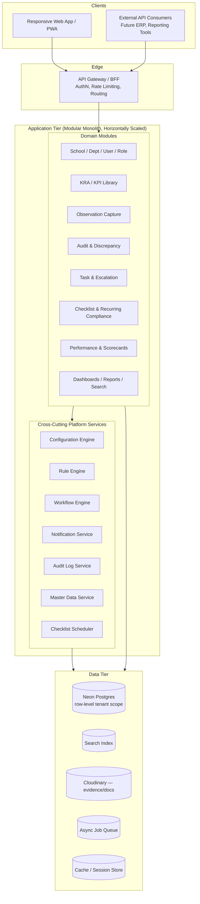

# Design.md — School Operations & Governance Platform

A single design reference synthesizing the Architecture Specification, Data Model Specification, and API Specification against the PRS (v1.5). Intended for engineering onboarding and design review — for full detail on any point, follow the section reference back to the source document.

## Document Control

| Version | Description |
|---|---|
| v1.1 | Original baseline design doc, aligned to PRS v1.1 (KPI Calculation Rules, Checklist & Recurring Task Management). |
| **v1.5 (this document)** | Realigned to PRS v1.5. Added design coverage for: Multi-Level Discrepancy Approval Chains (BR-21), Holiday Calendar & Non-Working-Day Policy (BR-22), Phase 1 Asset Lifecycle (BR-23), the idempotent/timezone-aware/backfilling Compliance Scheduler (BR-24), Duplicate Observation detection with Block/Override (BR-25), Missed-KPI Grace Period & Reopen governance (BR-26), and governed Evidence Retention/Deletion (BR-27). Updated Architecture Principles (§2), Component Architecture (§5), Cross-Cutting Platform Services (§6), Immutability Strategy (§8), Workflow & State Machine Design (§9), Data Architecture (§10), API Architecture (§11.1), ADR summary (§16), and NFR Traceability (§17) accordingly. Document version bumped 1.1 → 1.5 to realign with PRS v1.5 and API-Spec v1.5.

---

## 1. What This System Is

An enterprise SaaS **governance layer** that sits alongside a school ERP — it does not manage fees, admissions, payroll, or academics. It owns four connected capabilities:

1. KRA/KPI compliance definition and structured observation capture.
2. Independent verification (audit → discrepancy → investigation → closure).
3. Task and escalation governance.
4. Immutable, versioned performance scorecards derived from (1)–(3).

Five system roles — SuperAdmin, Admin, Checker, Auditor, Viewer — operate under a strict single-school-per-user model (exceptions: SuperAdmin, Viewer). See **rules.md** for the full binding rule set; this document focuses on *how the system is built* to satisfy those rules.

---

## 2. Architecture Principles (Design Constraints)

Nine principles drive every design decision below (Architecture §1):

| # | Principle |
|---|---|
| AP1 | Rules live in configuration, not code. |
| AP2 | Immutability enforced at the data layer, never only the UI. |
| AP3 | Cross-cutting concerns are shared services, called by modules — never re-implemented per module. |
| AP4 | Scope isolation is a mandatory query-layer filter, independent of role permissions. |
| AP5 | The API is first-class — enforces the identical Permission Matrix as the UI. |
| AP6 | Design for horizontal scale-out from day one. |
| AP7 | No hard deletes, anywhere. |
| AP8 | Build the modular monolith first; extract services only where a genuine boundary demands it. |
| AP9 | A recurring compliance obligation is a Checklist Template generating immutable-once-completed Instances, never a hand-recreated Task. |
| AP10 *(v1.5)* | Deletion is never automatic — retention-eligibility, and the actual deletion action, are distinct, explicitly logged states (governs Evidence Retention, BR-27, and informs the general no-hard-delete posture, AP7). |
| AP11 *(v1.5)* | A detected conflict (duplicate Observation, out-of-window submission, out-of-order approval) blocks by default and is resolved only through an explicit, justified, logged override or approval action — never silently accepted or silently dropped. |

---

## 3. Architecture Style

**Modular monolith, service-oriented internally, deployed as a small number of independently scalable units** (ADR-01).

- Domain modules map directly to PRS Part 2 (§18–35) and communicate **in-process** through internal service interfaces — never a shared-database free-for-all. This makes later service extraction a deployment change, not a rewrite.
- Six cross-cutting platform services (Section 6) are consumed by every domain module.
- A single **API Gateway / BFF** fronts the monolith: terminates auth, applies the Permission Matrix, routes internally.
- Read-heavy workloads (Dashboards, Reports, Search) are architecturally separated from write-path workloads (Observation submission, Task actions) so heavy report generation cannot degrade transactional response times.

**Rejected: microservices-from-day-one.** Cross-module transactions are the norm in this domain (Observation → Discrepancy → Task → Scorecard all touch each other); a monolith keeps these transactionally consistent without distributed-transaction complexity, and Phase 1 team/scope doesn't justify independent deployability yet (Architecture §2).

---

## 4. High-Level System View

---

## 5. Component Architecture

Each module owns its own tables and calls shared platform services rather than re-implementing them. **Module boundary rule:** a module may write only to its own tables; to read data owned by another module it calls that module's internal service interface — never queries another module's tables directly. This is the seam that allows Phase 3 service extraction without a data-layer rewrite.

| Module | PRS Ref | Owns | Depends On |
|---|---|---|---|
| School / Department / User / Role | §18–21 | School, Department, User, Role, Permission assignment | Master Data, Audit, Configuration |
| KRA / KPI Library | §22–23 | KRA, KPI (versioned), Global KPI Library | Audit, Configuration, Rule Engine |
| Observation Capture | §24 | Observation records, lock-period enforcement, Duplicate detection (BR-25), Grace Period/Reopen (BR-26), Event Time capture | Configuration, Audit, Rule Engine, Compliance Scheduler |
| Audit & Discrepancy | §25–26 | Discrepancy lifecycle, investigation, multi-level Approval Chain resolution (BR-21) | Workflow Engine, Audit, Notification, Master Data (Discrepancy Category) |
| Task & Escalation | §27 | Task, Primary Ownership, ETA, Escalation Matrix | Workflow Engine, Configuration, Notification |
| Checklist & Recurring Compliance | §23 (new) | ChecklistTemplate/Item, ChecklistInstance/Item | Checklist Scheduler, Workflow Engine, Rule Engine, Task & Escalation, Notification, Audit |
| Performance & Scorecards | §28–29 | Scorecard generation and versioning | Rule Engine, Audit |
| Dashboards / Reports / Search | §30–31, 33 | Read-optimized views, export, global search | Master Data, Configuration |
| Notifications (module-facing) | §32 | Per-user notification preferences | Notification Service, Configuration |
| Settings & Master Data | §34–35 | Configurable enumerations, feature flags, Organization Holiday Calendar & Working Days (BR-22), Discrepancy Category/Approval Chain config (BR-21), Asset lifecycle status (BR-23) | Configuration, Master Data, Audit |

---

## 6. Cross-Cutting Platform Services

Nine shared services, each with a stable internal interface consumed by every domain module:

- **6.1 Configuration Engine** — single source of truth for PRS §54 values (Lock Period, Max ETA Extensions [fixed], Escalation SLA, Reminder Frequency, KPI Amber Tolerance Band, Session Timeout, File Upload Limits, Feature Flags, and *(v1.5)* Duplicate Detection Window, Grace Period, Evidence Retention Period). Resolves by precedence **School override → Department override → Global default**. All changes versioned and audit-logged. Cache-backed read path.
- **6.2 Rule Engine** — evaluates KPI Comparator/RAG logic (full precision, round-half-up for display), computes Scorecard aggregation via a pluggable strategy (worst-status-wins in Phase 1; weighted scoring is a Phase 2 strategy add, not a rewrite), triggers reminder/escalation timers. Stateless and deterministic — same inputs always produce the same output (audit defensibility requirement).
- **6.3 Workflow Engine** — generic FSM executor shared by Task, Discrepancy, and Checklist Instance. State machines are **data-defined**, not hardcoded (Section 8 below); rejects any transition not in the entity's definition (satisfies FR-090: no skipped Discrepancy states). Every transition emits an event to Audit and, where applicable, Notification. *(v1.5)* Discrepancy's Approval stage is a **parameterized N-level sub-chain** resolved per Discrepancy Category (BR-21, up to two levels in Phase 1) — the engine reads level count and assigned Role from Approval Chain Configuration rather than hardcoding "Approve" as a single step; an in-progress Discrepancy binds to the chain version active when it entered Approval (FR-235).
- **6.4 Notification Service** — single dispatch point for all seven priority tiers. Fixed ordering and mandatory-category non-mutability enforced **server-side** (FR-165) — no client request path can mute Escalation/Audit Failure. Channel-agnostic core with pluggable adapters (in-app, email, SMS, WhatsApp). Publishes to the async job queue — never sends synchronously.
- **6.5 Audit Log Service** — single append-only sink for every PRS §45 event (login/logout/failed auth, KPI edits, Observation submit/lock, Discrepancy transitions, Role changes, Scorecard generation, sensitive-data views/exports, and *(v1.5)* blocked duplicate attempts, override actions, Reopen Requests/Approvals, scheduler run logs, Evidence deletion actions). Physically append-only — no UPDATE/DELETE grants for any application role. Permanent retention, partitioned by month.
- **6.6 Master Data Service** — owns reference enumerations (Frequency, Comparator, Priority, Department templates, Discrepancy Category, and *(v1.5)* Organization Holiday Calendar entries, Working Days calendars, Asset). Changes are forward-only — existing records never repointed retroactively.
- **6.7 Checklist Scheduler** *(v1.1)* — materializes `ChecklistInstance` rows from active `ChecklistTemplate` definitions per Frequency cadence. Generation is idempotent/deterministic: upserts against a uniqueness constraint on `(template_id, template_version, school_id, department_id, period_start)`. Reads cadence config from the Configuration Engine / Master Data Service. Delegates to the Workflow Engine for instance state and Notification Service for "Checklist Assigned." A missed due-date routes through the same Escalation Matrix and Task-creation path as Task & Escalation, rather than reimplementing escalation. Runs as a background job, never in the request path.
- **6.8 Compliance Scheduler** *(v1.5)* — a distinct background service (from the Checklist Scheduler above) that generates recurring **KPI compliance records** (PRS §23.16–23.17, BR-22, BR-24). Idempotent: checks for an existing record on the same logical occurrence (KPI version + scope + due date) before creating one. Timezone-aware: computes due dates using each School's configured timezone, never server-local/UTC. Backfilling: a missed run is detected and caught up by the next successful run, each backfilled record dated to its correct original due date. Holiday-aware: resolves the applicable Working Days calendar (KPI override, else School default) and Organization Holiday Calendar, applying the KPI's Non-Working-Day Policy (Skip / Shift Forward / Shift Backward) before a record is generated. Every run — success or failure, with generated/backfilled counts — is logged distinctly from per-record Audit Log entries (exposed read-only via API-Spec §15a).
- **6.9 Duplicate & Grace-Period Guard** *(v1.5)* — a Rule Engine extension consumed by Observation Capture (BR-25, BR-26) rather than a new top-level service, kept here for visibility since it's cross-cutting to every KPI-scoped submission. Duplicate check: same KPI version + scope + Event Time Point (if applicable) + Checker within the configured Duplicate Detection Window blocks submission by default; Override requires the Override permission plus a mandatory logged justification, independent of submission-token idempotency (FR-069/FR-260). Grace Period check: a Late submission is accepted automatically within the Grace Period; once elapsed the record moves Late-Submittable → Closed-Missed and requires an Admin/SuperAdmin-approved Reopen Request (single approval level, Phase 1) before it accepts a new submission, flagged both Late and Reopened.

---

## 7. Multi-Tenancy & Scope Isolation

- **Model:** shared application, shared database, **row-level tenant isolation** — every tenant-scoped table carries `school_id` (and `department_id` where relevant); every query passes a mandatory scope filter at the data-access layer, applied **before and independent of** permission checks (AP4).
- **Why shared, not database-per-school:** at target scale (hundreds of schools), per-tenant databases multiply migration/backup/connection-pool overhead without a compliance requirement forcing physical separation. Same pattern used by comparable enterprise SaaS (ServiceNow, Salesforce).
- **Exceptions:** SuperAdmin (all schools) and Viewer (multi-school grant) are modeled as explicit scope-grant records — the filter still runs, just against a wider allowed-scope set.
- **Enforcement point:** lives in a shared data-access layer no module can opt out of; unit-tested independently of any module's business logic.

---

## 8. Immutability & Versioning Strategy

Directly implements PRS §44/§55 — immutability must be data-layer enforced, not a UI convention.

| Entity | Mechanism |
|---|---|
| Observation | Mutable only until the configured lock period elapses. After lock, a DB-level constraint (trigger or write-guard) rejects UPDATE. Corrections create a *new* Observation referencing the original. |
| KPI | Every Target/Comparator/Unit edit inserts a new row with an incremented version and a new immutable ID; the prior version is never updated once any Observation references it. |
| Scorecard | Generated, never updated. Regeneration inserts a new version and sets `superseded_by` on the prior. No application role holds UPDATE/DELETE grants. |
| Audit Log | Append-only at the DB grant level — strongest guarantee in the system. |
| Master Data | New rows for changed values; FK references never repointed retroactively. |
| Checklist Templates/Instances | Same versioning philosophy as KPI — template edits version forward; instances reference the template version active at generation. |
| Discrepancy Approval Chain Configuration *(v1.5)* | Forward-only versioning, same pattern as Master Data; an in-progress Discrepancy snapshots and stays bound to the chain version active when it entered Approval (FR-235), even if the configuration changes underneath it. |
| Evidence Files *(v1.5)* | Never auto-deleted. Retention-eligibility (Evidence Retention Period elapsed) and actual deletion are modeled as two separate states; deletion requires an explicit, logged Admin/SuperAdmin action — there is no automated purge job (BR-27, AP10). |
| Compliance Record (Late/Closed-Missed) *(v1.5)* | Never deleted when a KPI is missed — reclassified Late-Submittable → Closed-Missed at Grace Period expiry, and restored to submittable only via a logged Admin-approved Reopen action (BR-26). |

**Enforcement pattern:** immutability is enforced by *removing the application's ability to issue the mutating statement* (DB grants/triggers), not solely application-code conditionals (ADR-04).

---

## 9. Workflow & State Machine Design

Discrepancy, Task, and Checklist Instance lifecycles are executed by the shared Workflow Engine using **data-defined** transition tables rather than per-module hardcoded logic:

- **Discrepancy:** `Raised → Under Investigation → Resolved → Pending Approval (Level 1..N, per configured chain) → Closed` (strictly linear per level, BR-13/BR-21; no skipped states, FR-090). Phase 1 supports up to two sequential approval levels, resolved from the Discrepancy's Category → Approval Chain Configuration rather than a fixed single "Approve" step. Segregation of duties enforced as an engine guard at every level: each level's Approver ≠ Investigation Owner and ≠ any prior level's Approver on the same Discrepancy. Rejection at any level reopens to Under Investigation, preserving prior investigation notes.
- **Task:** creation → in-progress → (ETA extension ×3 max, 4th triggers auto-escalation) → completion (per configured rule: ANY / ALL / post-completion approval, immutable after creation) → closed.
- **Checklist Instance:** generated (Pending) → In Progress → Completed, or missed-due-date → routed into the Task/Escalation path as a remediation Task rather than a duplicated escalation mechanism (ADR-06).
- **Observation compliance record** *(v1.5)* — not a Workflow Engine FSM (it is generated/consumed by the Compliance Scheduler and Duplicate & Grace-Period Guard, §6.8–6.9) but follows an analogous non-skippable path: `Generated → (on time | Late within Grace Period) → Submitted`, or `Generated → Grace Period elapsed → Closed-Missed → (Admin-approved Reopen) → Late-Submittable → Submitted (flagged Late + Reopened)`.

Adding a new stateful entity in Phase 3 (e.g., CAPA, Incident Reporting) is a **configuration change** (register new states/transitions) rather than an engine change.

---

## 10. Data Architecture

- **Primary datastore:** Neon (serverless Postgres) — system of record for all transactional entities (School, Department, User, Role, KRA, KPI, Observation, Discrepancy, Task, Scorecard, Master Data, Checklist entities). Branching model supports per-PR/feature preview environments; scale-to-zero keeps Dev/Staging cost proportional to use.
- **Entity relationships:** School → Department → User forms the tenancy hierarchy; KRA → KPI → Observation forms the compliance chain; Observation → Discrepancy is optional (0/1); Task ↔ User is many-to-many via Primary Ownership; User/Department → Scorecard is one-to-many with versioning. See full ERD in Data-Model.md §2.
- **Search index:** denormalized, near-real-time (< 60s lag target), fed by change events — never a second system of record.
- **Media & document storage:** Cloudinary holds evidence files (photos, video, PDF/DOCX/MD/PPTX); the database holds only the Cloudinary `public_id`/secure URL and metadata (type, format, size, virus-scan status). Chosen over a bare object store because it natively handles the format mix (image/video transforms, document handling) without a bolted-on processing pipeline.
- **Cache/session store:** session/token state, Configuration Engine reads, hot dashboard aggregates — never a source of truth.
- **Async job queue:** notification dispatch, large/async report exports, scheduled jobs (reminders, SLA checks, scorecard generation, checklist generation).

### 10.1 Data Model Conventions (Data-Model.md §1)
- Primary keys: UUID (server-generated; UUIDv7 for time-sortable high-volume tables like Observation).
- Every tenant-scoped table carries `school_id` (and `department_id` where applicable), NOT NULL except for explicit SuperAdmin/Viewer exceptions.
- Standard audit columns: `created_at`, `updated_at`, `created_by`, `updated_by` (append-only tables like Audit Log carry only `created_at`/`created_by`).
- No `deleted_at` column anywhere — lifecycle is a `status` enum (Active/Archived/Deprecated/Superseded); no DELETE grant on any application role.
- snake_case, plural table names, `<entity>_id` foreign keys.
- Fixed, rarely-changing value sets → native Postgres ENUM; admin-configurable value sets → FK to Master Data.

### 10.2 Core Entity Groups
- **Core (PRS §37-sourced):** `schools`, `departments`, `users`, `kras`, `kpis`, `observations`, `discrepancies`, `tasks`/`task_owners`, `scorecards`.
- **Supporting (inferred):** `roles`/`user_roles`, `escalation_rules`, `notifications`, `master_data_entries`, `user_school_grants`, `vendors`/`assets`, Checklist schema (`ChecklistTemplate`, `ChecklistTemplateItem`, `ChecklistInstance`, `ChecklistInstanceItem`, `ShiftPattern`).
- **Governance additions** *(v1.5, PRS §37.12, §54)*: `discrepancy_categories`, `discrepancy_approval_chain_configurations` (versioned), `discrepancy_approval_history` (Approval ID, Level, Assigned Role/User, Status, Approved At, Comments — FR-237), `organization_holiday_calendar`, `school_working_days`, `assets` (with `status`: Active/Retired, BR-23), `compliance_scheduler_run_log`, `duplicate_observation_overrides`, `observation_reopen_requests`, `evidence_retention_config`/`evidence_deletion_log`.
- **Cross-cutting:** `configuration_items`/`configuration_overrides`, `audit_log_entries`, logical `search_index`.

Full field-level definitions live in Data-Model.md §3–5; do not duplicate them here — this document is the shape, not the schema.

---

## 11. API Architecture

- **Style:** versioned REST (`/v1/...`), JSON, resource-oriented for all core entities.
- **AuthN:** Neon Auth (Better Auth-backed) — identity synced directly into a `neon_auth` schema inside the same Postgres instance, avoiding a separate IdP-to-app sync layer. The application's `users` table stays the source of truth for role/school/department/business fields; Neon Auth owns credentials, sessions, MFA enrollment. MFA required at login for Admin/SuperAdmin.
- **AuthZ:** every request re-evaluates the Permission Matrix and scope filter at execution time — API enforces identically to the UI (AP5); no looser API permission model.
- **Idempotency:** write endpoints accept a client-generated idempotency key; **required** for Observation submission (FR-069) to guard against duplicate creation on retry.
- **Pagination & filtering:** all list endpoints paginated with bounded date ranges by default, to protect performance targets.
- **Events/webhooks:** state-transition events (Discrepancy state change, Task escalation, Scorecard generation) published for future webhook consumers — event contract built now, outbound delivery infra deferred past Phase 1.
- **Error contract:** structured, machine-readable errors (code, message, field reference); conflict errors return 409-equivalent semantics with a resolution path.

### 11.1 API Surface (API-Spec.md)
| Area | Spec Section |
|---|---|
| Auth & Authorization | §2 |
| Error Response Contract | §3 |
| Pagination/Filtering/Field Selection | §4 |
| Idempotency | §5 |
| School / Department / User / Role | §6 |
| KRA / KPI Library | §7 |
| Observation Capture | §8 |
| Audit & Discrepancy | §9 |
| Task & Escalation | §10 |
| Checklist & Recurring Task Management | §10a |
| Performance & Scorecards | §11 |
| Dashboards, Reports, Search | §12 |
| Notifications | §13 |
| Settings, Master Data, Configuration | §14 |
| Locations | §14a |
| Holiday Calendar & Working Days *(v1.5)* | §14b |
| Asset Lifecycle *(v1.5)* | §14c |
| Evidence Retention & Deletion *(v1.5)* | §14d |
| Audit Log (Read) | §15 |
| Compliance Scheduler Run Log (Read) *(v1.5)* | §15a |
| Webhooks / Events | §16 |
| Integration Partner Management | §16a |
| Endpoint-to-FR Traceability | §17 |

---

## 12. Security Architecture

- Delegated AuthN via Neon Auth; MFA gate for Admin/SuperAdmin.
- Encryption in transit and at rest.
- Segregation-of-duties rules (Discrepancy Approver ≠ Investigation Owner) enforced as Workflow Engine guards.
- DPDP Act compliance posture pending Legal confirmation on erasure vs. retention exemption for audit-relevant records (AQ4).
- Category-level export/view overrides (e.g., financial KPI restriction from Viewer export) configurable per BR-04/BR-19.
- *(v1.5)* Every override/exception path is itself a governed, logged action: duplicate-block Override requires the Override permission plus mandatory justification (BR-25); Closed-Missed reopen requires Admin/SuperAdmin approval (BR-26); Evidence deletion requires an explicit Admin/SuperAdmin action, never an automated purge (BR-27, ADR-08).

---

## 13. Performance, Scalability & Availability

- Horizontal scale-out design from day one (AP6) — no vertical-scaling-only assumption, given a 5,000-concurrent-user Phase 1 target (pending final confirmation, PRS Q8).
- Read replicas offload reporting/dashboard workloads from the transactional path.
- Report/dashboard generation architecturally separated from write-path workloads.
- Async queue absorbs notification dispatch, large exports, and scheduled jobs so they never block interactive request paths.
- Search indexing lag target: < 60 seconds.
- Observation table partitioning strategy (by month vs. by School) — open (AQ2), pending performance-target confirmation (Q8).

---

## 14. Deployment Architecture

- **Environments:** Dev, Staging, Production — fully separated (separate DBs, separate configuration).
- **Hosting:** cloud-hosted; responsive web app (PWA-capable); no native mobile app in Phase 1.
- **CI/CD:** automated pipeline runs the acceptance-criteria test suite against every change before promotion.
- **Rollout:** module- and feature-level Feature Flags allow phased enablement (e.g., new report type for one school) without redeploy — decouples deploy from release.
- **Connectivity assumption:** online-only; no offline mode — simplifies client architecture (no local sync/conflict resolution), but limits client resilience to standard retry/idempotency on transient network loss.

---

## 15. Technology Stack (Recommended, Not Binding)

| Layer | Recommendation | Why |
|---|---|---|
| Primary database | Neon (serverless Postgres) | Full Postgres compatibility (RLS, partitioning, JSONB); serverless autoscaling; scale-to-zero for Dev/Staging; instant DB branching for previews; read replicas for reporting offload. |
| Authentication | Neon Auth (Better Auth-backed) | Identity synced into the same Postgres instance (`neon_auth` schema) — no separate IdP sync plumbing; email/password, MFA, OAuth/SSO out of the box. |
| Media & document storage | Cloudinary | Purpose-built for the mixed evidence/document types the platform handles; built-in transform/compression, CDN delivery — avoids a bolt-on image pipeline. |
| Search index | OpenSearch/Elasticsearch-class | Meets < 60s indexing-lag target with near-real-time ingestion. |
| Cache/session | Redis-class | Backs Configuration Engine reads, session externalization, hot dashboard aggregates. |
| Async queue | SQS-class or Kafka-class (per ordering needs) | Decouples notification dispatch, report generation, checklist generation from the request path. |
| Application runtime | Framework-agnostic, team's existing depth | Module/service boundaries are framework-independent. |
| API layer | REST, OpenAPI-documented | Matches the explicit REST requirement; documented contract for future ERP integration. |

This section is intentionally the least prescriptive — confirm against organizational hosting/vendor standards before treating as binding. Neon and Cloudinary are the confirmed choices for database/auth and media/document storage respectively, per business direction (ADR-07).

---

## 16. Architecture Decision Records (Summary)

| ADR | Decision | Rejected Alternative(s) — Why |
|---|---|---|
| ADR-01 | Modular monolith for Phase 1, not microservices | Microservices-from-day-one — adds distributed-transaction/ops complexity not justified at Phase 1 scale; cross-module workflows are easier to keep consistent in one transactional boundary. |
| ADR-02 | Shared database, row-level tenant isolation | Database-per-school — multiplies migration/backup/ops overhead across hundreds of schools without a compliance requirement forcing physical separation. |
| ADR-03 | Data-defined (configurable) state machines via a generic Workflow Engine | Hardcoded state logic per module — duplicates transition-validation logic and makes new stateful entities (Phase 3) a code change instead of config. |
| ADR-04 | Immutability via DB grants/triggers, not application conditionals only | App-layer "read-only after lock" checks alone — a bug could bypass an in-code check; a missing DB grant can't be bypassed the same way. |
| ADR-05 | Async notification dispatch via job queue | Synchronous inline dispatch — a slow/down SMS/WhatsApp provider would block unrelated requests. |
| ADR-06 | Checklist Instances as scheduler-generated, versioned Templates — a distinct entity from Task | (a) Extending Task's `recurrence_rule` — Task has no native per-item response capture, critical-item flagging, or fixed compliance period; would overload one entity with two lifecycles. (b) Manual recreation each cycle — fails the 100%-completion target outright. |
| ADR-07 | Neon (DB + auth) and Cloudinary (media/docs) | (a) Self-managed Postgres + separate IdP + S3-compatible bucket — pushes HA/backup/connection-pooling/identity-sync onto the team. (b) Firebase/Supabase combined BaaS — generic storage underperforms Cloudinary for this platform's actual evidence mix (photo/video + PDF/DOCX/PPTX). |
| ADR-08 *(v1.5)* | Evidence deletion as an explicit, logged human action gated on a retention-eligibility flag, not an automated purge job | An automated purge cron — simpler to build, but removes the human check-point the business rule (BR-27) explicitly requires, and risks deleting evidence still relevant to an in-flight Discrepancy/Investigation with no recovery path. |
| ADR-09 *(v1.5)* | Discrepancy Approval as a parameterized N-level sub-chain inside the existing Workflow Engine (config-resolved level count/role), not a second, Discrepancy-specific approval engine | A bespoke multi-level approval module — duplicates transition-validation and segregation-of-duties logic the Workflow Engine (ADR-03) already provides for Task and Checklist Instance. |

---

## 17. NFR Traceability Matrix

| PRS NFR / Requirement | Design Section (this doc) |
|---|---|
| Configuration centralization (§54) | §6.1 |
| KPI RAG/rounding rules (§23.14) | §6.2 |
| No skipped state transitions (FR-090) | §9 |
| Mandatory notification non-mutability (FR-165) | §6.4 |
| Immutability at data layer (§55) | §8 |
| Tenant/scope isolation (§43) | §7 |
| API parity with UI permissions (§39) | §11 |
| Segregation of duties (FR-026, FR-092) | §9, §12 |
| Performance targets (§46) | §13 |
| Availability target (§46) | §13 |
| No hard deletes (§47) | §8, §10.1 |
| DPDP compliance (§41) | §12 |
| Integration boundary (BR-19, §40) | §11 |
| Recurring/checklist Task generation (FR-110, FR-111) | §6.7, §9 |
| Multi-Level Discrepancy Approval (BR-21, FR-231–237) | §6.3, §9, §10.2 |
| Holiday Calendar & Non-Working-Day Policy (BR-22, FR-238–243) | §6.6, §6.8, §10.2 |
| Phase 1 Asset Lifecycle (BR-23, FR-244–249) | §6.6, §10.2 |
| Idempotent/timezone-aware/backfilling Compliance Scheduler (BR-24, FR-250–255) | §6.8 |
| Duplicate Observation detection & Override (BR-25, FR-256–262) | §6.9, §10.2 |
| Missed-KPI Grace Period & Reopen (BR-26, FR-263–270) | §6.9, §9, §10.2 |
| Governed Evidence Retention/Deletion (BR-27, FR-271–274) | §6.1, §6.5, §8, ADR-08 |

---

## 18. Open Design Questions (Blocking Full Sign-off)

| # | Question | Depends On |
|---|---|---|
| AQ1 | Application-tier compute hosting platform (DB/auth/storage resolved — Neon, Cloudinary) | Infra stakeholders |
| AQ2 | Observation table partitioning: calendar month vs. School | Q8 resolution |
| AQ3 | Message-queue technology (ordering guarantees for escalation timers) | Engineering |
| AQ4 | DPDP erasure: true anonymization vs. retention exemption for audit-relevant records | Compliance/Legal |
| AQ5 | SSO provider/protocol ahead of Phase 2 ERP integration | ERP integration owner |
| AQ6 *(v1.5)* | Whether the Duplicate & Grace-Period Guard (§6.9) is implemented as an in-process Rule Engine extension (as designed here) or split out as its own internal service once Compliance Scheduler + Duplicate + Grace-Period volume is better understood — a scale/ops call, not a behavior change. | Engineering |
| AQ7 *(v1.5)* | Whether Discrepancy Approval Chain levels beyond Phase 1's two-level cap should be schema-capped or left open-ended in `discrepancy_approval_chain_configurations` — affects migration cost if Phase 3 raises the cap. | Engineering + Product |

Nine business/policy decisions (D1–D9, spanning KPI taxonomy, notification-channel budget, SLA numbers, Event Time hardware rollout, and whether Asset Lifecycle expands beyond the Phase 1 minimal status) remain open at the PRS level — see **PRS §17** — and are stakeholder, not design, questions; they are not duplicated here.

See **phases.md** for how these resolve against the delivery roadmap, and **rules.md** for the full binding business/validation rule set this design implements.
