# Product Requirements Specification

**School Operations & Governance Platform**

*KRA/KPI Compliance, Observation Capture, Audit, Discrepancy, Task Management, Escalation, Performance Review, Scorecard & Governance System*

| | |
|---|---|
| Document Type | Product Requirements Specification (PRS) |
| Version | 1.5 |
| Supersedes | BRD v3.0 (Gap Closure) |
| Status | Ready for Stakeholder Sign-off (Section 17 decisions pending) |
| Classification | Internal — Business & Engineering |
| Prepared For | School Operations Digitalization Initiative |

---

## Document Control

| Version | Description |
|---|---|
| v1.3 | Original baseline BRD |
| v2.0 | Gap-closure revision against 10 role-based KRA/KPI manuals and comparable products |
| v3.0 | Gap-closure revision adding Success Metrics, User Journey, Screen Inventory, Report Catalogue, Notification Matrix, Permission Matrix, Data Dictionary, Acceptance Criteria, Risks & Assumptions |
| v1.0 | Full re-platform as an enterprise Product Requirements Specification. Reorganizes, completes, and normalizes all prior content into Business Foundation / Functional Specification / Technical & Governance parts. Incorporates 20 final, approved business decisions. No existing functionality removed. |
| v1.1 | Added Section 23.14 KPI Calculation Rules (formula types, rounding, missing-data handling, RAG thresholds) with new FR-175–FR-177; added hard performance/scalability targets to Section 46; added KPI Amber Tolerance Band to Section 54 Configuration Management; added Q8/Q9 to Open Questions for stakeholder confirmation. |
| v1.2 | Added Event-Time Capture (Section 24.14, FR-178–FR-190): dual-mode (Auto-Captured / Manual with mandatory reason) recording of *when* an operational event occurred — e.g., bus departure/return time, floor-wise washroom/facility cleaning time, staff/student check-in/check-out time — as distinct from the existing Submitted At (system capture) timestamp. Added KPI Capture Type (Section 23, FR-178) to classify a KPI as Value Reading, Event Time, or Value + Event Time. Added Location (floor/zone) as new Master Data and Entity (Section 35, 36, 37.10, FR-189–FR-190). Updated Observation and KPI data dictionaries (Section 37.5, 37.6) with new fields. Updated Validation Rules (Section 52) and Report Catalogue (Section 50) accordingly. |
| v1.3 | Hardened Section 41 Security into explicit subsections (Authentication & Authorization, Input Validation & Output Encoding, Data Protection, OWASP Top 10 Prevention, Dependency & Infrastructure Security, API Security, Secure Development Lifecycle, Deployment & Operations) with new FR-191–FR-210, so the platform is scale- and audit-ready by design. Strengthened Section 39 API Requirements and Section 46 Performance/Scalability with API-first, stateless, horizontally-scalable, cache-friendly architecture requirements so the same backend can serve a future native mobile app (iOS/Android) without redesign. Added new Section 58 Engineering & Code Quality Standards (architecture, readability, version control, testing, error handling/logging, documentation) as binding engineering practice for all contributors. |
| v1.4 | Elevated ERP/third-party integration from a future-phase note to a fully specified, secure integration layer. Rewrote Section 40 Integration Strategy with Integration Architecture, external-system Authentication & Authorization (OAuth 2.0 Client Credentials, scoped tokens, optional mTLS), Data Mapping & Field-Level Configuration, Conflict Resolution & Sync Exception handling, Error Handling/Retry/Idempotency, Integration Monitoring & Health, and a Sandbox/Certification Environment, with new FR-211–FR-230. Extended Section 39 API Requirements with a dedicated secured integration surface (signed webhooks, per-partner rate limits, partner-specific deprecation notice window). Added Integration Partner as a new Entity/Data Dictionary record (Section 36, 37.11) and Integration Sync/Exception Reports (Section 50). |
| **v1.5 (this document)** | Closed seven of the ten open gap-analysis items (Q12–Q15, Q17–Q19) raised at the end of v1.4, produced via a structured gap-closure exercise: Multi-Level Discrepancy Approval (BR-21, Section 26, FR-231–237); Holiday Calendar & Non-Working-Day Policy (BR-22, Section 23.17, 35, FR-238–243); Phase 1 minimal Asset Lifecycle/Status (BR-23, Section 35.15, FR-244–249); an idempotent, timezone-aware, backfilling Compliance Scheduler (BR-24, Section 23.16, FR-250–255); Duplicate Observation detection with Block/Override (BR-25, Section 24.4–24.7, FR-256–262); Missed-KPI Grace Period & Reopen governance (BR-26, Section 24.16, FR-263–270); and Evidence Retention configuration with archive tiering and governed deletion (BR-27, Section 47, FR-271–274). Added Discrepancy Category, Organization Holiday Calendar, Working Days, and Asset (Section 37.12) as new/revised Master Data and Data Dictionary entries. Section 9 now carries twenty-seven Business Rules; Section 12 Permission Matrix gained six new rows; Section 15 Business Glossary gained nine new terms. Renamed and rewrote Section 17 from "Open Questions" to "Stakeholder Decisions Required Before Phase 1 Sign-off" (D1–D9), since every item with a single defensible engineering answer is now resolved in-spec — only genuine business/policy decisions remain open. Two previously raised items (Q16 Dashboard Refresh, Q20 AI & Analytics Roadmap) were found already covered by v1.4 and required no change. |

---

## Table of Contents

**PART 1 — BUSINESS FOUNDATION**
1. [Executive Summary](#1-executive-summary)
2. [Business Vision](#2-business-vision)
3. [Business Objectives](#3-business-objectives)
4. [Success Metrics](#4-success-metrics)
5. [Stakeholders](#5-stakeholders)
6. [Scope](#6-scope)
7. [Assumptions](#7-assumptions)
8. [Constraints](#8-constraints)
9. [Business Rules](#9-business-rules-global)
10. [User Personas](#10-user-personas)
11. [Roles](#11-roles)
12. [Permission Matrix](#12-permission-matrix)
13. [School Hierarchy](#13-school-hierarchy)
14. [Department Hierarchy](#14-department-hierarchy)
15. [Business Glossary](#15-business-glossary)
16. [Risks](#16-risks)
17. [Stakeholder Decisions Required Before Phase 1 Sign-off](#17-stakeholder-decisions-required-before-phase-1-sign-off)

**PART 2 — FUNCTIONAL SPECIFICATION**
18. [School Management](#18-school-management)
19. [Department Management](#19-department-management)
20. [User Management](#20-user-management)
21. [Role Management](#21-role-management)
22. [KRA Management](#22-kra-management)
23. [KPI Management](#23-kpi-management)
24. [Observation Capture](#24-observation-capture)
25. [Audit Management](#25-audit-management)
26. [Discrepancy Management](#26-discrepancy-management)
27. [Task Management](#27-task-management)
28. [Performance Reviews](#28-performance-reviews)
29. [Scorecards](#29-scorecards)
30. [Dashboards](#30-dashboards)
31. [Reports](#31-reports)
32. [Notifications](#32-notifications)
33. [Search](#33-search)
34. [Settings](#34-settings)
35. [Master Data](#35-master-data)

**PART 3 — TECHNICAL & GOVERNANCE**
36. [Entity Definitions](#36-entity-definitions)
37. [Data Dictionary](#37-data-dictionary)
38. [Relationship Model & ERD](#38-relationship-model--erd)
39. [API Requirements](#39-api-requirements)
40. [Integration Strategy](#40-integration-strategy)
41. [Security](#41-security)
42. [Authentication](#42-authentication)
43. [Authorization & RBAC](#43-authorization--rbac)
44. [Versioning](#44-versioning)
45. [Audit Logging](#45-audit-logging)
46. [Performance, Scalability & Availability](#46-performance-scalability--availability)
47. [Data Retention & Archival](#47-data-retention--archival)
48. [Governance Rules](#48-governance-rules)
49. [Notification Matrix](#49-notification-matrix)
50. [Report Catalogue](#50-report-catalogue)
51. [Search Behaviour](#51-search-behaviour)
52. [Validation Rules](#52-validation-rules)
53. [Error Handling](#53-error-handling)
54. [Configuration Management](#54-configuration-management)
55. [Acceptance Criteria (Platform-Level)](#55-acceptance-criteria-platform-level)
56. [Deployment Assumptions](#56-deployment-assumptions)
57. [Roadmap](#57-roadmap)
58. [Engineering & Code Quality Standards](#58-engineering--code-quality-standards)

---

# PART 1 — BUSINESS FOUNDATION

## 1. Executive Summary

The School Operations & Governance Platform is an enterprise SaaS system that digitizes operational compliance, verification, and performance governance across multiple schools. It is **not** a school ERP; it does not manage fees, admissions, payroll, or academics. It is a governance layer that sits alongside an ERP and owns four connected capabilities:

1. **KRA/KPI compliance** — definition of Key Result Areas and Key Performance Indicators, and structured capture of operational readings against them.
2. **Independent verification** — auditor review of captured observations, discrepancy management, investigation, and closure.
3. **Task & escalation governance** — general-purpose task assignment, ETA management, and time-bound escalation.
4. **Performance governance** — periodic, immutable scorecards and performance reviews derived from (1)–(3).

The platform serves five system roles (SuperAdmin, Admin, Checker, Auditor, Viewer) mapped onto real job titles across departments, within a strict single-school-per-user model (with defined exceptions for SuperAdmin and Viewer). All twenty final business decisions listed in Section 9 are binding constraints on this specification.

## 2. Business Vision

To become the system of record for **operational compliance and performance governance** across every school in the organization — replacing paper-based and spreadsheet-based KRA/KPI tracking with a single, auditable, real-time platform that gives leadership continuous visibility into compliance, task execution, and performance, while remaining the master system for tasks, compliance, audits, discrepancies, KPIs, and performance even after future ERP integration.

## 3. Business Objectives

| # | Objective |
|---|---|
| O1 | Eliminate manual (paper/Excel) KRA/KPI tracking across all schools. |
| O2 | Provide independent, tamper-evident verification of every operational reading. |
| O3 | Reduce audit preparation and discrepancy resolution time through automation and structured evidence capture. |
| O4 | Standardize a single, centrally governed KPI library across the organization, seeded from existing role-based KRA/KPI manuals. |
| O5 | Formalize escalation paths and SLA governance for tasks and discrepancies. |
| O6 | Provide immutable, versioned performance scorecards for individuals and departments. |
| O7 | Establish a governance foundation (configuration, rules, workflow, notification, audit engines) that scales to future modules without re-architecture. |

## 4. Success Metrics

| Metric | Current (Manual Process) | Target (Post Go-Live) |
|---|---|---|
| Manual compliance tracking | 100% | 0% (fully digital) |
| Audit preparation time | 3 days | < 30 minutes |
| KPI submission rate | Not tracked | > 98% |
| Overdue tasks | Not tracked | < 5% |
| Average audit closure time | Not tracked | < 48 hours |
| Discrepancy resolution SLA adherence | Not tracked | > 95% |
| Escalation response time (breach to first action) | ~3 days (informal) | < 24 hours at Level 1 |
| Performance review cycle turnaround | 1–2 weeks manual compilation | Same day as cycle close (auto-generated) |
| User adoption (weekly active / total onboarded) | N/A | ≥ 85% by Pilot exit |

Metrics are reviewed at Pilot exit (Section 57) and 90 days post full rollout, with named owners accountable for reporting actuals.

## 5. Stakeholders

| Stakeholder | Interest |
|---|---|
| Program Sponsor / Leadership | ROI, compliance visibility, adoption |
| SuperAdmin (Platform Owner) | Global configuration, KPI library governance, cross-school reporting |
| Principal / School Admin | School-level compliance, staff, statutory obligations |
| Department Heads | Department KPI performance, task assignment, escalations |
| Checkers (ground staff) | Simple, fast observation capture |
| Auditors | Verification workload, discrepancy management |
| Viewers | Reporting and oversight, potentially cross-school |
| IT / Engineering | Buildability, integration, technical debt |
| QA | Testability, acceptance criteria coverage |
| Compliance / Legal | DPDP Act adherence, data governance |

## 6. Scope

### 6.1 In Scope (Phase 1)

- Multi-school, multi-department architecture with strict data isolation.
- Centralized, versioned Global KPI Library (SuperAdmin-owned).
- KRA and KPI management with 1:1 KPI-to-KRA ownership.
- Observation capture (Checker) with configurable immutability lock period.
- Independent audit/verification workflow (Auditor), never editing observations.
- Discrepancy → Investigation → Resolution → Approval → Closure workflow.
- Task management with multiple Primary Owners, configurable completion rules, ETA governance with a 3-extension cap and auto-escalation.
- Configurable, per-department Escalation Matrix with SLA timers.
- Periodic, immutable, versioned Performance Reviews and Scorecards.
- Role-based dashboards, a defined Report Catalogue, and data export (Excel, CSV, PDF, REST API).
- Priority-ordered, non-mutable-for-mandatory-events notification system (in-app, email, SMS, WhatsApp).
- Full audit logging across all modules.
- English + Hindi localization at launch.
- Documented REST API layer to support future ERP integration.

### 6.2 Explicitly Out of Scope (Phase 1)

- Native iOS/Android apps (responsive web only).
- Offline data capture / offline synchronization (internet connectivity is required — Section 8).
- Weighted KPI scoring model (deferred to Phase 2).
- Full ERP/HRMS integration (payroll, admissions, fees, master identity) — Phase 2/3 (Section 57).
- Vendor/procurement financial workflows beyond basic vendor record-keeping.
- Self-service school registration (Phase 2).
- Future modules listed in Section 57.3 (Asset Management, Visitor Management, Procurement, Leave Management, Maintenance, Incident Reporting, CAPA, Vendor Management).

## 7. Assumptions

| # | Assumption |
|---|---|
| A1 | Internet connectivity is available at all operational sites; the system is online-only (Section 8). |
| A2 | The 10 supplied role-based KRA/KPI manuals represent the current, board-approved KPI catalogue and can be imported as-is at go-live. |
| A3 | Email connectivity is available for all Admin/SuperAdmin users. |
| A4 | A cloud object store (e.g., Cloudinary or equivalent) is available and approved for evidence/photo storage. |
| A5 | WhatsApp Business API access will be approved before go-live for notification channels requiring it. |
| A6 | School organizational hierarchy remains structurally stable during Phase 1 build. |
| A7 | ERP integration, when it occurs, will treat this platform as the master for Tasks, Compliance, Audits, Discrepancies, KPIs, and Performance, and the ERP as master for Users, Departments, and Schools (Section 40). |

## 8. Constraints

| # | Constraint |
|---|---|
| C1 | One user belongs to exactly one school, except SuperAdmin (all schools) and Viewer (may be granted multiple schools). |
| C2 | Only SuperAdmin can create schools in Phase 1. |
| C3 | Only SuperAdmin can modify the Global KPI Library; schools cannot create their own KPI libraries. |
| C4 | Users are never hard-deleted; only archived, with login disabled and full audit history retained permanently. |
| C5 | Observations, once locked, are immutable; Auditors never edit them. |
| C6 | Scorecards are immutable once generated; corrections require a new version, not an edit. |
| C7 | No offline mode; the system requires an active internet connection. |
| C8 | Maximum of three ETA extensions per task instance; a fourth request auto-escalates. |
| C9 | Mandatory notification categories (Escalation, Audit Failure) cannot be muted by users. |

## 9. Business Rules (Global)

These twenty-seven decisions are final, approved, and binding on all downstream design.

| # | Rule |
|---|---|
| BR-01 | **School Access** — A user belongs to exactly one school. Exceptions: SuperAdmin (access to all schools) and Viewer (may be granted access to multiple schools). |
| BR-02 | **Roles** — A user may hold multiple roles within the same school (e.g., Principal = Admin + Viewer; IT Head = Checker + Auditor). |
| BR-03 | **School Creation** — Phase 1: only SuperAdmin creates schools. School creation automatically creates default departments, imports the Global KPI Library, and creates the first Admin user. Future: self-registration with an approval workflow. |
| BR-04 | **KPI Library** — One centralized Global KPI Library, modifiable only by SuperAdmin. Schools cannot create their own KPI libraries. |
| BR-05 | **KPI Versioning** — KPIs are version-controlled. Historical reports always reference the KPI version active during the reporting period. History is never overwritten. |
| BR-06 | **KPI Ownership** — Each KPI belongs to exactly one KRA. A KPI may never belong to multiple KRAs. |
| BR-07 | **Employee Transfer** — When an employee changes department, the current assignment updates; historical records remain attributed to the previous department. |
| BR-08 | **Employee Leaving** — Users are never deleted. They are archived, login is disabled, and the complete audit history is retained permanently. |
| BR-09 | **Task Ownership** — Tasks may have multiple Primary Owners; there are no collaborators. Every Primary Owner receives notifications, reminders, and escalations. Completion rule is configurable per task: ANY owner completes, ALL owners must complete, or completion requires post-completion approval. |
| BR-10 | **ETA** — Maximum of three ETA extensions per task. The fourth extension request automatically triggers escalation instead of being granted. |
| BR-11 | **Observation Capture** — Checkers never edit business records; they only capture observations (fuel, odometer, temperature, attendance, inventory count, photos, pressure, meter readings, etc.). Observations become immutable after a configurable lock period. |
| BR-12 | **Audit** — Auditors never edit observations. An Auditor may only Verify an observation or raise a Discrepancy against it. The original observation is never altered. |
| BR-13 | **Discrepancy** — Lifecycle is strictly: Discrepancy → Investigation → Resolution → Approval → Closed. |
| BR-14 | **Scorecards** — Generated automatically; immutable. If recalculation is required, a new version (v2) is generated and the prior version (v1) is retained, never edited. |
| BR-15 | **Notifications** — Fixed priority order: (1) Escalation, (2) Audit Failure, (3) Task Assignment, (4) Due Today, (5) KPI Reminder, (6) Comments, (7) Informational. Mandatory notification categories cannot be muted by users. |
| BR-16 | **Offline** — Internet connectivity is required. No offline synchronization is designed or supported. |
| BR-17 | **Export** — The system supports Excel, CSV, PDF, and REST API export. |
| BR-18 | **Archive** — Archived records remain searchable and read-only; they are never editable. |
| BR-19 | **Future Integration** — The ERP becomes the master for Users, Departments, and Schools. This platform remains master for Tasks, Compliance, Audits, Discrepancies, KPIs, and Performance. |
| BR-20 | **KPI-KRA-Observation Chain** — An Observation is always captured against a specific KPI (and, transitively, its owning KRA); the platform never permits an Observation without a linked KPI. |
| BR-21 | **Discrepancy Multi-Level Approval** — A Discrepancy SHALL be assigned a Discrepancy Category (FK to Discrepancy Category Master Data) at creation, immutable thereafter. The Approval stage SHALL follow the Approval Chain configured for that Category (Section 54). Phase 1 supports up to two sequential approval levels per chain. A Discrepancy already in the Approval stage SHALL continue using the Approval Chain version active at the moment it entered that stage, even if the configuration is later changed. |
| BR-22 | **Holiday Calendar** — KPI compliance-cycle generation (Section 23.17) SHALL respect an Organization Holiday Calendar and, where configured, a per-KPI Working Days rule. A KPI due on a non-working day SHALL be handled per its configured Non-Working-Day Policy (Skip, Shift to Next Working Day, or Shift to Previous Working Day) rather than silently generating a due/overdue record on a day the school is closed. |
| BR-23 | **Asset Lifecycle** — An Asset SHALL never be hard-deleted. An Asset that is decommissioned, sold, or otherwise taken out of service SHALL be marked Retired rather than removed, preserving all historical Observations, Event Time records, and reports that reference it. A Retired Asset SHALL NOT be assignable to new KPIs, Event Time Points, or Tasks going forward. |
| BR-24 | **Compliance Scheduler** — Recurring KPI compliance records SHALL be generated automatically by a background scheduler, not on-demand at first access. Generation SHALL be idempotent — a given logical occurrence (KPI + Department/Asset/Location scope + due date) SHALL never be generated more than once, regardless of retries, backfills, or overlapping scheduler runs. Generation SHALL use each School's configured timezone, not server-local or UTC time, when computing due dates and cycle boundaries. |
| BR-25 | **Duplicate Observation Prevention** — The system SHALL detect and prevent duplicate Observations for the same logical occurrence — defined as the same KPI version, same scope (Department/Asset/Location), same Event Time Point (where applicable), and same Checker — submitted within a configurable Duplicate Detection Window of a prior Observation for that occurrence. A duplicate submission SHALL be blocked by default; a user holding Override permission MAY submit it anyway, but only after providing a mandatory justification, which is retained with the record. |
| BR-26 | **Missed KPI Grace Period** — A KPI compliance record whose due date has passed without a submitted Observation SHALL remain submittable, marked Late, until a configurable Grace Period elapses. Once the Grace Period elapses, further submission SHALL require Admin approval to reopen the record; the record itself is never deleted or made permanently unsubmittable — it is instead reclassified from Late-Submittable to Closed-Missed, from which only an explicit Admin reopen action restores submittability. |
| BR-27 | **Evidence Retention** — Evidence files SHALL NOT be automatically deleted. After the Evidence Retention Period elapses, evidence files become eligible for deletion, but actual deletion requires an explicit, logged Admin/SuperAdmin action; the platform SHALL NOT run an automated purge process. This distinguishes the retention obligation, deletion eligibility, and actual deletion as three separate states. |

## 10. User Personas

| Persona | Role Mapping | Digital Literacy | Primary Need |
|---|---|---|---|
| Principal | Admin (school-scoped) + Viewer | Medium–High | School-wide compliance oversight, statutory reporting |
| Department Head (Transport, Facilities, IT, Stores, etc.) | Admin (dept-scoped) or Checker + Auditor combination | Medium | Task assignment, escalation visibility, department scorecards |
| Checker (ground staff — Security Guard, Driver, Store staff) | Checker | Low | Fast, low-friction observation capture; vernacular UI |
| Auditor | Auditor | Medium | Efficient verification queue, discrepancy raising |
| SuperAdmin (Platform Owner) | SuperAdmin | High | Global configuration, KPI library governance, cross-school analytics |
| Viewer (regional oversight / board) | Viewer | Medium | Read-only, cross-school reporting and dashboards |

## 11. Roles

| System Role | Definition |
|---|---|
| **SuperAdmin** | Platform owner. Access to all schools. Owns Global KPI Library, global configuration, and cross-school governance. |
| **Admin** | School- or department-scoped administrator. Manages users, departments, tasks, escalation configuration within scope. |
| **Checker** | Captures observations against assigned KPIs and executes tasks. Cannot edit business records or audit data. |
| **Auditor** | Verifies observations and raises discrepancies. Never edits observations. |
| **Viewer** | Read-only access to dashboards and reports, within a granted scope that may span multiple schools. |

A single user account may hold multiple roles concurrently within their school (BR-02).

## 12. Permission Matrix

✔ = Allowed · ✖ = Not Allowed · **Sc** = Scoped to user's school/department

| Module / Action | SuperAdmin | Admin | Dept Head | Checker | Auditor | Viewer |
|---|---|---|---|---|---|---|
| Create School | ✔ | ✖ | ✖ | ✖ | ✖ | ✖ |
| Create Department | ✔ | ✔ (Sc) | ✖ | ✖ | ✖ | ✖ |
| Create/Edit Global KPI Library | ✔ | ✖ | ✖ | ✖ | ✖ | ✖ |
| Assign KPI to Department | ✔ | ✔ (Sc) | ✔ (Sc) | ✖ | ✖ | ✖ |
| Create Observation | ✖ | ✖ | ✖ | ✔ | ✖ | ✖ |
| Verify Observation | ✖ | ✖ | ✖ | ✖ | ✔ | ✖ |
| Raise Discrepancy | ✖ | ✖ | ✖ | ✖ | ✔ | ✖ |
| Investigate/Resolve Discrepancy | ✔ | ✔ (Sc) | ✔ (Sc) | ✖ | ✖ | ✖ |
| Approve Discrepancy Closure | ✔ | ✔ (Sc) | ✖ | ✖ | ✖ | ✖ |
| Create/Assign Task | ✔ | ✔ | ✔ (Sc) | ✔ (peer, if allowed) | ✖ | ✖ |
| Complete Task | ✔ | ✔ | ✔ | ✔ (as Owner) | ✖ | ✖ |
| Approve Task Completion | ✔ | ✔ (Sc) | ✔ (Sc) | ✖ | ✖ | ✖ |
| Configure Escalation Matrix | ✔ | ✔ (Sc) | ✖ | ✖ | ✖ | ✖ |
| Generate Performance Review / Scorecard | ✔ (auto) | ✔ (auto) | — | — | — | — |
| View Scorecard | ✔ | ✔ (Sc) | ✔ (Sc) | ✔ (own) | ✔ (own) | ✔ (granted) |
| Create/Manage Users | ✔ | ✔ (Sc) | ✖ | ✖ | ✖ | ✖ |
| Archive User | ✔ | ✔ (Sc) | ✖ | ✖ | ✖ | ✖ |
| Export Reports | ✔ | ✔ | ✔ (Sc) | ✖ | ✔ | ✔ (granted) |
| View Audit Log | ✔ | ✔ (Sc) | ✖ | ✖ | ✔ (Sc) | ✖ |
| Manage Global Configuration | ✔ | ✖ | ✖ | ✖ | ✖ | ✖ |
| Approve Discrepancy (Level 2, category-restricted) | ✔ | Category-dependent* | ✖ | ✖ | ✖ | ✖ |
| Retire/Reactivate Asset | ✔ | ✔ (Sc) | ✖ | ✖ | ✖ | ✖ |
| Manage Holiday Calendar (school-scoped) | ✔ (org default) | ✔ (Sc) | ✖ | ✖ | ✖ | ✖ |
| Override Duplicate Block | ✔ | ✔ (Sc) | ✔ (Sc) | ✖ (default; configurable per School, Section 54) | ✖ | ✖ |
| Request Reopen (post-Grace) | ✔ | ✔ | ✔ (Sc) | ✔ (own) | ✖ | ✖ |
| Approve Reopen | ✔ | ✔ (Sc) | ✖ | ✖ | ✖ | ✖ |

*\*Admin holds Level 2 approval rights only for categories explicitly configured to allow it (Section 54); Safety/Legal categories default to SuperAdmin-only.*

Category-level overrides (e.g., financial KPIs restricted from Viewer export) are configurable per BR-04/BR-19 and detailed in Section 43.

## 13. School Hierarchy

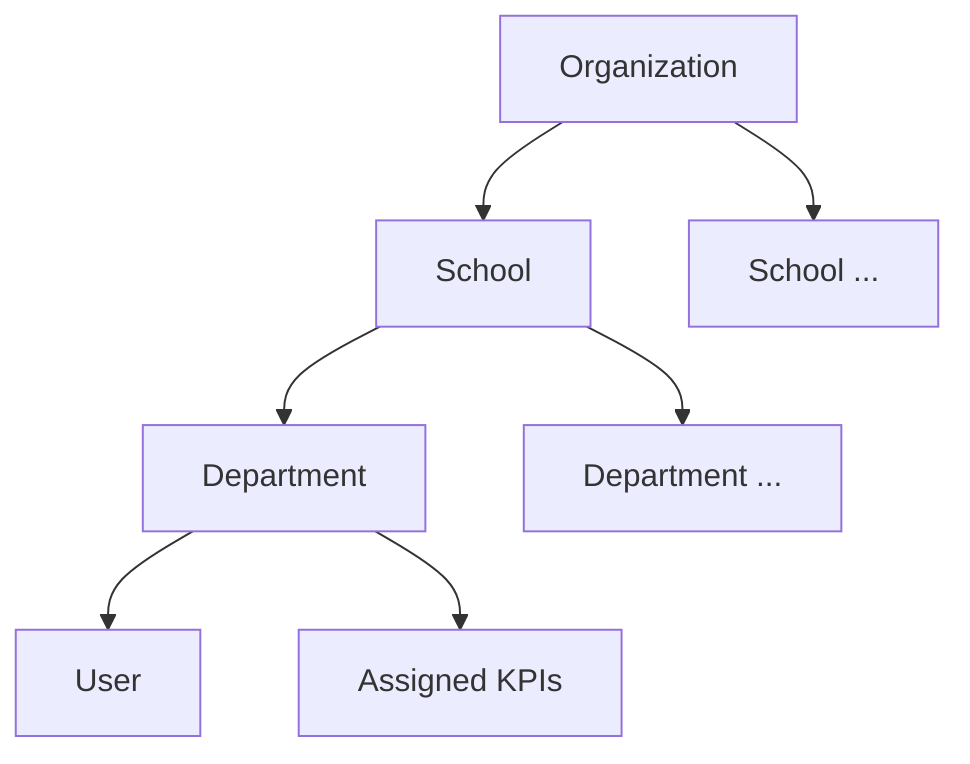

Each School is an isolated data boundary except for SuperAdmin (global) and Viewer (multi-school grant). Schools cannot see one another's data by default.

## 14. Department Hierarchy

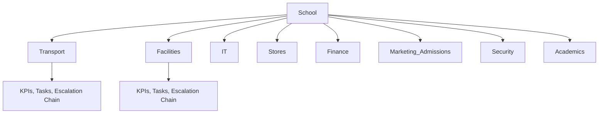

Default departments are created automatically at School Creation (BR-03) from a Master Data template (Section 35) and may be extended per school.

## 15. Business Glossary

| Term | Definition |
|---|---|
| KRA | Key Result Area — a governance category (e.g., "Fleet Safety") grouping related KPIs. |
| KPI | Key Performance Indicator — a measurable target belonging to exactly one KRA (BR-06). |
| Observation | A single captured reading/evidence entry against a KPI, made by a Checker. |
| Auto-Result | System-computed evaluation (Met / Not Met / N/A) comparing an Observation's value to the KPI's Target and Comparator. |
| Discrepancy | A formal record raised by an Auditor when an Observation does not match verification evidence. |
| Escalation Matrix | Configurable, ordered chain of users/roles with SLA timers used to escalate unresolved tasks or discrepancies. |
| Primary Owner | A user assigned direct accountability for a Task; multiple Primary Owners may exist per task (BR-09). |
| ETA | Estimated Time of Arrival/completion for a Task; extendable up to three times (BR-10). |
| Scorecard | An immutable, versioned, auto-generated performance summary for a user or department over a cycle. |
| Lock Period | Configurable duration after which an Observation becomes immutable. |
| Global KPI Library | The single, centrally governed catalogue of all KPIs across the organization (BR-04). |
| Grace Period | Configurable duration after a KPI's due date during which a Checker may still submit an Observation without Admin intervention (BR-26, Section 24.16). |
| Compliance Status | Field on a compliance record's shell (Open, Late-Submittable, Closed-Missed, Submitted) tracking its submission lifecycle, distinct from Observation-level Auto-Result/RAG (Section 37.6). |
| Discrepancy Category | Master Data entity governing which Approval Chain (Section 54) a Discrepancy follows; assigned at creation and immutable thereafter (BR-21). |
| Approval Chain vs. Approval Level | Not synonyms — an **Approval Chain** is the configured object (Master Data, Section 54) for a Discrepancy Category; an **Approval Level** is a single numbered step within a chain (Section 26). |
| Holiday Calendar / Working Days | Organization/School-scoped Master Data defining non-working dates and the days of the week a School (or a specific KPI) operates on; drives compliance-cycle generation (BR-22, Section 23.17). |
| Asset Status | Phase 1 minimal lifecycle field on an Asset (Active/Retired) governing future assignability without hard-deleting historical references (BR-23, Section 35.15). |
| Evidence Retention Period / Archive Tier | The configurable duration evidence files are retained before becoming eligible for deletion, and the storage tier (Active/Archived) files move to after a configurable threshold (BR-27, Section 47). |
| Duplicate Detection Window | Configurable time window within which a second Observation for the same logical occurrence is treated as a potential duplicate and blocked pending Override (BR-25, Section 24.16). |
| Compliance Scheduler | The background service that generates recurring KPI compliance records automatically, idempotently, and timezone-aware (BR-24, Section 23.16). |

## 16. Risks

| Risk | Impact | Mitigation |
|---|---|---|
| Low adoption among ground staff (Checkers) | Compliance data gaps | Role-specific training, vernacular UI, in-app champion model |
| Missing/incomplete data at capture time | Broken Auto-Result computation | Mandatory-field validation (Section 52) |
| Network dependency (no offline mode, BR-16/C7) | Data loss risk at low-connectivity sites | Client-side retry/resubmit pattern; connectivity requirement communicated at rollout |
| ERP dependency for future master data | Duplicate/conflicting user & department records | REST API layer and clear master-data ownership boundary (BR-19, Section 40) |
| Scope creep toward Phase 2/3 modules | Delayed Phase 1 delivery | Explicit Out-of-Scope list (Section 6.2), Feature Flags (Section 54) |
| Sensitive/financial KPI exposure | Privacy/compliance violation (DPDP Act) | Category-level permission overrides, encryption in transit/at rest (Section 41) |
| Scorecard/versioning misuse | Loss of trust in performance data if edited | Strict immutability enforcement at the data layer, not just UI (BR-14) |

## 17. Stakeholder Decisions Required Before Phase 1 Sign-off

*Every item below requires input from business/product stakeholders — not engineering — because each has more than one defensible answer and materially affects scope, cost, or compliance posture. All items previously raised that had a single correct implementation answer have been resolved and incorporated into the specification (Sections 9, 12, 23–26, 35, 37, 41, 46–47, 50, 54, 57) rather than left open here.*

| # | Decision | Why it can't be resolved in-spec | Recommendation on file |
|---|---|---|---|
| D1 | Marketing/Telecaller KPIs: stay on this platform or integrate with a separate CRM? | Depends on whether a CRM procurement decision has already been made elsewhere in the organization. | Keep in-platform initially; future CRM syncs performance data rather than duplicating KPIs. |
| D2 | Notification channel approval: which events get SMS/WhatsApp, and is the associated per-message cost approved? | Budget/vendor decision, not a product design question. | Start with In-App + Email; add SMS/WhatsApp per event once cost is approved. |
| D3 | Minimum viable Global KPI Library taxonomy for schools without a supplied role manual. | Requires domain input from KPI-manual owners; blocks data migration if unresolved. | Finalize before development begins — highest-priority item on this list. |
| D4 | Escalation SLA durations: organization-wide defaults vs. per-department overrides. | A governance/operating-model choice, not a technical one. | Organization defaults with department override (already architecturally supported, Section 54) — needs actual SLA numbers. |
| D5 | Performance/scalability targets (concurrent users, Observation volume, availability SLA). | Requires infrastructure stakeholder sign-off and sizing/cost tradeoffs. | Confirm with infra stakeholders before engineering sizing (Section 46). |
| D6 | KPI Amber Tolerance Band: uniform default vs. per-category (e.g., 0% for Safety KPIs). | A risk-tolerance policy decision. | Per-category, with Safety at stricter/zero tolerance — needs stakeholder confirmation of exact bands. |
| D7 | Event Time integration matrix: which Event Time Points get genuine Auto-Capture at go-live vs. Manual-only in Phase 1, and which (if any) are Auto-Capture-only with no Manual fallback. | Depends on vendor/hardware procurement timeline, outside this PRS's scope. | Decide before development — drives architecture (Section 24.14). |
| D8 | Should individual KPI ownership exist beyond Department-level assignment? | Introducing individual ownership is a data-model and accountability-policy decision, not a gap-fill. | Recommend deferring — Department-level assignment plus User→Department transfer history (FR-025) gives adequate accountability tracing for Phase 1. |
| D9 | Should Asset Lifecycle expand beyond the Phase 1 minimal Active/Retired status (Section 35.15)? | Scope/roadmap tradeoff, not a technical gap. | Recommend keeping full Asset Management in Phase 3 as planned; the Phase 1 minimal status is sufficient for Event Time scoping safety. |

**Resolved and removed from this section:** lock period, ETA extension duration, self-service registration phasing, dashboard refresh cadence, and all seven gap-analysis items (approval chains, holiday calendar, asset status, scheduler behavior, duplicate prevention, grace period, evidence retention) are now fully specified in Sections 9, 12, 23–26, 35, 37, 41, 46–47, 50, 54, 57 and require no further stakeholder input.

---

# PART 2 — FUNCTIONAL SPECIFICATION

> **Module Template.** Every module below follows: Purpose · Business Context · Actors · Workflow · Business Rules · Validations · Permissions · Notifications · Audit Logs · Reports · Acceptance Criteria · Edge Cases · Future Enhancements · Functional Requirements.

## 18. School Management

### 18.1 Purpose
Manage the top-level tenant boundary of the platform. Every data record ultimately belongs to exactly one School.

### 18.2 Business Context
Schools are the primary data-isolation unit. Creation is centrally controlled in Phase 1 (BR-03) to ensure consistent default configuration and KPI library seeding.

### 18.3 Actors
SuperAdmin (creator/owner), Admin (school-scoped operator).

### 18.4 Workflow

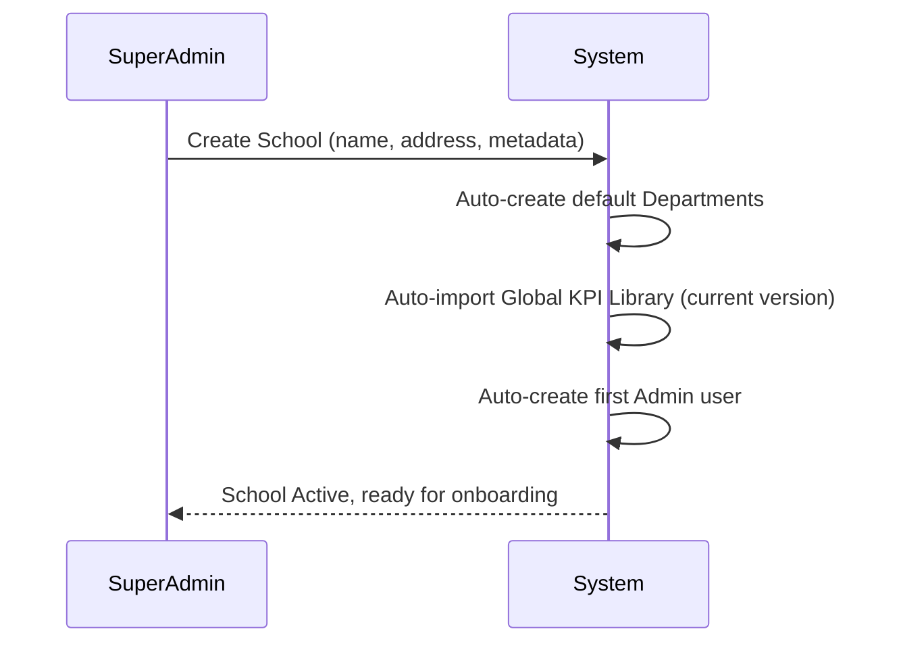

### 18.5 Business Rules
- BR-01, BR-03, BR-04 apply directly.
- A School cannot be deleted; it can only be Deactivated (soft state), preserving all historical data.
- School status: `Active`, `Inactive`, `Pending Onboarding`.

### 18.6 Validations
- School Name unique within the organization.
- At least one Admin must exist per Active school.
- School cannot be marked Active until default departments and KPI library import complete successfully.

### 18.7 Permissions
Create/Deactivate: SuperAdmin only. View: SuperAdmin (all), Admin/Viewer (own/granted scope only).

### 18.8 Notifications
School Created → notify assigned first Admin (Informational, Section 49).

### 18.9 Audit Logs
School Created, School Updated, School Deactivated, KPI Library Import Snapshot ID.

### 18.10 Reports
School Onboarding Status, School Comparison Report (Section 50).

### 18.11 Acceptance Criteria
- School creation atomically creates departments + imports KPI library + creates first Admin, or the entire operation rolls back.
- A deactivated school's data remains read-only and reportable.

### 18.12 Edge Cases
- Global KPI Library update occurs mid-onboarding: school still receives the version that was current at the moment of School Creation initiation (BR-05 traceability).
- Duplicate school name submitted concurrently: second request rejected with conflict error (Section 53).

### 18.13 Future Enhancements
Self-service registration with approval workflow (BR-03 future phase); multi-tenant billing hooks.

### 18.14 Functional Requirements

| ID | Requirement |
|---|---|
| FR-001 | The system SHALL restrict School creation to users holding the SuperAdmin role. |
| FR-002 | The system SHALL automatically create default Departments upon School creation, sourced from Master Data templates (Section 35). |
| FR-003 | The system SHALL automatically import the current version of the Global KPI Library into a newly created School. |
| FR-004 | The system SHALL automatically create a first Admin user as part of School creation. |
| FR-005 | The system SHALL enforce uniqueness of School Name within the organization. |
| FR-006 | The system SHALL treat School creation as an atomic operation; partial failure SHALL roll back all changes. |
| FR-007 | The system SHALL prevent hard deletion of a School; only Deactivation SHALL be permitted. |
| FR-008 | The system SHALL retain full historical data of a Deactivated School in read-only state. |
| FR-009 | The system SHALL log School Created, Updated, and Deactivated events to the Audit Log. |
| FR-010 | The system SHALL record the KPI Library version snapshot imported at School creation for traceability. |

## 19. Department Management

### 19.1 Purpose
Manage organizational sub-units within a School to which users, KPIs, tasks, and escalation chains are scoped.

### 19.2 Business Context
Departments are the primary scoping unit for Admins, Checkers, Auditors, and KPI assignment. Default departments are seeded at School creation; Admin may add further departments.

### 19.3 Actors
SuperAdmin, Admin (school/department-scoped).

### 19.4 Workflow
Create Department → Assign Department Head (Admin, department-scoped) → Assign KPIs (Section 23) → Assign Users (Section 20) → Configure Escalation Chain (Section 26).

### 19.5 Business Rules
- A Department belongs to exactly one School.
- BR-07: on employee transfer, current assignment updates; historical records remain attributed to the prior department.
- Departments cannot be deleted once they have historical Observation/Task records; they may only be Archived (BR-18).

### 19.6 Validations
Department Name unique within a School. Department cannot be archived while active Tasks or unresolved Discrepancies exist.

### 19.7 Permissions
Create/Edit: SuperAdmin (any school), Admin (own school). View: scoped per Section 12.

### 19.8 Notifications
Department Created → notify assigned Department Head.

### 19.9 Audit Logs
Department Created, Updated, Archived; Department Head reassignment.

### 19.10 Reports
Department Comparison Report, Department Scorecard (Section 50).

### 19.11 Acceptance Criteria
- Archiving a department with open Tasks/Discrepancies is blocked with a clear validation error.
- Transferring an employee out of a department does not alter historical records tied to that department.

### 19.12 Edge Cases
- Department merge/split is not supported in Phase 1; must be handled via Archive + Create new + manual data mapping.

### 19.13 Future Enhancements
Department hierarchy (sub-departments); department-level budget/cost-center linkage.

### 19.14 Functional Requirements

| ID | Requirement |
|---|---|
| FR-011 | The system SHALL scope every Department to exactly one School. |
| FR-012 | The system SHALL enforce Department Name uniqueness within a School. |
| FR-013 | The system SHALL prevent Department deletion where historical Observation or Task records exist; Archive SHALL be offered instead. |
| FR-014 | The system SHALL block Department archival while open Tasks or unresolved Discrepancies exist. |
| FR-015 | The system SHALL preserve historical record attribution to the originating Department upon employee transfer (BR-07). |
| FR-016 | The system SHALL update a transferred employee's current Department assignment without altering historical records. |
| FR-017 | The system SHALL log Department Created, Updated, Archived, and Department Head Reassigned events. |
| FR-018 | The system SHALL allow Admin to create additional Departments beyond the auto-created defaults, scoped to their own School. |

## 20. User Management

### 20.1 Purpose
Manage user identity, school/department scope, role assignment, and lifecycle (onboarding through archival).

### 20.2 Business Context
Users map real job titles to one or more system roles within a single school (except SuperAdmin/Viewer per BR-01). Users are never deleted (BR-08).

### 20.3 Actors
SuperAdmin, Admin.

### 20.4 Workflow

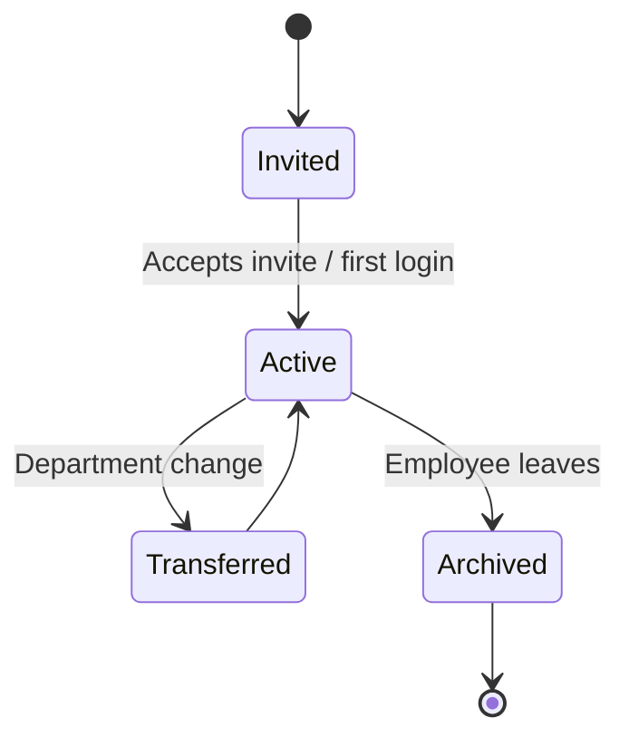

### 20.5 Business Rules
BR-01, BR-02, BR-07, BR-08 apply directly. A non-SuperAdmin/Viewer user cannot be assigned to more than one School at any time.

### 20.6 Validations
Email/phone unique per user. At least one role required per user. Role combinations must be valid per Section 21.5 (e.g., a user cannot be simultaneously the sole Auditor and sole Checker verifying their own observation on the same KPI — see Edge Cases).

### 20.7 Permissions
Create/Edit/Archive: SuperAdmin (any), Admin (own school). Self-service profile edit: all authenticated users (limited fields).

### 20.8 Notifications
User Invited, Role Changed, Account Archived — Informational priority (Section 49) except Role Changed (also Task Assignment-adjacent if roles affect active task ownership).

### 20.9 Audit Logs
User Created, Updated, Role Changed, Department Transferred, Archived, Login, Logout.

### 20.10 Reports
User Productivity Report, User Performance Report (Section 50).

### 20.11 Acceptance Criteria
- Archiving a user disables login immediately while preserving all historical audit trail entries indefinitely.
- A user with multiple roles sees a unified dashboard reflecting the union of role-based views.

### 20.12 Edge Cases
- Same user is both Checker and Auditor for a department: the system SHALL prevent that user from auditing their own submitted observation (self-audit conflict rule, Section 25.5).
- User transferred mid-open-task: task ownership review triggered (Section 27.12).

### 20.13 Future Enhancements
Self-service password reset via SSO; directory sync from ERP once ERP becomes master for Users (BR-19, Phase 3).

### 20.14 Functional Requirements

| ID | Requirement |
|---|---|
| FR-019 | The system SHALL restrict a non-SuperAdmin, non-Viewer user to exactly one School. |
| FR-020 | The system SHALL allow a Viewer to be granted access to multiple Schools. |
| FR-021 | The system SHALL never permit hard deletion of a User record. |
| FR-022 | The system SHALL disable login immediately upon User archival while retaining full audit history. |
| FR-023 | The system SHALL support assignment of multiple concurrent Roles to a single User within their School. |
| FR-024 | The system SHALL enforce uniqueness of email and phone number per User account. |
| FR-025 | The system SHALL update a User's current Department on transfer while preserving historical attribution (BR-07). |
| FR-026 | The system SHALL prevent a User from auditing (verifying) an Observation they themselves submitted as Checker. |
| FR-027 | The system SHALL log all authentication events (Login, Logout, failed attempts) to the Audit Log. |
| FR-028 | The system SHALL notify a User upon invitation, role change, and archival. |
| FR-029 | The system SHALL require at least one active Role per User. |
| FR-030 | The system SHALL allow Admin to manage Users only within their own School scope. |

## 21. Role Management

### 21.1 Purpose
Define and govern the five system roles and their permitted combinations.

### 21.2 Business Context
Roles are permission templates, not job titles. Job titles map to one or more roles (BR-02, Section 11).

### 21.3 Actors
SuperAdmin.

### 21.4 Workflow
SuperAdmin defines role → permission mappings (system-level, not editable by Admin in Phase 1) → Admin assigns roles to Users within their School.

### 21.5 Business Rules
Role permission templates are fixed system configuration in Phase 1 (not customizable per school). Multiple roles per user are additive (union of permissions), except where a conflict rule (Section 20.12) explicitly restricts a combination.

### 21.6 Validations
Role assignment must reference a valid, active System Role. Conflict rules evaluated at assignment time and at transaction time (e.g., self-audit block).

### 21.7 Permissions
Role template management: SuperAdmin only. Role assignment to Users: SuperAdmin, Admin (own school).

### 21.8 Notifications
Role Assigned/Removed → Informational to affected user.

### 21.9 Audit Logs
Role Template Changed (SuperAdmin only), Role Assigned, Role Removed.

### 21.10 Reports
Role Distribution Report (users per role, per school).

### 21.11 Acceptance Criteria
Assigning a conflicting role combination (Section 20.12) is blocked with a descriptive validation error at assignment time.

### 21.12 Edge Cases
Removing a user's last role: blocked, since FR-029 requires at least one active role.

### 21.13 Future Enhancements
School-customizable role templates (Phase 2); custom/fine-grained permission bundles.

### 21.14 Functional Requirements

| ID | Requirement |
|---|---|
| FR-031 | The system SHALL define exactly five system roles: SuperAdmin, Admin, Checker, Auditor, Viewer. |
| FR-032 | The system SHALL restrict Role Template modification to SuperAdmin in Phase 1. |
| FR-033 | The system SHALL allow Admin to assign/remove Roles for Users within their own School. |
| FR-034 | The system SHALL treat multiple roles held by one User as additive permissions. |
| FR-035 | The system SHALL block role combinations that create a self-audit conflict (FR-026). |
| FR-036 | The system SHALL require every User to retain at least one active Role at all times. |
| FR-037 | The system SHALL log every Role assignment and removal event. |
| FR-038 | The system SHALL notify a User when their Role assignment changes. |

## 22. KRA Management

### 22.1 Purpose
Manage Key Result Areas — the governance categories that group related KPIs.

### 22.2 Business Context
KRAs are the top level of the compliance taxonomy (e.g., "Fleet Safety," "Statutory Compliance"), owned centrally within the Global KPI Library.

### 22.3 Actors
SuperAdmin.

### 22.4 Workflow
SuperAdmin creates/edits KRA → KRA published to Global KPI Library → KPIs created under the KRA (Section 23) → KRA + KPIs propagate to schools per BR-04.

### 22.5 Business Rules
BR-04, BR-06 apply directly. A KRA cannot be deleted once it has one or more KPIs with historical Observations; it may only be Deprecated.

### 22.6 Validations
KRA Name unique within the Global KPI Library. A Deprecated KRA cannot have new KPIs added.

### 22.7 Permissions
Create/Edit/Deprecate: SuperAdmin only. View: all roles (read access to KRA taxonomy).

### 22.8 Notifications
KRA Published/Deprecated → Informational, broadcast to all Admins.

### 22.9 Audit Logs
KRA Created, Updated, Deprecated.

### 22.10 Reports
KRA Coverage Report (KPIs per KRA, per department).

### 22.11 Acceptance Criteria
A Deprecated KRA and its KPIs remain visible in historical reports but cannot accept new Observations.

### 22.12 Edge Cases
Attempting to delete a KRA with linked KPIs is blocked; Deprecate is offered instead.

### 22.13 Future Enhancements
School-specific KRA extensions (Phase 2, pending Q5 resolution).

### 22.14 Functional Requirements

| ID | Requirement |
|---|---|
| FR-039 | The system SHALL restrict KRA creation and modification to SuperAdmin. |
| FR-040 | The system SHALL enforce KRA Name uniqueness within the Global KPI Library. |
| FR-041 | The system SHALL prevent KRA deletion where linked KPIs have historical Observations; Deprecation SHALL be offered instead. |
| FR-042 | The system SHALL prevent new KPI creation under a Deprecated KRA. |
| FR-043 | The system SHALL make the KRA taxonomy read-visible to all system roles. |
| FR-044 | The system SHALL log KRA Created, Updated, and Deprecated events. |
| FR-045 | The system SHALL retain Deprecated KRAs and their KPIs in historical reporting. |
| FR-046 | The system SHALL broadcast KRA publication/deprecation notifications to all Admins. |

## 23. KPI Management

### 23.1 Purpose
Manage Key Performance Indicators — the versioned, measurable units against which Observations are captured.

### 23.2 Business Context
KPIs are the operational heart of the platform. Each carries a Target Value, Comparator, Unit of Measure, and Frequency, and belongs to exactly one KRA (BR-06). KPIs are version-controlled (BR-05) so historical reports remain accurate.

### 23.3 Actors
SuperAdmin (owns Global KPI Library), Admin (assigns KPIs to department within school scope).

### 23.4 Workflow

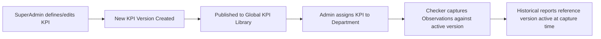

### 23.5 Business Rules
- BR-04, BR-05, BR-06 apply directly.
- Editing a Target, Comparator, or Unit creates a **new KPI version**; it does not overwrite the prior version.
- A KPI version becomes immutable once at least one Observation references it.

### 23.6 Validations
Target Value numeric; Comparator ∈ {≥, ≤, =, <, >}; Unit of Measure required. Frequency ∈ {Daily, Weekly, Monthly, Quarterly, Half-Yearly, Annually, Times-per-day, Ad-hoc/Event-triggered}. KPI must reference exactly one existing, non-Deprecated KRA. Capture Type ∈ {Value Reading, Event Time, Value + Event Time} (Section 24.14); a KPI configured as Event Time or Value + Event Time SHALL define one or more named Event Time Points (e.g., Departure Time, Return Time, Check-In Time, Check-Out Time, Cleaning Time) at creation, and Target Value/Comparator are optional for KPIs configured as Event Time only (timeliness, not a threshold value, is what is being governed).

A KPI's Frequency configuration MAY include a Working Days override (defaults to the School's Working Days) and a Non-Working-Day Policy (Skip / Shift Forward / Shift Backward), applicable when Frequency is Daily, Weekly, or Times-per-day.

### 23.7 Permissions
Create/Edit (new version): SuperAdmin only. Assign to Department: SuperAdmin, Admin (own school). View: all roles.

### 23.8 Notifications
KPI Version Published → Informational to Admins of departments where the KPI is assigned.

### 23.9 Audit Logs
KPI Created, New Version Published, Assigned to Department, Deprecated.

### 23.10 Reports
KPI Performance Report, KPI Trend Report (Section 50).

### 23.11 Acceptance Criteria
- Creating a new KPI version never mutates a prior version referenced by existing Observations.
- Reports for a past period always resolve to the KPI version active during that period, never the current version.

### 23.12 Edge Cases
- A KPI is edited while an Observation is in-flight (not yet submitted): the in-flight submission SHALL bind to the version that was active when data entry began.
- A KPI's Frequency changes mid-cycle: the change applies from the next cycle only; the current cycle completes under the prior Frequency.
- A holiday is added retroactively (after a compliance cycle already generated a due record for that date): the already-generated record is **not** retracted; the Non-Working-Day Policy applies only to *future* generation runs from the point the holiday was added.
- School has no Holiday Calendar configured at all: the system falls back to the organization-level default calendar; if that's also empty, all days are treated as working days (fail-open, not fail-closed).
- Overlapping scheduler runs: a database-level uniqueness constraint on (KPI Version, Scope, Due Date) rejects the duplicate generation attempt silently at the data layer; this is expected behavior, not an alertable error.
- A KPI is Deprecated between scheduled generation and actual scheduler run: no new compliance record is generated for a Deprecated KPI, even during backfill.

### 23.13 Future Enhancements
Weighted KPI scoring (Phase 2, per BR/Scope Section 6.2).

### 23.14 KPI Calculation Rules

**Formula types**
- **Threshold comparison** (Phase 1, only supported formula type): Auto-Result = Pass if the Observation Value satisfies the KPI's Comparator against Target Value (e.g., ≥, ≤, =, <, >).
- **Weighted scoring** is explicitly out of scope for Phase 1 (Section 57.2). This subsection governs Phase 1 threshold-only calculation.

**Rounding rules**
- Numeric Observation Values are stored at full precision as captured; no rounding occurs at capture.
- Displayed/reported values round to 2 decimal places using standard round-half-up.
- Comparator evaluation (Pass/Fail) always uses the full-precision stored value, never the rounded display value, to prevent boundary misclassification.

**Missing data handling**
- A KPI whose due date passes with no Observation submitted is classified **Not Submitted** — distinct from Fail — and is excluded from the Pass/Fail ratio used in Scorecards, but is counted separately in the Compliance Report and Overdue KPI Report (Section 50).
- **Not Submitted** SHALL NOT default to Pass or Fail in any calculation; it must remain visually and numerically distinct wherever KPI performance is aggregated (dashboards, scorecards, reports).
- A late-but-submitted Observation (Section 24) is scored normally against the Comparator and separately flagged as Late.

**RAG (Red/Amber/Green) thresholds**

| Status | Condition |
|---|---|
| Green | KPI meets or exceeds Target per Comparator, submitted on time |
| Amber | KPI meets Target but was Late, OR falls within a configurable tolerance band of Target Value without meeting the strict Comparator |
| Red | KPI fails Comparator, or is Not Submitted |

- The Amber tolerance band is a Configuration Management item (Section 54: "KPI Amber Tolerance Band"), default 10%, configurable per KPI category by SuperAdmin.
- RAG status is computed at the individual Observation level and rolled up to Scorecards using worst-status-wins aggregation in Phase 1 (a Department Scorecard shows Red if any constituent KPI is Red). Weighted aggregation is Phase 2.

**Open item:** whether the Amber tolerance band should be uniform (10% default) or vary by KPI category (e.g., safety-related KPIs may require Amber = 0%, strict pass/fail only) — to be confirmed with KPI-manual owners before sign-off (Section 17, D6).

**Relationship to Not Submitted.** "Not Submitted" is the RAG/Scorecard-level classification applied once a due date passes with no Observation. BR-26 governs a separate, operational question layered on top: for how long, and under what conditions, a Checker may still act on a Not Submitted record. Not Submitted status doesn't change when the Grace Period elapses — what changes is whether the record accepts a new Observation without Admin intervention.

### 23.15 Functional Requirements

| ID | Requirement |
|---|---|
| FR-047 | The system SHALL restrict Global KPI Library modification to SuperAdmin. |
| FR-048 | The system SHALL enforce that every KPI belongs to exactly one KRA. |
| FR-049 | The system SHALL create a new immutable KPI version whenever Target Value, Comparator, or Unit of Measure is edited. |
| FR-050 | The system SHALL never overwrite a KPI version that has one or more linked Observations. |
| FR-051 | The system SHALL resolve historical reports to the KPI version active during the reporting period. |
| FR-052 | The system SHALL support KPI Comparators of ≥, ≤, =, <, and >. |
| FR-053 | The system SHALL support KPI Frequencies of Daily, Weekly, Monthly, Quarterly, Half-Yearly, Annually, Times-per-day, and Ad-hoc/Event-triggered. |
| FR-054 | The system SHALL prevent Admins from creating school-specific KPI libraries. |
| FR-055 | The system SHALL allow Admin to assign existing Global KPIs to Departments within their own School. |
| FR-056 | The system SHALL bind an in-flight Observation to the KPI version active when data entry began. |
| FR-175 | The system SHALL classify a KPI with no Observation submitted by its due date as Not Submitted, distinct from Fail, and SHALL exclude Not Submitted results from the Pass/Fail ratio used in Scorecards. |
| FR-176 | The system SHALL evaluate KPI Comparator results against the full-precision stored Observation Value, not the rounded display value. |
| FR-177 | The system SHALL compute RAG (Red/Amber/Green) status per Observation using a configurable Amber tolerance band, and roll up Scorecard RAG status using worst-status-wins aggregation in Phase 1. |
| FR-057 | The system SHALL apply a Frequency change starting from the next compliance cycle, not the current one. |
| FR-058 | The system SHALL support bulk import of an initial KPI catalogue via a structured CSV/Excel template. |
| FR-059 | The system SHALL log every KPI version creation, publication, assignment, and deprecation event. |
| FR-060 | The system SHALL make the current and historical KPI versions viewable by all roles with appropriate scope. |
| FR-178 | The system SHALL support a KPI Capture Type of Value Reading, Event Time, or Value + Event Time, and SHALL require at least one named Event Time Point to be defined at KPI creation whenever Capture Type is Event Time or Value + Event Time (Section 24.14). |
| FR-238 | The system SHALL maintain an Organization Holiday Calendar as School-scoped Master Data, with an organization-level default set that Schools inherit and may override/extend. |
| FR-239 | The system SHALL maintain a Working Days setting per School (default) and, optionally, per KPI (override). |
| FR-240 | The system SHALL apply a configurable Non-Working-Day Policy (Skip, Shift Forward, Shift Backward) when a KPI's computed due date falls on a non-working day, per Section 23.17. |
| FR-241 | The system SHALL make a KPI's Non-Working-Day Policy immutable once set, consistent with KPI versioning (Section 23.5) — changing it creates a new KPI version. |
| FR-242 | The system SHALL never generate more than one compliance record for a single logical occurrence, regardless of how many consecutive non-working days precede or follow it. |
| FR-243 | The system SHALL log all Holiday Calendar changes (Created, Updated, Deprecated) to the Audit Log, distinguishing organization-level changes from school-level overrides. |
| FR-250 | The system SHALL generate recurring KPI compliance records via an automated background scheduler, not on first user access. |
| FR-251 | The system SHALL compute compliance-cycle due dates and boundaries using each School's configured timezone. |
| FR-252 | The system SHALL ensure scheduler idempotency: no logical occurrence SHALL ever be generated more than once, across retries, backfills, or overlapping runs. |
| FR-253 | The system SHALL detect missed scheduler executions and backfill all missed occurrences on the next successful run, preserving each occurrence's original due date. |
| FR-254 | The system SHALL begin compliance-cycle generation for a newly created School from the next full cycle boundary following its KPI Library import. |
| FR-255 | The system SHALL log every scheduler run (success/failure, records generated, records backfilled) to the Audit Log, distinct from per-record lifecycle logging. |

### 23.16 Compliance Cycle Generation (Scheduler)

**Purpose.** Defines how and when the next instance of a recurring KPI's compliance record comes into existence. This is a business-behavior specification, not a purely infrastructural one — its outcomes directly determine due dates, Overdue status, Late flags, and everything downstream in Compliance Reports and Scorecards.

**Generation trigger.** A background scheduler process runs on a fixed interval and, for every Active KPI assignment, determines whether the next occurrence's due date has arrived and no record yet exists for it. Records are never generated lazily at first user access.

**Timezone.** Generation SHALL compute cycle boundaries using the School's configured timezone (Section 37.1), not server-local time or UTC.

**Idempotency.** Each generation run SHALL check for an existing record matching the same logical occurrence (KPI version + scope + due date) before creating one. This is a stronger, cycle-generation-level counterpart to the existing submission-level idempotency for Observations (FR-069).

**Failure recovery / backfill.** If the scheduler fails to run for a period, the next successful run SHALL detect and generate all missed occurrences since the last successful run, each dated to its correct original due date.

**New School onboarding.** A School created mid-cycle begins compliance-cycle generation from the next full cycle boundary following its KPI Library import (Section 18.4), consistent with the "Frequency change applies from next cycle" precedent (Section 23.12).

**Holiday/Working-Day interaction.** See Section 23.17 — generation defers to the Non-Working-Day Policy when a computed due date falls on a non-working day.

**Audit.** Every scheduler run — successful or failed, including counts of records generated and backfilled — SHALL be logged, distinct from per-record Audit Log entries.

### 23.17 Compliance Cycle & Holiday Interaction

When generating the next compliance-cycle instance for a KPI (Section 23.16 Scheduler), the system SHALL check the target due date against the applicable Working Days calendar (KPI-level override, else School default) and the Organization Holiday Calendar (School-scoped, inheriting organization defaults). If the due date falls on a non-working day:
- **Skip** — no compliance record is generated for that occurrence; the next occurrence proceeds per normal Frequency from the following working day.
- **Shift Forward** — the due date moves to the next working day; only one record is generated, not one per skipped day.
- **Shift Backward** — the due date moves to the preceding working day (used where "must complete before the holiday" matters, e.g., pre-holiday safety checks).

The policy is set per KPI at creation (default: Skip) and is immutable for a given KPI version, consistent with the versioning philosophy of Section 23.5.

## 24. Observation Capture

### 24.1 Purpose
Capture operational readings and evidence against assigned KPIs.

### 24.2 Business Context
Checkers record readings (fuel, odometer, temperature, attendance, inventory count, photos, pressure, meter reading, etc.) against KPIs. Checkers never edit business records (BR-11); they only add Observations.

Some KPIs govern *when* an operational event happened rather than, or in addition to, a numeric/status value — for example: bus departure time and return time per route/vehicle, floor-wise washroom/facility cleaning time, and staff or student check-in/check-out time. For these, the Observation captures one or more Event Times against the KPI's defined Event Time Points (Section 23.6), in addition to any Value. Section 24.14 defines how Event Time is captured, automatically or manually, and the governance applied to each mode.

### 24.3 Actors
Checker (creates), Auditor (reads/verifies), Admin (reads).

### 24.4 Workflow

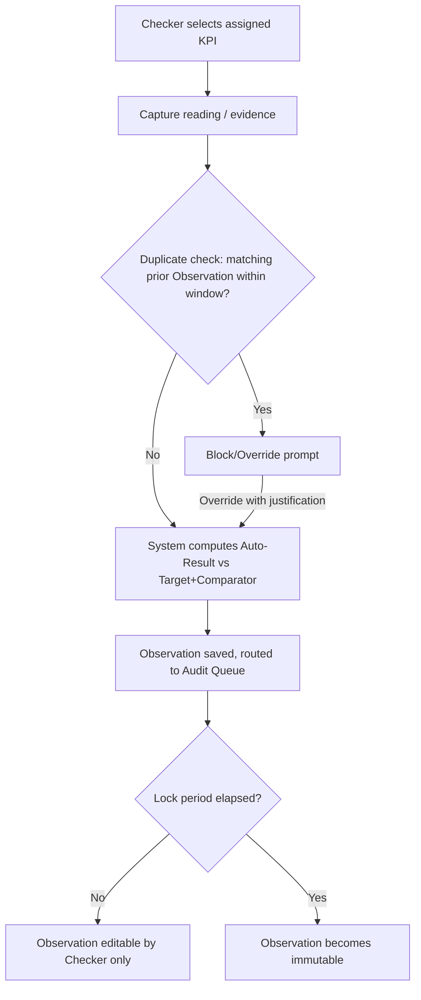

Insert a duplicate-check decision point between "Capture reading / evidence" and "System computes Auto-Result": if a matching prior Observation exists within the window, the flow branches to a Block/Override prompt before proceeding to Auto-Result computation; otherwise it proceeds unchanged.

### 24.5 Business Rules
- BR-11, BR-20, BR-25, BR-26 apply directly.
- Auto-Result is computed automatically wherever a numeric value is captured; for status-only KPIs (Followed/Not Followed), Auto-Result mirrors the status.
- After the configurable lock period, the Observation is immutable to everyone, including the Checker; corrections require a new Observation entry with a reference to the original.
- Duplicate detection operates independently of, and in addition to, submission-idempotency (FR-069), which only catches retries of the *same* submission attempt. BR-25 catches a Checker submitting a *second, distinct* Observation for an occurrence already recorded.
- The Duplicate Detection Window is a Configuration Management item (Section 54), defaulting to a value appropriate to the KPI's Frequency.
- The Grace Period is independent of the existing Observation Lock Period (Section 24.5/BR-11) — Lock Period governs immutability *after* successful submission; Grace Period governs whether a submission is accepted *before* it exists at all.

### 24.6 Validations
Value required and must match the KPI's Unit type. Photo evidence, where required by KPI configuration, must validate format/size (Section 41 File Management extension). Observation cannot be submitted against a Deprecated KPI version.

Before an Observation is accepted, the system checks for an existing Observation on the same KPI version + scope + Event Time Point (if applicable) + Checker, submitted within the configured Duplicate Detection Window. If a match is found: the submission is blocked and the Checker is shown the prior Observation's summary, with an option to cancel or proceed with Override. Override requires: (a) the submitting user holds Override permission (Section 12), and (b) a mandatory free-text justification is entered before the Observation is accepted.

### 24.7 Permissions
Create: Checker (assigned scope only). View: Checker (own), Auditor (assigned scope), Admin (department scope), SuperAdmin (all), Viewer (granted scope). Edit: Checker only, before lock period. Override Duplicate Block: Admin, Department Head (scoped) — configurable per School whether Checkers themselves may also hold this permission (Section 54); default is Checkers do **not** have Override. Request Reopen (post-Grace-Period): Checker (own), Admin, Department Head. Approve Reopen: Admin, SuperAdmin (scoped) — single approval level (Phase 1).

### 24.8 Notifications
KPI Reminder (before due), Due Today, Observation Submitted → notify assigned Auditor.

### 24.9 Audit Logs
Observation Created, Edited (pre-lock), Locked, Viewed (for sensitive categories).

### 24.10 Reports
Compliance Report, KPI Trend Report, Overdue KPI Report (Section 50).

### 24.11 Acceptance Criteria
- Observation saves successfully with all mandatory fields validated.
- Photo uploads validate format and size before acceptance.
- Timestamp is recorded server-side, not client-side, to prevent tampering.
- An Audit Log entry is created for every Observation lifecycle event.
- The record becomes immutable automatically after the configured lock period, with no manual override available to Checker or Admin.

### 24.12 Edge Cases
- Checker submits an Observation after the KPI's due window closes: system flags as Late and still computes Auto-Result; it is separately counted in the Overdue KPI Report.
- Network interruption mid-submission: client retries submission; server enforces idempotency using a client-generated submission token to prevent duplicate Observations.
- Two different Checkers (e.g., shift substitute) submit what is genuinely the same event within the window: duplicate check is scoped to same Checker by default, specifically to avoid false-blocking legitimate handoffs; a School MAY configure the check to be Checker-agnostic if stricter control is needed.
- A legitimate correction within the window: handled via Override with justification "Correction" — coexists without conflict with the post-lock correction mechanism (Section 24.5).
- A Reopen Request is submitted but never actioned by an Admin: the record remains in a pending-reopen sub-state indefinitely; it is surfaced on the same Overdue-style reports as other unresolved administrative items.
- Grace Period is changed while records are already mid-window under the old value: in-progress records keep the Grace Period value active at their due-date generation, not the newly changed value (consistent with the Section 23.16/BR-24 determinism precedent).

### 24.13 Future Enhancements
Voice-based observation capture for low-literacy roles; barcode/RFID-assisted asset readings.

### 24.14 Event Time Capture (Auto vs Manual)

**Purpose.** For KPIs with Capture Type Event Time or Value + Event Time (Section 23.6), the Observation records the actual clock time of the operational event itself (e.g., the bus *actually* left, the floor *actually* was cleaned, the person *actually* checked in) — this is distinct from **Submitted At** (Section 37.6), which is the server timestamp of when the Observation record was saved into the system. Event Time and Submitted At MAY differ (e.g., a Checker logs a 7:42 AM bus departure at 7:50 AM), and both are always retained.

**Examples (illustrative, not exhaustive):**

| Scenario | KPI Example | Event Time Point(s) |
|---|---|---|
| Transport | School Bus On-Time Departure/Return | Departure Time, Return Time (per Route/Vehicle) |
| Facility Hygiene | Washroom Cleaning Frequency | Cleaning Time (per Floor/Zone) |
| Attendance | Staff/Student Attendance | Check-In Time, Check-Out Time |

**Capture modes.** Every Event Time Point is captured in one of two modes:

- **Auto-Captured** — the Event Time is derived by the system from an integrated signal at the moment the event occurs, with no manual entry: e.g., GPS/geofence trigger on a tracked vehicle for bus Departure/Return, RFID/biometric/QR scan for Check-In/Check-Out, or an IoT/NFC tag scan for Cleaning Time. Auto-Captured Event Time is treated as authoritative and requires no Reason.
- **Manual Entry** — a Checker enters the Event Time by hand (clock/time picker), used where no automated signal exists, or as an exception fallback when the automated signal is unavailable (device offline, tag not scanned, vehicle tracker fault, etc.). Manual Entry:
  - SHALL require a mandatory **Reason** selected from a configurable enumeration (e.g., "No GPS/tracker signal," "Scanner unavailable," "Entered on behalf of Checker," "Correction — see linked Observation") plus an optional free-text note.
  - SHALL be visually and reportably distinguished from Auto-Captured entries (Time Capture Mode field, Section 37.6) wherever Event Time is displayed — dashboards, scorecards, and reports never merge the two without indicating which was used.
  - SHALL be permitted only where the KPI configuration (Section 23) allows Manual Entry as a fallback for that Event Time Point; a KPI MAY be configured to require Auto-Captured only, with no Manual fallback, for safety-critical events (subject to the school's Configuration Management settings, Section 54).

**Per-location/asset scoping.** Where an Event Time Point is tracked per sub-unit (e.g., Cleaning Time per Floor, Departure/Return per Vehicle/Route), the Observation SHALL reference the relevant Location and/or Asset record (Section 35, 36, 37.10) so that readings are attributable and reportable at that granularity, not only at KPI level.

**Lateness and RAG.** Where the KPI defines a target time window for an Event Time Point (e.g., "Departure Time ≤ 07:45"), the same Comparator/Target mechanism (Section 23.14) and RAG rollup applies, using the captured Event Time as the value; a Manually Entered Event Time is scored identically to an Auto-Captured one but retains its Manual flag for audit purposes.

**Immutability.** Event Time is subject to the same Observation lock period and immutability rules as any other Observation field (BR-11, Section 24.5); a correction after lock requires a new Observation referencing the original, consistent with Section 24.5.

### 24.15 Functional Requirements

| ID | Requirement |
|---|---|
| FR-061 | The system SHALL restrict Observation creation to users holding the Checker role for their assigned KPI scope. |
| FR-062 | The system SHALL prevent Checkers from editing any business record other than their own Observations. |
| FR-063 | The system SHALL automatically compute Auto-Result (Met/Not Met/N/A) for every Observation carrying a numeric value. |
| FR-064 | The system SHALL make an Observation immutable to all users after its configured lock period elapses. |
| FR-065 | The system SHALL record Observation timestamps using server time, not client-supplied time. |
| FR-066 | The system SHALL validate photo/file evidence format and size before accepting an Observation. |
| FR-067 | The system SHALL prevent Observation submission against a Deprecated KPI version. |
| FR-068 | The system SHALL flag Observations submitted after the KPI's due window as Late while still computing Auto-Result. |
| FR-069 | The system SHALL enforce submission idempotency using a client-generated token to prevent duplicate Observations on retry. |
| FR-070 | The system SHALL notify the assigned Auditor upon Observation submission. |
| FR-071 | The system SHALL send a KPI Reminder notification before the due time and a Due Today notification on the due date. |
| FR-072 | The system SHALL allow Checkers to edit their own Observations only before the lock period elapses. |
| FR-073 | The system SHALL log every Observation lifecycle event (Created, Edited, Locked) to the Audit Log. |
| FR-256 | The system SHALL check every new Observation against existing Observations for the same KPI version, scope, Event Time Point (if applicable), and Checker, within a configurable Duplicate Detection Window, before accepting it. |
| FR-257 | The system SHALL block a duplicate Observation by default, presenting the prior matching Observation's summary to the submitting user. |
| FR-258 | The system SHALL permit submission of a detected duplicate only to a user holding Override permission, and only after a mandatory justification is provided. |
| FR-259 | The system SHALL record the justification, the overriding user, and a reference to the original Observation on any Override-submitted duplicate. |
| FR-260 | The system SHALL treat duplicate-detection independently of submission-token idempotency (FR-069) — both checks apply, addressing different failure modes. |
| FR-261 | The system SHALL make the Duplicate Detection Window configurable, with a default appropriate to the KPI's Frequency (Section 54). |
| FR-262 | The system SHALL log every blocked duplicate attempt and every Override action to the Audit Log. |
| FR-263 | The system SHALL accept a late Observation submission without Admin intervention while the KPI's configured Grace Period has not yet elapsed. |
| FR-264 | The system SHALL transition a compliance record to Closed-Missed once its Grace Period elapses without a submitted Observation. |
| FR-265 | The system SHALL prevent direct Checker submission against a Closed-Missed record. |
| FR-266 | The system SHALL support a Reopen Request workflow (mandatory reason) and require Admin/SuperAdmin approval before a Closed-Missed record accepts a new submission. |
| FR-267 | The system SHALL distinctly flag a post-reopen submission as both Late and Reopened, separate from an ordinary within-Grace-Period Late submission. |
| FR-268 | The system SHALL make the Grace Period configurable, with a default appropriate to the KPI's Frequency. |
| FR-269 | The system SHALL calculate the Grace Period for a backfilled compliance record relative to its original due date, with an outage-duration extension per Section 54 configuration. |
| FR-270 | The system SHALL log every Reopen Request and Approval/Rejection to the Audit Log. |

### 24.16 Grace Period & Late Submission Governance

**Purpose.** Defines the window during which a Checker may still submit an Observation after a KPI's due date has passed, and what happens once that window closes.

**Grace Period.** A configurable duration (Section 54), defaulting to a value appropriate to the KPI's Frequency, starting from the due date/time.

**Within the Grace Period.** The Checker may submit normally. The Observation is accepted, flagged Late (FR-068), and Auto-Result is computed as usual. No Admin action is required.

**After the Grace Period elapses.** The compliance record transitions from Late-Submittable to **Closed-Missed**:
- A Checker can no longer submit directly.
- The Checker (or the record's assigned Auditor/Admin) may request reopening, with a mandatory reason.
- An Admin (school-scoped) or SuperAdmin must approve the reopen request before the record accepts a submission again.
- A reopened-and-then-submitted Observation is flagged both Late and Reopened, distinctly from an ordinary within-window Late submission.

**Interaction with the Scheduler (Section 23.16).** The Grace Period is evaluated relative to the record's original due date, not relative to when the record was backfilled if the scheduler experienced downtime — a backfilled record's Grace Period SHALL be calculated to avoid unfairly penalizing Checkers for a scheduler outage that was not their fault (default: Grace Period extended by the outage duration; configurable, Section 54).
| FR-074 | The system SHALL route every submitted Observation to the appropriate Auditor's Audit Queue. |
| FR-075 | The system SHALL require every Observation to reference exactly one active KPI version (BR-20). |
| FR-179 | The system SHALL capture a distinct Event Time value (Section 37.6) for every Event Time Point defined on a KPI of Capture Type Event Time or Value + Event Time, separate from the Submitted At system timestamp. |
| FR-180 | The system SHALL support Auto-Captured Event Time derived from an integrated signal source (e.g., GPS/geofence, RFID/biometric/QR scan, IoT/NFC tag) without manual entry, where such integration is configured for the KPI. |
| FR-181 | The system SHALL support Manual Entry of Event Time by a Checker where the KPI configuration permits it, either as the primary capture method or as a fallback when an Auto-Captured signal is unavailable. |
| FR-182 | The system SHALL require a Reason, selected from a configurable enumeration, whenever an Event Time is entered via Manual Entry. |
| FR-183 | The system SHALL prevent Manual Entry of Event Time for any Event Time Point configured as Auto-Captured-only. |
| FR-184 | The system SHALL record and persist the Time Capture Mode (Auto-Captured/Manual) for every Event Time value, and SHALL surface this distinction in every dashboard, scorecard, and report that displays Event Time. |
| FR-185 | The system SHALL associate an Event Time Observation with the relevant Location and/or Asset record where the KPI is configured for per-location or per-asset tracking (e.g., per Floor, per Vehicle/Route). |
| FR-186 | The system SHALL evaluate Event Time against the KPI's Target/Comparator (where configured) using the same RAG and lateness rules as value-based Observations (Section 23.14). |
| FR-187 | The system SHALL apply the same lock-period immutability to Event Time fields as to all other Observation fields (BR-11). |
| FR-188 | The system SHALL log the Time Capture Mode and Reason (where Manual) as part of the Observation's Audit Log entry. |

## 25. Audit Management

### 25.1 Purpose
Independently verify Observations for accuracy and integrity without altering the original data.

### 25.2 Business Context
Auditors either Verify an Observation or raise a Discrepancy (Section 26). The original Observation is never modified by an Auditor (BR-12).

### 25.3 Actors
Auditor, Admin (oversight).

### 25.4 Workflow

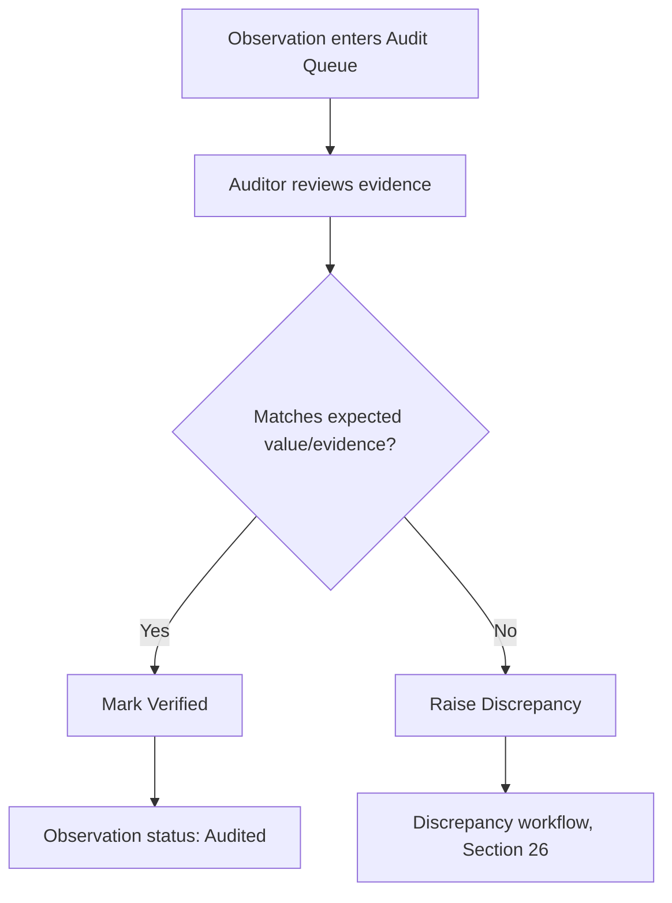

### 25.5 Business Rules
- BR-12 applies directly: Auditors never edit Observations.
- A Checker who submitted an Observation cannot also serve as its Auditor (self-audit conflict, FR-026).
- Every Verify or Discrepancy action is logged with Auditor identity and timestamp; this record is never removable.

### 25.6 Validations
An Observation must be in `Submitted` status to enter the Audit Queue. A Verify or Discrepancy action requires a reason/comment field when overriding an Auto-Result classification.

### 25.7 Permissions
Verify/Raise Discrepancy: Auditor only, within assigned scope. View Audit Queue: Auditor (own queue), Admin (department scope), SuperAdmin (all).

### 25.8 Notifications
Audit Failed → notify Admin and Department Head (High priority, Section 32). Audit Queue Aging reminder → notify Auditor.

### 25.9 Audit Logs
Observation Verified, Discrepancy Raised, Auto-Result Overridden (with reason).

### 25.10 Reports
Pending Audits Report, Audit Report, Average Audit Closure Time.

### 25.11 Acceptance Criteria
- An Auditor cannot submit a Verify/Discrepancy action against an Observation they authored as Checker.
- Every audit action is permanently attributable to the acting Auditor.
- Audit Queue aging is measurable and reportable (Success Metric: < 48 hours average closure).

### 25.12 Edge Cases
- Auditor is reassigned/archived with a non-empty Audit Queue: SuperAdmin/Admin must reassign the queue before the Auditor can be archived (Section 20.11 blocking rule).
- Duplicate audit action submitted concurrently by two sessions of the same Auditor: system enforces optimistic locking, rejecting the second write with a conflict message.

### 25.13 Future Enhancements
AI-assisted anomaly flagging to prioritize the Audit Queue (Phase 2/3).

### 25.14 Functional Requirements

| ID | Requirement |
|---|---|
| FR-076 | The system SHALL prevent Auditors from editing any field of an Observation. |
| FR-077 | The system SHALL restrict audit actions (Verify, Raise Discrepancy) to users holding the Auditor role. |
| FR-078 | The system SHALL prevent a Checker from auditing an Observation they personally submitted. |
| FR-079 | The system SHALL require a reason/comment when an Auditor overrides an Auto-Result classification. |
| FR-080 | The system SHALL permanently attribute every audit action to the acting Auditor's identity and timestamp. |
| FR-081 | The system SHALL notify Admin and Department Head upon Audit Failure (High priority). |
| FR-082 | The system SHALL block reassignment-pending Auditor archival until their Audit Queue is reassigned. |
| FR-083 | The system SHALL enforce optimistic locking to prevent duplicate concurrent audit actions on the same Observation. |
| FR-084 | The system SHALL only permit audit actions on Observations in `Submitted` status. |
| FR-085 | The system SHALL log every Verify and Discrepancy-raise action to the immutable Audit Log. |
| FR-086 | The system SHALL provide a queryable, filterable Audit Queue scoped to the acting Auditor. |
| FR-087 | The system SHALL measure and report Average Audit Closure Time per Auditor, Department, and School. |
| FR-088 | The system SHALL support Audit Queue Aging reminders to Auditors for items pending beyond a configurable threshold. |

## 26. Discrepancy Management

### 26.1 Purpose
Manage the formal lifecycle of mismatches identified during audit, from raising through closure.

### 26.2 Business Context
A Discrepancy is a governed record with a strict, non-skippable state machine (BR-13).

### 26.3 Actors
Auditor (raises), Investigation Owner (investigates), Admin/Department Head (resolves), Admin/SuperAdmin (approves closure).

### 26.4 Workflow

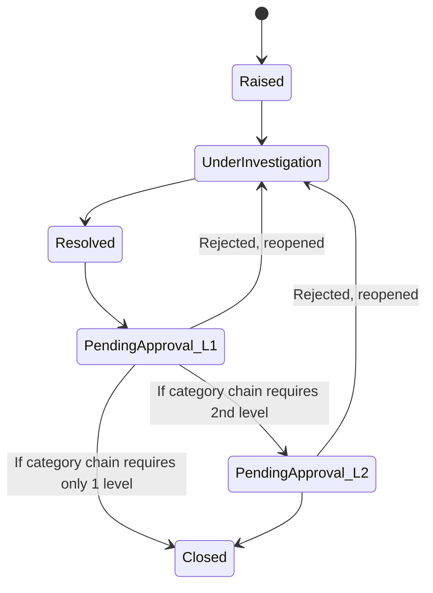

### 26.5 Business Rules
- BR-13, BR-21 apply directly: Discrepancy → Investigation → Resolution → Approval (per configured chain) → Closed, with no stage skipped.
- A Discrepancy cannot be closed without an explicit Approval action distinct from the Resolution action.
- The original Observation referenced by a Discrepancy is never altered (BR-12).
- Each approval level is assigned to the Role configured in the Approval Chain Configuration for that Category and level — the workflow engine SHALL NOT hardcode role names.
- Each approval level requires an Approver distinct from all preceding levels (segregation of duties, extended across levels).
- A Discrepancy cannot Close until every configured level has an Approved status.

### 26.6 Validations
Investigation must record findings before transitioning to Resolved. Resolution requires a resolution note. Approval requires an Approver different from the Investigation Owner (segregation of duties).

Discrepancy Category is mandatory at creation, immutable thereafter, and must reference an Active Discrepancy Category Master Data record. Each Approver at a given level must differ from the Investigation Owner and from every Approver at a prior level on the same Discrepancy.

### 26.7 Permissions
Raise: Auditor. Investigate/Resolve: Admin, Department Head (scoped). Approve (Level 1): Admin, SuperAdmin (scoped). Approve (Level 2, category-dependent): role resolved from Approval Chain Configuration (Section 54) — engine-agnostic, not hardcoded. View: all roles per scope.

### 26.8 Notifications
Discrepancy Created → Investigation Owner (Critical priority, Section 32). ETA Exceeded on Investigation → Escalation Manager (Critical).

### 26.9 Audit Logs
Discrepancy Raised, Investigation Started, Resolved, Approved, Closed, Reopened.

### 26.10 Reports
Open Discrepancies Report, Discrepancy Resolution SLA Report, Escalation Summary.

### 26.11 Acceptance Criteria
- A Discrepancy cannot transition directly from Raised to Closed; all intermediate states are enforced.
- Resolution SLA adherence is measurable (Success Metric: > 95%).
- Reopening a rejected approval returns the Discrepancy to Under Investigation, preserving prior investigation notes.

### 26.12 Edge Cases
- Investigation Owner is archived mid-investigation: Admin must reassign before further action is permitted.
- Discrepancy investigation exceeds its ETA without resolution: auto-escalates per the Escalation Matrix (Section 27.5), independent of the underlying Task escalation.
- Approval Chain Configuration changes while a Discrepancy is already in the Approval stage: the Discrepancy continues under the chain version active when it entered that stage (FR-235); the new configuration applies only to Discrepancies entering Approval after the change.
- A Discrepancy's Category is later Deprecated in Master Data: existing Discrepancies referencing it are unaffected (Approval Chain Version already snapshotted); new Discrepancies cannot select the Deprecated category.

### 26.13 Future Enhancements
Root-cause categorization and CAPA linkage (Phase 3, Section 57.3).

### 26.14 Functional Requirements

| ID | Requirement |
|---|---|
| FR-089 *(revised)* | The system SHALL enforce the Discrepancy state machine: Raised → Under Investigation → Resolved → Pending Approval (Level 1..N, per configured chain) → Closed. |
| FR-090 | The system SHALL prevent any Discrepancy state transition that skips an intermediate stage. |
| FR-091 | The system SHALL require investigation findings before a Discrepancy can move to Resolved. |
| FR-092 | The system SHALL require a distinct Approver from the Investigation Owner before Closure (segregation of duties). |
| FR-093 | The system SHALL preserve investigation notes when a rejected Approval reopens a Discrepancy. |
| FR-094 | The system SHALL notify the Investigation Owner with Critical priority upon Discrepancy creation. |
| FR-095 | The system SHALL auto-escalate a Discrepancy whose investigation exceeds its configured ETA. |
| FR-096 | The system SHALL never permit modification of the original Observation referenced by a Discrepancy. |
| FR-097 | The system SHALL log every Discrepancy state transition with actor identity and timestamp. |
| FR-098 | The system SHALL measure and report Discrepancy Resolution SLA adherence. |
| FR-099 | The system SHALL block reassignment-pending Investigation Owner archival until the Discrepancy is reassigned. |
| FR-100 | The system SHALL provide an Open Discrepancies Report filterable by School, Department, and Age. |
| FR-231 | The system SHALL require a Discrepancy Category (FK to Master Data) at creation and SHALL make it immutable thereafter. |
| FR-232 | The system SHALL resolve the number of approval levels and the assigned Role per level from the Approval Chain Configuration for the Discrepancy's Category. |
| FR-233 | The system SHALL require each approval level's Approver to be distinct from the Investigation Owner and from Approvers at all prior levels on the same Discrepancy. |
| FR-234 | The system SHALL prevent Closure of a Discrepancy until every configured approval level has reached Approved status. |
| FR-235 | The system SHALL bind an in-progress Discrepancy to the Approval Chain Configuration version active when it entered the Approval stage, and SHALL NOT apply subsequent configuration changes to it. |
| FR-236 | The system SHALL version Approval Chain Configuration changes and log them to the Audit Log, distinct from Discrepancy-level approval events. |
| FR-237 | The system SHALL record every approval action as a row in the Discrepancy Approval History entity (Approval ID, Level, Assigned Role, Assigned User, Status, Approved At, Comments), rather than as fixed columns on the Discrepancy record. |

## 27. Task Management

### 27.1 Purpose
General-purpose assignment and tracking of operational work items, independent of the KPI/Observation chain.

### 27.2 Business Context
Tasks support multiple Primary Owners, configurable completion rules, and a bounded ETA-extension/escalation model (BR-09, BR-10).

### 27.3 Actors
Admin, Department Head (assign); Primary Owners (execute); Approver (where required).

### 27.4 Workflow

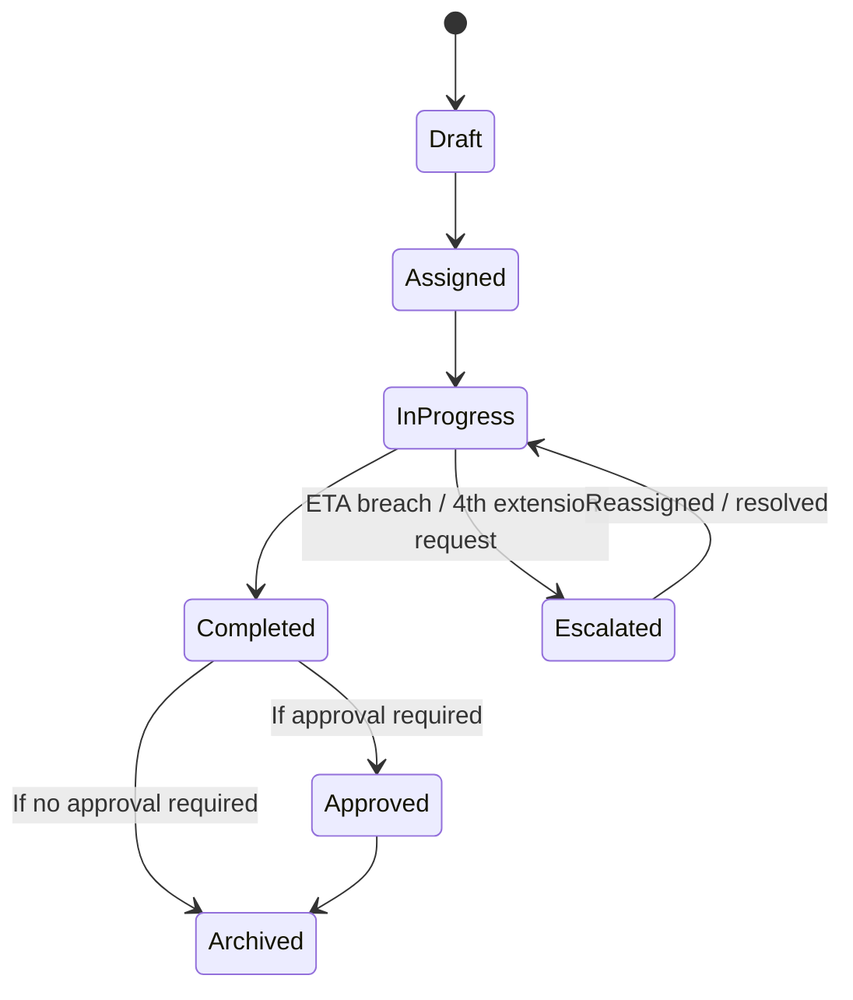

### 27.5 Business Rules
- BR-09: Tasks may have multiple Primary Owners; no collaborators. Every Owner receives notifications, reminders, escalations. Completion rule configurable: ANY / ALL / Approval-required.
- BR-10: Maximum three ETA extensions; the fourth request auto-escalates instead of extending.
- Escalation follows the configured, per-department Escalation Matrix (Section 26.5-adjacent) with SLA timers per level.

### 27.6 Validations
At least one Primary Owner required. ETA must be a future date/time at creation. Completion rule must be selected at task creation and is immutable thereafter (to prevent gaming completion semantics).

### 27.7 Permissions
Create/Assign: Admin, Department Head, Checker (peer-level, if enabled). Complete: assigned Primary Owners only. Approve completion: Admin/Department Head, where the completion rule requires it.

### 27.8 Notifications
Task Assigned (High priority) → all Primary Owners. Due Today (High) → all Primary Owners. Escalation (Critical) → Escalation Manager, per Section 32 priority order.

### 27.9 Audit Logs
Task Created, Assigned, Owner Added/Removed, ETA Extended, Escalated, Completed, Approved, Archived.

### 27.10 Reports
Task Aging Report, Escalation Summary, User Productivity Report.

### 27.11 Acceptance Criteria
- A task with completion rule "ALL" only transitions to Completed once every Primary Owner has marked completion.
- A fourth ETA extension request is rejected and immediately triggers escalation instead.
- Every Primary Owner receives every notification tier applicable to the task (assignment, reminders, escalation) — no owner is silently excluded.

### 27.12 Edge Cases
- A Primary Owner is transferred to another department mid-task: task ownership is flagged for Admin review; ownership is not silently dropped.
- All Primary Owners are archived before task completion: Admin is notified to reassign; task is held in a `Blocked` sub-state (not auto-closed).
- Completion rule "Approval required" is combined with "ANY owner completes": the first owner's completion still requires a single Approval before the task closes.

### 27.13 Future Enhancements
Dependency chains between tasks; recurring task templates shared across departments (extends existing v2.0 recurrence capability).

### 27.14 Functional Requirements

| ID | Requirement |
|---|---|
| FR-101 | The system SHALL support multiple Primary Owners per Task and SHALL NOT support a Collaborator role. |
| FR-102 | The system SHALL deliver every notification tier (assignment, reminder, escalation) to every Primary Owner of a Task. |
| FR-103 | The system SHALL support a configurable Task completion rule: ANY owner completes, ALL owners complete, or Approval required after completion. |
| FR-104 | The system SHALL make the Task completion rule immutable once set at creation. |
| FR-105 | The system SHALL permit a maximum of three ETA extensions per Task. |
| FR-106 | The system SHALL automatically escalate a Task upon a fourth ETA extension request, rejecting the extension itself. |
| FR-107 | The system SHALL require at least one Primary Owner at Task creation. |
| FR-108 | The system SHALL flag a Task for Admin review when a Primary Owner is transferred to a different Department. |
| FR-109 | The system SHALL place a Task into a Blocked sub-state, rather than auto-closing it, if all Primary Owners are archived before completion. |
| FR-110 | The system SHALL support subtasks/checklist items within a Task, each independently completable, rolling up to overall completion percentage. |
| FR-111 | The system SHALL support recurring Tasks with configurable recurrence rules, auto-generating the next instance on completion or schedule. |
| FR-112 | The system SHALL support comments and @mentions on Tasks, notifying mentioned users. |
| FR-113 | The system SHALL support Task Tags/Categories and reusable Task Templates. |
| FR-114 | The system SHALL support bulk Task creation/assignment to multiple Owners at once. |
| FR-115 | The system SHALL escalate a Task through the configured, per-department Escalation Matrix upon SLA breach. |
| FR-116 | The system SHALL log every Task lifecycle event, including ETA extensions and escalations. |
| FR-117 | The system SHALL prevent Task deletion once historical activity exists; Archive SHALL be offered instead. |
| FR-118 | The system SHALL provide a Task Aging Report filterable by School, Department, Owner, and Status. |

## 28. Performance Reviews

### 28.1 Purpose
Provide periodic, structured review of individual and department performance derived from KPI, Task, and Discrepancy data.

### 28.2 Business Context
Every supplied role manual defines a Performance Review Cadence. This module formalizes that as a native, configurable, recurring capability (full weighted appraisal scoring remains Phase 2).

### 28.3 Actors
SuperAdmin/Admin (configure cadence), all roles (view own/scoped review).

### 28.4 Workflow
Admin/SuperAdmin configures cadence (Monthly/Quarterly/etc.) per role or department → cycle closes → system auto-generates Scorecard (Section 29) → review is available for the applicable scope.

### 28.5 Business Rules
BR-14 applies (Scorecards immutable, versioned). Review cadence configuration is a Configuration Management item (Section 54).

### 28.6 Validations
Cadence must be one of the supported Frequency values (Section 23.6). A cycle cannot close and generate a review until all Discrepancies opened within the cycle are either Closed or explicitly carried forward with a documented reason.

### 28.7 Permissions
Configure cadence: SuperAdmin, Admin (scoped). View: per Permission Matrix (Section 12).

### 28.8 Notifications
Performance Review Cycle Closed → Informational, to the user/department and their Admin/SuperAdmin.

### 28.9 Audit Logs
Cadence Configured, Cycle Closed, Review Generated.

### 28.10 Reports
Performance Review history report, feeding into Scorecards (Section 29).

### 28.11 Acceptance Criteria
Cycle close is a deterministic, repeatable operation producing identical output given identical input data.

### 28.12 Edge Cases
Cadence changed mid-cycle: applies from the next cycle only, mirroring the KPI Frequency change rule (Section 23.12).

### 28.13 Future Enhancements
Weighted appraisal scoring (Phase 2); 360-degree review input.

### 28.14 Functional Requirements

| ID | Requirement |
|---|---|
| FR-119 | The system SHALL allow SuperAdmin/Admin to configure a Performance Review cadence per role or department. |
| FR-120 | The system SHALL support cadence values consistent with the KPI Frequency enumeration (Section 23.6). |
| FR-121 | The system SHALL auto-generate a Performance Review at the close of each configured cycle. |
| FR-122 | The system SHALL apply a cadence change starting from the next cycle only. |
| FR-123 | The system SHALL require open Discrepancies within a cycle to be Closed or explicitly carried forward with a documented reason before cycle close. |
| FR-124 | The system SHALL notify the reviewed user/department and their Admin/SuperAdmin upon cycle close. |
| FR-125 | The system SHALL log cadence configuration and cycle-close events. |
| FR-126 | The system SHALL produce deterministic, reproducible review output for identical input data. |

## 29. Scorecards

### 29.1 Purpose
Provide an immutable, auto-generated summary of compliance and performance for a user or department over a cycle.

### 29.2 Business Context
Scorecards are the terminal, trusted output of the KPI/Observation/Task/Discrepancy chain and must never be editable (BR-14).

### 29.3 Actors
System (generator), all roles (viewers, per scope).

### 29.4 Workflow
Cycle closes (Section 28) → system computes % KPIs Met, % Tasks On-Time, Open Discrepancy Count → Scorecard v1 generated and locked → if recalculation is later required, Scorecard v2 is generated; v1 is retained unchanged.

### 29.5 Business Rules
BR-14 applies directly. A Scorecard is never edited; only superseded by a new version. All versions remain permanently retrievable.

### 29.6 Validations
Scorecard generation requires the underlying cycle to be formally closed (Section 28.6).

### 29.7 Permissions
View: per Permission Matrix (Section 12) — user (own), Admin/Department Head (scoped), SuperAdmin (all), Viewer (granted scope). Generate/Regenerate: system-triggered only; no manual user-initiated edit exists.

### 29.8 Notifications
Scorecard Generated → Informational to the subject user and their Admin.

### 29.9 Audit Logs
Scorecard Generated (v1, v2, …), with generation trigger reason recorded for any regeneration.

### 29.10 Reports
School Scorecard, Department Scorecard, User Performance Report (Section 50).

### 29.11 Acceptance Criteria
- No UI or API pathway permits editing a generated Scorecard.
- Regeneration always creates a new version; the prior version remains queryable and is clearly marked superseded.

### 29.12 Edge Cases
- Underlying Observation data is corrected after Scorecard generation (e.g., via a formally reopened Discrepancy): triggers Scorecard regeneration as v2 with an audit-logged reason, not a silent recalculation.

### 29.13 Future Enhancements
Comparative benchmarking scorecards across schools (aggregate, anonymized).

### 29.14 Functional Requirements

| ID | Requirement |
|---|---|
| FR-127 | The system SHALL generate Scorecards automatically upon Performance Review cycle close. |
| FR-128 | The system SHALL make every generated Scorecard immutable. |
| FR-129 | The system SHALL create a new Scorecard version, rather than editing, whenever recalculation is required. |
| FR-130 | The system SHALL retain all prior Scorecard versions permanently and mark superseded versions clearly. |
| FR-131 | The system SHALL record a reason for every Scorecard regeneration event in the Audit Log. |
| FR-132 | The system SHALL compute Scorecards using % KPIs Met, % Tasks On-Time, and Open Discrepancy Count at minimum. |
| FR-133 | The system SHALL restrict Scorecard visibility per the Permission Matrix (Section 12). |
| FR-134 | The system SHALL notify the subject user and their Admin upon Scorecard generation. |

## 30. Dashboards

### 30.1 Purpose
Provide real-time, role-specific visual summaries of compliance, task, and performance status.

### 30.2 Business Context
Dashboards are the primary daily interface for most roles and must load quickly (Section 46) and respect scope restrictions.

### 30.3 Actors
All roles.

### 30.4 Workflow
User logs in → system resolves role(s) and scope → dashboard renders widgets applicable to the union of the user's roles.

### 30.5 Business Rules
Dashboard data is always read from current, live state except where a widget explicitly displays a locked/immutable Scorecard.

### 30.6 Validations
N/A (read-only aggregation layer); underlying data validations apply at source (Sections 24, 27).

### 30.7 Permissions
Every widget individually respects the Permission Matrix (Section 12); no dashboard widget bypasses record-level scope.

### 30.8 Notifications
N/A (dashboards are pull, not push; see Section 32 for push notifications).

### 30.9 Audit Logs
Dashboard access is not individually logged except for sensitive/financial KPI categories, which log Viewed events (Section 45).

### 30.10 Reports
Dashboards summarize but do not replace the Report Catalogue (Section 50); each widget links to its underlying report.

### 30.11 Acceptance Criteria
Dashboard load time < 3 seconds for standard queries (Section 46 NFR).

### 30.12 Edge Cases
A user with multiple roles sees a merged dashboard; widget duplication across roles is deduplicated, not repeated.

### 30.13 Future Enhancements
Configurable/drag-and-drop dashboard layout per user (Phase 2).

### 30.14 Functional Requirements

| ID | Requirement |
|---|---|
| FR-135 | The system SHALL render a role-specific Dashboard reflecting the union of all Roles held by the logged-in User. |
| FR-136 | The system SHALL enforce Permission Matrix scope on every individual Dashboard widget. |
| FR-137 | The system SHALL load standard Dashboard queries in under 3 seconds. |
| FR-138 | The system SHALL deduplicate widgets shared across a user's multiple Roles. |
| FR-139 | The system SHALL link every Dashboard widget to its corresponding detailed Report. |
| FR-140 | The system SHALL log Dashboard views of sensitive/financial KPI category widgets. |

## 31. Reports

### 31.1 Purpose
Provide the full catalogue of exportable, structured reports across all modules (full catalogue in Section 50).

### 31.2 Business Context
Reports are the audit- and leadership-facing output of the platform and must support standard export formats (BR-17).

### 31.3 Actors
Admin, SuperAdmin, Auditor, Viewer (per report and scope).

### 31.4 Workflow
User selects report → applies filters (school, department, date range) → system generates report scoped to user's permissions → export or view in-app.

### 31.5 Business Rules
BR-17 applies. Report output is always scoped by the requesting user's Permission Matrix entry, never by report configuration alone.

### 31.6 Validations
Date range required for trend-based reports; maximum range configurable to protect performance (Section 46).

### 31.7 Permissions
Per Section 12 and per-report overrides noted in Section 50 (e.g., financial KPI category restrictions).

### 31.8 Notifications
Scheduled report generation complete → Informational to requester (where async generation is used for large exports).

### 31.9 Audit Logs
Report Generated, Report Exported (with format and requester identity).

### 31.10 Reports
Self-referential: this module is the Report Catalogue (Section 50).

### 31.11 Acceptance Criteria
Every report respects row-level and column-level (e.g., financial category) permission scope; no export path bypasses this.

### 31.12 Edge Cases
Very large export requests are processed asynchronously with a completion notification rather than blocking the UI.

### 31.13 Future Enhancements
Scheduled/recurring report delivery via email.

### 31.14 Functional Requirements

| ID | Requirement |
|---|---|
| FR-141 | The system SHALL support report export in Excel, CSV, and PDF formats, and via REST API. |
| FR-142 | The system SHALL scope every report by the requesting user's Permission Matrix entry. |
| FR-143 | The system SHALL enforce category-level restrictions (e.g., financial KPIs) independent of role-level scope. |
| FR-144 | The system SHALL process large export requests asynchronously and notify the requester on completion. |
| FR-145 | The system SHALL log every report generation and export event with requester identity and format. |
| FR-146 | The system SHALL require a bounded date range for trend-based reports to protect query performance. |
| FR-147 | The system SHALL provide the full Report Catalogue defined in Section 50. |
| FR-148 | The system SHALL allow filtering of all reports by School, Department, Role, and Date Range where applicable. |

## 32. Notifications

### 32.1 Purpose
Deliver timely, priority-ordered alerts across in-app, email, SMS, and WhatsApp channels.

### 32.2 Business Context
Notification priority is fixed and non-negotiable per BR-15; mandatory categories cannot be muted.

### 32.3 Actors
System (sender), all roles (recipients).

### 32.4 Workflow
Triggering event occurs → system resolves recipient(s) and applicable channel(s) per the Notification Matrix (Section 49) → notification queued respecting priority order → delivered.

### 32.5 Business Rules
BR-15 applies directly: priority order (1) Escalation, (2) Audit Failure, (3) Task Assignment, (4) Due Today, (5) KPI Reminder, (6) Comments, (7) Informational. Escalation and Audit Failure categories cannot be muted by any user.

### 32.6 Validations
A notification must resolve to at least one valid channel per recipient; if all configured channels for a recipient are invalid (e.g., missing phone for SMS), the system falls back to in-app and logs the channel failure.

### 32.7 Permissions
Notification template configuration: SuperAdmin (Section 54). Mute non-mandatory categories: individual user, self-scope only.

### 32.8 Notifications
N/A (this is the notification engine itself).

### 32.9 Audit Logs
Notification Sent, Notification Failed (with channel and reason), Mute Preference Changed.

### 32.10 Reports
Notification delivery success rate (operational report, Section 50).

### 32.11 Acceptance Criteria
Higher-priority notifications are never delayed behind lower-priority notifications in the delivery queue. Mandatory categories cannot be disabled through any user-facing setting.

### 32.12 Edge Cases
Simultaneous Escalation and Comment notifications for the same user: Escalation is delivered first regardless of generation order.

### 32.13 Future Enhancements
Push notification channel; digest mode for low-priority categories.

### 32.14 Functional Requirements

| ID | Requirement |
|---|---|
| FR-149 | The system SHALL enforce the fixed notification priority order defined in BR-15. |
| FR-150 | The system SHALL prevent users from muting Escalation and Audit Failure notification categories. |
| FR-151 | The system SHALL support in-app, email, SMS, and WhatsApp notification channels. |
| FR-152 | The system SHALL fall back to the in-app channel and log a channel failure when all configured channels for a recipient are invalid. |
| FR-153 | The system SHALL deliver higher-priority notifications ahead of lower-priority notifications regardless of generation order. |
| FR-154 | The system SHALL allow users to mute non-mandatory notification categories for themselves only. |
| FR-155 | The system SHALL log every notification send attempt, including failures and the reason. |
| FR-156 | The system SHALL resolve notification recipients and channels per the Notification Matrix (Section 49). |

## 33. Search

### 33.1 Purpose
Provide global and scoped search across platform entities.

### 33.2 Business Context
Users need to quickly locate KPIs, Observations, Tasks, Discrepancies, and Users within their permission scope.

### 33.3 Actors
All roles.

### 33.4 Workflow
User enters query → system applies permission-scoped filters → indexed search returns ranked results across entity types → user applies additional filters or saves the filter set.

### 33.5 Business Rules
Search results never surface records outside the requesting user's Permission Matrix scope, including Archived records (which remain searchable but read-only per BR-18).

### 33.6 Validations
Minimum query length enforced to avoid excessively broad scans; special characters sanitized to prevent injection.

### 33.7 Permissions
Search respects the same Permission Matrix scoping as direct module access (Section 12).

### 33.8 Notifications
N/A.

### 33.9 Audit Logs
Search of sensitive/financial categories logged; general search queries are not individually logged (privacy/performance balance).

### 33.10 Reports
N/A — search is an access pattern, not a report.

### 33.11 Acceptance Criteria
Search results respect permission scope with zero leakage of out-of-scope records, verified by dedicated QA test cases.

### 33.12 Edge Cases
Search across Archived and Active records in a single query returns both, clearly labeled by status.

### 33.13 Future Enhancements
Natural-language search; saved search alerts.

### 33.14 Functional Requirements

| ID | Requirement |
|---|---|
| FR-157 | The system SHALL provide global search across KPIs, Observations, Tasks, Discrepancies, and Users. |
| FR-158 | The system SHALL scope all search results to the requesting user's Permission Matrix entry. |
| FR-159 | The system SHALL include Archived records in search results, clearly labeled as Archived and read-only. |
| FR-160 | The system SHALL support saved filters per user. |
| FR-161 | The system SHALL sanitize search input to prevent injection attacks. |
| FR-162 | The system SHALL log search access to sensitive/financial KPI categories. |

## 34. Settings

### 34.1 Purpose
Provide user- and organization-level configuration surfaces.

### 34.2 Business Context
Settings span personal preferences (language, notification mute for non-mandatory categories) and administrative configuration (Section 54).

### 34.3 Actors
All roles (personal settings), SuperAdmin/Admin (administrative settings).

### 34.4 Workflow
User accesses Settings → edits personal preferences (language, non-mandatory notification mutes) → SuperAdmin/Admin accesses Configuration Management (Section 54) for organizational parameters.

### 34.5 Business Rules
Personal settings never override mandatory notification rules (BR-15) or permission scope.

### 34.6 Validations
Language preference must be one of the supported locales (English, Hindi at launch).

### 34.7 Permissions
Personal settings: self-scope only. Administrative configuration: SuperAdmin (global), Admin (school-scoped subset, Section 54).

### 34.8 Notifications
Setting Changed → Informational, self-notification only (in-app confirmation).

### 34.9 Audit Logs
Language Preference Changed, Notification Mute Preference Changed, Administrative Configuration Changed.

### 34.10 Reports
N/A.

### 34.11 Acceptance Criteria
Changing a personal setting takes effect immediately without requiring re-login.

### 34.12 Edge Cases
User attempts to mute a mandatory category via a settings API call directly (bypassing UI): request is rejected server-side, not just hidden in UI (defense in depth).

### 34.13 Future Enhancements
Per-user theming; additional locale support beyond English/Hindi.

### 34.14 Functional Requirements

| ID | Requirement |
|---|---|
| FR-163 | The system SHALL support per-user Language Preference selection from supported locales. |
| FR-164 | The system SHALL apply personal setting changes immediately without requiring re-login. |
| FR-165 | The system SHALL reject, server-side, any attempt to mute a mandatory notification category regardless of client request path. |
| FR-166 | The system SHALL restrict administrative configuration access per Section 54's Configuration Matrix. |
| FR-167 | The system SHALL log all personal and administrative setting changes. |
| FR-168 | The system SHALL support at minimum English and Hindi as UI locales at launch. |

## 35. Master Data

### 35.1 Purpose
Manage shared reference data used across modules (department templates, categories, priorities, frequencies).

### 35.2 Business Context
Master Data underpins consistent defaults (e.g., default Departments at School creation, BR-03) and reference enumerations (Frequency, Comparator, Priority). It also manages the Location list (floors/zones/wings, Section 37.10) used for per-location Event Time scoping, and the Manual Time Reason enumeration used when Event Time is entered manually (Section 24.14).

**Discrepancy Category** — Name, Active flag, Default Approval Chain (ordered list of Role + level), Default Auto-Escalation SLA per level, Allow Delegate (Yes/No). Create/Edit: SuperAdmin only.

**Organization Holiday Calendar** — School-scoped (with an organization-level default schools can inherit or override) list of dates marked Holiday, each with a Label (e.g., "Diwali," "Summer Break Start") and Recurrence type (One-time, Annual-fixed-date, Annual-variable — manually re-entered each year for Phase 1). Create/Edit: SuperAdmin (organization default), Admin (school-scoped additions/overrides).

**Working Days** — per-School default (e.g., Mon–Sat, Mon–Fri), overridable per KPI (Section 23.6) for KPIs that legitimately run on days the school is otherwise closed (e.g., a security guard's daily check-in KPI).

### 35.3 Actors
SuperAdmin.

### 35.4 Workflow
SuperAdmin defines/edits Master Data entries → propagated to relevant modules at point of use (e.g., new School creation pulls current Department template).

### 35.5 Business Rules
Master Data changes do not retroactively alter historical records; they affect only new records created after the change (consistent with BR-05 versioning philosophy).

### 35.6 Validations
Master Data entries must be uniquely named within their category.

An Asset cannot be selected for a new Observation, or newly linked to a KPI's Event Time Point configuration, while its Status is Retired. An Asset cannot transition to Retired while it is the *only* Asset satisfying a mandatory per-asset KPI scoping requirement without an Admin acknowledgment (warning, not hard block).

### 35.7 Permissions
Create/Edit: SuperAdmin only, except Location, which Admin may also create/edit within their own School (FR-189). View: all roles (reference data is not sensitive).

### 35.8 Notifications
N/A (administrative, low-frequency changes).

### 35.9 Audit Logs
Master Data Created, Updated, Deprecated.

### 35.10 Reports
N/A.

### 35.11 Acceptance Criteria
A Master Data change (e.g., new default department template) applies only to Schools created after the change.

### 35.12 Edge Cases
Deprecating a Master Data value in active use (e.g., a Priority level used by open Tasks) is blocked until no active records reference it, or the value is marked Deprecated-but-retained for historical display.

An Asset referenced by an in-flight Observation is Retired mid-submission: the in-flight submission is still allowed to complete, consistent with Section 23.12's version-binding precedent. A Retired Asset is later needed due to a data-entry mistake: Admin may re-activate it (Status → Active); the toggle is Audit Logged (FR-246).

### 35.13 Future Enhancements
School-level Master Data overrides (Phase 2).

### 35.14 Functional Requirements

| ID | Requirement |
|---|---|
| FR-169 | The system SHALL restrict Master Data modification to SuperAdmin. |
| FR-170 | The system SHALL apply Master Data changes only to records created after the change, preserving historical consistency. |
| FR-171 | The system SHALL enforce unique naming of Master Data entries within each category. |
| FR-172 | The system SHALL provide the default Department template used during School creation (FR-002). |
| FR-173 | The system SHALL maintain reference enumerations for Frequency, Comparator, and Priority centrally. |
| FR-174 | The system SHALL log all Master Data changes. |
| FR-189 | The system SHALL allow SuperAdmin/Admin (school-scoped) to define and maintain the Location list (floors/zones/wings) used for per-location Event Time scoping (Section 37.10). |
| FR-190 | The system SHALL maintain the Manual Time Reason enumeration centrally as Master Data, editable by SuperAdmin. |
| FR-244 | The system SHALL support an Asset Status of Active or Retired. |
| FR-245 | The system SHALL prevent a Retired Asset from being newly assigned to a KPI's Event Time Point scoping or to a new Observation. |
| FR-246 | The system SHALL log every Asset Status change (Active↔Retired) to the Audit Log, including actor and timestamp. |
| FR-247 | The system SHALL preserve all historical Observations, Event Time records, and derived reports referencing a Retired Asset, unaltered and fully attributable. |
| FR-248 | The system SHALL prevent hard deletion of any Asset record that has one or more linked Observations; Retirement SHALL be offered instead, consistent with BR-23. |
| FR-249 | The system SHALL bind an in-flight Observation to the Asset Status active when data entry began, consistent with the KPI-version-binding rule (Section 23.12). |

### 35.15 Asset Status (Phase 1 Minimal Lifecycle)

Phase 1 does not include full Asset Management (creation workflows, stock/procurement, vendor linkage beyond the existing optional Asset↔Vendor relationship) — that remains Phase 3. However, because Assets are already referenced by Phase 1 Event Time Observations (Section 24.14, FR-185), a minimal Status field is required to prevent orphaned or misleading references when a tracked vehicle, floor unit, or other Asset goes out of service during Phase 1's operational life.

- Asset Status ∈ {Active, Retired}.
- Only Active Assets may be newly assigned to a KPI's Event Time Point scoping or to a new Observation.
- Retiring an Asset does not alter, hide, or unlink any historical Observation that already references it.
- An Asset with historical Observations SHALL NOT be hard-deleted, only Retired (BR-23).
- Re-activating a Retired Asset is permitted and does not affect historical continuity.

---

# PART 3 — TECHNICAL & GOVERNANCE

## 36. Entity Definitions

| Entity | Description |
|---|---|
| School | Top-level tenant boundary. |
| Department | Organizational sub-unit within a School. |
| User | System account, scoped per BR-01, holding one or more Roles. |
| Role | Permission template (SuperAdmin, Admin, Checker, Auditor, Viewer). |
| KRA | Key Result Area, top-level governance category. |
| KPI | Versioned, measurable indicator owned by exactly one KRA. |
| Observation | Immutable-after-lock reading captured by a Checker against a KPI version. |
| Audit Action | Verify or Discrepancy-raise action performed by an Auditor. |
| Discrepancy | Governed mismatch record with a fixed lifecycle state machine. |
| Task | General-purpose work item with multiple Primary Owners and ETA governance. |
| Escalation Rule | Configurable, ordered per-department escalation chain with SLA timers. |
| Performance Review | Cycle-based review configuration and closure record. |
| Scorecard | Immutable, versioned performance summary. |
| Notification | System-generated alert with priority, recipient, and channel. |
| Vendor | Optional third-party record linked to Assets/Documents (Phase 1, limited scope). |
| Asset | Equipment/inventory record, with optional stock attributes. Carries a Status (Active/Retired) governing future assignability; full lifecycle management (acquisition, maintenance, disposal workflow) is Phase 3 (Section 57.3). |
| Discrepancy Category | Master Data entity governing Discrepancy approval-chain routing (Section 26, 35). |
| Location | Named sub-unit of a School used for per-location Event Time scoping (e.g., floor, zone, wing). |
| Integration Partner | Registered external system (ERP/third-party) with its own credentials, scope, and audit trail for server-to-server sync (Section 40). |
| Master Data | Shared reference/configuration entries (departments template, enumerations). |

## 37. Data Dictionary

### 37.1 School
| Field | Type | Required | Default | Validation | Description |
|---|---|---|---|---|---|
| School ID | UUID | Yes | Generated | — | Primary key |
| Name | Text | Yes | — | Unique org-wide | Display name |
| Status | Enum | Yes | Pending Onboarding | Active/Inactive/Pending Onboarding | Lifecycle state |
| Created At / Updated At | Timestamp | Yes | Server time | — | Audit fields |
| KPI Library Version Imported | FK (Version) | Yes | Current at creation | — | Traceability (BR-05) |
| Timezone | String (IANA tz name) | Yes | Org default | — | Drives compliance-cycle boundary computation (Section 23.16) |

### 37.2 Department
| Field | Type | Required | Default | Validation | Description |
|---|---|---|---|---|---|
| Department ID | UUID | Yes | Generated | — | Primary key |
| School ID | FK | Yes | — | Must exist | Parent School |
| Name | Text | Yes | — | Unique within School | Display name |
| Department Head | FK (User) | No | Null | Must hold Admin role | Assigned head |
| Status | Enum | Yes | Active | Active/Archived | Lifecycle state |

### 37.3 User
| Field | Type | Required | Default | Validation | Description |
|---|---|---|---|---|---|
| User ID | UUID | Yes | Generated | — | Primary key |
| Name | Text | Yes | — | — | Display name |
| Email | Text | Yes | — | Unique, RFC 5322 | Login identifier |
| Phone | Text | No | — | E.164 format | For SMS/WhatsApp |
| School ID | FK | Conditional | — | Required unless SuperAdmin/Viewer | Scope (BR-01) |
| Roles | Array[Enum] | Yes | — | At least one | Section 21 |
| Language Preference | Enum | Yes | English | Supported locale | Section 34 |
| Status | Enum | Yes | Invited | Invited/Active/Archived | Lifecycle (BR-08) |

### 37.4 KRA
| Field | Type | Required | Default | Validation | Description |
|---|---|---|---|---|---|
| KRA ID | UUID | Yes | Generated | — | Primary key |
| Name | Text | Yes | — | Unique in Library | Category name |
| Status | Enum | Yes | Active | Active/Deprecated | Lifecycle |

### 37.5 KPI
| Field | Type | Required | Default | Validation | Description |
|---|---|---|---|---|---|
| KPI ID | UUID | Yes | Generated | — | Stable identity across versions |
| Version | Integer | Yes | 1 | Increments on edit | BR-05 |
| KRA ID | FK | Yes | — | Exactly one, non-Deprecated | BR-06 |
| Title | Text | Yes | — | — | Display name |
| Target Value | Decimal | Yes | — | Numeric | Section 23.6 |
| Comparator | Enum | Yes | — | ≥/≤/=/</> | Section 23.6 |
| Unit of Measure | Text/Enum | Yes | — | Non-empty | %, count, incidents, days, hrs |
| Frequency | Enum | Yes | — | Section 23.6 list | Cycle cadence |
| Capture Type | Enum | Yes | Value Reading | Value Reading/Event Time/Value + Event Time | Section 23.6, 24.14 |
| Event Time Points | Array[Text] | Conditional | [] | ≥1 required if Capture Type ≠ Value Reading | e.g., Departure Time, Return Time, Check-In Time, Check-Out Time, Cleaning Time |
| Status | Enum | Yes | Active | Active/Deprecated | Lifecycle |

### 37.6 Observation
| Field | Type | Required | Default | Validation | Description |
|---|---|---|---|---|---|
| Observation ID | UUID | Yes | Generated | — | Primary key |
| KPI ID + Version | FK | Yes | — | Must be Active at capture | BR-20 |
| Checker (User ID) | FK | Yes | — | Must hold Checker role | Actor |
| Value | Decimal/Text | Yes | — | Matches KPI Unit type | Captured reading |
| Evidence (File) | File, optional | No | — | Format/size validated | Photo/document |
| Auto-Result | Derived Enum | Yes | Computed | Met/Not Met/N/A | Section 24.5 |
| Submitted At | Timestamp | Yes | Server time | — | FR-065 |
| Event Times | Array[{Point, Time}] | Conditional | [] | Required per KPI's Event Time Points if Capture Type ≠ Value Reading | Section 24.14, FR-179 |
| Time Capture Mode | Enum | Conditional | — | Auto-Captured/Manual; required if Event Times present | Section 24.14, FR-184 |
| Manual Time Reason | Enum + Text | Conditional | — | Required if Time Capture Mode = Manual | Section 24.14, FR-182 |
| Location ID | FK (Location), optional | No | Null | Must exist | Per-floor/zone scoping, Section 37.10 |
| Asset ID | FK (Asset), optional | No | Null | Must exist | Per-vehicle/route scoping |
| Lock Status | Enum | Yes | Unlocked | Unlocked/Locked | BR-11 |
| Submission Token | UUID | Yes | Client-generated | Unique | Idempotency (FR-069) |
| Duplicate Override Flag | Boolean | Yes | False | — | True only if submitted past a detected duplicate block |
| Duplicate Override Justification | Text | Conditional | — | Required if flag = True | Section 24.6 |
| Original Observation ID (Duplicate Reference) | FK (Observation), self-referencing | No | Null | Populated only when flag is True | Section 24.6 |
| Evidence Storage Tier | Enum | Yes | Active | Active/Archived | Transitions to Archived automatically per Archive Tier Threshold; does not affect retrievability |
| Compliance Status | Enum | Yes | Open | Open/Late-Submittable/Closed-Missed/Submitted | Distinct from Observation-level Auto-Result/RAG. An Observation exists in shell form (Compliance Status = Open) from scheduler generation until a Checker submits it. |
| Grace Period Elapsed At | Timestamp (computed) | No | — | Due Date + configured Grace Period (+ outage extension if backfilled) | Section 24.16 |
| Reopen Requested By / Reason | FK (User) / Text | Conditional | — | Required together if reopen requested | Section 24.16 |
| Reopen Approved By | FK (User) | No | — | Must be Admin/SuperAdmin | Section 24.16 |
| Reopened Flag | Boolean | Yes | False | — | Set True on any post-reopen submission |

### 37.7 Discrepancy
| Field | Type | Required | Default | Validation | Description |
|---|---|---|---|---|---|
| Discrepancy ID | UUID | Yes | Generated | — | Primary key |
| Observation ID | FK | Yes | — | Must exist | Linked source |
| Raised By (Auditor) | FK | Yes | — | Must hold Auditor role | Actor |
| State | Enum | Yes | Raised | Section 26.4 state machine | Lifecycle |
| Investigation Owner | FK | Conditional | — | Required before Resolved | Section 26 |
| Investigation Findings | Text | Conditional | — | Required before Resolved | FR-091 |
| Resolution Note | Text | Conditional | — | Required before Pending Approval | Section 26.6 |
| Category ID | FK (Discrepancy Category) | Yes | — | Immutable after creation | Section 26, 35 |
| Approval Chain Version ID | FK (snapshot reference) | Yes | — | Set on entry to Approval stage; not updated by later config changes | FR-235 |

*Note: `Level1ApproverID` / `Level2ApproverID` fixed columns are removed in v1.5 — approval actions are recorded per-level in the new Discrepancy Approval child entity below (FR-237).*

**Discrepancy Approval** (child of Discrepancy)

| Field | Type | Required | Default | Validation | Description |
|---|---|---|---|---|---|
| Approval ID | UUID | Yes | Generated | — | Primary key |
| Discrepancy ID | FK | Yes | — | Must exist | Parent |
| Approval Level | Integer | Yes | — | 1..N per configured chain | — |
| Assigned Role | FK (Role) | Yes | — | — | Resolved from Approval Chain Configuration at stage entry |
| Assigned User ID | FK (User) | Conditional | — | Required once actioned | — |
| Status | Enum | Yes | Pending | Pending/Approved/Rejected | — |
| Approved At | Timestamp | No | — | — | — |
| Comments | Text | No | — | — | — |

### 37.8 Task
| Field | Type | Required | Default | Validation | Description |
|---|---|---|---|---|---|
| Task ID | UUID | Yes | Generated | — | Primary key |
| Primary Owners | Array[FK User] | Yes | — | ≥1 | BR-09 |
| Completion Rule | Enum | Yes | — | ANY/ALL/Approval-required, immutable | FR-104 |
| ETA | Timestamp | Yes | — | Future at creation | Section 27.6 |
| ETA Extension Count | Integer | Yes | 0 | Max 3 (BR-10) | FR-105 |
| Status | Enum | Yes | Draft | Section 27.4 state machine | Lifecycle |
| Parent Task ID | FK, nullable | No | Null | — | Subtasks |
| Recurrence Rule | Text/Enum | No | Null | — | FR-111 |
| Tags | Array[Text] | No | [] | — | FR-113 |

### 37.9 Scorecard
| Field | Type | Required | Default | Validation | Description |
|---|---|---|---|---|---|
| Scorecard ID | UUID | Yes | Generated | — | Primary key |
| Subject (User/Dept ID) | FK | Yes | — | — | Scope |
| Cycle Period | Date Range | Yes | — | — | Section 28 |
| Version | Integer | Yes | 1 | Increments on regeneration | BR-14 |
| % KPIs Met | Decimal | Yes | Computed | — | Section 29.4 |
| % Tasks On-Time | Decimal | Yes | Computed | — | Section 29.4 |
| Open Discrepancy Count | Integer | Yes | Computed | — | Section 29.4 |
| Generated At | Timestamp | Yes | Server time | Immutable | BR-14 |
| Superseded By | FK, nullable | No | Null | — | Points to next version |

### 37.10 Location

| Field | Type | Required | Default | Validation | Description |
|---|---|---|---|---|---|
| Location ID | UUID | Yes | Generated | — | Primary key |
| School ID | FK | Yes | — | Must exist | Parent School |
| Name | Text | Yes | — | Unique within School | e.g., "Floor 2," "Block A – Ground Floor" |
| Type | Enum | Yes | — | Floor/Zone/Wing/Other | Master Data-managed (Section 35) |
| Status | Enum | Yes | Active | Active/Archived | Lifecycle state |

### 37.11 Integration Partner

| Field | Type | Required | Default | Validation | Description |
|---|---|---|---|---|---|
| Integration Partner ID | UUID | Yes | Generated | — | Primary key |
| Name | Text | Yes | — | Unique | e.g., "Acme ERP – Production" |
| Auth Type | Enum | Yes | — | OAuth2 Client Credentials/API Key/mTLS | Section 40.2 |
| Client ID | Text | Yes | Generated | Unique | Public identifier |
| Credential (Secret/Key Hash) | Text | Yes | — | Never stored/returned in plaintext | Section 41.3 |
| Scopes | Array[Enum] | Yes | — | Entities + actions this partner may access | Section 40.2 |

### 37.12 Asset

| Field | Type | Required | Default | Validation | Description |
|---|---|---|---|---|---|
| Asset ID | UUID | Yes | Generated | — | Primary key |
| Name | Text | Yes | — | — | Display name |
| Category | FK (Master Data) | No | — | — | e.g., Vehicle, Cleaning Equipment |
| Status | Enum | Yes | Active | Active/Retired | Section 35.15 |
| Location/Vehicle Reference | FK (Location) or free text | No | — | — | For per-location/per-vehicle scoping (Section 24.14) |
| Vendor ID | FK (Vendor) | No | — | — | Optional, Phase 1 limited scope |
| School Scope | Array[FK School], nullable | Conditional | [] | Required unless organization-wide | Section 40.2 |
| Environment | Enum | Yes | Sandbox | Sandbox/Production | Section 40.7 |
| Status | Enum | Yes | Pending Certification | Pending Certification/Active/Suspended/Revoked | Lifecycle |
| Last Successful Sync At | Timestamp, nullable | No | Null | Server time | Section 40.6 |
| Webhook Secret Hash | Text, nullable | No | — | Used for HMAC signature verification | Section 39, 40.1 |

## 38. Relationship Model & ERD

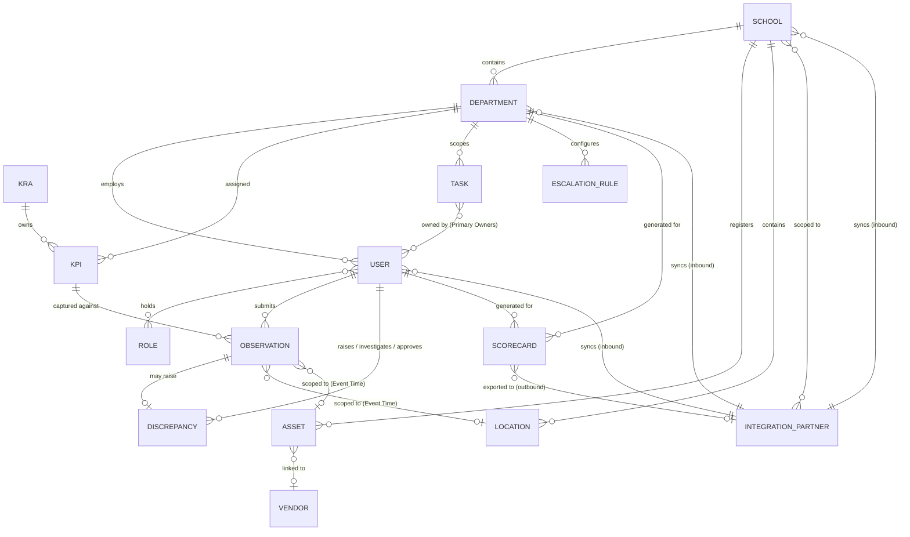

### 38.1 ERD Explanation
- **School → Department → User** forms the tenancy/scope hierarchy (BR-01).
- **KRA → KPI → Observation** forms the compliance taxonomy and its captured evidence (BR-06, BR-20).
- **Observation → Discrepancy** is optional (0 or 1); most Observations are simply Verified without a Discrepancy.
- **Task ↔ User** is many-to-many via Primary Ownership (BR-09), distinct from the Observation chain.
- **User/Department → Scorecard** is one-to-many across cycles, with strict versioning (BR-14).
- **Department → Escalation Rule** is one-to-many, ordered by Level.
- **Asset ↔ Vendor** is an optional linkage, Phase 1 limited scope (Section 6.2).
- **Observation → Location / Asset** is optional (0 or 1 each) and used only for Event Time Observations that are scoped per floor/zone (Location) or per vehicle/route (Asset), per Section 24.14.
- **Integration Partner ↔ School** is many-to-many (a partner may be scoped to one, several, or all Schools); Integration Partner syncs Users/Departments/Schools inbound and receives Scorecards outbound, per Section 40 — it is never a proxy for a human User account.

## 39. API Requirements

- The system SHALL expose a documented REST API layer for all core entities (Users, KPIs, Observations, Tasks, Discrepancies, Scorecards) per FR-040/FR-058/existing v2.0 FR40 baseline.
- APIs SHALL enforce the same Permission Matrix (Section 12) as the UI; no API endpoint SHALL bypass scope enforcement.
- APIs SHALL support idempotent writes for Observation submission (FR-069) using a client-supplied idempotency key.
- APIs SHALL version endpoints (e.g., `/v1/...`) to allow non-breaking evolution.
- APIs SHALL support pagination, filtering, and field selection for list endpoints to protect performance (Section 46).
- Webhook/event support SHALL be available for state-transition events (Discrepancy state change, Task escalation, Scorecard generation) to support the future Integration Layer (Section 54's Configuration Engine philosophy).

**API-first / mobile-readiness.** The web application (Section 56) SHALL be a client of the same REST API layer described above, not a system with backend logic embedded in the web tier — i.e., all business logic, validation, and authorization live behind the API, never in the web client alone. This is a deliberate architectural constraint so that:
- A future native mobile app (iOS/Android) or mobile wrapper can be built as an additional API client with no backend redesign, consistent with the Section 6.2 scope note that Phase 1 ships no native app but the platform SHALL NOT be architected in a way that blocks one later.
- Authentication SHALL use stateless, short-lived bearer tokens (JWT or equivalent) with refresh tokens (Section 42), not server-side session state pinned to a single web server, so mobile and web clients authenticate identically and any API node can serve any request.
- Push notification hooks SHALL be reserved in the Notification Service (Section 57.4) so mobile push can be added as a channel alongside In-App/Email/SMS/WhatsApp (Section 32) without re-architecting notification delivery.
- File upload/evidence-capture endpoints (Section 24, 41) SHALL accept standard multipart/binary uploads independent of any web-only mechanism (e.g., browser-only form submission), so a mobile camera capture flow can reuse the same endpoint.
- API responses SHALL be a stable, versioned contract (OpenAPI-documented, Section "Documentation" in Section 58) so mobile and web clients can evolve independently of each other.

**Secured integration surface (ERP / third-party).** In addition to the user-facing API above, the platform SHALL expose a distinct, dedicated integration surface for server-to-server ERP and third-party connectivity (Section 40), so integration traffic is isolated, secured, and governed independently of interactive web/mobile traffic:
- Integration endpoints SHALL be namespaced separately (e.g., `/integrations/v1/...`) from user-facing endpoints (`/v1/...`), with their own versioning and deprecation timeline.
- Integration authentication SHALL use OAuth 2.0 Client Credentials (server-to-server, no human session) or a scoped API key, per Integration Partner (Section 40.2); no ERP connection SHALL share a human user's credentials.
- Mutual TLS (mTLS) SHALL be supported as an optional, higher-assurance authentication layer for ERP partners that require it, in addition to token-based auth.
- Outbound webhooks (Section 40.1) SHALL be HMAC-signed, with a timestamp and nonce in the payload, so receivers can verify authenticity and reject replayed requests.
- Every integration endpoint SHALL enforce a rate limit scoped to the calling Integration Partner (Section 41.6), independent of the limits applied to human users, so one partner's traffic cannot degrade another's or the interactive UI's.
- Breaking changes to the integration contract SHALL carry a longer minimum deprecation notice than the user-facing API, given the operational cost of an ERP vendor re-certifying their sync (Section 40.7).

## 40. Integration Strategy

Per BR-19: the future ERP becomes the master for **Users, Departments, and Schools**; this platform remains the master for **Tasks, Compliance, Audits, Discrepancies, KPIs, and Performance**. This section specifies how that connection is built, secured, and operated — not only *what* the eventual data ownership split is.

| Domain | System of Record | Integration Direction |
|---|---|---|
| Schools, Departments, Users | ERP (future) | ERP → Platform (sync inbound) |
| KRA/KPI Library | This Platform | Platform-internal, no external sync |
| Observations, Audits, Discrepancies | This Platform | Platform-internal; may export to ERP reporting layer |
| Tasks | This Platform | Platform-internal |
| Scorecards/Performance | This Platform | Platform → ERP (export outbound, read-only) |

Phase 1 ships the REST API layer (Section 39) without live ERP connectivity; Phase 2/3 activate the sync per Section 57. The API and security design below SHALL be built in Phase 1 so activation in Phase 2 is a configuration/credentialing exercise, not a re-architecture.

### 40.1 Integration Architecture
- Inbound sync (ERP → Platform: Schools, Departments, Users) SHALL be supported via both **webhook push** (ERP notifies the platform of a change) and **scheduled pull/poll** (platform periodically requests deltas), so ERPs without webhook capability are still supportable.
- Outbound sync (Platform → ERP: Scorecards/Performance, read-only) SHALL be delivered via signed webhook event and/or a pollable export endpoint, at the receiving ERP's choice.
- All inbound writes from an ERP SHALL be treated as an **upsert** (create-or-update by external reference ID), never a raw overwrite of platform-internal fields the ERP does not own (e.g., an ERP cannot set a User's Role or School-internal Status).
- Every inbound sync record SHALL carry a client-supplied idempotency key (Section 39, FR-069 pattern) so ERP retries never create duplicate Schools/Departments/Users.

### 40.2 Authentication & Authorization for External Systems
- Each connected ERP/third-party is registered as an **Integration Partner** record (Section 37.11) with its own credentials, scopes, and School-scope boundary — an Integration Partner is never a proxy for a human User account.
- Authentication SHALL use OAuth 2.0 Client Credentials grant (preferred) or a scoped, rotatable API key (Section 41.3) as a fallback for ERPs that cannot support OAuth.
- Every Integration Partner SHALL be assigned an explicit **scope** (which entities it may read/write and which Schools it may act on) — the same least-privilege principle as Section 41.1, applied to machine-to-machine access.
- Integration Partner credentials SHALL follow the same rotation policy as other secrets (Section 41.3) and SHALL be independently revocable without affecting other partners.
- Every integration action SHALL be attributed to the Integration Partner identity in the Audit Log (Section 45), exactly as a human actor would be, so "who changed this record" is always answerable even for ERP-originated changes.

### 40.3 Data Mapping & Field-Level Configuration
- Field-level mapping between an ERP's schema (e.g., its own User/Department/School fields) and this platform's Data Dictionary (Section 37) SHALL be configurable per Integration Partner, not hardcoded per ERP vendor — consistent with the Configuration Engine philosophy (Section 54, 57.4).
- Unmapped or unrecognized inbound fields SHALL be ignored (not rejected) so a partial or evolving ERP schema does not break sync, but SHALL be logged for visibility.
- Required platform fields with no ERP-side equivalent SHALL fall back to a configured default or be routed to the Sync Exception Queue (Section 40.4) for manual completion, rather than silently left blank.

### 40.4 Conflict Resolution & Sync Exceptions
- For domains where the ERP is system of record (Schools, Departments, Users), ERP data wins on conflict, consistent with BR-19 — the platform does not allow local edits to fields the ERP owns once live sync is active for that School.
- An inbound record that fails validation (Section 52), references a non-existent parent (e.g., a User for an unknown School), or conflicts with a platform-side governance rule (e.g., BR-01 single-School constraint) SHALL NOT be silently dropped or silently overwritten — it SHALL be routed to a **Sync Exception Queue**, visible to Admin/SuperAdmin, for manual resolution.
- Outbound data (Scorecards/Performance) is always platform-authoritative; the ERP SHALL treat it as read-only and any ERP-side "correction" SHALL NOT sync back.

### 40.5 Error Handling, Retry & Idempotency
- Failed inbound or outbound sync attempts SHALL retry with exponential backoff up to a configurable maximum, then land in a dead-letter state visible in the Integration Health view (Section 40.6) rather than retrying indefinitely or failing silently.
- All sync operations SHALL be idempotent (Section 40.1) so retries after a network failure or partial success never duplicate records, consistent with the platform-wide idempotency principle (FR-069, Section 53).
- Structured error responses (Section 53) apply identically to the integration surface, so ERP developers get the same actionable, machine-readable error contract as internal API consumers.

### 40.6 Integration Monitoring & Health
- An Integration Health view SHALL show, per Integration Partner: connection status, last successful sync timestamp, pending Sync Exceptions, and recent failure count.
- Repeated sync failures for a given Integration Partner SHALL trigger an alert to SuperAdmin/Admin (Section 32 Notification channels), distinct from end-user notification categories.
- Integration activity is included in the Audit Log (Section 45) and reportable via the Integration Sync Report (Section 50).

### 40.7 Sandbox / Certification Environment
- A non-production sandbox environment, pre-populated with synthetic Schools/Departments/Users, SHALL be available for an ERP vendor to build and test their integration against the documented contract (Section 39) before Production credentials are issued.
- Production Integration Partner credentials SHALL only be issued after the partner's sync has been validated against the sandbox contract, reducing the risk of a malformed or unauthorized integration reaching live data.

### 40.8 Functional Requirements

| ID | Requirement |
|---|---|
| FR-211 | The system SHALL support inbound ERP sync for Schools, Departments, and Users via both webhook push and scheduled pull. |
| FR-212 | The system SHALL support outbound sync of Scorecards/Performance data to a connected ERP as read-only, via signed webhook and/or pollable export endpoint. |
| FR-213 | The system SHALL treat every inbound ERP write as an upsert keyed on external reference ID, never a raw overwrite of platform-owned fields. |
| FR-214 | The system SHALL require a client-supplied idempotency key on every inbound sync record and SHALL reject or safely no-op a duplicate. |
| FR-215 | The system SHALL maintain an Integration Partner record for every connected ERP/third-party, distinct from human User accounts, with its own credentials and scope. |
| FR-216 | The system SHALL support OAuth 2.0 Client Credentials authentication for Integration Partners, with a scoped API key as a fallback option. |
| FR-217 | The system SHALL enforce an explicit read/write entity scope and School-scope boundary per Integration Partner on every integration request. |
| FR-218 | The system SHALL support independent credential rotation and revocation per Integration Partner without affecting other partners. |
| FR-219 | The system SHALL attribute every integration-originated change to the acting Integration Partner in the Audit Log. |
| FR-220 | The system SHALL support configurable, per-Integration-Partner field-level mapping between the ERP's schema and the platform Data Dictionary. |
| FR-221 | The system SHALL ignore and log unmapped inbound fields rather than rejecting the sync record. |
| FR-222 | The system SHALL route a required field with no ERP-side value to a configured default or to the Sync Exception Queue rather than persisting it blank. |
| FR-223 | The system SHALL apply ERP-wins conflict resolution for Schools/Departments/Users while live sync is active for a School, per BR-19. |
| FR-224 | The system SHALL route a failing, ambiguous, or governance-conflicting inbound record to a Sync Exception Queue visible to Admin/SuperAdmin, rather than dropping or silently overwriting it. |
| FR-225 | The system SHALL treat outbound Scorecard/Performance data as platform-authoritative and SHALL NOT accept an ERP-side correction back into the platform. |
| FR-226 | The system SHALL retry failed sync operations with exponential backoff up to a configurable maximum, then mark them dead-lettered and visible for manual review. |
| FR-227 | The system SHALL provide an Integration Health view showing per-partner connection status, last successful sync, pending exceptions, and recent failure count. |
| FR-228 | The system SHALL alert SuperAdmin/Admin on repeated sync failures for a given Integration Partner. |
| FR-229 | The system SHALL provide a sandbox/certification environment with synthetic data for ERP vendors to validate their integration before Production credentials are issued. |
| FR-230 | The system SHALL apply a longer minimum deprecation notice period to the integration API surface than to the user-facing API surface for breaking changes. |

## 41. Security

### 41.1 Authentication & Authorization
- Role-Based Access Control (RBAC) enforced at API and data layer (Section 43), evaluated on every request server-side — never trusted from client state.
- Passwords SHALL be hashed with bcrypt, Argon2, or scrypt; plaintext storage and MD5/SHA1 hashing are prohibited.
- Password policy: minimum length, complexity, and forced rotation on suspected compromise.
- Session auto-timeout after a configurable inactivity period (Section 54).
- MFA mandatory (not merely recommended) for Admin and SuperAdmin roles (Section 42); available optionally to all other roles.
- SSO integration (Section 40) SHALL use an industry-standard protocol (OAuth 2.0 / OpenID Connect / SAML) rather than a custom auth scheme, when activated.
- Session/token management SHALL use secure, HttpOnly, SameSite cookies (web) and short-lived signed tokens with refresh (API/mobile, Section 39), with configurable expiry (Section 54).
- Least privilege is structural: a User's effective permission set is the union of held Roles (Section 43) plus School/Department scope filtering (BR-01) — no implicit elevated access.

### 41.2 Input Validation & Output Encoding
- All user input SHALL be validated and sanitized server-side; client-side validation is a UX convenience only and is never relied on for security.
- All database access SHALL use parameterized queries / prepared statements or a vetted ORM — string-concatenated queries are prohibited.
- All output rendered into HTML, JavaScript, or URL contexts SHALL use context-aware output encoding to prevent XSS, backed by a Content-Security-Policy header.
- Validation logic SHALL prefer allowlists (accepted values/formats) over denylists (blocked patterns).
- File uploads (Section 24.6, Evidence files) SHALL be validated by actual content/type inspection — not filename or declared extension alone — size-limited, and stored outside the web root.

### 41.3 Data Protection
- TLS 1.2+ (moving to 1.3) in transit; AES-256 at rest for all sensitive data stores and file evidence.
- Secrets (API keys, DB credentials, signing keys) SHALL never be hardcoded; they SHALL be sourced from environment configuration or a secrets manager, and SHALL be excluded from version control (Section 58.3).
- Data minimization: the platform SHALL collect and retain only fields required for governance (Section 37); optional PII fields are minimized by design.
- Keys used for encryption and token signing SHALL follow a documented rotation policy.
- Sensitive data (passwords, tokens, PII, evidence file contents) SHALL be masked/redacted in logs, error messages, and non-production environments (Section 41.7).
- Adherence to India's DPDP Act, including data-subject rights handling (access/correction/erasure requests) and a maintained data-processing record.
- Target ISO 27001-aligned controls given the compliance nature of the data.
- Archived (cold-tier) evidence files remain subject to the same access-control and encryption-at-rest requirements as active-tier files (Section 41.3) — see also Section 47.

### 41.4 OWASP Top 10 Prevention
- SQL/NoSQL injection: prevented via parameterized queries/ORMs (Section 41.2).
- XSS: prevented via output encoding and CSP (Section 41.2).
- CSRF: prevented via anti-CSRF tokens (web forms) and SameSite cookie attributes.
- Insecure deserialization: the platform SHALL NOT deserialize untrusted payloads into executable objects; API payloads are validated against a defined schema before processing.
- Broken access control: every API endpoint re-verifies authorization server-side (Section 41.1, Section 43) — a hidden UI element is never treated as an access control.
- SSRF: any server-initiated outbound request (e.g., webhook delivery, Section 39) SHALL validate and restrict target hosts against an allowlist.
- Security headers SHALL be set on all responses: Content-Security-Policy, X-Frame-Options, X-Content-Type-Options, Strict-Transport-Security.

### 41.5 Dependency & Infrastructure Security
- Dependencies SHALL be kept current using automated scanning (e.g., `npm audit`/Dependabot, `pip-audit`/Snyk equivalents) integrated into CI (Section 58.4).
- Unmaintained or unnecessary third-party packages SHALL be avoided and periodically pruned (Section 58.2).
- Container images (if used) SHALL be scanned for known vulnerabilities before deployment.
- Application and OS-level services SHALL run under least-privilege service accounts, never root/admin by default.
- Servers, runtimes, and OS SHALL be kept patched on a defined cadence.

### 41.6 API Security
- Rate limiting and throttling SHALL be enforced per API key/token/user to prevent abuse and DoS, tuned against the load targets in Section 46.
- API access SHALL use scoped tokens (Section 41.1) rather than a single shared credential.
- Content types SHALL be validated; unexpected/malformed payloads SHALL be rejected with a structured error (Section 53).
- APIs are versioned (Section 39) so security-relevant breaking changes do not silently affect existing clients (including any future mobile client).
- CORS policy SHALL be explicit and origin-scoped; a wildcard (`*`) origin SHALL NOT be used in production.

### 41.7 Secure Development Lifecycle
- Threat modeling SHALL be performed during the design phase of each major module (Section 18–35) before implementation begins.
- Static Application Security Testing (SAST) and Dynamic Application Security Testing (DAST) SHALL run in CI/CD (Section 58.4) on every push/PR to protected branches.
- Code reviews (Section 58.3) SHALL explicitly include a security-focused pass, not only functional correctness.
- Periodic penetration testing and vulnerability scanning SHALL be scheduled against Staging/Production-equivalent environments.
- A documented incident-response process and a responsible-disclosure channel SHALL exist before go-live.

### 41.8 Deployment & Operations
- HTTPS SHALL be enforced everywhere; HTTP requests SHALL redirect to HTTPS.
- Debug mode and verbose stack traces SHALL be disabled in Production; error responses return structured, non-leaking messages (Section 53).
- Monitoring, alerting, and audit logging (Section 45) SHALL cover suspicious activity (repeated auth failures, permission-denied spikes, abnormal export volume).
- Infrastructure-as-Code (IaC) SHALL be used for environment provisioning, with security scanning (e.g., tfsec/Checkov-equivalent) in the provisioning pipeline.
- Backups SHALL run on a defined schedule with periodic restore drills to validate recoverability (Section 47).
- Defense in depth applies throughout: no single control (network, application, or data-layer) is relied upon exclusively.

**Cross-cutting note.** File Management settings (allowed formats — JPEG, PNG, PDF; maximum file size, default 10MB configurable; virus scanning on upload; automatic image compression) remain as previously specified and are retained under Section 41.2/41.3, with retention aligned to Section 47.

### 41.9 Functional Requirements

| ID | Requirement |
|---|---|
| FR-191 | The system SHALL hash all passwords using bcrypt, Argon2, or scrypt; plaintext or MD5/SHA1 password storage is prohibited. |
| FR-192 | The system SHALL use parameterized queries or a vetted ORM for all database access; string-concatenated queries are prohibited. |
| FR-193 | The system SHALL apply context-aware output encoding on all user-influenced content rendered in HTML/JS/URL contexts, and SHALL set a Content-Security-Policy header. |
| FR-194 | The system SHALL validate file uploads by actual content/type, not filename or declared extension, and SHALL store uploaded files outside the web root. |
| FR-195 | The system SHALL never store secrets (API keys, credentials, signing keys) in source control; secrets SHALL be sourced from environment configuration or a secrets manager. |
| FR-196 | The system SHALL mask or redact sensitive data (passwords, tokens, PII) in logs, error messages, and non-production environments. |
| FR-197 | The system SHALL protect against CSRF using anti-CSRF tokens and SameSite cookie attributes on all state-changing web requests. |
| FR-198 | The system SHALL validate and restrict the destination of any server-initiated outbound request (e.g., webhook delivery) against an allowlist to prevent SSRF. |
| FR-199 | The system SHALL set Content-Security-Policy, X-Frame-Options, X-Content-Type-Options, and Strict-Transport-Security headers on all HTTP responses. |
| FR-200 | The system SHALL enforce rate limiting/throttling per API key, token, or user identity on all API endpoints. |
| FR-201 | The system SHALL reject API requests with unexpected or malformed content types with a structured error (Section 53). |
| FR-202 | The system SHALL enforce an explicit, origin-scoped CORS policy in Production; a wildcard origin SHALL NOT be used. |
| FR-203 | The system SHALL run automated dependency vulnerability scanning as part of the CI pipeline (Section 58.4) and flag known-vulnerable dependencies before merge. |
| FR-204 | The system SHALL run its application services under least-privilege OS/service accounts, never as root/administrator. |
| FR-205 | The system SHALL run SAST and DAST tooling in CI/CD on every push/PR to protected branches. |
| FR-206 | The system SHALL redirect all HTTP traffic to HTTPS and SHALL disable debug mode and verbose stack traces in Production. |
| FR-207 | The system SHALL alert on suspicious activity patterns (repeated authentication failures, permission-denied spikes, abnormal export volume) via the monitoring/alerting pipeline (Section 45). |
| FR-208 | The system SHALL support scheduled backups with a documented, periodically tested restore procedure. |
| FR-209 | The system SHALL provision infrastructure via Infrastructure-as-Code with automated security scanning in the provisioning pipeline. |
| FR-210 | The system SHALL maintain a documented incident-response process and a responsible-disclosure channel prior to go-live. |
| FR-271 | The system SHALL retain Observation evidence files for a configurable Evidence Retention Period, defaulting to 7 years from Submitted At. |
| FR-272 | The system SHALL move evidence files to lower-cost archival storage after a configurable Archive Tier Threshold, defaulting to 1 year, while keeping them retrievable on demand. |
| FR-273 | The system SHALL NOT automatically delete evidence files at any point. After the Evidence Retention Period elapses, files become eligible for deletion, but deletion SHALL require an explicit, logged Admin/SuperAdmin action. |
| FR-274 | The system SHALL log every manual evidence-deletion action, including actor, timestamp, and the Observation(s) affected. |

## 42. Authentication

- Email/password authentication at minimum; SSO integration path reserved for future ERP integration (Section 40).
- MFA required for Admin/SuperAdmin (Section 41).
- Failed login attempts logged and rate-limited to prevent brute-force attacks.
- Session tokens expire per the configured inactivity timeout (Section 54).

## 43. Authorization & RBAC

- Every API and UI action is evaluated against the Permission Matrix (Section 12) at the point of execution, not only at page load.
- Category-level overrides (e.g., financial KPI restriction) layer on top of role-level permissions and are evaluated independently (FR-143).
- School-scope enforcement (BR-01) is applied as a mandatory row-level filter on every query, independent of role permissions, to guarantee tenant isolation.
- Multi-role users receive the union of permissions across all held roles, with explicit conflict rules (e.g., self-audit block, FR-026) evaluated as exceptions to the union.

## 44. Versioning

| Entity | Versioning Approach |
|---|---|
| KPI | New immutable version on Target/Comparator/Unit edit (BR-05); historical reports resolve to the version active at capture time. |
| Scorecard | New version on any regeneration; prior versions retained and marked superseded (BR-14). |
| KRA | Deprecation, not versioning; a KRA is a stable category, not a value that changes over time. |
| Master Data | New records for changed values; existing references unaffected retroactively (Section 35.5). |

## 45. Audit Logging

A single, shared Audit Service (Section 54) SHALL log, at minimum, the following actions across all modules: Login, Logout, failed authentication, Task Created, KPI Edited (new version), Observation Submitted, Observation Locked, Discrepancy state transitions, Role Changed, User Archived, Scorecard Generated, sensitive/financial category views and exports, Integration Partner Created/Credential Rotated/Suspended/Revoked, Integration Sync Succeeded/Failed, Sync Exception Created/Resolved.

Audit Log entries SHALL be immutable, append-only, and retained per Section 47. Every entry SHALL capture: actor identity, action, affected entity/record ID, timestamp (server time), and, where applicable, a reason/comment field.

## 46. Performance, Scalability & Availability

| Metric | Target |
|---|---|
| Page load time (95th percentile) | < 2 seconds |
| Dashboard/report load time (95th percentile) | < 5 seconds |
| API response time (average) | < 500 ms |
| API response time (95th percentile) | < 1.5 seconds |
| Concurrent users supported | 5,000 |
| Observation volume | 1,000,000+ per year, sustained without degradation |
| System availability | 99.9% (excluding scheduled maintenance windows) |
| Scheduled maintenance | ≤ 4 hours/month, off-peak, with advance notice |
| Search indexing lag | < 60 seconds (Section 51) |

- These targets supersede the Open Question previously logged in Section 17 and become binding NFRs upon infrastructure stakeholder confirmation; until confirmed, they SHALL be treated as the working design target.
- Availability is measured monthly; a breach triggers incident review per Section 48 governance rules.
- Load targets assume horizontal scalability of the application tier; architecture SHALL NOT rely on vertical scaling alone to meet the concurrent-user target.
- Architecture SHALL support growth to hundreds of schools and departments without redesign.
- List/report endpoints SHALL enforce pagination and bounded date ranges to protect performance (Section 31.6).
- Large/asynchronous exports SHALL not block interactive request paths (Section 31.12).
- Application services SHALL be stateless (no in-memory session/user state pinned to a single instance, Section 41.1) so instances can be added/removed behind a load balancer to meet demand.
- The database tier SHALL support read replicas and/or sharding by School as a scale-out path, consistent with the tenant-boundary model (BR-01), without requiring an application rewrite.
- Frequently-read, slow-changing data (KPI Library, Master Data, Permission Matrix) SHALL be cacheable at the application or edge layer, with explicit invalidation on change (Section 44 Versioning), to keep API response times within target as load grows.
- Static assets and file evidence SHALL be served via CDN where feasible to offload the application tier and improve mobile-client load times on constrained networks.
- The same API layer (Section 39) that serves the web client SHALL serve any future mobile client, so scaling the API tier scales both simultaneously rather than requiring separate backends.
- The Compliance Scheduler SHALL be horizontally safe to run as multiple concurrent instances without violating idempotency (FR-252) — achieved via a database-level uniqueness constraint, not application-level locking alone.
- Backfill volume after an extended outage SHALL not degrade normal-day generation performance; backfilled records MAY be generated across multiple scheduler ticks if volume is large.

## 47. Data Retention & Archival

- No hard deletes anywhere in the platform (BR-04 for Schools implicitly, BR-08 for Users, BR-18 generally) except where explicitly permitted for pre-lock Observation edits by the original Checker.
- Archived records (Users, Schools, Departments, Tasks, KPIs/KRAs via Deprecation) remain searchable and read-only (BR-18, Section 33.12).
- Audit Log retention: permanent, no expiry.
- Evidence files (photos/documents/videos) attached to Observations SHALL be retained for a configurable Evidence Retention Period (Section 54), defaulting to 7 years from the Observation's Submitted At date. After 1 year (configurable), evidence files SHALL be moved to lower-cost archival storage; they remain retrievable on demand but MAY have higher retrieval latency, consistent with the read-only-but-searchable principle applied to other archived records in this section. **After the configured Evidence Retention Period elapses, evidence files become eligible for deletion but SHALL remain retained until an explicit, logged deletion action is performed by an authorized Administrator or SuperAdmin. The platform SHALL NOT automatically purge compliance evidence.**
- Archived (cold-tier) evidence files remain subject to the same access-control and encryption-at-rest requirements as active-tier files (Section 41.3) — archival storage tier is a cost/performance optimization, not a reduction in security posture.

## 48. Governance Rules

- The twenty-seven Business Rules in Section 9 are the binding governance constraints for this platform and SHALL NOT be altered without formal stakeholder change control.
- All configuration changes affecting governance (lock periods, ETA extension limits, escalation SLAs) SHALL be logged and attributable (Section 54).
- Segregation of duties is enforced structurally: Checker ≠ Auditor of own work (FR-026), Investigation Owner ≠ Approver (FR-092), and Approver ≠ Approver at any prior level on the same Discrepancy (FR-233).

## 49. Notification Matrix

| Event | Recipient(s) | Channel(s) | Priority |
|---|---|---|---|
| Escalation Level Triggered | Escalation Manager (per level) | In-App, Email, SMS | 1 — Escalation |
| Audit Failed / Discrepancy Raised | Admin, Department Head, Investigation Owner | Email, In-App | 2 — Audit Failure |
| Task Assigned | All Primary Owners | In-App, Email | 3 — Task Assignment |
| Due Today (Task or KPI) | Assignee(s) / Checker | In-App, WhatsApp | 4 — Due Today |
| KPI Reminder (before due) | Checker | In-App, WhatsApp | 5 — KPI Reminder |
| Task Comment / @Mention | Mentioned user(s), assigner | In-App | 6 — Comments |
| School/User/KRA/KPI Created, Role Changed, Scorecard Generated | Relevant user(s)/Admin | In-App, Email | 7 — Informational |

Mandatory categories (1, 2) cannot be muted (BR-15, FR-150).

## 50. Report Catalogue

| Report | Purpose | Primary Consumer |
|---|---|---|
| Compliance Report | KRA/KPI submission status vs. target | Admin, SuperAdmin |
| KPI Performance Report | Current-period KPI performance summary | Admin, SuperAdmin |
| KPI Trend Report | Historical KPI trend over time | Department Head, SuperAdmin |
| School Scorecard | School-level scorecard aggregation | SuperAdmin |
| Department Scorecard | Department-level scorecard aggregation | Admin, SuperAdmin |
| Audit Report | Audit actions, overrides, outcomes | Auditor, SuperAdmin |
| Pending Audits Report | Open Audit Queue items by age | Auditor, Admin |
| Task Aging Report | Open tasks by age/overdue duration | Admin, Department Head |
| Open Discrepancies Report | Open discrepancies by stage/age | Admin, SuperAdmin |
| Discrepancy Resolution SLA Report | SLA adherence for discrepancy resolution | Admin, SuperAdmin |
| Overdue KPI Report | KPIs past due or breaching SLA | Department Head, Admin |
| Event Time Report | Event Time readings by Location/Asset with Capture Mode (Auto/Manual) and Reason breakdown | Admin, SuperAdmin |
| User Performance Report | Individual scorecard history | Admin, self |
| User Productivity Report | Task/KPI throughput per user | Admin |
| School Comparison Report | Cross-school benchmarking | SuperAdmin |
| Department Comparison Report | Cross-department benchmarking | Admin, SuperAdmin |
| Escalation Summary | SLA breaches and escalation history | Admin, SuperAdmin |
| Inventory Report | Stock levels, reorder alerts, stockouts | Store In-Charge, Admin |
| Vendor Report | Vendor-linked assets/documents/status | Department Head, Admin |
| Compliance Dashboard (export) | Snapshot export of the live dashboard | All (per scope) |
| Trend Analysis | Cross-KPI trend comparison | SuperAdmin, Admin |
| Integration Sync Report | Per-partner sync status, last successful sync, failure history | SuperAdmin, Admin |
| Sync Exception Report | Inbound ERP records pending manual resolution | Admin, SuperAdmin |
| Holiday Impact Report | Shows which compliance cycles were Skipped/Shifted due to holidays, by School | Admin, SuperAdmin |
| Asset Status Report | Active vs. Retired Assets by School, with last-referenced-Observation date | Admin, SuperAdmin |
| Scheduler Run Log Report | Scheduler execution history: runs, records generated, backfilled occurrences, failures | SuperAdmin (Engineering/Ops) |
| Duplicate Observation Report | Blocked duplicates and Override actions, by School/Department/Checker | Admin, SuperAdmin |
| Grace Period / Reopen Report | Records that entered Closed-Missed, with reopen requests, approvals, and outcomes | Admin, SuperAdmin |

## 51. Search Behaviour

- **Global search:** cross-entity (Section 33.4), permission-scoped.
- **Filters:** entity type, School, Department, Status (including Archived), date range.
- **Saved filters:** per-user, private by default.
- **Search permissions:** identical scope enforcement as direct module access (Section 43).
- **Search indexing:** near-real-time indexing of new/updated records; indexing lag target < 60 seconds.

## 52. Validation Rules

| Domain | Rule |
|---|---|
| Observation | Value required, type-matched to KPI Unit; evidence format/size validated; submission blocked against Deprecated KPI version. |
| Event Time | Required for every Event Time Point defined on the KPI (Section 23.6); Time Capture Mode required (Auto-Captured/Manual); Manual Time Reason required and non-empty whenever Time Capture Mode = Manual; Manual Entry blocked where the KPI restricts the Event Time Point to Auto-Captured-only (Section 24.14). |
| Task | ≥1 Primary Owner; ETA must be future at creation; Completion Rule immutable after creation. |
| KPI | Comparator ∈ {≥,≤,=,<,>}; exactly one KRA reference; Frequency from supported enumeration. |
| Discrepancy | Investigation findings required before Resolved; Approver ≠ Investigation Owner. |
| User | Unique email/phone; ≥1 active Role; single-School constraint unless SuperAdmin/Viewer. |
| Notification | Mandatory categories cannot be disabled server-side, regardless of client request path (FR-165). |
| Integration Partner | Unique Name; Auth Type required; at least one Scope required; Credential never persisted or returned in plaintext; every inbound record requires an idempotency key (Section 40). |

## 53. Error Handling

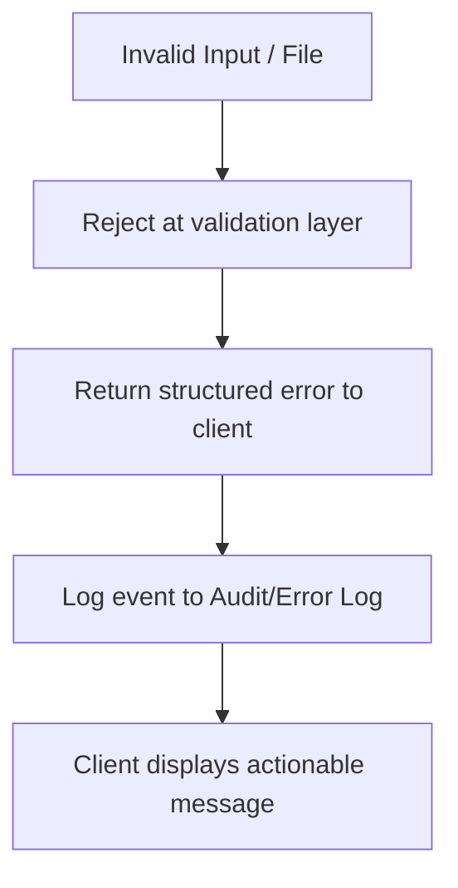

- All rejected operations SHALL return a structured, machine-readable error (code, message, field reference).
- Conflict errors (e.g., duplicate School name, concurrent audit action) SHALL return HTTP 409-equivalent semantics with a clear resolution path.
- All error events affecting data integrity SHALL be logged (Section 45).
- Idempotency keys (FR-069) SHALL prevent duplicate record creation on client retry after a network failure.

## 54. Configuration Management

Configurable items, centrally managed by SuperAdmin (with school-scoped subsets delegable to Admin where noted):

| Configuration Item | Scope | Configurable By |
|---|---|---|
| Observation Lock Period | Global default, school override | SuperAdmin, Admin (school) |
| Max ETA Extensions | Global (fixed at 3 per BR-10) | Not overridable — governance rule |
| Escalation SLA per Level | Per Department | SuperAdmin, Admin (school) |
| Notification Templates | Global | SuperAdmin |
| Reminder Frequency | Global default, school override | SuperAdmin, Admin |
| Performance Review Cadence | Per Role/Department | SuperAdmin, Admin (school) |
| Session Timeout Duration | Global | SuperAdmin |
| File Upload Limits | Global | SuperAdmin |
| Supported Locales | Global | SuperAdmin |
| Feature Flags | Global/per-school | SuperAdmin |
| KPI Amber Tolerance Band | Global default, per-KPI-category override | SuperAdmin |
| Manual Time Entry Permitted (per Event Time Point) | Per KPI | SuperAdmin |
| Integration Partner Credential Rotation Interval | Global default, per-partner override | SuperAdmin |
| Integration Sync Retry/Backoff Limits | Global | SuperAdmin |
| Approval Chain Configuration (Category, Levels, Level Roles, Auto-Escalation SLA per level, Allow Delegate) | Per Discrepancy Category | SuperAdmin |
| Default Non-Working-Day Policy | Global default, per-KPI override | SuperAdmin |
| Duplicate Detection Window | Global default, per-KPI-Frequency override | SuperAdmin |
| Duplicate Override Permission (Checker-level) | Per School, default: disabled | SuperAdmin, Admin (school) |
| Grace Period | Global default, per-KPI-Frequency override | SuperAdmin |
| Backfill Grace Period Extension Policy | Global | SuperAdmin |
| Evidence Retention Period | Global default, per-School override | SuperAdmin |
| Evidence Archive Tier Threshold | Global default (e.g., 1 year) | SuperAdmin |

This is realized through a **Configuration Engine** (Section 57.4 architecture) that centralizes rules rather than hardcoding them across modules.

## 55. Acceptance Criteria (Platform-Level)

- No module permits a hard delete of School, User, Observation (post-lock), Discrepancy, Task (with history), Scorecard, or Asset (with linked Observations) records.
- Every immutability rule (Observation lock, Scorecard version, KPI version, in-progress Discrepancy's Approval Chain version) is enforced at the data layer, not solely in the UI.
- Every cross-module workflow (Observation → Audit → Discrepancy → Investigation → Approval Chain → Closure; Task → ETA → Escalation → Completion; KPI → Scheduler → Observation → Grace Period → Scorecard) completes end-to-end in staging environment testing without manual data patching.
- All twenty-seven Business Rules (Section 9) have at least one corresponding automated test case.
- All Functional Requirements (FR-001 through FR-174, plus FR-175–FR-177 added in Section 23.15, FR-178–FR-190 added in Sections 23.15/24.15/35.14 in v1.2, FR-191–FR-210 added in Section 41.9 in v1.3, FR-211–FR-230 added in Section 40.8 in v1.4, and FR-231–FR-274 added across Sections 9/12/23/24/26/35/37/41/46/47/50/54 in v1.5) are traceable to at least one acceptance test.

## 56. Deployment Assumptions

- Responsive web application (PWA-capable), no native mobile app in Phase 1 (Section 6.2). The backend is API-first (Section 39) so a native iOS/Android app can be added in a later phase as an additional API client, without a backend redesign.
- Internet connectivity required at all times; no offline mode (BR-16/C7).
- Cloud-hosted infrastructure with environment separation (Dev/Staging/Production).
- CI/CD pipeline with automated test execution against the acceptance criteria in each module section.
- Feature Flags (Section 54) used to control phased module rollout without requiring redeployment.
- Application services are stateless and horizontally scalable (Section 46), enabling scale-out via additional instances behind a load balancer rather than larger single servers.

## 57. Roadmap

### 57.1 Phase 1 (This Specification)
School, Department, User, Role Management; Global KPI Library with versioning; Observation Capture; Audit & Discrepancy Management; Task Management with ETA governance; Escalation Matrix; Performance Reviews & Scorecards; Dashboards; Report Catalogue; Notification system; REST API layer (no live external integration); English + Hindi localization.

### 57.2 Phase 2
Weighted KPI scoring model; self-service School registration with approval workflow; school-customizable role templates; school-level Master Data overrides; scheduled/recurring report delivery; procurement/PO management extension to Vendor module; live ERP integration activation for Users/Departments/Schools (BR-19); native mobile app (iOS/Android) consuming the existing API layer (Section 39), including mobile push notifications and camera-based evidence capture (Section 24).

### 57.3 Phase 3
Additional operational modules: Asset Management, Visitor Management, Procurement, Leave Management, Maintenance, Incident Reporting, CAPA, Vendor Management (full). Root-cause categorization and CAPA linkage for Discrepancies (Section 26.13). AI-assisted audit queue prioritization (Section 25.13). Comparative cross-school benchmarking scorecards (Section 29.13).

> Phase 1 includes a minimal Active/Retired Status on Asset records (Section 35.15) to support safe decommissioning of Event-Time-scoped Assets (e.g., vehicles, cleaning zones) introduced in v1.2; full Asset Management (acquisition, maintenance workflows, procurement linkage) remains Phase 3.

### 57.4 Architecture-Level Evolution (Cross-Phase)
- **Configuration Engine** — centralizes configurable rules (ETA limits, lock periods, SLA thresholds, notification schedules) instead of hardcoding them per module.
- **Rule Engine** — evaluates KPIs, triggers reminders, computes escalations, and calculates scorecards using configurable rules rather than embedded logic.
- **Workflow Engine** — reusable approval/state-transition engine shared by Discrepancy, Task, and future modules.
- **Notification Service** — shared service supporting in-app, email, SMS, WhatsApp, and future push notifications.
- **Audit Service** — single, shared audit-logging mechanism used by every module (Section 45).
- **Master Data Service** — central management for departments, categories, priorities, frequencies, and other reference data (Section 35).
- **Integration Layer** — standard REST APIs and webhook/event support to simplify future ERP and third-party integration (Section 39, 40).
- **Feature Flags** — enable phased rollout of modules and capabilities without redeploying the application (Section 54, 56).
- **Compliance Scheduler** — background service generating recurring KPI compliance instances, idempotent, timezone-aware, holiday-aware (Sections 23.16–23.17).

---

## 58. Engineering & Code Quality Standards

These are binding engineering practices for the build/implementation team, distinct from the user-facing functional requirements elsewhere in this specification. They exist to keep the platform maintainable as it scales (Section 46) and portable to a future mobile client (Section 39, 56).

### 58.1 Architecture & Design
- Separation of concerns SHALL be enforced (e.g., layered/MVC architecture): business logic, data access, and presentation SHALL NOT be mixed in the same module.
- Object-oriented code SHALL follow SOLID principles; functions/methods SHALL be small and single-purpose.
- Premature optimization SHALL be avoided — code is written clearly first, then profiled before optimizing, against the targets in Section 46.
- Components SHALL be designed for testability (dependency injection, avoidance of tight coupling) so unit tests (Section 58.4) do not require a live database or external service by default.

### 58.2 Readability & Maintainability
- Consistent naming conventions and formatting SHALL be enforced via linters/formatters (e.g., ESLint, Prettier, Black or language-appropriate equivalents) in CI (Section 58.4).
- Code SHALL be self-documenting; comments explain *why*, not *what*.
- A consistent project structure SHALL be followed per language/framework idiom.
- Deep nesting SHALL be avoided in favor of early returns and guard clauses.
- Dead code and unused dependencies SHALL be reviewed and removed on a regular cadence.

### 58.3 Version Control
- Commits SHALL be meaningful and atomic, with clear messages.
- A defined branching strategy (e.g., Git Flow or trunk-based development) SHALL be followed.
- All changes SHALL go through pull request review before merging to a protected branch.
- Secrets, credentials, and `.env` files SHALL never be committed; `.gitignore` SHALL be maintained accordingly (Section 41.3, FR-195).

### 58.4 Testing
- Unit tests SHALL cover core business logic (KPI calculation, RAG rollup, escalation timers, scorecard generation), targeting meaningful coverage of behavior rather than a raw percentage.
- Integration and end-to-end tests SHALL cover critical cross-module flows identified in Section 55 (Observation → Audit → Discrepancy → Investigation → Closure; Task → ETA → Escalation → Completion; KPI → Observation → Scorecard).
- Test-driven development SHOULD be used where it fits the module's complexity.
- All tests SHALL run automatically in CI on every push/PR (Section 41.7).
- Test suites SHALL explicitly cover edge cases (Section "Edge Cases" in each module, e.g., 24.12, 26.12, 27.12), not only the happy path.

### 58.5 Error Handling & Logging
- Errors SHALL be handled explicitly; exceptions SHALL never be silently swallowed.
- Logging SHALL be structured (JSON logs) with appropriate levels (debug/info/warn/error).
- Logs SHALL never contain sensitive data (passwords, tokens, PII) — consistent with Section 41.3/FR-196.
- Failures SHALL degrade gracefully, returning meaningful, non-leaking error messages to users (Section 53) while full detail is captured server-side for diagnosis.

### 58.6 Documentation
- A README SHALL be maintained with setup, run, and deployment instructions for every service/repository.
- APIs SHALL be documented (OpenAPI/Swagger for REST, Section 39) and kept in sync with the live contract so both the web client and any future mobile client can rely on it.
- Architecture Decision Records (ADRs) SHALL be kept for major design choices (e.g., the API-first/stateless decisions in Section 39 and 46), so the rationale for scale- and mobile-readiness decisions is preserved for future contributors.

---

*End of Document.*
